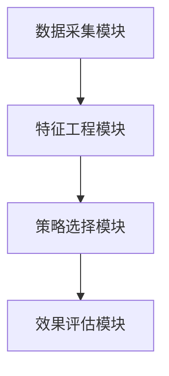

                 


# 企业AI Agent的强化学习在广告投放优化中的实时决策实践

> 关键词：企业AI Agent，强化学习，广告投放优化，实时决策，深度Q学习

> 摘要：本文探讨了如何利用企业AI Agent结合强化学习技术，实现广告投放优化中的实时决策。通过分析广告投放的挑战和强化学习的优势，详细阐述了强化学习在广告投放优化中的算法原理、系统设计和实际应用。本文还通过具体案例，展示了如何通过强化学习优化广告投放策略，帮助企业在激烈的市场竞争中占据优势。

---

## 第1章: 广告投放优化的挑战与强化学习的引入

### 1.1 广告投放优化的挑战

广告投放优化是企业提升营销效果和投资回报率的重要手段。然而，广告投放优化面临以下主要挑战：

- **实时性要求高**：广告投放需要实时调整策略，以快速响应市场变化和用户行为。
- **多目标优化**：广告投放需要在点击率、转化率、成本控制等多个目标之间找到平衡。
- **数据量大且复杂**：广告投放涉及大量数据，包括用户点击、转化、浏览量等，数据维度复杂。
- **动态环境**：市场环境和用户行为不断变化，广告策略需要动态调整。

### 1.2 强化学习在广告投放中的应用价值

强化学习是一种通过智能体与环境交互来学习最优策略的机器学习方法。其在广告投放中的应用价值体现在以下几个方面：

- **实时决策能力**：强化学习可以实时根据广告投放效果调整策略，快速响应市场变化。
- **复杂决策优化**：强化学习能够处理多目标优化问题，帮助企业在广告投放中找到最优平衡点。
- **数据驱动优化**：强化学习通过不断试错和学习，优化广告投放策略，提高转化率和收益。

### 1.3 企业AI Agent的核心目标

企业AI Agent的核心目标是通过智能决策和自动执行，优化广告投放策略，实现以下目标：

- **最大化广告点击率和转化率**：通过实时调整广告内容和投放位置，吸引更多的目标用户。
- **降低广告投放成本**：通过优化预算分配和广告位选择，减少无效投放，提高广告效果。
- **快速响应市场变化**：通过实时监控市场动态和用户行为，快速调整广告策略。

---

## 第2章: 强化学习的核心原理

### 2.1 强化学习的基本原理

强化学习的核心原理是通过智能体与环境的交互，学习最优策略。其主要概念包括：

- **状态（State）**：智能体所处的环境状况，例如当前广告的点击率、转化率等。
- **动作（Action）**：智能体根据当前状态做出的决策，例如选择投放哪个广告位。
- **奖励（Reward）**：智能体执行动作后获得的反馈，奖励用于衡量动作的好坏。
- **策略（Policy）**：智能体在不同状态下选择动作的概率分布。
- **价值函数（Value Function）**：衡量某状态下采取某动作的价值。

### 2.2 强化学习算法的分类

强化学习算法主要分为以下几类：

- **值函数方法（Value-based Methods）**：通过学习价值函数来优化策略，例如Q-learning。
- **策略梯度方法（Policy Gradient Methods）**：直接优化策略，例如策略梯度算法。
- **深度强化学习（Deep RL）**：结合深度学习和强化学习，例如Deep Q-learning。

### 2.3 强化学习的核心公式

Q-learning算法的核心公式是Q值的更新公式：

$$ Q(s, a) = Q(s, a) + \alpha [r + \gamma \max_{a'} Q(s', a') - Q(s, a)] $$

其中：
- \( Q(s, a) \)：当前状态下动作 \( a \) 的Q值。
- \( \alpha \)：学习率。
- \( r \)：获得的奖励。
- \( \gamma \)：折扣因子。
- \( s' \)：下一个状态。

深度Q-learning算法通过神经网络近似Q函数，网络结构如下图所示：

```mermaid
graph TD
    A[输入层] --> B[隐藏层1] --> C[隐藏层2] --> D[输出层(Q值)]
```

---

## 第3章: AI Agent的实时决策机制

### 3.1 实时决策的核心要素

实时决策的核心要素包括：

- **状态空间**：包括当前广告的点击率、转化率、展示量等。
- **动作空间**：包括选择投放哪个广告位、调整广告内容等。
- **奖励机制**：根据广告效果给予奖励或惩罚。

### 3.2 强化学习在实时决策中的应用

强化学习通过以下步骤实现实时决策：

1. **感知环境**：智能体收集当前广告投放的相关数据，如点击率、转化率等。
2. **选择动作**：根据当前状态，智能体选择一个动作，例如选择一个广告位。
3. **执行动作**：智能体执行选择的动作，投放广告。
4. **获得奖励**：根据广告效果，智能体获得奖励或惩罚。
5. **更新模型**：智能体根据奖励更新Q函数或策略。

### 3.3 实时决策的数学模型

实时决策的数学模型可以表示为：

$$ \text{奖励} = f(\text{点击率}, \text{转化率}, \text{成本}) $$

其中，奖励函数 \( f \) 是一个衡量广告效果的函数。

---

## 第4章: 广告投放优化的强化学习建模

### 4.1 广告投放的场景描述

广告投放优化的场景包括：

- **广告位选择**：选择点击率高的广告位。
- **广告内容优化**：根据用户行为调整广告内容。
- **预算分配**：根据广告效果动态调整预算。

### 4.2 强化学习模型的构建

构建强化学习模型需要以下步骤：

1. **定义状态空间**：包括当前广告的点击率、转化率等。
2. **定义动作空间**：包括选择广告位、调整广告内容等。
3. **定义奖励函数**：根据广告效果给予奖励或惩罚。
4. **选择强化学习算法**：例如Q-learning或Deep Q-learning。
5. **训练模型**：通过大量数据训练模型，优化策略。

### 4.3 实际案例分析

以一家互联网公司为例，该公司希望通过强化学习优化广告投放策略。以下是具体步骤：

1. **数据收集**：收集过去一段时间内的广告投放数据，包括点击率、转化率、展示量等。
2. **数据预处理**：清洗数据，提取特征，构建状态和动作空间。
3. **模型训练**：使用Q-learning算法训练模型，优化广告投放策略。
4. **模型部署**：将训练好的模型部署到广告投放系统中，实时调整广告策略。
5. **效果评估**：通过A/B测试评估模型的效果，优化模型参数。

### 4.4 项目小结

通过强化学习优化广告投放策略，可以显著提高广告的点击率和转化率，降低广告成本，为企业创造更大的收益。

---

## 第5章: 系统设计与实现

### 5.1 系统功能设计

广告投放优化系统的功能模块包括：

- **数据采集模块**：实时采集广告投放数据。
- **特征工程模块**：对数据进行特征提取和处理。
- **策略选择模块**：根据强化学习模型选择最优策略。
- **效果评估模块**：评估广告投放效果，更新奖励函数。

### 5.2 系统架构设计

系统架构设计如下：



### 5.3 系统交互设计

系统交互流程如下：

1. **数据采集**：实时采集广告投放数据。
2. **特征提取**：对数据进行特征提取和处理。
3. **策略选择**：根据强化学习模型选择最优策略。
4. **效果评估**：评估广告投放效果，更新奖励函数。

---

## 第6章: 最佳实践与总结

### 6.1 最佳实践

1. **数据质量**：确保数据的完整性和准确性。
2. **模型调参**：根据实际情况调整模型参数，如学习率和折扣因子。
3. **持续优化**：定期更新模型，适应市场变化。

### 6.2 总结与展望

通过强化学习优化广告投放策略，可以帮助企业在激烈的市场竞争中占据优势。未来，随着技术的不断发展，强化学习在广告投放中的应用将更加广泛和深入。

---

## 作者

作者：AI天才研究院/AI Genius Institute & 禅与计算机程序设计艺术 /Zen And The Art of Computer Programming

---

通过以上内容，我们可以看到，强化学习在广告投放优化中的应用具有巨大的潜力。企业可以通过引入AI Agent和强化学习技术，实现广告投放的实时决策和动态优化，从而提高广告效果和投资回报率。

