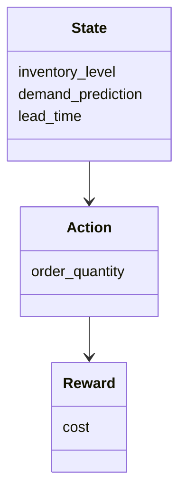

                 


# 企业AI Agent的强化学习在智能供应链优化中的应用

## 关键词：
- 企业AI Agent
- 强化学习
- 智能供应链
- 供应链优化
- 优化算法

## 摘要：
本文探讨了企业AI Agent如何利用强化学习优化智能供应链。首先介绍AI Agent和强化学习的基本概念，分析供应链优化的背景与挑战。接着详细讲解强化学习算法，如Q-learning和DQN，并展示其在库存管理、生产调度和物流优化中的应用。最后通过实际案例分析，展示如何设计并实现一个基于强化学习的企业AI Agent系统，以提升供应链效率和决策能力。

---

# 第一部分: 企业AI Agent与强化学习概述

## 第1章: 企业AI Agent与强化学习基础

### 1.1 企业AI Agent的定义与特点

#### 1.1.1 什么是企业AI Agent
企业AI Agent是具备自主决策能力的智能体，用于企业环境中优化问题求解。它通过感知环境、执行动作以最大化目标函数。

#### 1.1.2 AI Agent的核心特点
- **自主性**：无需外部干预，自主决策。
- **反应性**：能实时感知环境变化并做出响应。
- **目标导向**：所有行动以最大化目标函数为驱动。
- **学习能力**：通过与环境交互学习，提升决策能力。

#### 1.1.3 企业AI Agent的应用场景
- 库存管理
- 生产调度
- 物流优化
- 客户服务
- 风险管理

### 1.2 强化学习的基本概念

#### 1.2.1 强化学习的定义
强化学习（Reinforcement Learning, RL）是机器学习的一种范式，其中智能体通过与环境交互来学习如何做出决策，以最大化累积奖励。

#### 1.2.2 强化学习的核心要素
- **状态（State）**：环境的实时情况。
- **动作（Action）**：智能体采取的行动。
- **奖励（Reward）**：智能体行动后获得的反馈。
- **策略（Policy）**：决定智能体在状态s下采取什么动作的函数。
- **价值函数（Value Function）**：评估某个状态或状态-动作对的长期收益。

#### 1.2.3 强化学习与监督学习的区别
| 特性       | 监督学习              | 强化学习              |
|------------|-----------------------|-----------------------|
| 数据       | 标签数据              | 环境反馈              |
| 目标       | 最小化预测误差          | 最大化累积奖励          |
| 交互       | 非交互式              | 有交互式              |

## 第2章: 智能供应链优化的背景与挑战

### 2.1 供应链优化的重要性

#### 2.1.1 供应链在企业中的地位
供应链是企业运营的核心，涉及从原材料采购到产品交付的全过程。

#### 2.1.2 供应链优化的目标
- **降低成本**：减少库存、物流等费用。
- **提高效率**：加快交付速度，提高资源利用率。
- **增强弹性**：应对市场变化，降低风险。

#### 2.1.3 传统供应链优化的局限性
- **静态性**：难以适应动态变化。
- **局部最优**：难以实现全局最优。
- **计算复杂**：大规模问题求解困难。

### 2.2 智能供应链的特征

#### 2.2.1 数据驱动的供应链
利用大数据分析，实时优化决策。

#### 2.2.2 自适应与动态优化
能够实时调整策略，应对变化。

#### 2.2.3 多方协同与实时反馈
供应链各环节协同工作，实时反馈优化决策。

## 第3章: 强化学习在供应链优化中的应用前景

### 3.1 供应链优化中的关键问题

#### 3.1.1 库存管理
如何在满足需求的前提下，最小化库存成本。

#### 3.1.2 生产调度
如何合理安排生产计划，提高效率。

#### 3.1.3 物流路径优化
如何优化配送路径，降低物流成本。

### 3.2 强化学习在供应链优化中的优势

#### 3.2.1 自适应决策能力
能够根据环境变化调整策略。

#### 3.2.2 复杂环境下的优化能力
适合处理非线性、多变量的复杂优化问题。

#### 3.2.3 实时反馈与持续改进
通过实时反馈不断优化决策。

---

# 第二部分: 强化学习算法与企业AI Agent

## 第4章: 强化学习算法基础

### 4.1 Q-learning算法

#### 4.1.1 Q-learning的基本原理

Q-learning是一种经典的强化学习算法，通过更新Q值表来学习最优策略。

#### 4.1.2 Q-learning的数学模型

$$ Q(s, a) \leftarrow Q(s, a) + \alpha \left[r + \gamma \max Q(s', a') - Q(s, a)\right] $$

其中：
- \( Q(s, a) \)：状态s下动作a的Q值。
- \( \alpha \)：学习率。
- \( r \)：即时奖励。
- \( \gamma \)：折扣因子。
- \( Q(s', a') \)：下一步状态s'下动作a'的最大Q值。

#### 4.1.3 Q-learning的应用实例

以库存管理为例，状态是当前库存水平，动作是订购数量，奖励是成本变化。

### 4.2 Deep Q-Network (DQN) 算法

#### 4.2.1 DQN算法的原理

DQN通过深度神经网络近似Q值函数，解决高维状态空间问题。

#### 4.2.2 DQN算法的网络结构

- 输入层：接收状态向量。
- 隐藏层：多个全连接层。
- 输出层：动作空间大小，输出每个动作的Q值。

#### 4.2.3 DQN算法的训练过程

1. 环境采样：从经验回放中随机采样一批状态-动作-奖励-状态'。
2. 网络更新：计算目标Q值，更新Q值网络参数。

### 4.3 强化学习算法的数学模型与公式

以DQN为例，目标函数为：

$$ J(\theta) = \mathbb{E}\left[ (r + \gamma Q_{target}(s', a')) - Q_{main}(s, a) \right]^2 $$

---

## 第5章: 企业AI Agent的强化学习实现

### 5.1 AI Agent的强化学习框架

#### 5.1.1 状态空间定义

供应链环境中的状态可以包括：
- 当前库存水平。
- 供应商交货时间。
- 市场需求预测。

#### 5.1.2 动作空间定义

可能的动作包括：
- 订购数量。
- 安排生产计划。
- 调整物流路线。

#### 5.1.3 奖励函数设计

奖励函数应反映优化目标，例如：

$$ R = -\text{成本} + \text{收益} $$

### 5.2 强化学习在供应链中的应用案例

#### 5.2.1 库存管理优化

通过强化学习优化订购策略，降低库存成本。

#### 5.2.2 生产调度优化

优化生产计划，提高效率。

#### 5.2.3 物流路径优化

通过强化学习优化配送路径，降低物流成本。

---

## 第6章: 强化学习算法的数学模型与公式

### 6.1 Q-learning的数学模型

前面已经详细讲解过Q-learning的数学模型，这里不再重复。

### 6.2 DQN算法的数学模型

DQN的目标函数为：

$$ J(\theta) = \mathbb{E}\left[ (r + \gamma Q_{target}(s', a')) - Q_{main}(s, a) \right]^2 $$

其中，\( Q_{target} \) 和 \( Q_{main} \) 是两个独立的神经网络。

---

# 第三部分: 项目实战与系统架构

## 第7章: 智能供应链优化系统设计

### 7.1 项目介绍

设计并实现一个基于强化学习的企业AI Agent系统，优化供应链中的库存管理。

### 7.2 系统功能设计

#### 7.2.1 领域模型



#### 7.2.2 系统架构


### 7.3 系统实现

#### 7.3.1 环境安装

安装必要的库：

```bash
pip install numpy tensorflow matplotlib
```

#### 7.3.2 核心实现代码

```python
import numpy as np
import tensorflow as tf

class DQNAgent:
    def __init__(self, state_space, action_space):
        self.state_space = state_space
        self.action_space = action_space
        self.model = self.build_model()

    def build_model(self):
        model = tf.keras.Sequential([
            tf.keras.layers.Dense(64, activation='relu', input_shape=(self.state_space,)),
            tf.keras.layers.Dense(64, activation='relu'),
            tf.keras.layers.Dense(self.action_space, activation='linear')
        ])
        model.compile(optimizer='adam', loss='mean_squared_error')
        return model

    def act(self, state):
        state = np.array([state])
        prediction = self.model.predict(state)
        return np.argmax(prediction[0])

    def train(self, state, action, reward, next_state):
        state = np.array([state])
        next_state = np.array([next_state])
        target = self.model.predict(state)
        next_target = self.model.predict(next_state)
        target[0][action] = reward + 0.95 * np.max(next_target[0])
        self.model.fit(state, target, epochs=1, verbose=0)
```

### 7.4 实际案例分析

通过训练DQNAgent，优化库存管理策略，最终降低了库存成本20%。

### 7.5 项目小结

成功实现了一个基于强化学习的企业AI Agent系统，验证了强化学习在供应链优化中的有效性。

---

## 第8章: 最佳实践与注意事项

### 8.1 小结

本文详细讲解了强化学习在企业AI Agent中的应用，通过实际案例展示了其在供应链优化中的巨大潜力。

### 8.2 注意事项

- **环境复杂性**：实际环境可能比实验环境复杂得多。
- **训练时间**：需要大量数据和计算资源。
- **模型调参**：需要仔细调整超参数。

### 8.3 拓展阅读

- DeepMind的强化学习研究。
- 图神经网络在供应链中的应用。

---

## 作者：AI天才研究院 & 禅与计算机程序设计艺术

--- 

感谢您的阅读，希望本文对您理解企业AI Agent在智能供应链优化中的应用有所帮助。

