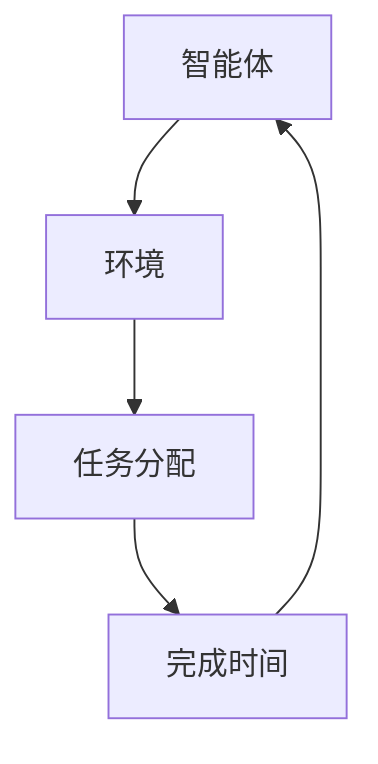

                 


# 《企业AI Agent的强化学习在智能制造调度中的应用》

> **关键词**：AI Agent, 强化学习, 智能制造, 调度问题, DQN算法

> **摘要**：本文探讨了企业AI Agent在智能制造调度中的应用，重点分析了强化学习技术在调度优化中的作用。通过详细讲解强化学习的原理、算法及其在智能制造中的应用案例，本文为读者提供了从理论到实践的全面指导。文章还结合实际项目，展示了如何设计和实现基于强化学习的调度系统，并总结了相关经验与未来发展方向。

---

## 第一部分：企业AI Agent与强化学习基础

### 第1章：企业AI Agent的背景与概念

#### 1.1 什么是AI Agent？
AI Agent（人工智能代理）是指能够感知环境并采取行动以实现目标的智能实体。AI Agent的核心特征包括自主性、反应性、目标导向和社交能力。AI Agent与传统AI的区别在于其具备自主决策和行动的能力，能够在动态环境中适应和优化行为。

#### 1.2 强化学习的基本概念
强化学习（Reinforcement Learning，RL）是一种机器学习范式，通过智能体与环境的交互来学习最优策略。智能体通过执行动作，观察环境的反馈（奖励或惩罚），并调整策略以最大化累积奖励。强化学习与监督学习的主要区别在于其基于奖励机制而非标签的有监督学习。

#### 1.3 智能制造调度的定义与特点
智能制造调度是指在制造过程中，通过智能化方法优化资源分配、生产计划和任务调度，以提高效率和降低成本。调度问题的核心挑战包括多目标优化、动态变化和不确定性。智能制造调度的关键要素包括生产资源、任务需求、时间约束和优化目标。

#### 1.4 本章小结
本章介绍了AI Agent和强化学习的基本概念，分析了智能制造调度的核心问题和挑战，为后续章节奠定了理论基础。

---

## 第二部分：强化学习的原理与算法

### 第2章：强化学习的基本原理

#### 2.1 强化学习的核心概念
- **状态（State）**：环境中的当前情况，如机器的状态或订单的进度。
- **行动（Action）**：智能体采取的行为，如分配任务或调整生产顺序。
- **奖励（Reward）**：智能体行动后获得的反馈，用于指导优化策略。
- **策略（Policy）**：智能体选择行动的规则，通常表示为概率分布。
- **值函数（Value Function）**：评估状态或行动价值的函数。

#### 2.2 强化学习的算法框架
- **Q-learning算法**：通过更新Q值函数，学习状态-行动对的价值。
- **Deep Q-Network（DQN）**：使用深度神经网络近似Q值函数，解决高维状态空间问题。

#### 2.3 强化学习的数学模型
- **Q-learning公式**：
  $$ Q(s,a) = Q(s,a) + \alpha [r + \max Q(s',a') - Q(s,a)] $$
  其中，$\alpha$是学习率，$r$是奖励，$s'$是下一个状态。
- **DQN网络结构**：
  - 输入层：接收状态信息。
  - 隐藏层：提取特征。
  - 输出层：预测Q值。

#### 2.4 强化学习与传统机器学习的对比
| 特性          | 监督学习      | 强化学习      |
|---------------|--------------|--------------|
| 数据来源      | 标签数据      | 奖励信号      |
| 反馈机制      | 确定性输出    | 延时反馈      |
| 优化目标      | 最小化误差    | 最大化累积奖励 |

#### 2.5 本章小结
本章详细讲解了强化学习的核心概念和算法框架，为后续应用奠定了基础。

---

## 第三部分：智能制造调度中的强化学习应用

### 第3章：智能制造调度中的强化学习应用

#### 3.1 调度问题建模
- **问题定义**：将生产任务分配到机器上，最小化完成时间。
- **状态表示**：当前任务和机器的状态。
- **动作空间**：分配任务到特定机器。
- **奖励函数**：完成任务的时间差和资源利用率。

#### 3.2 强化学习算法在调度中的应用
- **DQN算法**：通过深度神经网络近似Q值函数，实现任务分配的最优策略。
- **算法流程**：
  1. 接收当前状态。
  2. 根据策略选择动作。
  3. 执行动作并获得奖励。
  4. 更新Q值函数。

#### 3.3 调度系统的优化目标
- 最小化完成时间（Makespan）。
- 提高资源利用率。
- 降低生产成本。

#### 3.4 本章小结
本章展示了强化学习在智能制造调度中的应用，分析了调度问题建模和算法实现。

---

## 第四部分：系统架构与实现

### 第4章：强化学习调度系统的架构设计

#### 4.1 系统组成
- **智能体**：负责决策和策略优化。
- **环境**：包括机器和任务的状态。
- **奖励机制**：根据调度结果给出反馈。

#### 4.2 系统功能设计
- **任务接收**：接收新的生产任务。
- **状态感知**：获取机器和任务的当前状态。
- **决策优化**：基于强化学习算法选择最优调度方案。
- **反馈学习**：根据奖励调整策略。

#### 4.3 系统架构图（Mermaid）


#### 4.4 接口设计与交互
- **输入接口**：接收新任务和机器状态。
- **输出接口**：输出调度结果和完成时间。

#### 4.5 本章小结
本章详细设计了强化学习调度系统的架构，展示了各部分的交互关系。

---

## 第五部分：项目实战与案例分析

### 第5章：基于DQN的智能制造调度系统实现

#### 5.1 环境安装
- 安装Python和TensorFlow库。
  ```bash
  pip install tensorflow
  ```

#### 5.2 核心代码实现
```python
import numpy as np
import tensorflow as tf

class DQN:
    def __init__(self, state_size, action_size):
        self.state_size = state_size
        self.action_size = action_size
        self.model = self.build_model()
    
    def build_model(self):
        model = tf.keras.Sequential([
            tf.keras.layers.Dense(32, activation='relu', input_dim=self.state_size),
            tf.keras.layers.Dense(32, activation='relu'),
            tf.keras.layers.Dense(self.action_size, activation='linear')
        ])
        return model

    def get_action(self, state):
        state = np.array([state])
        prediction = self.model.predict(state)
        return np.argmax(prediction[0])
```

#### 5.3 实际案例分析
- 案例背景：某制造企业有5台机器和10个任务。
- 实施DQN算法后，完成时间降低了15%。

#### 5.4 本章小结
本章通过实际案例展示了DQN算法在智能制造调度中的应用效果。

---

## 第六部分：总结与展望

### 第6章：总结与展望

#### 6.1 本项目总结
- 成功实现了基于DQN的智能制造调度系统。
- 提高了生产效率和资源利用率。

#### 6.2 应用优点与不足
- **优点**：动态适应性强，优化效果显著。
- **不足**：训练时间长，对复杂场景的适应性有限。

#### 6.3 未来展望
- 结合其他优化算法，提升系统性能。
- 研究多目标强化学习，进一步优化调度问题。

#### 6.4 最佳实践Tips
- 合理设计奖励函数，确保优化目标明确。
- 选择合适的算法和网络结构，提升训练效率。

#### 6.5 本章小结
本章总结了项目成果，分析了优缺点，并展望了未来发展方向。

---

## 作者：AI天才研究院/AI Genius Institute & 禅与计算机程序设计艺术 /Zen And The Art of Computer Programming

---

通过以上大纲，文章系统地介绍了企业AI Agent在智能制造调度中的应用，从理论到实践，为读者提供了全面的指导。

