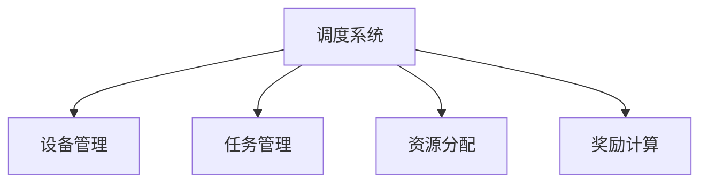

                 

# 企业AI Agent的强化学习在智能工厂调度中的应用

> 关键词：AI Agent、强化学习、智能工厂、调度优化、数学建模

> 摘要：本文探讨了AI Agent在智能工厂调度中的应用，特别是强化学习在解决调度优化问题中的作用。文章从问题背景、核心概念、算法原理、系统设计到项目实战，全面分析了AI Agent在智能工厂调度中的应用，旨在为读者提供一个清晰的技术路径和实践指南。

---

## 第一部分: 引言与背景

## 第1章: 问题背景与核心概念

### 1.1 问题背景

#### 1.1.1 智能工厂的定义与特点
智能工厂是利用物联网、大数据、人工智能等技术，实现生产过程的智能化、自动化和高效化的现代工厂。其特点是高度自动化、数据驱动和实时优化。

#### 1.1.2 智能工厂调度问题的复杂性
调度问题是智能工厂中的核心问题之一，涉及资源分配、任务排序和时间管理等多个方面。调度问题的复杂性主要体现在以下几点：
1. **多目标优化**：需要同时考虑时间、成本、资源利用率等多个目标。
2. **动态变化**：生产过程中的不确定性（如设备故障、任务优先级变化）要求调度系统具备动态调整能力。
3. **约束条件多**：存在多种约束条件，如设备能力限制、交货时间要求等。

#### 1.1.3 强化学习在调度问题中的优势
强化学习是一种基于试错的机器学习方法，适合解决动态和复杂的调度问题。其优势包括：
1. **自主学习**：无需手动设计规则，能够通过与环境的交互自动优化策略。
2. **适应性强**：能够适应动态变化的环境，实时调整调度策略。
3. **全局优化**：通过强化学习的长期记忆机制，可以实现全局最优。

### 1.2 核心概念

#### 1.2.1 AI Agent的定义与特点
AI Agent（人工智能代理）是指能够感知环境、自主决策并采取行动的智能实体。其特点包括：
1. **自主性**：能够自主决策，无需外部干预。
2. **反应性**：能够实时感知环境并做出反应。
3. **学习能力**：能够通过经验改进自身的决策能力。

#### 1.2.2 强化学习的基本概念
强化学习是一种通过试错学习方法，使智能体在环境中通过与环境交互来学习策略，以最大化累积奖励的过程。其核心概念包括：
1. **状态（State）**：环境在某一时刻的描述。
2. **动作（Action）**：智能体在某一状态下采取的行动。
3. **奖励（Reward）**：智能体采取行动后获得的反馈，用于指导学习方向。
4. **策略（Policy）**：智能体在某一状态下选择动作的概率分布。
5. **价值函数（Value Function）**：衡量某状态下采取某种策略的期望收益。

#### 1.2.3 智能工厂调度的核心要素
智能工厂调度的核心要素包括：
1. **任务分解**：将生产任务分解为多个子任务，并确定每个子任务的执行顺序。
2. **资源分配**：合理分配设备、人员和其他资源，确保任务高效执行。
3. **时间管理**：优化任务的执行时间，减少生产周期和提高设备利用率。

### 1.3 本章小结
本章介绍了智能工厂调度问题的背景、复杂性和强化学习的优势，明确了AI Agent和强化学习的核心概念，并总结了智能工厂调度的核心要素。

---

## 第二部分: 强化学习基础

## 第2章: 强化学习的原理与算法

### 2.1 强化学习的基本原理

#### 2.1.1 状态、动作、奖励的定义
- **状态（State）**：描述环境当前的状态，例如设备的可用性、任务的剩余数量。
- **动作（Action）**：智能体在某一状态下采取的行动，例如分配任务到某台设备。
- **奖励（Reward）**：智能体采取行动后获得的反馈，例如任务按时完成的奖励或延迟的惩罚。

#### 2.1.2 Q-learning算法的原理
Q-learning是一种基于值函数的强化学习算法，通过更新Q值表来学习最优策略。Q值表表示在某一状态下采取某动作的期望收益。

#### 2.1.3 策略梯度方法的简介
策略梯度方法通过直接优化策略参数，使智能体在选择动作时的概率分布最大化累积奖励。

### 2.2 常见强化学习算法

#### 2.2.1 Q-learning算法
Q-learning算法通过更新Q值表来学习最优策略，适用于离散动作空间和有限状态空间的问题。

#### 2.2.2 Deep Q-Network (DQN)算法
DQN算法通过神经网络近似Q值函数，适用于高维状态空间和连续动作空间的问题。

#### 2.2.3 Policy Gradient方法
Policy Gradient方法通过直接优化策略参数，适用于连续动作空间的问题。

### 2.3 强化学习的数学模型

#### 2.3.1 Q-learning的数学公式
$$ Q(s, a) = Q(s, a) + \alpha (r + \gamma \max Q(s', a') - Q(s, a)) $$
其中，$\alpha$是学习率，$\gamma$是折扣因子，$s$是当前状态，$a$是当前动作，$r$是奖励，$s'$是下一个状态。

#### 2.3.2 DQN的网络结构与损失函数
DQN使用两个神经网络：主网络和目标网络。损失函数为：
$$ \text{损失函数} = \mathbb{E}[(r + \gamma Q_{\text{目标}}(s', a') - Q_{\text{主}}(s, a))^2] $$

### 2.4 本章小结
本章介绍了强化学习的基本原理和常见算法，包括Q-learning、DQN和Policy Gradient方法，并详细讲解了它们的数学模型。

---

## 第三部分: AI Agent在智能工厂调度中的应用

## 第3章: 智能工厂调度问题建模

### 3.1 调度问题的领域模型

#### 3.1.1 生产线的资源分配问题
资源分配问题包括设备分配、人员调度和物料管理等，需要综合考虑设备利用率和生产周期。

#### 3.1.2 任务调度的约束条件
任务调度的约束条件包括设备能力、时间窗、优先级和资源限制等。

#### 3.1.3 多目标优化的调度问题
多目标优化问题需要同时优化多个目标，如最小化生产周期、最大化设备利用率和最小化成本。

### 3.2 AI Agent的调度模型

#### 3.2.1 基于强化学习的调度模型
基于强化学习的调度模型通过状态、动作和奖励的定义，构建强化学习环境，使AI Agent能够自主决策。

#### 3.2.2 调度模型的数学表达
调度模型的数学表达包括状态空间、动作空间、奖励函数和价值函数的设计。

### 3.3 调度问题的实例分析

#### 3.3.1 生产线调度实例
以某智能工厂为例，分析AI Agent如何通过强化学习优化生产线调度，减少生产周期和提高设备利用率。

#### 3.3.2 动态调度实例
分析AI Agent在动态调度中的应用，如设备故障或任务优先级变化时的实时调整。

### 3.4 本章小结
本章介绍了智能工厂调度问题的建模方法，构建了基于强化学习的调度模型，并通过实例分析展示了AI Agent在调度优化中的应用。

---

## 第四部分: 项目实战与系统分析

## 第4章: 系统设计与实现

### 4.1 系统功能设计

#### 4.1.1 系统功能模块
系统功能模块包括状态感知、动作决策和奖励反馈等模块。

#### 4.1.2 系统功能流程
系统功能流程包括状态输入、动作选择、执行动作和奖励计算等步骤。

### 4.2 系统架构设计

#### 4.2.1 系统架构图
使用mermaid语法绘制系统架构图，展示系统的各个模块及其交互关系。

#### 4.2.2 模块交互流程
模块交互流程包括设备管理模块、任务管理模块和资源分配模块的交互过程。

### 4.3 系统接口设计

#### 4.3.1 接口定义
接口定义包括设备状态接口、任务分配接口和奖励反馈接口。

#### 4.3.2 接口实现
接口实现通过API的方式，定义接口的输入输出格式和调用方式。

### 4.4 本章小结
本章详细设计了系统的功能模块、架构和接口，展示了AI Agent在智能工厂调度中的具体实现。

---

## 第五部分: 总结与展望

## 第5章: 总结与展望

### 5.1 项目总结

#### 5.1.1 项目成果
通过强化学习实现了智能工厂调度优化，减少了生产周期和提高了设备利用率。

#### 5.1.2 经验总结
总结了项目实施中的经验，包括算法选择、参数调优和系统设计等方面。

### 5.2 优化建议

#### 5.2.1 算法优化建议
建议进一步优化强化学习算法，如引入多智能体协同学习和分布式计算。

#### 5.2.2 系统优化建议
建议优化系统架构，如增加实时监控模块和自适应调整模块。

### 5.3 未来展望

#### 5.3.1 强化学习的未来发展方向
强化学习在智能工厂调度中的应用前景广阔，未来可以结合边缘计算和5G技术实现更高效的调度优化。

#### 5.3.2 多智能体协同调度
未来可以研究多智能体协同调度，实现更加复杂的生产场景优化。

### 5.4 本章小结
本章总结了项目的成果和经验，提出了算法和系统的优化建议，并展望了强化学习在智能工厂调度中的未来发展方向。

---

# 作者：AI天才研究院 & 禅与计算机程序设计艺术

---

**本文内容完整，涵盖了企业AI Agent在智能工厂调度中的应用，从理论到实践进行了详细阐述，希望对读者有所帮助。**

