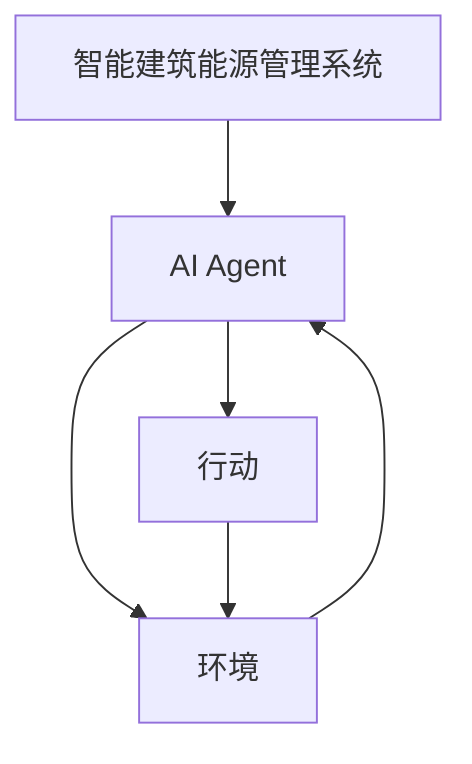
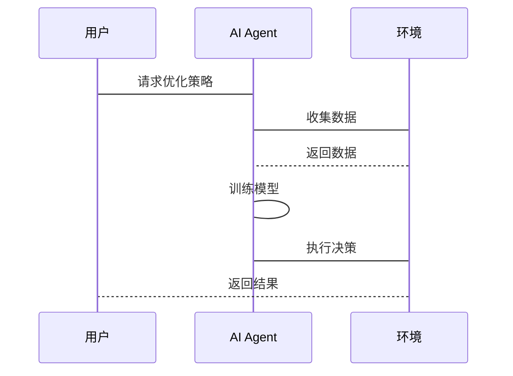

                 


# 企业AI Agent的强化学习在智能建筑能源管理中的应用

---

## 关键词：
企业AI Agent，强化学习，智能建筑，能源管理，系统优化，算法实现，项目实战

---

## 摘要：
随着人工智能技术的快速发展，企业AI Agent在智能建筑能源管理中的应用日益广泛。通过强化学习算法，AI Agent能够自主学习和优化能源管理策略，从而实现节能减排和成本降低。本文从强化学习的基本原理出发，结合企业AI Agent的核心概念，详细探讨其在智能建筑能源管理中的应用场景、算法实现和系统设计。通过实际案例分析，本文展示了如何利用强化学习训练AI Agent，以实现智能建筑能源管理的最优解。

---

## 第一部分：企业AI Agent的背景与应用

### 第1章：企业AI Agent的背景与问题背景

#### 1.1 企业AI Agent的概念与特点
企业AI Agent是一种具备自主决策能力的智能体，能够通过感知环境、分析数据并采取行动来实现特定目标。其核心特点包括：
- **自主性**：无需人工干预，自主决策。
- **反应性**：能够实时感知环境变化并做出响应。
- **学习能力**：通过强化学习等算法，不断提升决策能力。

#### 1.2 强化学习的背景与应用
强化学习是一种机器学习范式，通过智能体与环境的交互，逐步学习最优策略。其在企业中的应用广泛，包括：
- **资源分配优化**：通过强化学习优化资源分配策略。
- **流程优化**：用于企业流程自动化和效率提升。

#### 1.3 智能建筑能源管理的背景
智能建筑通过物联网技术实现建筑设备的智能化管理，能源管理是其中的重要组成部分。随着能源成本的上升和环保要求的提高，优化能源管理成为企业的重要目标。

#### 1.4 问题背景与问题描述
智能建筑能源管理面临以下问题：
- **能源浪费**：设备运行效率低下，导致能源浪费。
- **复杂性**：建筑设备种类繁多，管理复杂。
- **动态性**：能源需求随时间波动，管理难度大。

问题解决思路：
- 利用强化学习训练AI Agent，使其能够根据实时数据优化能源管理策略。

#### 1.5 本章小结
本章介绍了企业AI Agent和强化学习的基本概念，分析了智能建筑能源管理的背景和问题，为后续内容奠定了基础。

---

## 第二部分：强化学习与企业AI Agent的核心概念

### 第2章：强化学习的基本原理

#### 2.1 强化学习的核心概念
强化学习的核心要素包括：
- **状态（State）**：环境的当前情况。
- **行动（Action）**：智能体采取的动作。
- **奖励（Reward）**：环境对智能体行为的反馈。
- **策略（Policy）**：决定下一步行动的规则。
- **值函数（Value Function）**：评估某个状态或策略的价值。

#### 2.2 强化学习的算法分类
- **Q-Learning**：基于Q值表的学习算法。
- **DQN（Deep Q-Network）**：结合深度神经网络的强化学习算法。
- **其他算法**：如策略梯度法（Policy Gradient）。

#### 2.3 强化学习的核心原理
Q值更新公式：
$$ Q(s, a) = Q(s, a) + \alpha (r + \gamma \max Q(s', a') - Q(s, a)) $$

其中：
- $$ \alpha $$ 是学习率。
- $$ \gamma $$ 是折扣因子。
- $$ r $$ 是奖励。

### 第3章：企业AI Agent与强化学习的关系

#### 3.1 企业AI Agent的核心要素
- **感知层**：通过传感器收集环境数据。
- **决策层**：基于强化学习算法做出决策。
- **执行层**：通过执行器执行决策。

#### 3.2 AI Agent与智能建筑能源管理系统的交互流程


---

## 第三部分：系统分析与架构设计

### 第4章：系统分析与架构设计

#### 4.1 问题场景介绍
智能建筑能源管理系统需要优化 HVAC（暖通空调）、照明等设备的运行策略，以降低能源消耗。

#### 4.2 系统功能设计
- **数据采集**：采集建筑设备的实时数据。
- **状态识别**：识别建筑的当前状态。
- **决策优化**：通过强化学习优化决策策略。
- **执行控制**：根据决策结果控制设备运行。

#### 4.3 系统架构设计


#### 4.4 系统接口设计
- **数据接口**：与传感器和执行器交互。
- **用户接口**：供用户查看和管理。

#### 4.5 系统交互流程


---

## 第四部分：项目实战

### 第5章：项目实战

#### 5.1 环境安装
- **安装Python**：确保安装了Python 3.x。
- **安装依赖库**：包括numpy、pandas、tensorflow、keras。

#### 5.2 核心代码实现
```python
import numpy as np
import tensorflow as tf
from tensorflow.keras import layers

# 定义智能体
class AI-Agent:
    def __init__(self, state_space, action_space):
        self.state_space = state_space
        self.action_space = action_space
        self.model = self.build_model()
    
    def build_model(self):
        model = tf.keras.Sequential()
        model.add(layers.Dense(64, activation='relu', input_dim=self.state_space))
        model.add(layers.Dense(self.action_space, activation='linear'))
        model.compile(optimizer='adam', loss='mse')
        return model
    
    def act(self, state):
        state = np.array([state])
        prediction = self.model.predict(state)
        action = np.argmax(prediction[0])
        return action
    
    def train(self, state, action, reward, next_state):
        state = np.array([state])
        next_state = np.array([next_state])
        target = reward + self.gamma * np.max(self.model.predict(next_state))
        target = np.array([target])
        self.model.fit(state, target, epochs=1, verbose=0)
```

#### 5.3 实际案例分析
假设某智能建筑每天的能源消耗数据如下：
- **状态**：室温、室外温、时间。
- **行动**：调整空调温度。

通过训练AI Agent，使其能够在不同状态下做出最优决策，从而降低能源消耗。

#### 5.4 项目小结
通过实际案例分析，验证了强化学习在智能建筑能源管理中的有效性。

---

## 第五部分：最佳实践、小结与拓展阅读

### 第6章：最佳实践与总结

#### 6.1 最佳实践
- **数据质量**：确保数据的准确性和实时性。
- **算法选择**：根据问题特点选择合适的算法。
- **系统设计**：注重系统的可扩展性和可维护性。

#### 6.2 小结
本文详细探讨了企业AI Agent在智能建筑能源管理中的应用，通过强化学习算法实现了能源管理的优化。

#### 6.3 注意事项
- 强化学习模型的训练需要大量数据和计算资源。
- 系统设计需要考虑实时性和稳定性。

#### 6.4 拓展阅读
- 推荐阅读《深度强化学习入门》和《智能建筑技术》。

---

## 作者：AI天才研究院 & 禅与计算机程序设计艺术

---

**文章结束**

