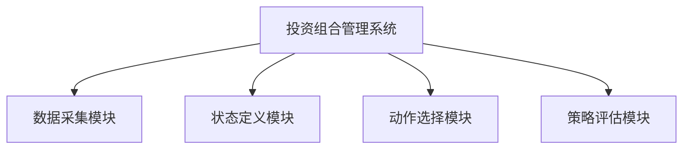

                 


# 企业AI Agent的强化学习在智能投资组合管理中的应用

> 关键词：企业AI Agent, 强化学习, 投资组合管理, 智能投资组合, 算法实现

> 摘要：本文探讨了企业AI Agent如何利用强化学习技术在投资组合管理中实现智能决策。通过分析强化学习的核心概念、算法实现以及系统架构设计，展示了AI Agent在动态市场环境下的应用潜力，并通过具体案例验证了其有效性和优势。

---

# 第一部分: 背景介绍

## 第1章: AI Agent与强化学习概述

### 1.1 AI Agent的基本概念
AI Agent（智能体）是指能够感知环境、采取行动以实现目标的智能实体。根据其复杂性，AI Agent可以分为简单反射Agent和基于模型的Agent。AI Agent的核心优势在于其自主决策能力和适应复杂环境的能力。

### 1.2 强化学习的基本概念
强化学习是一种机器学习方法，通过智能体与环境的交互来学习最优策略。其关键概念包括状态、动作、奖励和策略。强化学习广泛应用于游戏、机器人控制和投资组合管理等领域。

### 1.3 投资组合管理的强化学习应用
投资组合管理是通过优化资产配置实现收益最大化和风险最小化的过程。传统方法依赖均值-方差模型，存在参数敏感性问题。强化学习能够处理非线性和复杂动态，适应市场变化，因此在投资组合管理中具有重要应用价值。

---

## 第2章: 强化学习的核心概念与联系

### 2.1 马尔可夫决策过程（MDP）
- **状态空间**：市场情况、资产价格等。
- **动作空间**：买入、卖出、持有。
- **奖励函数**：收益减去风险惩罚。
- **策略**：决定在每个状态下采取的动作。

### 2.2 Q-learning算法
Q-learning通过更新Q值表学习最优策略。其收敛性分析表明，在有限状态空间下，Q-learning能够收敛到最优策略。Q-learning在投资组合管理中的应用包括动态资产配置，处理市场波动。

### 2.3 与投资组合管理的联系
- **动态调整**：根据市场变化实时调整资产配置。
- **风险控制**：通过奖励函数设计，平衡收益与风险。
- **策略优化**：利用强化学习找到最优投资策略。

---

## 第3章: 强化学习算法的实现

### 3.1 Q-learning算法实现
Q-learning算法实现示例代码：
```python
import numpy as np

class QLearning:
    def __init__(self, state_space, action_space, learning_rate=0.1, gamma=0.99):
        self.q_table = np.zeros(state_space * action_space)
        self.learning_rate = learning_rate
        self.gamma = gamma

    def get_action(self, state, epsilon=0.1):
        if np.random.random() < epsilon:
            return np.random.randint(0, action_space)
        return np.argmax(self.q_table[state])
```

### 3.2 策略梯度方法
策略梯度方法实现示例代码：
```python
import torch
import torch.nn as nn

class PolicyNetwork(nn.Module):
    def __init__(self, input_dim, output_dim):
        super(PolicyNetwork, self).__init__()
        self.fc = nn.Linear(input_dim, output_dim)
        self.softmax = nn.Softmax(dim=-1)

    def forward(self, x):
        return self.softmax(self.fc(x))
```

---

## 第4章: 系统分析与架构设计方案

### 4.1 系统功能设计
- **数据采集**：获取市场数据，如价格、波动率等。
- **状态定义**：当前资产组合、市场趋势、风险水平。
- **动作选择**：根据当前状态选择最优动作。
- **策略评估**：计算收益和风险，更新奖励函数。

### 4.2 系统架构设计
使用Mermaid图展示系统架构：


---

## 第5章: 项目实战

### 5.1 环境配置
- **数据源**：使用历史股价数据，如Yahoo Finance。
- **工具库**：使用Pandas进行数据处理，使用TensorFlow或PyTorch进行模型训练。

### 5.2 核心代码实现
- **数据预处理**：
  ```python
  import pandas as pd

  df = pd.read_csv('stock_data.csv')
  df['return'] = df['close'].pct_change()
  ```
- **模型训练**：
  ```python
  model = PolicyNetwork(input_dim=3, output_dim=3)
  optimizer = torch.optim.Adam(model.parameters(), lr=0.001)
  ```

### 5.3 案例分析
- **训练过程**：展示模型在不同市场情况下的决策过程。
- **结果分析**：比较强化学习策略与传统策略的收益和风险。

---

## 第6章: 最佳实践与小结

### 6.1 最佳实践
- **数据质量**：确保数据准确性和完整性。
- **算法选择**：根据具体问题选择合适的强化学习算法。
- **风险控制**：设计合理的奖励函数，平衡收益与风险。

### 6.2 未来展望
- **多资产配置**：扩展到更多资产类别。
- **动态调整**：提高模型的实时性和适应性。
- **模型解释性**：提升模型的可解释性，便于实际应用。

---

# 作者信息

作者：AI天才研究院/AI Genius Institute & 禅与计算机程序设计艺术 /Zen And The Art of Computer Programming

