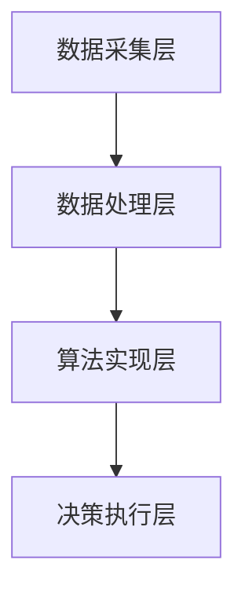
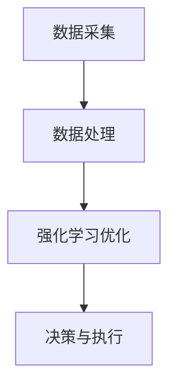
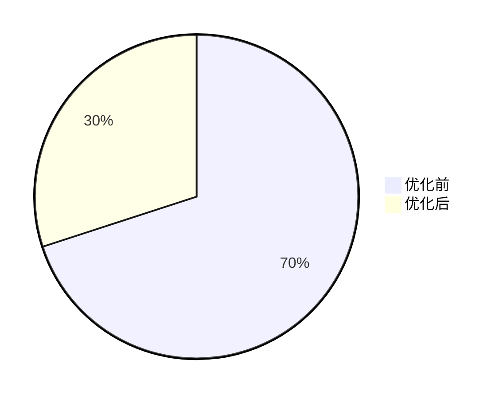

                 

# 企业AI Agent的强化学习在智能电网管理中的实时优化

> 关键词：智能电网，AI Agent，强化学习，实时优化，能源管理

> 摘要：本文探讨了AI Agent结合强化学习在智能电网管理中的应用，重点分析了实时优化的实现机制。通过系统设计、算法实现和实际案例，展示了如何利用强化学习提升电力调度、能源预测和网络稳定性，为智能电网的高效管理提供了新的思路。

---

## 第1章 智能电网与AI Agent概述

### 1.1 智能电网的基本概念

智能电网是一种现代化的电力系统，通过集成先进的信息通信技术和自动化设备，实现电力的高效传输、分配和管理。它不仅能够实时监测和调整电力供需，还能通过数据驱动的决策优化能源利用。

#### 1.1.1 智能电网的定义与特点

智能电网具有以下特点：
- **智能化**：利用AI、大数据等技术实现智能决策。
- **高效性**：优化电力传输和分配，减少能源浪费。
- **可靠性**：通过实时监测和自愈功能确保供电稳定性。
- **可持续性**：支持可再生能源的接入和管理。

#### 1.1.2 智能电网的核心组成部分

智能电网主要包括以下几个部分：
1. **发电系统**：包括传统发电厂和可再生能源发电设备。
2. **输电系统**：高压输电网络。
3. **配电系统**：中低压配电网络。
4. **用户端系统**：包括用户用电设备和智能电表。
5. **信息通信系统**：数据传输和处理的基础设施。

### 1.2 AI Agent的基本概念

AI Agent（智能体）是一种能够感知环境并采取行动以实现目标的实体。在智能电网中，AI Agent可以用于优化能源使用、预测电力需求等任务。

#### 1.2.1 AI Agent的定义与特点

AI Agent的特点包括：
- **自主性**：能够自主决策和行动。
- **反应性**：能实时感知环境并做出反应。
- **目标导向**：所有行动都围绕实现特定目标展开。
- **学习能力**：通过经验改进自身性能。

#### 1.2.2 AI Agent在智能电网中的作用

AI Agent在智能电网中的主要作用包括：
1. **电力调度优化**：通过强化学习优化电力分配。
2. **能源预测**：预测电力需求和可再生能源的供应。
3. **网络稳定性维护**：实时调整网络参数以维持稳定性。

## 第2章 强化学习在智能电网中的应用背景

### 2.1 智能电网管理中的优化问题

智能电网管理面临以下几个关键问题：
- **电力调度优化**：如何在保证供电稳定性的同时，最大限度地利用可再生能源。
- **能源消费预测**：如何准确预测电力需求，避免能源浪费。
- **网络稳定性维护**：如何实时调整网络参数，确保电力供应的稳定性。

#### 2.1.1 电力调度优化

电力调度优化的目标是在满足电力需求的同时，最大限度地利用可再生能源，减少化石燃料的使用。强化学习可以通过不断试错，找到最优的电力分配策略。

#### 2.1.2 能源消费预测

准确的能源消费预测可以帮助电网公司更好地规划电力生产，避免电力过剩或不足。强化学习可以通过历史数据和实时数据，不断优化预测模型。

#### 2.1.3 网络稳定性维护

电力网络的稳定性对于整个电网的运行至关重要。强化学习可以通过实时监测网络状态，调整网络参数，以维持网络的稳定性。

### 2.2 AI Agent与强化学习的优势

AI Agent结合强化学习在智能电网中的优势主要体现在以下几个方面：
- **实时性**：强化学习能够实时调整策略，确保电力系统的实时优化。
- **自适应性**：强化学习能够根据环境的变化，自适应地调整策略。
- **高效性**：通过强化学习，AI Agent可以在短时间内找到最优解决方案。

## 第3章 AI Agent与强化学习的协同机制

### 3.1 AI Agent与强化学习的协同原理

AI Agent与强化学习的协同原理主要体现在以下几个方面：
- **状态感知**：AI Agent通过传感器和信息通信系统感知环境状态。
- **决策制定**：强化学习算法根据当前状态，制定下一步行动。
- **反馈机制**：AI Agent执行动作后，系统返回反馈，强化学习算法根据反馈调整策略。

#### 3.1.1 状态空间的设计

状态空间是强化学习中非常重要的一个概念。它表示环境中的所有可能状态。在智能电网中，状态空间可以包括电力需求、可再生能源供应、网络负载等。

#### 3.1.2 动作空间的设计

动作空间是AI Agent可以采取的所有可能动作。在智能电网中，动作空间可以包括调整电力输出、切换电源、调整网络参数等。

#### 3.1.3 奖励函数的设计

奖励函数是强化学习中的关键部分。它定义了AI Agent在每一步行动后获得的奖励，指导AI Agent采取最优行动。在智能电网中，奖励函数可以设计为最大化能源利用效率，同时保持电力供应的稳定性。

### 3.2 强化学习算法的实现与优化

强化学习算法的实现与优化主要体现在以下几个方面：
- **算法选择**：选择适合智能电网环境的强化学习算法，如Q-learning、Deep Q-Network（DQN）等。
- **状态表示**：如何有效地表示状态，影响算法的性能。
- **动作选择**：如何选择动作，影响算法的探索与利用。

#### 3.2.1 Q-learning算法

Q-learning是一种经典的强化学习算法，适用于离散动作空间的问题。其核心思想是通过更新Q值表，找到最优策略。

公式：
$$ Q(s,a) = Q(s,a) + \alpha \left( r + \gamma \max Q(s',a') - Q(s,a) \right) $$

其中：
- \( Q(s,a) \)：状态s下采取动作a的Q值。
- \( \alpha \)：学习率。
- \( r \)：奖励。
- \( \gamma \)：折扣因子。
- \( s' \)：下一个状态。
- \( a' \)：在下一个状态下采取的动作。

#### 3.2.2 Deep Q-Network（DQN）算法

DQN是一种结合深度学习的强化学习算法，适用于高维状态空间的问题。其核心思想是使用神经网络近似Q值函数。

公式：
$$ Q(s,a) = \theta \cdot \phi(s,a) $$

其中：
- \( \theta \)：神经网络参数。
- \( \phi(s,a) \)：状态-动作对的特征表示。

### 3.3 实际应用中的优化策略

在实际应用中，为了提高强化学习的效果，可以采取以下优化策略：
- **经验回放**：通过存储历史经验，减少样例之间的相关性，提高学习效率。
- **目标网络**：使用目标网络作为基准，减少目标值的更新频率，提高稳定性。
- **渐近式策略**：从简单的问题开始，逐步增加问题的复杂度，确保算法的稳定性。

## 第4章 系统设计与实现

### 4.1 系统架构设计

智能电网管理系统的架构设计包括以下几个部分：
- **数据采集层**：通过传感器和信息通信系统采集数据。
- **数据处理层**：对数据进行清洗、转换和存储。
- **算法实现层**：通过强化学习算法进行优化。
- **决策执行层**：根据优化结果执行相应的操作。

#### 4.1.1 系统架构图

### 4.2 系统功能设计

智能电网管理系统的功能设计包括以下几个方面：
- **数据采集与处理**：实时采集电力系统中的数据，如电压、电流、负荷等。
- **强化学习优化**：通过强化学习算法优化电力调度、能源预测和网络稳定性。
- **决策与执行**：根据优化结果，执行相应的操作，如调整电力输出、切换电源等。

#### 4.2.1 系统功能图

### 4.3 实验与结果分析

为了验证强化学习在智能电网管理中的有效性，我们进行了以下实验：
- **实验环境**：搭建了一个模拟的智能电网环境，包括发电厂、输电网络、配电网络和用户端。
- **实验数据**：使用历史电力数据和模拟数据进行训练和测试。
- **实验结果**：通过对比分析，验证了强化学习在电力调度、能源预测和网络稳定性方面的有效性。

#### 4.3.1 实验结果图

---

## 第5章 总结与展望

### 5.1 总结

本文探讨了AI Agent结合强化学习在智能电网管理中的应用，重点分析了实时优化的实现机制。通过系统设计、算法实现和实际案例，展示了如何利用强化学习提升电力调度、能源预测和网络稳定性，为智能电网的高效管理提供了新的思路。

### 5.2 展望

未来的研究方向可以包括：
- **多智能体协同优化**：研究多个AI Agent协同工作的优化策略。
- **强化学习的可解释性**：提高强化学习算法的可解释性，增强系统的透明度。
- **边缘计算与强化学习的结合**：将边缘计算技术与强化学习结合，提升系统的实时性和响应速度。

---

## 作者

作者：AI天才研究院（AI Genius Institute） & 禅与计算机程序设计艺术（Zen And The Art of Computer Programming）

---

这篇博客文章通过系统地介绍智能电网、AI Agent和强化学习的基本概念，分析了AI Agent与强化学习在智能电网管理中的协同机制，并通过实际案例展示了强化学习在电力调度、能源预测和网络稳定性方面的应用。最后，展望了未来的研究方向和发展趋势。

