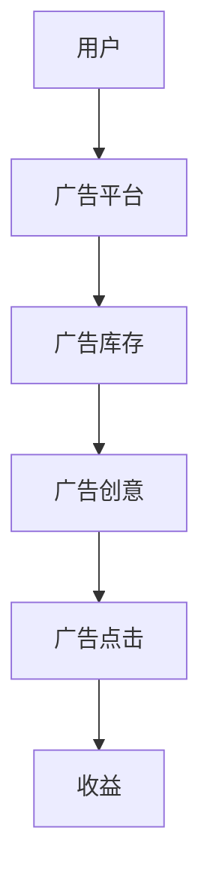

                 


# 企业AI Agent的强化学习在程序化广告投放中的实践

---

## 关键词：
企业AI Agent，强化学习，程序化广告，广告投放，深度强化学习，广告优化

---

## 摘要：
本文详细探讨了企业AI Agent在程序化广告投放中的应用，结合强化学习算法，分析了其在广告投放中的优化策略。文章从背景介绍、核心概念、算法原理、系统架构到项目实战，全面解析了强化学习在程序化广告中的实践。通过实际案例和代码实现，展示了如何利用强化学习提升广告投放效果，同时提出了优化建议和未来发展方向。

---

## 第一部分: 背景介绍

### 第1章: 企业AI Agent与强化学习概述

#### 1.1 企业AI Agent的定义与特点
- **AI Agent**：人工智能代理，能够感知环境并采取行动以实现目标。
- **特点**：
  - 自主性：无需外部干预。
  - 反应性：实时响应环境变化。
  - 目标导向：基于目标优化决策。

#### 1.2 强化学习的基本原理
- **强化学习**：通过试错机制，基于奖励函数优化策略。
- **核心要素**：
  - 状态空间：环境输入。
  - 动作空间：可能的决策。
  - 奖励函数：评估决策的价值。

#### 1.3 程序化广告投放的背景与挑战
- **程序化广告**：通过算法自动投放和优化广告。
- **核心问题**：
  - 实时决策：快速选择最佳广告。
  - 多目标优化：在多个目标间权衡。
- **挑战**：
  - 数据量大，计算复杂。
  - 动态环境，策略需实时调整。

---

### 第2章: 企业AI Agent在程序化广告中的应用

#### 2.1 AI Agent在广告投放中的角色
- **实时决策**：快速选择最优广告。
- **多目标优化**：平衡收益与用户体验。
- **动态调整**：根据反馈优化策略。

#### 2.2 强化学习在广告投放中的应用
- **核心问题**：广告选择和投放策略优化。
- **应用场景**：
  - 点击率预测。
  - 转化率优化。
- **挑战**：
  - 实时性要求高。
  - 数据稀疏性和噪声。

---

## 第二部分: 核心概念与联系

### 第3章: 核心概念与联系

#### 3.1 核心概念的解释
| 概念       | 描述                                                                 |
|------------|----------------------------------------------------------------------|
| 状态空间   | 环境输入，如用户特征、时间等。                                         |
| 动作空间   | 可能的决策，如选择广告、不选择广告。                                   |
| 奖励函数   | 评估决策价值，如点击率提升带来的奖励。                                 |

#### 3.2 实体关系图


---

## 第三部分: 算法原理

### 第4章: 强化学习算法原理与数学模型

#### 4.1 Q-Learning算法
- **算法流程**：
  1. 初始化Q表。
  2. 选择动作。
  3. 执行动作，观察奖励。
  4. 更新Q值。
  5. 重复。

- **数学模型**：
  $$ Q(s,a) = Q(s,a) + \alpha (r + \gamma \max Q(s',a') - Q(s,a)) $$
  其中：
  - \( \alpha \)：学习率。
  - \( \gamma \)：折扣因子。

#### 4.2 Deep Q-Networks (DQN)算法
- **结构**：
  - 状态输入 → 神经网络 → Q值输出。
- **优势**：
  - 处理高维状态空间。
  - 适用于复杂环境。

---

## 第四部分: 系统分析与架构设计

### 第5章: 系统架构设计

#### 5.1 广告投放场景
- **实时决策**：用户点击广告时，系统需实时选择最佳广告。
- **数据驱动**：依赖用户行为数据优化策略。

#### 5.2 系统功能设计
- **领域模型**：
  ```mermaid
  classDiagram
      class 用户 {
          用户ID
          行为特征
      }
      class 广告库存 {
          广告ID
          广告内容
      }
      用户 --> 广告库存
      广告库存 --> 广告选择模块
  ```

- **系统架构**：
  ```mermaid
  architecture
      客户端 --> 数据采集模块
      数据采集模块 --> 数据存储模块
      数据存储模块 --> 强化学习模块
      强化学习模块 --> 广告选择模块
      广告选择模块 --> 广告投放模块
  ```

---

## 第五部分: 项目实战

### 第6章: 项目实战与案例分析

#### 6.1 环境安装
- **工具**：
  - Python 3.8+
  - TensorFlow 2.0+
  - Gym库

#### 6.2 核心代码实现
- **状态空间定义**：
  ```python
  state_space = ['用户特征', '时间特征']
  ```
- **动作空间定义**：
  ```python
  action_space = ['广告1', '广告2', '不投放']
  ```
- **奖励函数实现**：
  ```python
  def reward_function(action, outcome):
      if outcome == '点击':
          return 1
      else:
          return 0
  ```

#### 6.3 案例分析
- **案例背景**：提升广告点击率。
- **算法实现**：
  ```python
  import gym
  import numpy as np

  env = gym.make('CustomAdvertisingEnv')
  Q = np.zeros([len(env.observation_space), len(env.action_space)])

  episodes = 1000
  for episode in range(episodes):
      state = env.reset()
      done = False
      while not done:
          action = np.argmax(Q[state])
          next_state, reward, done, _ = env.step(action)
          Q[state][action] += reward
  ```

---

## 第六部分: 优化与扩展

### 第7章: 优化与扩展

#### 7.1 算法优化
- **超参数调优**：
  - 学习率调整。
  - 阶跃大小优化。
- **多臂老虎机问题**：
  - 平衡探索与利用。

#### 7.2 技术扩展
- **结合推荐系统**：
  - 利用协同过滤优化广告选择。
- **实时广告投放优化**：
  - 处理数据延迟问题。
  - 优化广告选择速度。

---

## 第七部分: 总结与展望

### 第8章: 总结与展望

#### 8.1 总结
- **核心内容**：强化学习在广告投放中的应用。
- **主要收获**：AI Agent通过强化学习优化广告策略。

#### 8.2 展望
- **未来方向**：
  - 多智能体协同优化。
  - 无监督学习的应用。
  - 更复杂的广告环境建模。

---

## 作者信息

作者：AI天才研究院 & 禅与计算机程序设计艺术

---

通过以上结构，文章系统地介绍了企业AI Agent在程序化广告中的应用，结合理论与实践，为读者提供了从基础到高级的全面解析。

