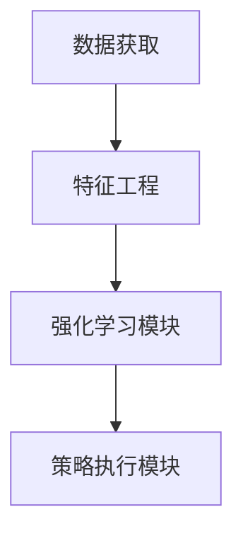

                 


# 企业AI Agent的强化学习在自动化交易策略中的应用

> 关键词：企业AI Agent, 强化学习, 自动化交易, 交易策略, 算法实现

> 摘要：本文探讨了企业AI Agent如何利用强化学习技术来优化自动化交易策略。从强化学习的基本概念到具体算法实现，再到系统架构设计，本文详细分析了强化学习在自动化交易中的应用，并通过一个实际案例展示了如何构建一个基于强化学习的交易系统。

---

# 第1章: 强化学习与企业AI Agent的背景

## 1.1 强化学习的基本概念

### 1.1.1 什么是强化学习

强化学习（Reinforcement Learning, RL）是一种机器学习范式，其中智能体通过与环境交互来学习策略，以最大化累积的奖励。与监督学习不同，强化学习不需要标注的训练数据，而是通过试错和奖励机制来优化行为。

$$
\text{奖励} = f(\text{动作}, \text{状态})
$$

### 1.1.2 强化学习的核心要素

| 核心要素 | 描述 |
|----------|------|
| 状态 (State) | 环境的当前情况，例如市场数据。 |
| 动作 (Action) | 智能体可以执行的操作，例如买入或卖出。 |
| 奖励 (Reward) | 对智能体行为的反馈，通常是一个标量值。 |
| 策略 (Policy) | 智能体选择动作的概率分布。 |
| 值函数 (Value Function) | 预测在给定状态下获得的期望奖励。 |

### 1.1.3 强化学习与其他学习方法的对比

| 方法 | 描述 |
|------|------|
| 监督学习 | 基于标注数据，预测目标值。 |
| 无监督学习 | 基于未标注数据，发现数据结构。 |
| 强化学习 | 基于与环境的交互，通过奖励优化策略。 |

## 1.2 企业AI Agent的定义

### 1.2.1 AI Agent的基本概念

AI Agent是一种能够感知环境、自主决策并执行任务的智能体。在企业场景中，AI Agent可以用于自动化交易、智能客服、供应链优化等任务。

### 1.2.2 企业级AI Agent的特点

| 特性 | 描述 |
|------|------|
| 高可用性 | 系统必须稳定运行，确保交易的及时性。 |
| 实时性 | 需要快速响应市场变化。 |
| 可扩展性 | 能够处理大量的数据和交易请求。 |
| 智能性 | 能够根据市场动态调整策略。 |

## 1.3 强化学习在企业AI Agent中的作用

### 1.3.1 提供自主决策能力

通过强化学习，企业AI Agent可以在复杂的市场环境中自主决策，无需人工干预。

### 1.3.2 实现策略优化

强化学习能够优化交易策略，提高收益并降低风险。

### 1.3.3 处理非结构化数据

强化学习可以处理非结构化数据，如市场情绪和新闻资讯。

---

# 第2章: 强化学习的核心算法

## 2.1 Q-Learning算法

### 2.1.1 Q-Learning的基本原理

Q-Learning是一种经典的强化学习算法，通过更新Q表来学习最优策略。

$$
Q(s, a) \leftarrow Q(s, a) + \alpha [r + \max Q(s', a') - Q(s, a)]
$$

### 2.1.2 Q-Learning的实现

```python
import numpy as np

class QLearning:
    def __init__(self, state_space, action_space, learning_rate=0.1, gamma=0.9):
        self.q_table = np.zeros((state_space, action_space))
        self.lr = learning_rate
        self.gamma = gamma

    def choose_action(self, state, epsilon=0.1):
        if np.random.random() < epsilon:
            return np.random.randint(0, self.q_table.shape[1])
        else:
            return np.argmax(self.q_table[state, :])

    def update_q_table(self, state, action, reward, next_state):
        self.q_table[state, action] += self.lr * (reward + self.gamma * np.max(self.q_table[next_state, :]) - self.q_table[state, action])
```

### 2.1.3 Q-Learning的优缺点

| 优点 | 缺点 |
|------|------|
| 简单易实现 | �状态空间大时效率低 |
| 离线训练 | 不适用于连续动作空间 |

## 2.2 Deep Q-Network (DQN)算法

### 2.2.1 DQN的基本原理

DQN通过神经网络近似值函数，解决了Q-Learning在高维状态空间中的效率问题。

$$
Q(s, a) \approx \theta \cdot \phi(s, a)
$$

### 2.2.2 DQN的实现

```python
import torch
import torch.nn as nn

class DQN(nn.Module):
    def __init__(self, input_dim, output_dim):
        super(DQN, self).__init__()
        self.fc1 = nn.Linear(input_dim, 64)
        self.fc2 = nn.Linear(64, output_dim)
        self.relu = nn.ReLU()
        self.softmax = nn.Softmax(dim=1)

    def forward(self, x):
        x = self.fc1(x)
        x = self.relu(x)
        x = self.fc2(x)
        x = self.softmax(x)
        return x
```

### 2.2.3 DQN在交易中的应用

DQN可以用于股票交易，通过神经网络预测下一步的最佳动作。

---

# 第3章: 企业AI Agent的强化学习框架

## 3.1 基于强化学习的交易系统架构

### 3.1.1 交易系统的模块划分

- **数据获取模块**：收集市场数据。
- **特征工程模块**：提取特征，如技术指标。
- **强化学习模块**：学习交易策略。
- **策略执行模块**：根据策略生成订单。

### 3.1.2 模块之间的交互

使用Mermaid图展示系统架构：



## 3.2 系统的输入输出设计

### 3.2.1 输入数据的处理

- **市场数据**：包括价格、成交量等。
- **特征工程**：提取技术指标，如MACD、RSI等。

### 3.2.2 输出策略的制定

- **动作选择**：根据Q值或策略网络输出选择动作。
- **策略执行**：根据选择的动作生成订单。

---

# 第4章: 强化学习在自动化交易中的应用

## 4.1 自动化交易的定义与分类

### 4.1.1 自动化交易的定义

自动化交易是指通过算法和计算机程序自动执行交易订单。

### 4.1.2 自动化交易的分类

| 类型 | 描述 |
|------|------|
| 算法交易 | 基于数学模型的交易策略。 |
| 黑盒交易 | 使用复杂模型的交易策略。 |
| 统计套利 | 基于价差的套利策略。 |

## 4.2 强化学习在交易策略中的作用

### 4.2.1 策略优化

通过强化学习，交易策略可以不断优化，以适应市场变化。

### 4.2.2 风险管理

强化学习可以帮助识别高风险交易，降低整体风险。

---

# 第5章: 强化学习交易系统的实现

## 5.1 项目实战

### 5.1.1 股票交易案例

以股票交易为例，展示如何实现一个基于强化学习的交易系统。

### 5.1.2 代码实现

```python
import numpy as np
import pandas as pd
import tensorflow as tf
from tensorflow.keras import layers

# 数据获取与预处理
data = pd.read_csv('stock_data.csv')
data = data['close'].values

# 特征工程
states = []
for i in range(1, len(data)):
    state = data[i-1:i]
    states.append(state)

# 强化学习模型
model = tf.keras.Sequential([
    layers.Dense(64, activation='relu'),
    layers.Dense(2, activation='softmax')
])

# 训练过程
def train_model():
    optimizer = tf.keras.optimizers.Adam(learning_rate=0.001)
    for episode in range(1000):
        state = states[episode]
        action = model.predict(tf.constant(state, dtype=tf.float32))
        action = tf.argmax(action).numpy()
        # 计算奖励
        reward = calculate_reward(state, action)
        # 更新模型
        optimizer.minimize(lambda: loss_function(model, state, action, reward))

def calculate_reward(state, action):
    next_state = states[episode+1]
    reward = next_state[action] - state[action]
    return reward

def loss_function(model, state, action, reward):
    prediction = model(tf.constant(state, dtype=tf.float32))
    loss = tf.keras.losses.sparse_categorical_crossentropy(action, prediction)
    return loss
```

---

# 第6章: 最佳实践与注意事项

## 6.1 算法选择

- 根据问题规模选择合适的算法。
- 在高维状态下选择DQN或Actor-Critic方法。

## 6.2 超参数调优

- 学习率：建议从0.01开始，逐步降低。
- 奖励设计：确保奖励机制能够引导智能体学习正确的策略。

## 6.3 风险管理

- 设置止损点，防止亏损过大。
- 监控交易系统，及时发现异常。

---

# 作者信息

作者：AI天才研究院/AI Genius Institute & 禅与计算机程序设计艺术 /Zen And The Art of Computer Programming

---

希望这篇文章能够清晰地展示企业AI Agent如何利用强化学习优化自动化交易策略，并为读者提供从理论到实践的全面指导。

