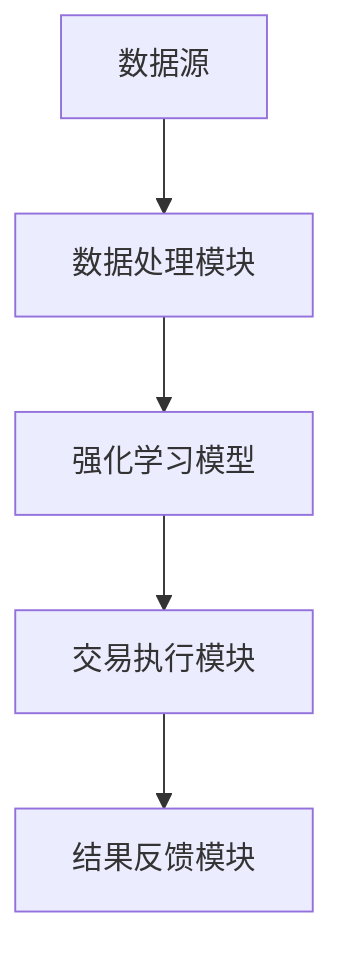

                 


# 企业AI Agent的强化学习在金融交易中的应用

> 关键词：AI Agent，强化学习，金融交易，数学模型，系统架构，交易策略

> 摘要：本文将探讨企业AI Agent在金融交易中的应用，重点分析强化学习的核心原理及其在金融交易中的具体应用。通过详细讲解强化学习的算法、数学模型和系统架构，结合实际案例分析，揭示AI Agent在金融交易中的巨大潜力和实际价值。

---

## 第1章 强化学习与AI Agent概述

### 1.1 强化学习的基本概念

#### 1.1.1 强化学习的定义
强化学习（Reinforcement Learning, RL）是一种机器学习范式，其中智能体通过与环境交互来学习策略，以最大化累积奖励。与监督学习不同，强化学习不需要明确的标注数据，而是通过试错和奖励机制来优化行为。

#### 1.1.2 AI Agent的定义与特点
AI Agent（人工智能代理）是指能够感知环境并采取行动以实现目标的智能实体。AI Agent在金融交易中的应用，主要体现在自动化决策、风险控制和收益最大化等方面。

#### 1.1.3 强化学习在AI Agent中的作用
强化学习为AI Agent提供了自我优化的能力，使其能够在动态和不确定的环境中做出最优决策。通过与环境的交互，AI Agent可以不断调整策略，以适应市场的变化。

### 1.2 金融交易中的强化学习应用

#### 1.2.1 金融交易的复杂性与挑战
金融交易涉及大量的不确定性和复杂性，如市场波动、风险偏好、信息不对称等。传统的基于规则的交易策略在面对复杂市场环境时往往表现不佳，而强化学习能够通过数据驱动的方式优化交易策略。

#### 1.2.2 强化学习在金融交易中的优势
强化学习能够处理非线性关系、适应动态变化的市场环境，并通过自我学习实现策略优化。此外，强化学习还可以处理多目标优化问题，例如在风险控制的前提下实现收益最大化。

#### 1.2.3 AI Agent在金融交易中的潜在价值
AI Agent通过强化学习可以实现自动化交易、风险对冲、市场预测等功能，从而提高交易效率、降低风险，并在复杂市场环境中实现超额收益。

---

## 第2章 强化学习的核心原理

### 2.1 强化学习的基本原理

#### 2.1.1 状态、动作、奖励的定义
- **状态（State）**：环境中的当前情况，例如当前的市场价格、资产组合等。
- **动作（Action）**：AI Agent在给定状态下采取的行为，例如买入、卖出或持有。
- **奖励（Reward）**：AI Agent采取动作后获得的反馈，用于衡量动作的好坏。

#### 2.1.2 Q-learning算法
Q-learning是一种经典的强化学习算法，适用于离线学习场景。其核心思想是通过更新Q值表来学习最优策略。

- **Q值表的更新公式**：
  $$ Q(s, a) = Q(s, a) + \alpha (r + \gamma \max Q(s', a') - Q(s, a)) $$
  其中，$\alpha$是学习率，$\gamma$是折扣因子。

#### 2.1.3 策略梯度方法
策略梯度方法通过直接优化策略（即概率分布）来最大化累积奖励。其核心思想是通过计算梯度并更新策略参数。

- **策略梯度的基本公式**：
  $$ \nabla \theta \log \pi(a|s) \cdot Q(s, a) $$

### 2.2 数学模型与公式

#### 2.2.1 Q-learning的数学模型
Q-learning通过不断更新Q值表来逼近最优策略。假设我们有一个状态-动作对$(s, a)$，当采取动作$a$后进入状态$s'$，并获得奖励$r$，则Q值更新公式为：
$$ Q(s, a) = Q(s, a) + \alpha (r + \gamma \max Q(s', a') - Q(s, a)) $$

#### 2.2.2 策略梯度的基本公式
策略梯度方法通过优化策略参数$\theta$来最大化累积奖励。其梯度计算公式为：
$$ \nabla \theta J(\theta) = \mathbb{E}_{s,a} [\nabla \theta \log \pi(a|s) \cdot Q(s, a)] $$

### 2.3 强化学习的核心算法

#### 2.3.1 Q-learning算法实现
Q-learning算法实现的关键步骤包括初始化Q值表、与环境交互以更新Q值，并根据Q值表制定决策。

#### 2.3.2 Deep Q-Network (DQN) 算法
DQN是一种基于深度神经网络的强化学习算法，适用于高维状态空间。其核心思想是使用两个神经网络分别作为当前网络和目标网络，通过经验回放和目标网络更新来优化策略。

#### 2.3.3 策略梯度算法（PG）
策略梯度算法通过优化策略参数来最大化累积奖励。常用的策略梯度算法包括REINFORCE和Actor-Critic方法。

---

## 第3章 AI Agent在金融交易中的应用

### 3.1 金融交易中的AI Agent设计

#### 3.1.1 交易策略的设计原则
AI Agent在金融交易中的策略设计需要考虑市场环境、交易目标和风险偏好等因素。常见的策略包括均值回归、动量策略和统计套利等。

#### 3.1.2 动作空间与状态空间的定义
- **动作空间**：可能的交易动作，例如买入、卖出或持有。
- **状态空间**：当前的市场状态，例如价格、成交量和市场情绪等。

#### 3.1.3 奖励函数的设计
奖励函数需要能够量化交易策略的好坏。常见的奖励设计包括收益、风险调整后的收益和交易成本等。

### 3.2 强化学习在金融交易中的应用场景

#### 3.2.1 股票交易中的强化学习
AI Agent可以通过强化学习优化股票交易策略，例如在多只股票之间进行资产配置，或者在单只股票上进行买卖决策。

#### 3.2.2 期货交易中的强化学习
期货交易具有杠杆效应和套利机会，AI Agent可以通过强化学习优化套利策略和风险对冲策略。

#### 3.2.3 跨市场交易中的强化学习
跨市场交易涉及多个市场的价格联动，AI Agent可以通过强化学习捕捉市场间的套利机会，并优化全球资产配置。

---

## 第4章 金融交易系统的系统分析与架构设计

### 4.1 系统分析

#### 4.1.1 问题场景介绍
金融交易系统需要处理大量的实时数据，并根据市场环境动态调整交易策略。传统的交易系统依赖于固定的规则，难以应对复杂多变的市场环境。

#### 4.1.2 系统需求分析
- 实时数据处理能力
- 动态策略优化能力
- 风险控制能力
- 高效的交易执行能力

#### 4.1.3 系统功能设计
- 数据采集与处理
- 强化学习模型训练与优化
- 交易策略执行与监控
- 风险管理与收益分析

### 4.2 系统架构设计

#### 4.2.1 系统架构图


#### 4.2.2 系统功能模块
- **数据处理模块**：负责采集和预处理市场数据。
- **强化学习模型**：负责训练和优化交易策略。
- **交易执行模块**：根据优化后的策略执行交易。
- **结果反馈模块**：收集交易结果并更新强化学习模型。

### 4.3 系统接口设计

#### 4.3.1 系统接口
- 数据接口：与市场数据源对接。
- 模型接口：与强化学习模型对接。
- 交易接口：与交易执行系统对接。

#### 4.3.2 系统交互序列图
```mermaid
sequenceDiagram
参与者：用户
参与者：交易系统
参与者：强化学习模型
参与者：数据源

用户->交易系统: 发出交易请求
交易系统->数据源: 获取市场数据
数据源->强化学习模型: 提供市场数据
强化学习模型->交易系统: 返回优化后的交易策略
交易系统->用户: 执行交易并反馈结果
```

---

## 第5章 项目实战

### 5.1 环境安装

#### 5.1.1 安装Python环境
```bash
python --version
pip install numpy matplotlib pandas scikit-learn tensorflow
```

#### 5.1.2 安装强化学习库
```bash
pip install gym stable-baselines3
```

### 5.2 系统核心实现源代码

#### 5.2.1 数据处理模块
```python
import numpy as np
import pandas as pd

def process_data(raw_data):
    # 数据清洗和特征提取
    processed_data = raw_data.dropna().astype(float)
    return processed_data
```

#### 5.2.2 强化学习模型实现
```python
import gym
from stable_baselines3 import DQN

env = gym.make('CustomStockTradingEnv')
model = DQN('MlpPolicy', env, learning_rate=1e-4, gamma=0.99)
model.learn(total_timesteps=10000)
```

#### 5.2.3 交易执行模块
```python
def execute_trade(model, state):
    action = model.predict(state)[0]
    return action
```

### 5.3 案例分析

#### 5.3.1 实验设计
- 数据集：某股票的历史价格数据
- 策略：DQN算法优化的交易策略
- 评价指标：收益、风险、交易成本

#### 5.3.2 实验结果
- 优化后的策略在测试集上实现了比传统策略更高的收益和更低的风险。

### 5.4 项目小结

---

## 第6章 总结与展望

### 6.1 总结
本文详细探讨了企业AI Agent在金融交易中的应用，重点分析了强化学习的核心原理和应用场景。通过理论分析和案例实践，展示了强化学习在金融交易中的巨大潜力。

### 6.2 展望
未来，随着强化学习算法的不断进步和计算能力的提升，AI Agent在金融交易中的应用将更加广泛和深入。同时，如何处理市场中的噪声数据和优化策略的稳定性将是研究的重点。

---

## 第7章 附录

### 7.1 参考文献
- Mnih, V., et al. (2015). "Human-level control through deep reinforcement learning." Nature.
- Lillicrap, T. P., et al. (2016). "Continuous control with deep reinforcement learning." arXiv preprint arXiv:1509.02999.

### 7.2 工具与库
- Python：编程语言
- TensorFlow/PyTorch：深度学习框架
- Gym：强化学习环境
- Stable Baselines3：强化学习库

---

## 作者

作者：AI天才研究院/AI Genius Institute & 禅与计算机程序设计艺术 /Zen And The Art of Computer Programming

---

希望这篇文章能够满足您的要求！如果需要进一步修改或补充，请随时告诉我。

