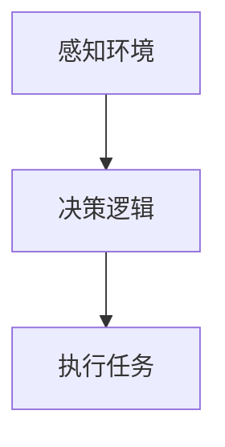
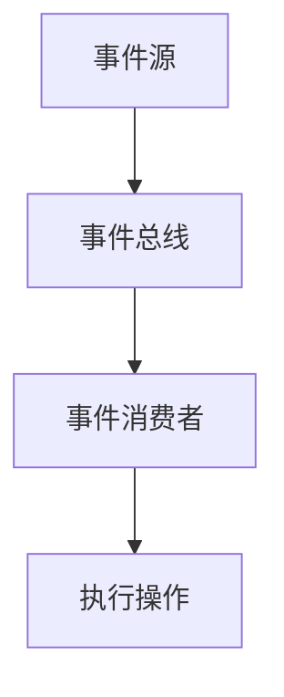
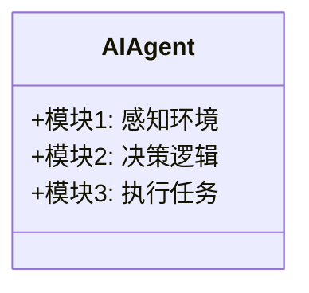
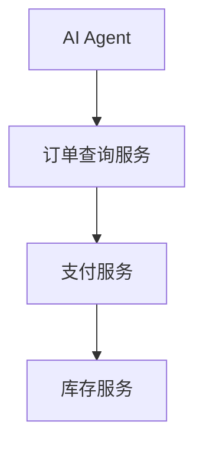
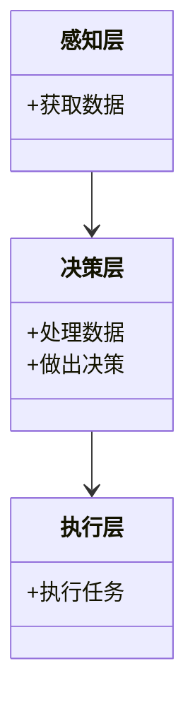
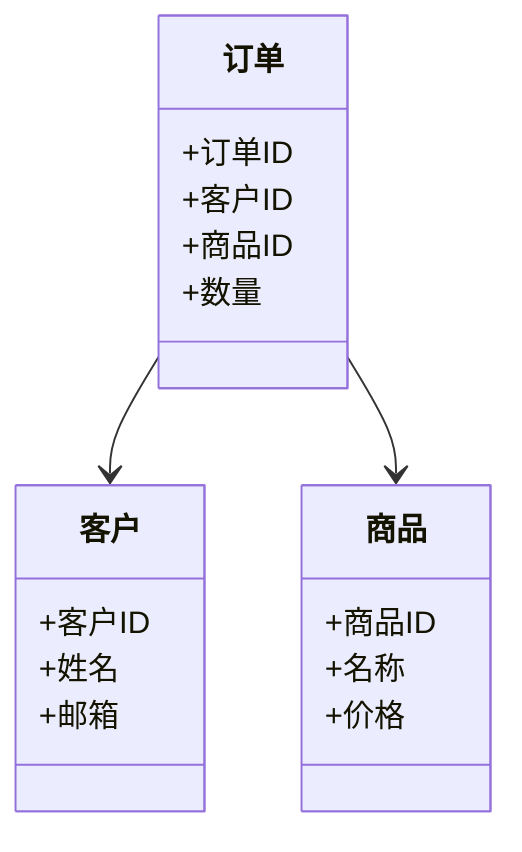
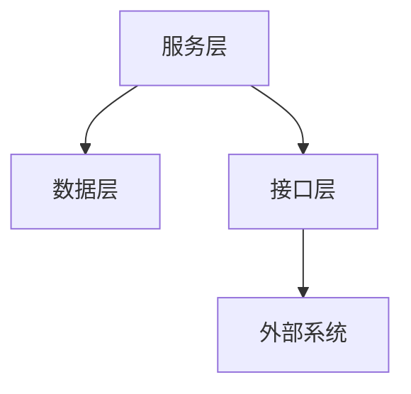
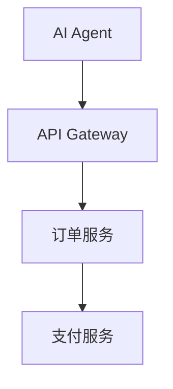
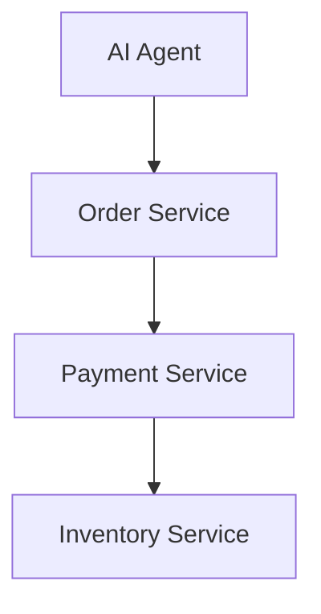

                 


# 企业AI Agent的微服务架构设计

## 关键词  
AI Agent, 微服务架构, 企业应用, 系统设计, 技术实现  

## 摘要  
随着人工智能技术的快速发展，AI Agent（智能代理）在企业中的应用越来越广泛。本文探讨了AI Agent在企业环境中的设计与实现，结合微服务架构的优势，分析了AI Agent的核心原理、系统架构设计、算法实现以及项目实战。通过详细的技术分析和实际案例，本文为企业AI Agent的微服务架构设计提供了全面的指导。

---

## 第一部分: 企业AI Agent的背景与概念

### 第1章: AI Agent与微服务架构概述

#### 1.1 AI Agent的定义与核心概念

AI Agent（智能代理）是一种能够感知环境、自主决策并执行任务的智能体。其核心概念包括：

- **感知环境**：通过传感器或接口获取外部信息。
- **自主决策**：基于获取的信息，通过算法做出决策。
- **执行任务**：通过执行器或接口完成任务。

AI Agent在企业中的典型应用场景包括自动化流程管理、智能客服、供应链优化等。

**对比表格：AI Agent与其他技术的对比**

| **技术**       | **特点**                                                                 |
|----------------|--------------------------------------------------------------------------|
| AI Agent       | 感知环境、自主决策、任务执行                                               |
| 传统脚本       | 静态规则、无自主决策能力                                                   |
| RESTful API    | 静态接口，无智能性                                                         |

#### 1.2 微服务架构的基本概念

微服务架构是一种将应用程序分解为小型、独立服务的架构模式。其核心优势包括：

- **高可扩展性**：每个服务独立扩展。
- **松耦合**：服务之间通过接口通信，降低耦合度。
- **技术多样性**：允许使用不同的技术栈。

**ER实体关系图：AI Agent与微服务架构的关系**

```mermaid
er
actor(AI Agent) -|-> service: 调用服务
service -|-> function: 提供功能
```

#### 1.3 AI Agent与微服务架构的结合

AI Agent在微服务架构中的应用，使得企业能够构建高效、灵活的智能系统。例如：

- **智能客服系统**：通过AI Agent调用微服务完成订单查询、用户咨询等任务。
- **供应链优化**：AI Agent协调多个微服务，优化库存、物流流程。

---

## 第二部分: AI Agent的核心原理与技术

### 第2章: AI Agent的核心原理

#### 2.1 AI Agent的基本原理

AI Agent的核心原理包括感知、决策和执行三个阶段：

1. **感知环境**：通过传感器或API获取数据。
2. **决策逻辑**：基于数据，通过算法做出决策。
3. **执行任务**：通过执行器或API完成任务。

**算法流程图：AI Agent的基本流程**



#### 2.2 微服务架构中的AI Agent实现

在微服务架构中，AI Agent通过调用多个服务完成任务。例如：

- **订单查询**：AI Agent调用订单微服务获取订单状态。
- **库存管理**：AI Agent调用库存微服务更新库存信息。

**数学模型：AI Agent的决策逻辑**

决策逻辑可以通过以下公式表示：

$$
决策 = \argmax_{i} (P(i | 观察))
$$

其中，$P(i | 观察)$ 表示在观察条件下的概率。

#### 2.3 AI Agent的事件驱动与响应机制

AI Agent通过事件驱动机制实现高效响应。例如：

- **订单创建事件**：触发AI Agent调用支付微服务完成支付。
- **库存更新事件**：触发AI Agent调用供应链微服务优化物流。

**事件驱动流程图：AI Agent的事件处理机制**



---

## 第三部分: 微服务架构中的AI Agent设计

### 第3章: 微服务架构下的AI Agent设计原则

#### 3.1 微服务架构下的设计原则

在微服务架构中设计AI Agent时，需遵循以下原则：

- **模块化设计**：将AI Agent的功能分解为多个独立模块。
- **接口标准化**：确保服务之间的接口统一。
- **容错设计**：通过重试机制处理服务调用失败的情况。

**模块化设计示意图**



#### 3.2 AI Agent的微服务化设计

将AI Agent的功能模块化设计为独立的微服务，例如：

- **订单查询服务**：负责查询订单信息。
- **支付服务**：负责处理支付请求。
- **库存服务**：负责管理库存数据。

**微服务化设计流程图**



---

## 第四部分: 企业AI Agent的系统架构与实现

### 第4章: 企业AI Agent的系统架构设计

#### 4.1 企业AI Agent的系统架构概述

企业AI Agent的系统架构通常包括以下部分：

- **感知层**：负责获取外部数据。
- **决策层**：负责数据处理和决策。
- **执行层**：负责任务执行。

**系统架构分层设计**



#### 4.2 企业AI Agent的领域模型设计

领域模型设计是系统设计的重要部分。例如：

- **订单领域模型**：包含订单ID、客户信息、商品信息等。

**领域模型类图**



#### 4.3 企业AI Agent的系统架构设计

系统架构设计通常包括以下部分：

- **服务层**：提供核心业务逻辑。
- **数据层**：管理数据存储和检索。
- **接口层**：提供API接口供其他系统调用。

**系统架构设计图**



#### 4.4 企业AI Agent的系统接口设计

系统接口设计需要遵循RESTful API规范。例如：

- **GET /order/{id}**：获取订单信息。
- **POST /payment**：提交支付请求。

**接口设计示意图**



---

## 第五部分: 项目实战

### 第5章: 项目实战与案例分析

#### 5.1 项目背景介绍

假设我们正在开发一个智能客服系统，AI Agent需要调用订单、支付、库存等多个微服务。

#### 5.2 系统核心实现

以下是AI Agent的核心代码示例：

```python
class AIAgent:
    def __init__(self):
        self.order_service = OrderService()
        self.payment_service = PaymentService()
        self.inventory_service = InventoryService()

    def process_order(self, order_id):
        order = self.order_service.get_order(order_id)
        if order.status == 'pending':
            self.payment_service.pay(order)
            self.inventory_service.update_stock(order)
```

#### 5.3 案例分析与解读

通过上述代码，AI Agent能够协调多个微服务完成订单处理流程。例如：

1. **获取订单信息**：调用订单服务获取订单状态。
2. **支付处理**：调用支付服务完成支付。
3. **库存更新**：调用库存服务更新库存数据。

**流程图：订单处理流程**



---

## 第六部分: 总结与展望

### 第6章: 总结与展望

#### 6.1 本章总结

本文详细探讨了企业AI Agent的微服务架构设计，从概念、原理到实现，为企业构建智能系统提供了全面的指导。

#### 6.2 未来展望

随着AI技术的不断发展，AI Agent在企业中的应用将更加广泛。未来的研究方向包括：

- 更高效的AI Agent算法。
- 更智能的微服务架构设计。
- 更安全的系统接口设计。

---

## 最佳实践 Tips

- **小结**：企业AI Agent的微服务架构设计需要结合AI技术与微服务架构的优势，通过模块化设计和事件驱动机制实现高效、灵活的智能系统。
- **注意事项**：在实际项目中，需注意服务间的通信效率和系统的可扩展性。
- **拓展阅读**：建议深入学习微服务架构和AI算法的相关知识，以更好地设计和实现企业AI Agent。

---

## 作者  
作者：AI天才研究院 & 禅与计算机程序设计艺术

