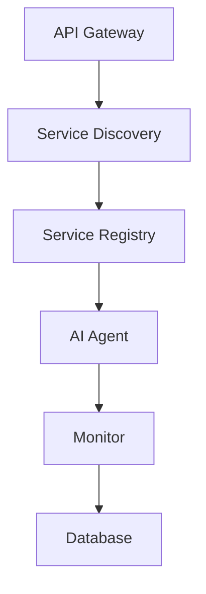

                 


# 《企业AI Agent的微服务治理与监控策略》

> **关键词**：企业AI Agent，微服务治理，服务监控，系统架构，AI算法，自动化运维

> **摘要**：本文系统地探讨了企业AI Agent在微服务架构中的治理与监控策略。通过分析AI Agent的核心原理、微服务治理的理论基础、监控策略的实现方法，结合实际项目案例，详细阐述了如何在企业级微服务系统中实现高效的AI Agent治理与监控。文章从理论到实践，详细介绍了AI Agent的架构设计、监控体系的构建、系统架构的实现，并通过具体代码示例和案例分析，帮助读者全面掌握企业AI Agent的微服务治理与监控策略。

---

# 第1章：企业AI Agent的概述与背景

## 1.1 AI Agent的基本概念

### 1.1.1 AI Agent的定义与特点

AI Agent（人工智能代理）是一种能够感知环境、自主决策并执行任务的智能实体。它通过传感器获取外部信息，利用算法进行分析和推理，然后通过执行器与外部环境交互。AI Agent的核心特点包括：

- **自主性**：能够在没有外部干预的情况下自主运行。
- **反应性**：能够实时感知环境变化并做出反应。
- **主动性**：主动采取行动以实现目标。
- **社会性**：能够与其他系统或人类进行协作与通信。

### 1.1.2 AI Agent在企业中的作用

在企业环境中，AI Agent被广泛应用于自动化运维、智能客服、智能推荐等领域。它能够提高企业的运营效率、降低成本、提升用户体验。例如，在运维领域，AI Agent可以自动检测系统故障并进行修复；在客服领域，AI Agent可以提供24/7的智能支持。

### 1.1.3 微服务架构与AI Agent的结合

微服务架构将系统拆分为多个小型、独立的服务，每个服务负责特定的功能。AI Agent可以在微服务架构中作为独立的服务存在，与其他服务协同工作。这种架构使得AI Agent能够灵活地扩展和部署，同时提高了系统的可维护性和可扩展性。

---

## 1.2 微服务治理的背景与挑战

### 1.2.1 微服务架构的特点与优势

微服务架构将系统拆分为多个小型服务，每个服务独立开发、部署和扩展。这种架构具有以下优势：

- **模块化**：服务之间耦合度低，便于维护和扩展。
- **可扩展性**：可以根据需求快速扩展特定服务。
- **技术多样性**：每个服务可以使用不同的技术栈。

### 1.2.2 微服务治理的核心问题

随着微服务数量的增加，治理问题变得越来越重要。微服务治理的核心问题包括：

- **服务发现**：如何找到可用的服务实例。
- **服务路由**：如何将请求路由到合适的服务。
- **服务熔断**：如何处理服务故障或超负荷的情况。
- **监控与告警**：如何实时监控服务状态并及时告警。

### 1.2.3 企业AI Agent在微服务治理中的应用

AI Agent可以利用其智能性和自主性，辅助解决微服务治理中的复杂问题。例如，AI Agent可以自动分析服务的负载情况，动态调整路由策略；也可以通过历史数据预测服务故障，提前采取预防措施。

---

## 1.3 本章小结

本章介绍了AI Agent的基本概念及其在企业中的作用，并探讨了微服务架构的特点与优势。同时，分析了微服务治理的核心问题以及AI Agent在其中的应用。接下来，我们将深入探讨AI Agent的原理与架构。

---

# 第2章：AI Agent的原理与架构

## 2.1 AI Agent的核心原理

### 2.1.1 AI Agent的工作原理

AI Agent的工作流程包括感知、决策和执行三个阶段：

1. **感知**：通过传感器或API获取外部环境数据。
2. **决策**：利用算法对数据进行分析，生成决策。
3. **执行**：通过执行器将决策转化为具体行动。

### 2.1.2 AI Agent的感知与决策机制

AI Agent的感知机制包括数据采集和数据处理。数据采集可以通过传感器、日志文件或API接口实现，数据处理则涉及数据清洗、特征提取和数据建模。决策机制基于机器学习模型，常用的算法包括随机森林、神经网络和强化学习。

### 2.1.3 AI Agent的执行与反馈机制

AI Agent的执行机制包括动作选择和动作执行。动作选择基于当前状态和目标，选择最优动作；动作执行则通过调用API或控制外部设备完成。反馈机制用于收集执行结果，用于后续优化。

---

## 2.2 微服务架构下的AI Agent架构

### 2.2.1 微服务架构与AI Agent的结合

在微服务架构中，AI Agent可以作为独立的服务运行，与其他服务通过API进行交互。这种架构使得AI Agent能够灵活地与其他服务协同工作，同时保持自身的独立性和可扩展性。

### 2.2.2 AI Agent在微服务中的角色

AI Agent在微服务中可以作为监控代理、自动化运维代理或业务逻辑代理。例如，监控代理可以实时监控服务状态，自动化运维代理可以自动修复系统故障。

### 2.2.3 AI Agent的通信与协作机制

AI Agent通过服务发现和通信协议与微服务进行交互。常用的服务发现机制包括注册中心和DNS解析。通信协议可以是HTTP、gRPC或消息队列。

---

## 2.3 本章小结

本章详细介绍了AI Agent的核心原理及其在微服务架构中的角色。接下来，我们将探讨微服务治理的核心概念与方法。

---

# 第3章：微服务治理的核心概念与方法

## 3.1 微服务治理的理论基础

### 3.1.1 微服务治理的基本概念

微服务治理是指对微服务系统进行规划、设计、监控和优化的过程。它包括服务发现、服务路由、服务熔断等多个方面。

### 3.1.2 微服务治理的目标与原则

微服务治理的目标是确保系统的可用性、可靠性和可扩展性。其原则包括去中心化治理、服务自治和可观测性。

### 3.1.3 微服务治理的框架与模型

常用的微服务治理框架包括Spring Cloud、 Istio和Kubernetes。这些框架提供了服务发现、路由、熔断和监控等功能。

---

## 3.2 微服务治理的主要方法

### 3.2.1 服务发现与注册

服务发现是指通过注册中心找到可用的服务实例。常用的服务发现机制包括Zookeeper、Consul和Eureka。

### 3.2.2 服务路由与负载均衡

服务路由是指将请求路由到合适的服务实例。负载均衡算法包括轮询、随机和加权。

### 3.2.3 服务熔断与降级

服务熔断是指在服务超负荷时暂时停止调用，防止雪崩效应。服务降级是指在非核心功能上进行降级，以保证系统整体可用性。

---

## 3.3 本章小结

本章详细介绍了微服务治理的核心概念与方法。接下来，我们将探讨AI Agent的监控策略与实现。

---

# 第4章：AI Agent的监控策略与实现

## 4.1 监控体系的构建

### 4.1.1 监控目标与范围

监控的目标是实时掌握系统运行状态，及时发现和解决问题。监控的范围包括服务可用性、响应时间和错误率。

### 4.1.2 监控指标的设计

常用的监控指标包括CPU使用率、内存使用率、请求响应时间和错误率。指标的设计需要结合业务需求和系统架构。

### 4.1.3 监控数据的采集与存储

监控数据可以通过日志采集、性能监控和链路追踪工具采集。常用的工具包括Prometheus、Grafana和ELK。

---

## 4.2 监控策略的实现

### 4.2.1 实时监控与告警

实时监控可以通过Prometheus和Grafana实现。告警策略可以根据指标的阈值触发。

### 4.2.2 历史数据分析与趋势预测

历史数据分析可以利用机器学习模型进行趋势预测。常用算法包括ARIMA和LSTM。

### 4.2.3 自动化响应与修复

自动化响应可以通过预定义的剧本实现。剧本可以根据监控数据触发，自动修复系统故障。

---

## 4.3 本章小结

本章详细介绍了AI Agent的监控策略与实现。接下来，我们将通过系统架构设计与实现来具体实践这些策略。

---

# 第5章：系统架构设计与实现

## 5.1 系统架构设计

### 5.1.1 系统功能设计

系统功能包括服务发现、服务路由、服务熔断、实时监控和告警。功能设计需要结合业务需求和系统架构。

### 5.1.2 系统架构图

以下是系统架构图的Mermaid代码：



### 5.1.3 系统接口设计

系统接口包括服务发现接口、服务调用接口和监控数据接口。接口设计需要遵循RESTful原则。

---

## 5.2 项目实战

### 5.2.1 环境搭建

需要安装以下工具：Docker、Kubernetes、Spring Cloud、Prometheus和Grafana。

### 5.2.2 核心代码实现

以下是AI Agent的Python实现代码：

```python
class AIAgent:
    def __init__(self):
        self.services = []

    def discover_service(self):
        # 发现服务
        pass

    def route_request(self, request):
        # 路由请求
        pass

    def monitor_service(self):
        # 监控服务
        pass

    def handle_error(self, error):
        # 处理错误
        pass
```

### 5.2.3 案例分析

以一个简单的微服务系统为例，展示AI Agent如何实现服务发现和监控。案例包括服务发现、服务路由和实时监控三个部分。

---

## 5.3 本章小结

本章通过系统架构设计与项目实战，展示了AI Agent的监控策略的具体实现。接下来，我们将总结全文并展望未来的发展方向。

---

# 第6章：总结与展望

## 6.1 本章总结

本文系统地探讨了企业AI Agent的微服务治理与监控策略。通过理论分析和实践案例，展示了AI Agent在微服务架构中的应用及其监控策略的实现。

## 6.2 未来展望

随着AI技术的不断发展，AI Agent在微服务治理中的应用将更加广泛。未来的研究方向包括智能化监控、自适应治理和跨平台协作。

---

# 作者

作者：AI天才研究院/AI Genius Institute & 禅与计算机程序设计艺术 /Zen And The Art of Computer Programming

