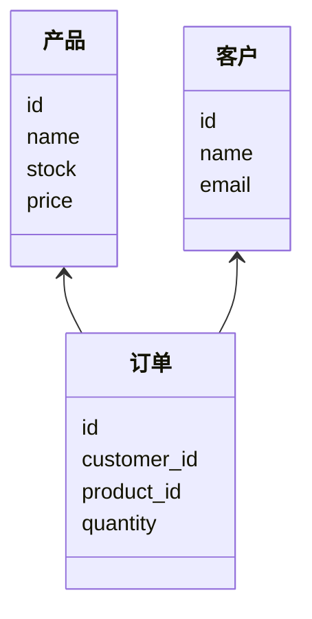
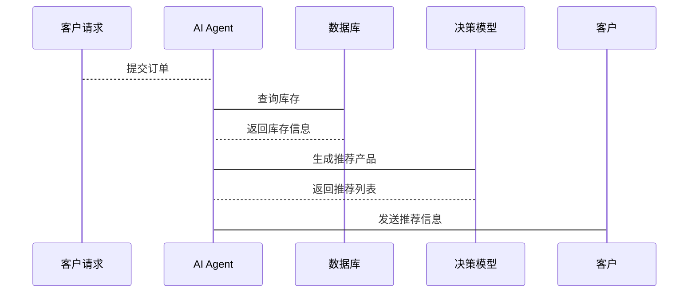

                 


# 企业AI Agent的快速适应框架：应对瞬息万变的市场环境

## 关键词：企业AI Agent，快速适应框架，市场环境，智能决策，自适应系统

## 摘要：  
在当今快速变化的市场环境中，企业需要一种能够快速响应和适应的新工具。企业AI Agent通过智能决策和自适应能力，帮助企业实时应对市场波动，优化运营效率，并提高竞争力。本文将深入探讨企业AI Agent的核心概念、算法原理、系统架构以及实际应用场景，为企业提供一套快速适应市场环境的框架。

---

# 第一部分: 企业AI Agent的背景与概念

## 第1章: 企业AI Agent的基本概念

### 1.1 AI Agent的定义与特点  
企业AI Agent是一种能够感知环境、自主决策并执行任务的智能系统。其特点包括：  
- **自主性**：能够在没有人工干预的情况下独立运行。  
- **智能性**：通过机器学习和数据分析能力，实现复杂决策。  
- **适应性**：能够根据环境变化动态调整行为。  
- **交互性**：与企业系统、员工和客户进行无缝交互。  

### 1.2 企业AI Agent与传统自动化工具的对比  

| 对比维度         | 传统自动化工具          | 企业AI Agent                 |  
|------------------|-------------------------|------------------------------|  
| **决策能力**     | 基于预定义规则          | 基于机器学习模型动态决策      |  
| **适应性**       | 固定流程，难以调整       | 能够根据环境变化自适应调整      |  
| **学习能力**     | 无学习能力              | 具备学习能力，持续优化性能      |  
| **复杂性**       | 简单规则驱动            | 复杂逻辑驱动，处理非结构化数据 |  

### 1.3 企业AI Agent的应用场景  

#### 1.3.1 销售与客户关系管理  
AI Agent可以通过分析客户行为数据，实时调整销售策略，优化客户体验。例如，在电商平台上，AI Agent可以自动推荐产品并处理客户咨询。  

#### 1.3.2 生产与供应链优化  
AI Agent可以实时监控生产过程，预测供应链风险，并优化库存管理。例如，在制造业中，AI Agent可以根据市场需求动态调整生产计划。  

#### 1.3.3 财务与风险管理  
AI Agent可以帮助企业实时监控财务数据，识别潜在风险，并制定应对策略。例如，在金融行业，AI Agent可以实时分析市场波动，辅助投资决策。  

#### 1.3.4 人力资源管理  
AI Agent可以通过分析员工数据，优化招聘、培训和绩效管理流程。例如，在企业内部，AI Agent可以自动筛选简历并推荐候选人。  

---

# 第二部分: 企业AI Agent的核心概念与原理

## 第2章: 企业AI Agent的核心概念  

### 2.1 智能决策机制  

#### 2.1.1 基于数据的决策逻辑  
AI Agent通过收集和分析大量数据，利用机器学习模型生成决策。例如，可以使用随机森林或神经网络模型来预测市场趋势。  

#### 2.1.2 决策优化算法  
为了优化决策过程，AI Agent可以使用强化学习算法（如Q-learning）来动态调整策略。  

#### 2.1.3 智能决策与企业目标的关联  
AI Agent的决策过程需要与企业的长期目标（如利润最大化、客户满意度）保持一致。  

### 2.2 感知与学习能力  

#### 2.2.1 数据采集与分析  
AI Agent通过传感器、API或其他数据源获取实时数据，并通过数据清洗和特征提取技术进行分析。  

#### 2.2.2 模型训练与优化  
AI Agent使用监督学习或无监督学习算法训练模型，并通过交叉验证和超参数调优优化性能。  

#### 2.2.3 知识图谱构建与应用  
通过知识图谱技术，AI Agent可以将企业内外部知识关联起来，提高决策的准确性。  

### 2.3 执行与反馈机制  

#### 2.3.1 行为规划与执行  
AI Agent根据决策结果生成行动计划，并通过API或自动化工具执行任务。  

#### 2.3.2 反馈机制与优化  
AI Agent通过实时反馈不断优化决策模型，并调整行为策略。  

#### 2.3.3 系统自适应能力  
AI Agent能够根据环境变化自动调整参数和策略，确保系统的稳定性和高效性。  

### 2.4 核心概念对比分析  

#### 2.4.1 AI Agent与传统自动化系统的对比  
- **传统自动化系统**：基于固定规则，无法应对复杂变化。  
- **AI Agent**：具备学习和自适应能力，能够处理非结构化问题。  

#### 2.4.2 不同类型AI Agent的特征对比  

| 类型          | 基础能力         | 高级能力         |  
|---------------|------------------|------------------|  
| **简单AI Agent** | 数据采集与规则执行 | 无法学习和优化     |  
| **复杂AI Agent** | 数据分析与决策   | 强化学习与自适应   |  

---

# 第三部分: 企业AI Agent的算法原理

## 第3章: 强化学习与决策优化  

### 3.1 强化学习算法介绍  
强化学习是一种通过试错方法来优化决策的算法。其核心是通过与环境交互，不断更新策略以最大化累积奖励。  

#### 3.1.1 Q-learning算法  
Q-learning是一种经典的强化学习算法，适用于离散动作空间的问题。其更新公式如下：  
$$ Q(s, a) = Q(s, a) + \alpha \left[ r + \gamma \max Q(s', a') - Q(s, a) \right] $$  
其中，$\alpha$ 是学习率，$\gamma$ 是折扣因子。  

#### 3.1.2 实战代码示例  
以下是Q-learning算法的Python实现示例：  

```python
import numpy as np

class QLearning:
    def __init__(self, state_size, action_size, learning_rate=0.1, gamma=0.9):
        self.state_size = state_size
        self.action_size = action_size
        self.learning_rate = learning_rate
        self.gamma = gamma
        self.Q = np.zeros((state_size, action_size))
    
    def update(self, state, action, reward, next_state):
        self.Q[state, action] += self.learning_rate * (reward + self.gamma * np.max(self.Q[next_state, :]) - self.Q[state, action])
```

### 3.2 监督学习与预测模型  

#### 3.2.1 监督学习算法  
监督学习是通过训练数据学习输入与输出之间的映射关系。常用的算法包括线性回归、支持向量机（SVM）和随机森林。  

#### 3.2.2 预测模型的数学公式  
线性回归的预测公式为：  
$$ y = \beta_0 + \beta_1 x_1 + \beta_2 x_2 + \dots + \beta_n x_n $$  
其中，$\beta$ 是回归系数，$x$ 是输入特征，$y$ 是输出预测值。  

---

# 第四部分: 企业AI Agent的系统分析与架构设计

## 第4章: 系统架构设计  

### 4.1 问题场景介绍  
假设某企业在电商平台上销售电子产品，市场环境瞬息万变，需要快速调整库存和定价策略。  

### 4.2 系统功能设计  

#### 4.2.1 领域模型设计  
以下是领域模型的Mermaid类图：  



#### 4.2.2 系统架构设计  
以下是系统架构的Mermaid图：  

```mermaid
rect
    title 企业AI Agent系统架构
    子图 数据采集模块:
        数据源 --> 数据清洗 --> 数据存储
    子图 智能决策模块:
        数据存储 --> 决策模型 --> 决策结果
    子图 执行模块:
        决策结果 --> 自动化工具 --> 反馈
```

### 4.3 接口与交互设计  

#### 4.3.1 系统接口设计  
以下是API接口的描述：  
- **输入接口**：接收实时市场数据和企业内部数据。  
- **输出接口**：输出决策结果和执行指令。  

#### 4.3.2 系统交互设计  
以下是Mermaid序列图：  



---

# 第五部分: 项目实战

## 第5章: 电商场景下的库存管理  

### 5.1 环境配置  
需要安装以下工具：  
- Python 3.8+  
- TensorFlow 2.0+  
- Pandas 1.0+  

### 5.2 核心代码实现  

```python
import pandas as pd
from tensorflow.keras import layers

# 数据加载
data = pd.read_csv('inventory.csv')

# 模型构建
model = tf.keras.Sequential([
    layers.Dense(64, activation='relu'),
    layers.Dense(1, activation='sigmoid')
])

# 模型训练
model.compile(optimizer='adam', loss='binary_crossentropy')
model.fit(data, epochs=10, batch_size=32)
```

### 5.3 功能分析与实现  
- **库存预测**：基于历史销售数据，预测未来库存需求。  
- **自动补货**：当库存低于阈值时，自动触发采购订单。  

### 5.4 案例分析与总结  
通过实际案例分析，验证AI Agent在库存管理中的有效性，并总结经验教训。

---

# 第六部分: 总结与展望

## 第6章: 总结与展望  

### 6.1 最佳实践 Tips  
- **数据质量**：确保数据的准确性和完整性。  
- **模型优化**：定期更新模型，避免过时。  
- **系统安全**：加强数据隐私保护，确保系统安全。  

### 6.2 小结  
企业AI Agent作为一种智能化工具，能够帮助企业快速适应市场变化，优化运营效率。通过本文的介绍，读者可以深入了解其核心概念、算法原理和系统架构，并将其应用于实际场景中。  

### 6.3 注意事项  
- 在实际应用中，需要结合企业的具体需求进行定制化开发。  
- 确保团队具备相关技术能力，避免过度依赖外部供应商。  

### 6.4 拓展阅读  
- 《强化学习实战》  
- 《机器学习算法与应用》  
- 《企业架构设计：复杂系统的简化之道》  

---

# 作者：AI天才研究院/AI Genius Institute & 禅与计算机程序设计艺术 /Zen And The Art of Computer Programming  

---

以上是文章的完整大纲和内容，涵盖企业AI Agent的核心概念、算法原理、系统架构和实际应用，帮助企业快速适应瞬息万变的市场环境。

