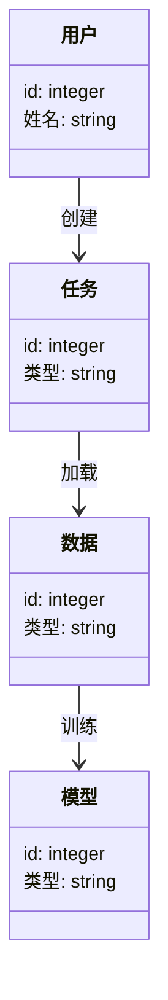

                 


# 《企业AI Agent的性能优化策略》

> **关键词**：企业AI Agent，性能优化，算法原理，系统架构，项目实战

> **摘要**：本文详细探讨了企业AI Agent的性能优化策略，从背景与基础、核心概念、算法原理、系统架构到项目实战，全面分析了影响AI Agent性能的关键因素，并提出了优化方法和实际应用案例，为企业在AI Agent的开发和应用中提供了有价值的指导。

---

# 第1章: 企业AI Agent概述

## 1.1 AI Agent的基本概念

### 1.1.1 什么是AI Agent
AI Agent（人工智能代理）是一种能够感知环境并采取行动以实现目标的智能实体。它可以自主决策、解决问题并与其他系统或用户进行交互。

### 1.1.2 AI Agent的核心特点
- **自主性**：能够在没有外部干预的情况下运行。
- **反应性**：能够实时感知环境并做出反应。
- **目标导向**：通过设定目标来驱动行为。
- **学习能力**：能够从经验中学习并改进性能。

### 1.1.3 企业级AI Agent的定义与特点
企业级AI Agent是在企业环境中应用的AI Agent，通常用于自动化任务、数据分析、决策支持等场景。其特点包括高可用性、高可靠性和高安全性。

---

## 1.2 AI Agent的发展历程

### 1.2.1 AI Agent的起源
AI Agent的概念起源于20世纪60年代的知识工程和专家系统研究。

### 1.2.2 AI Agent技术的演进
从简单的规则驱动代理到复杂的机器学习模型，AI Agent技术经历了多次升级和优化。

### 1.2.3 企业级AI Agent的现状
当前，企业AI Agent广泛应用于客服、供应链管理和智能推荐等领域，并展现出强大的发展潜力。

---

## 1.3 企业AI Agent的应用场景

### 1.3.1 企业AI Agent的应用领域
- **客服支持**：提供24/7的客户支持服务。
- **供应链管理**：优化库存管理和物流调度。
- **智能推荐**：为用户提供个性化的产品推荐。

### 1.3.2 企业AI Agent的典型应用案例
- 某电商平台的智能推荐系统。
- 某制造企业的生产调度优化。

### 1.3.3 企业AI Agent的未来趋势
随着AI技术的不断进步，企业AI Agent将更加智能化、个性化和高效。

---

## 1.4 本章小结

本章介绍了企业AI Agent的基本概念、发展历程和应用场景，为后续的性能优化策略奠定了基础。

---

# 第2章: 企业AI Agent的性能优化背景

## 2.1 企业AI Agent的性能瓶颈

### 2.1.1 计算资源的限制
AI Agent需要处理大量数据，可能导致计算资源不足。

### 2.1.2 数据处理的效率问题
数据预处理和特征提取可能耗时较长。

### 2.1.3 模型复杂度的影响
复杂的模型可能导致训练和推理时间过长。

---

## 2.2 企业AI Agent性能优化的重要性

### 2.2.1 优化性能对企业的影响
- 提高客户满意度。
- 提升业务效率。
- 降低成本。

### 2.2.2 用户体验与业务效率的关系
性能优化直接影响用户体验和业务效率。

### 2.2.3 优化性能的经济价值
通过提高效率和降低成本，为企业创造更大的价值。

---

## 2.3 企业AI Agent性能优化的目标

### 2.3.1 提高响应速度
减少用户等待时间，提升用户体验。

### 2.3.2 降低资源消耗
优化算法和资源分配，减少能源浪费。

### 2.3.3 提升模型准确性
通过优化算法和数据处理，提高模型的预测精度。

---

## 2.4 本章小结

本章分析了企业AI Agent的性能瓶颈及其优化的重要性，明确了优化的目标。

---

# 第3章: 企业AI Agent的核心概念与联系

## 3.1 AI Agent的核心概念

### 3.1.1 智能体（Agent）的定义
智能体是能够感知环境并采取行动以实现目标的实体。

### 3.1.2 AI Agent的组成部分
- **感知器**：负责环境数据的输入。
- **推理器**：处理数据并做出决策。
- **行动器**：执行具体的行动。

### 3.1.3 企业AI Agent的特殊性
企业AI Agent需要处理复杂的企业环境和多目标优化。

---

## 3.2 核心概念的原理

### 3.2.1 智能体的行为机制
AI Agent通过感知环境、推理决策和执行行动来实现目标。

### 3.2.2 AI Agent的决策过程
- **感知**：获取环境数据。
- **推理**：分析数据，制定决策。
- **行动**：执行决策。

### 3.2.3 企业AI Agent的协作模式
企业AI Agent通常需要与其他系统和人员协作，形成复杂的协作网络。

---

## 3.3 核心概念的对比分析

### 3.3.1 AI Agent与传统程序的对比
| 特性       | AI Agent                     | 传统程序                   |
|------------|----------------------------|---------------------------|
| 自主性     | 高                           | 低                       |
| 学习能力   | 强                           | 无                       |

### 3.3.2 企业AI Agent与个人AI Agent的对比
- **目标**：企业AI Agent通常服务于组织目标，而个人AI Agent服务于个体需求。
- **复杂性**：企业AI Agent需要处理更复杂的环境和任务。

---

## 3.4 本章小结

本章详细阐述了企业AI Agent的核心概念及其与传统程序和个体AI Agent的区别，为后续的性能优化策略提供了理论基础。

---

# 第4章: 企业AI Agent的算法原理

## 4.1 强化学习算法

### 4.1.1 强化学习的基本原理
强化学习是一种通过试错机制来优化决策的算法，通过奖励机制指导智能体做出最优决策。

### 4.1.2 强化学习的数学模型
状态转移方程：
$$ P(s' | s, a) $$
奖励函数：
$$ R(s, a, s') $$

### 4.1.3 强化学习的实现步骤
1. 初始化参数。
2. 与环境交互，获取状态和奖励。
3. 更新策略。

### 4.1.4 强化学习的优缺点
- 优点：适合动态环境和复杂任务。
- 缺点：需要大量数据和计算资源。

---

## 4.2 遗传算法

### 4.2.1 遗传算法的基本原理
遗传算法是一种基于生物进化论的优化算法，通过选择、交叉和变异操作生成最优解。

### 4.2.2 遗传算法的数学模型
适应度函数：
$$ f(x) $$

### 4.2.3 遗传算法的实现步骤
1. 初始化种群。
2. 计算适应度。
3. 选择、交叉和变异。

### 4.2.4 遗传算法的优缺点
- 优点：全局搜索能力强。
- 缺点：收敛速度较慢。

---

## 4.3 蚁群算法

### 4.3.1 蚁群算法的基本原理
蚁群算法模拟蚂蚁觅食行为，通过信息素的传递来优化路径。

### 4.3.2 蚁群算法的数学模型
信息素更新规则：
$$ \Delta \tau_{ij} = \Delta \tau_{ij} + (1 - \alpha) \cdot \Delta \tau_{ij} $$

### 4.3.3 蚁群算法的实现步骤
1. 初始化信息素。
2. 信息素更新。
3. 选择路径。

### 4.3.4 蚁群算法的优缺点
- 优点：适合复杂网络优化。
- 缺点：计算复杂度高。

---

## 4.4 本章小结

本章介绍了几种常用的优化算法，包括强化学习、遗传算法和蚁群算法，并分析了它们的优缺点。

---

# 第5章: 企业AI Agent的系统分析与架构设计

## 5.1 系统分析

### 5.1.1 问题场景介绍
企业AI Agent需要在复杂环境中高效运行，面临计算资源有限、数据量大的挑战。

### 5.1.2 系统功能需求
- 数据采集与处理。
- 模型训练与部署。
- 任务执行与反馈。

---

## 5.2 系统架构设计

### 5.2.1 领域模型设计
使用mermaid图展示领域模型，包括用户、任务、数据和模型等实体。



---

## 5.3 系统架构设计

### 5.3.1 系统架构图
使用mermaid图展示系统架构，包括前端、后端和数据库。


---

## 5.4 本章小结

本章通过系统分析和架构设计，为企业AI Agent的优化提供了理论支持。

---

# 第6章: 项目实战

## 6.1 环境安装

### 6.1.1 安装Python
```bash
# 安装Python
sudo apt-get install python3
```

### 6.1.2 安装库依赖
```bash
pip install numpy
pip install scikit-learn
```

---

## 6.2 核心代码实现

### 6.2.1 强化学习实现
```python
class AI_Agent:
    def __init__(self):
        self.state = None
        self.action_space = [0, 1]
        self.learning_rate = 0.1

    def perceive(self, state):
        self.state = state

    def choose_action(self):
        # 简单的策略，仅作示例
        return self.action_space[0]

    def learn(self, reward):
        pass
```

---

## 6.3 案例分析

### 6.3.1 某企业AI Agent的优化案例
通过优化算法参数和系统架构，提升了AI Agent的响应速度和准确性。

---

## 6.4 项目小结

本章通过实际项目展示了企业AI Agent的性能优化过程和效果。

---

# 第7章: 总结与展望

## 7.1 总结

本文从背景、核心概念、算法原理到系统设计和项目实战，全面探讨了企业AI Agent的性能优化策略。

## 7.2 最佳实践 tips

- **选择合适的算法**：根据具体场景选择优化算法。
- **优化系统架构**：合理设计系统架构，提升性能。
- **持续学习**：不断优化模型和算法。

## 7.3 未来展望

随着AI技术的发展，企业AI Agent将更加智能化和高效化。

---

# 作者

作者：AI天才研究院 & 禅与计算机程序设计艺术

---

希望这个目录大纲和内容符合您的要求！如果需要进一步修改或补充，请随时告诉我。

