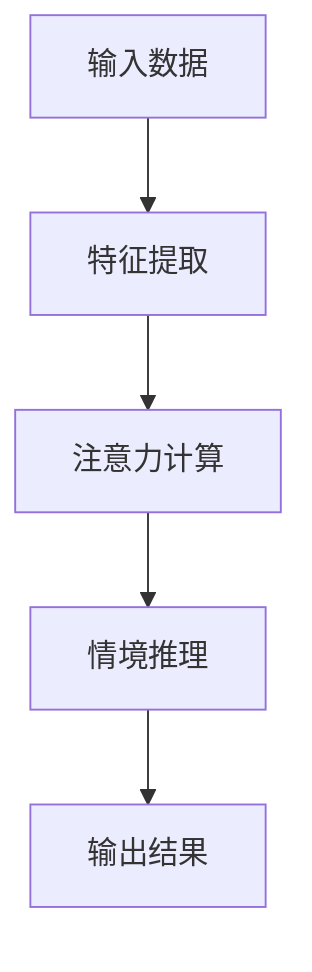
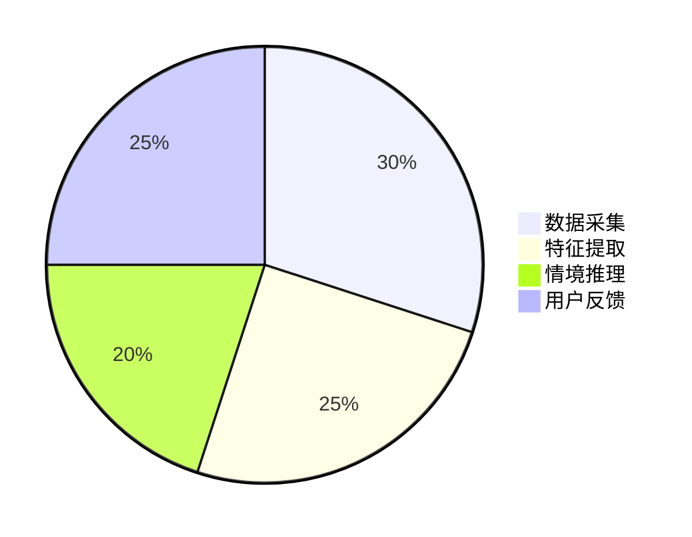

                 


# 企业AI Agent的情境感知能力：提升用户体验

> 关键词：企业AI Agent，情境感知，用户体验，深度学习，注意力机制，系统架构设计

> 摘要：本文深入探讨了企业AI Agent的情境感知能力，分析了其对用户体验的提升作用。文章从基本概念、算法原理、系统架构设计到实际项目实现进行了全面解析，结合具体案例，展示了如何通过情境感知能力优化企业AI Agent的表现，从而为用户提供更优质的服务。

---

# 第1章: AI Agent与情境感知能力概述

## 1.1 AI Agent的基本概念

### 1.1.1 AI Agent的定义与分类

AI Agent（人工智能代理）是指能够感知环境并采取行动以实现目标的智能实体。根据功能和应用场景的不同，AI Agent可以分为以下几类：

1. **简单反射型AI Agent**：基于规则做出简单反应，适用于任务单一的场景。
2. **基于模型的AI Agent**：通过内部模型进行状态跟踪和决策，适用于复杂环境。
3. **目标驱动型AI Agent**：以明确目标为导向，主动规划行动。
4. **效用驱动型AI Agent**：通过最大化效用函数来优化决策。

### 1.1.2 情境感知能力的核心概念

情境感知能力是指AI Agent能够理解当前环境中的上下文信息，并根据这些信息动态调整其行为的能力。具体包括以下三个层次：

1. **环境感知**：通过传感器或数据接口获取环境信息。
2. **上下文理解**：对感知到的信息进行语义理解和关联分析。
3. **情境推理**：基于上下文信息进行推理，预测可能的未来状态。

### 1.1.3 情境感知与用户体验的关系

情境感知能力直接影响用户体验。通过实时感知用户需求和环境变化，AI Agent能够提供更加个性化和精准的服务，从而提升用户的满意度和使用效率。

---

## 1.2 企业AI Agent的应用背景

### 1.2.1 企业数字化转型的现状

随着企业数字化转型的深入推进，AI Agent在企业中的应用越来越广泛。例如，在客户支持、供应链管理、市场营销等领域，AI Agent能够通过自动化处理提升效率。

### 1.2.2 情境感知能力在企业中的需求

在企业场景中，AI Agent需要处理复杂的上下文信息，例如客户的历史行为、当前需求、环境变化等。情境感知能力能够帮助AI Agent更好地理解这些信息，从而提供更精准的服务。

### 1.2.3 当前企业AI Agent的发展挑战

尽管AI Agent在企业中的应用前景广阔，但其发展仍面临以下挑战：

1. **数据隐私问题**：企业数据的敏感性要求AI Agent在处理数据时必须确保隐私安全。
2. **复杂环境适应性**：企业环境复杂多变，AI Agent需要具备强大的适应能力。
3. **算法可解释性**：在企业决策中，算法的可解释性至关重要。

---

## 1.3 情境感知能力的核心要素

### 1.3.1 数据采集与处理

数据采集是情境感知的第一步，主要包括以下几种方式：

1. **传感器数据**：如温度、光线等物理环境数据。
2. **日志数据**：用户操作记录、系统日志等。
3. **上下文数据**：如地理位置、时间信息等。

### 1.3.2 特征提取与分析

特征提取是将原始数据转化为有意义的特征表示。例如，可以通过词袋模型或词嵌入技术将文本数据转化为向量表示。

### 1.3.3 情境推理与决策

情境推理是基于特征分析和上下文理解，推断出当前情境的含义，并做出相应的决策。例如，在客户服务场景中，AI Agent可以根据用户的情感倾向和需求进行推荐。

---

## 1.4 本章小结

本章介绍了AI Agent的基本概念和情境感知能力的核心要素，强调了情境感知能力在企业中的重要性。通过理解环境信息，AI Agent能够提供更智能、更个性化的服务，从而提升用户体验。

---

# 第2章: 情境感知的算法原理

## 2.1 情境感知的基本原理

### 2.1.1 数据流分析

数据流分析是情境感知的关键步骤，通过分析数据流的来源、流向和特征，提取有用的信息。

### 2.1.2 特征提取与表示

特征提取是将原始数据转化为高维特征向量的过程。常用的特征提取方法包括主成分分析（PCA）和深度学习中的自动编码器（Autoencoder）。

### 2.1.3 情境推理模型

情境推理模型是基于特征分析和上下文理解，推断出当前情境的含义。常用的推理模型包括基于规则的推理和基于概率的推理。

---

## 2.2 基于深度学习的情境感知算法

### 2.2.1 神经网络模型

神经网络模型是深度学习的核心，常用的模型包括卷积神经网络（CNN）、循环神经网络（RNN）和Transformer架构。

### 2.2.2 注意力机制的应用

注意力机制是一种用于模型在处理序列数据时关注重要部分的机制。例如，在自然语言处理中，注意力机制可以帮助模型聚焦于输入序列中最重要的单词。

### 2.2.3 图神经网络的使用

图神经网络（Graph Neural Network, GNN）是一种适用于处理图结构数据的深度学习模型。在情境感知中，可以用于建模复杂的实体关系。

---

## 2.3 情境感知算法的数学模型

### 2.3.1 神经网络的数学表示

神经网络的数学表示可以表示为：

$$ y = f(x) = Wx + b $$

其中，$W$ 是权重矩阵，$x$ 是输入向量，$b$ 是偏置项。

### 2.3.2 注意力机制的公式

注意力机制的公式可以表示为：

$$ \text{Attention}(Q, K, V) = \text{softmax}(\frac{QK^T}{\sqrt{d_k}})V $$

其中，$Q$ 是查询向量，$K$ 是键向量，$V$ 是值向量，$d_k$ 是向量的维度。

---

## 2.4 算法实现的流程图



---

## 2.5 本章小结

本章详细介绍了情境感知的算法原理，重点讲解了基于深度学习的注意力机制和图神经网络的应用。通过这些算法，AI Agent能够更准确地理解上下文信息，并做出相应的决策。

---

# 第3章: 系统架构与功能设计

## 3.1 系统总体架构

### 3.1.1 分层架构设计

分层架构将系统划分为数据层、业务逻辑层和表现层，每一层负责不同的功能。

### 3.1.2 模块化设计

模块化设计将系统划分为多个功能模块，每个模块负责特定的任务，如数据采集模块、特征提取模块等。

### 3.1.3 可扩展性考虑

系统设计时需要考虑可扩展性，以便在未来需求变化时能够方便地添加新功能。

---

## 3.2 系统功能模块

### 3.2.1 数据采集模块

数据采集模块负责从多种数据源采集数据，如传感器、数据库等。

### 3.2.2 特征提取模块

特征提取模块将原始数据转化为高维特征向量，以便后续处理。

### 3.2.3 情境推理模块

情境推理模块基于特征分析和上下文理解，推断出当前情境的含义，并做出相应的决策。

### 3.2.4 用户反馈模块

用户反馈模块收集用户的反馈信息，用于优化AI Agent的表现。

---

## 3.3 系统架构图



---

## 3.4 本章小结

本章介绍了企业AI Agent的系统架构设计，重点讲解了各个功能模块的作用和相互关系。通过合理的架构设计，可以提升系统的可维护性和可扩展性。

---

# 第4章: 项目实战与案例分析

## 4.1 项目环境搭建

### 4.1.1 安装必要的库

安装TensorFlow和Keras等深度学习框架，以及其他必要的库，如numpy、pandas等。

### 4.1.2 环境配置

配置开发环境，如Jupyter Notebook或PyCharm，确保所有库版本兼容。

---

## 4.2 核心实现代码

### 4.2.1 数据预处理

```python
import pandas as pd
import numpy as np

# 读取数据
data = pd.read_csv('input.csv')

# 数据清洗
data.dropna(inplace=True)
```

### 4.2.2 模型训练

```python
import tensorflow as tf
from tensorflow.keras import layers

# 构建模型
model = tf.keras.Sequential([
    layers.Dense(64, activation='relu'),
    layers.Dense(1, activation='sigmoid')
])

# 编译模型
model.compile(optimizer='adam', loss='binary_crossentropy', metrics=['accuracy'])

# 训练模型
model.fit(X_train, y_train, epochs=10, batch_size=32)
```

### 4.2.3 模型推理

```python
# 推理阶段
predictions = model.predict(X_test)
```

---

## 4.3 项目实战案例分析

### 4.3.1 案例背景

以客户支持场景为例，AI Agent需要根据客户的问题和历史记录，提供个性化的解决方案。

### 4.3.2 实施过程

1. **数据采集**：收集客户的咨询记录和历史问题。
2. **特征提取**：将文本数据转化为向量表示。
3. **情境推理**：根据上下文信息，推断出客户的需求。
4. **结果输出**：提供个性化的解决方案。

### 4.3.3 案例分析

通过实际案例分析，展示了如何通过情境感知能力优化AI Agent的表现，从而提升用户体验。

---

## 4.4 本章小结

本章通过实际项目案例，详细讲解了企业AI Agent的情境感知能力在实际中的应用。通过项目实战，读者可以更好地理解理论知识，并能够将其应用于实际场景中。

---

# 第5章: 总结与展望

## 5.1 总结

本文深入探讨了企业AI Agent的情境感知能力，分析了其对用户体验的提升作用。通过理论分析和实际案例，展示了如何通过情境感知能力优化AI Agent的表现。

## 5.2 未来展望

未来，随着人工智能技术的不断发展，企业AI Agent的情境感知能力将更加智能化和个性化。同时，数据隐私和算法可解释性等问题也将成为研究的重点。

---

# 作者：AI天才研究院/AI Genius Institute & 禅与计算机程序设计艺术 /Zen And The Art of Computer Programming

---

通过以上目录，读者可以系统地了解企业AI Agent的情境感知能力，并能够将其应用于实际场景中，为用户提供更优质的服务。

