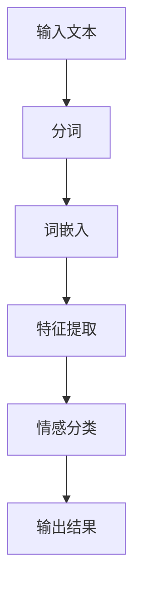
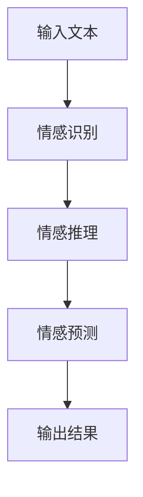
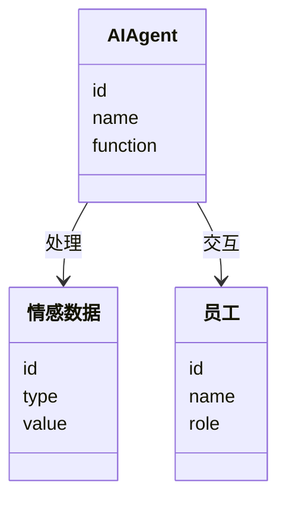

                 


# 企业AI Agent的情感智能：提升员工体验与忠诚度

---

## 关键词：AI Agent, 情感智能, 员工体验, 忠诚度, 企业智能化, 情感分析

---

## 摘要：  
随着人工智能技术的快速发展，企业AI Agent（智能代理）逐渐成为提升员工体验与忠诚度的重要工具。本文从情感智能的视角出发，详细探讨AI Agent在企业中的应用，分析其如何通过情感智能技术优化员工与系统之间的互动，进而提升员工的工作满意度和忠诚度。文章结合实际案例，从算法原理、系统架构到项目实战，全面解析企业AI Agent情感智能的核心技术和应用场景，为企业的智能化转型提供理论与实践的双重支持。

---

## 第一部分：企业AI Agent的情感智能概述

### 第1章：AI Agent与情感智能的背景介绍

#### 1.1 AI Agent的基本概念
- **AI Agent的定义与核心功能**  
  AI Agent（人工智能代理）是指能够感知环境并采取行动以实现特定目标的智能系统。它通常具备以下核心功能：感知、推理、决策、执行和学习。AI Agent可以通过与用户交互，理解用户需求并提供相应的服务。

- **情感智能（Emotional Intelligence）的基本概念**  
  情感智能是指个体识别、理解、管理自己和他人情感的能力。在AI领域，情感智能技术能够帮助机器识别和分析人类的情感状态，从而做出更符合人类情感需求的决策。

- **企业AI Agent与情感智能的结合**  
  在企业环境中，AI Agent可以通过情感智能技术，理解员工的情感状态，提供个性化的支持和反馈，从而提升员工的体验和忠诚度。

---

#### 1.2 企业AI Agent的应用场景
- **企业内部员工体验优化**  
  AI Agent可以用于员工入职、培训、绩效管理等场景，通过情感智能技术帮助员工解决工作中的情感问题，提升员工满意度。

- **客户服务中的情感智能应用**  
  在客户服务领域，AI Agent可以通过情感智能技术识别客户的情绪状态，提供更贴心的服务，提升客户满意度。

- **情感智能在团队协作中的作用**  
  在团队协作中，AI Agent可以分析团队成员的情感状态，帮助团队领导者更好地管理团队氛围，提升团队凝聚力。

---

#### 1.3 情感智能在员工体验中的重要性
- **员工体验的核心要素**  
  员工体验包括员工的工作满意度、职业发展、团队合作、工作环境等多个方面。情感智能技术可以帮助企业更好地关注员工的情感需求，提升员工的整体体验。

- **情感智能如何提升员工忠诚度**  
  通过情感智能技术，企业可以识别员工的情感需求，并提供相应的支持，从而增强员工对企业的忠诚度。

- **企业目标与员工情感需求的结合**  
  企业通过AI Agent的情感智能技术，将员工的情感需求与企业目标相结合，从而实现员工与企业的共同发展。

---

## 第二部分：AI Agent的情感智能核心概念与联系

### 第2章：AI Agent与情感智能的核心概念

#### 2.1 AI Agent的情感智能属性
- **情感识别与理解**  
  AI Agent可以通过自然语言处理（NLP）技术识别员工的情感状态。例如，通过分析员工的语气、语调和关键词，识别员工是否感到压力、焦虑或满意。

- **情感推理与预测**  
  基于情感识别的结果，AI Agent可以进一步推理员工的情感状态，并预测员工未来的情感变化。例如，通过分析员工的情感波动，预测员工可能离职的风险。

- **情感表达与反馈**  
  AI Agent可以通过情感智能技术，以自然的方式与员工互动，提供情感上的支持和反馈。例如，当员工表达压力时，AI Agent可以提供安慰和建议。

---

#### 2.2 情感智能与传统AI的对比
- **传统AI的核心特点**  
  传统AI主要关注任务的执行和数据的处理，缺乏对情感和人类情感需求的理解。例如，传统的客服系统可以通过关键词匹配提供标准答案，但无法理解客户的情感状态。

- **情感智能的创新点**  
  情感智能技术的核心在于对人类情感的理解和处理。它不仅关注任务的执行，还关注用户的情感需求，从而提供更个性化的服务。

- **两者的区别与联系**  
  传统AI是情感智能的基础，而情感智能是传统AI的延伸和增强。通过结合情感智能技术，AI Agent可以更好地理解人类情感需求，提供更智能化的服务。

---

#### 2.3 情感智能的ER实体关系图

```mermaid
er
    entity(AI Agent) {
        id
        name
        function
    }
    entity(情感数据) {
        id
        type
        value
    }
    entity(员工) {
        id
        name
        role
    }
    AI Agent --> 情感数据: 处理
    AI Agent --> 员工: 交互
```

---

## 第三部分：AI Agent情感智能的算法原理

### 第3章：情感智能算法的核心原理

#### 3.1 情感分析算法
- **基于机器学习的情感分析**  
  基于机器学习的情感分析通过训练数据，学习情感特征，从而实现对文本的情感分类。常用的算法包括支持向量机（SVM）和随机森林（Random Forest）。

- **基于深度学习的情感分析**  
  基于深度学习的情感分析通过神经网络模型（如LSTM和Transformer）对文本进行建模，捕捉文本中的语义信息，从而实现更准确的情感分类。

- **情感分析的mermaid流程图**



- **Python实现示例**

```python
import pandas as pd
from sklearn.feature_extraction.text import TfidfVectorizer
from sklearn.svm import SVC

# 数据准备
data = pd.DataFrame({
    'text': ['我感到非常开心', '我对这个结果很不满意'],
    'label': [1, 0]
})

# 特征提取
vectorizer = TfidfVectorizer()
X = vectorizer.fit_transform(data['text'])

# 模型训练
model = SVC()
model.fit(X, data['label'])

# 预测
test_text = ['我今天很累']
test_X = vectorizer.transform(test_text)
predicted = model.predict(test_X)
print(predicted)
```

---

#### 3.2 情感推理算法
- **基于规则的情感推理**  
  基于规则的情感推理通过预定义的规则对情感进行推理。例如，如果文本中包含“开心”这个词，则情感状态为积极。

- **基于模型的情感推理**  
  基于模型的情感推理通过预训练的情感模型（如BERT）对情感进行推理。这种模型能够理解上下文，并根据上下文信息进行情感推理。

- **情感推理的mermaid流程图**



---

## 第四部分：系统分析与架构设计方案

### 第4章：企业AI Agent情感智能的系统架构设计

#### 4.1 问题场景介绍
- **问题背景**  
  在企业中，员工与AI Agent的交互需要考虑员工的情感需求。例如，员工在工作压力大时，可能需要情感上的支持。

- **项目介绍**  
  本项目旨在通过AI Agent的情感智能技术，提升员工的体验和忠诚度。系统将通过情感分析、情感推理等技术，实现对员工情感状态的识别和响应。

---

#### 4.2 系统功能设计
- **领域模型设计**



---

#### 4.3 系统架构设计
- **系统架构图**


---

## 第五部分：项目实战

### 第5章：基于情感智能的员工体验优化系统

#### 5.1 环境安装
- **Python环境**  
  需要安装Python 3.8及以上版本。
- **依赖库安装**  
  使用以下命令安装所需的依赖库：
  ```bash
  pip install scikit-learn nltk transformers
  ```

---

#### 5.2 核心实现代码
- **情感分析模块**

```python
from sklearn.feature_extraction.text import TfidfVectorizer
from sklearn.svm import SVC

# 数据准备
data = pd.DataFrame({
    'text': ['我感到非常开心', '我对这个结果很不满意'],
    'label': [1, 0]
})

# 特征提取
vectorizer = TfidfVectorizer()
X = vectorizer.fit_transform(data['text'])

# 模型训练
model = SVC()
model.fit(X, data['label'])

# 预测
test_text = ['我今天很累']
test_X = vectorizer.transform(test_text)
predicted = model.predict(test_X)
print(predicted)
```

---

#### 5.3 实际案例分析
- **案例背景**  
  某企业希望通过AI Agent提升员工的忠诚度。系统将分析员工的情感状态，并提供个性化的支持。

- **案例分析**  
  系统通过情感分析模块识别员工的情感需求，并根据需求提供相应的支持。例如，当员工表现出压力时，系统将提供心理支持和建议。

---

## 第六部分：总结与展望

### 第6章：企业AI Agent情感智能的未来发展趋势

#### 6.1 总结
- 企业AI Agent情感智能技术能够有效提升员工的体验和忠诚度。
- 情感智能技术的应用将推动企业智能化转型。

#### 6.2 未来展望
- **情感智能的深度学习**  
  随着深度学习技术的发展，情感智能的准确性和智能化将不断提升。

- **多模态情感识别**  
  未来的AI Agent将不仅仅依赖文本，还将结合语音、图像等多种模态信息，实现更精准的情感识别。

---

## 作者信息

作者：AI天才研究院/AI Genius Institute & 禅与计算机程序设计艺术 /Zen And The Art of Computer Programming

---

**版权声明：本文版权归作者所有，未经授权，不得转载。**

