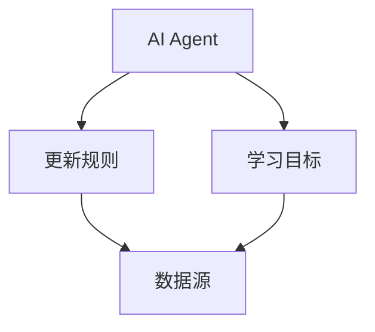
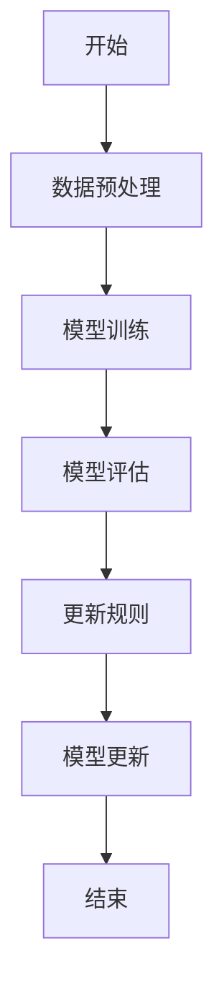
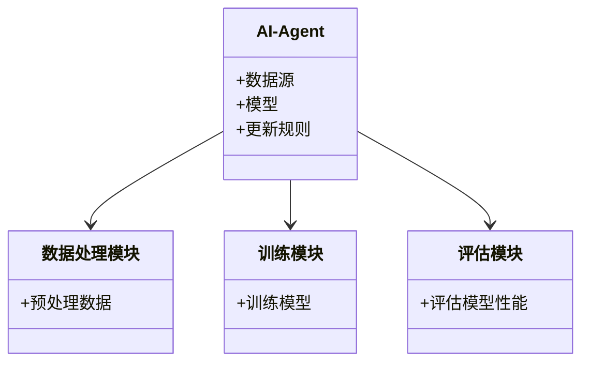
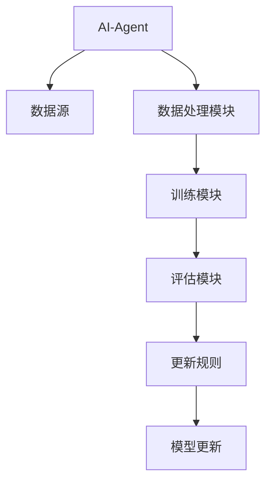

                 


# 企业AI Agent的持续学习与更新机制

> **关键词**：企业AI Agent，持续学习，更新机制，机器学习，人工智能，数据处理

> **摘要**：本文详细探讨了企业AI Agent的持续学习与更新机制，从背景介绍、核心概念到算法原理、系统设计，再到项目实战，全面分析了AI Agent在企业中的持续学习与更新的实现方法和应用案例。通过本文，读者可以深入了解如何设计和实现一个高效的AI Agent持续学习与更新系统，提升企业AI应用的智能化水平和适应能力。

---

## 第1章 背景介绍

### 1.1 问题背景

在企业信息化建设的今天，AI Agent（人工智能代理）的应用越来越广泛。AI Agent能够自动化处理企业中的各种任务，如数据处理、决策支持、客户交互等。然而，随着企业业务的不断扩展和变化，AI Agent需要能够适应新的数据和业务需求，这就要求AI Agent具备持续学习与更新的能力。

#### 1.1.1 企业AI Agent的发展现状

AI Agent在企业中的应用已经取得了显著的进展。从简单的规则执行到复杂的自主决策，AI Agent的能力不断提升。然而，现有的AI Agent大多依赖于静态的数据和模型，难以适应动态变化的业务环境。

#### 1.1.2 当前存在的主要问题

- **数据更新滞后**：企业业务数据不断变化，AI Agent需要及时更新模型以适应新的数据。
- **模型过时**：随着时间的推移，AI Agent的模型可能会过时，导致其决策和执行能力下降。
- **缺乏自适应能力**：AI Agent无法根据新的业务需求自动调整其行为和策略。

#### 1.1.3 持续学习与更新的必要性

持续学习与更新机制能够帮助AI Agent保持其性能和适应能力，使其在企业环境中长期有效。

### 1.2 问题描述

持续学习与更新机制的设计需要解决以下问题：

- 如何高效地更新AI Agent的模型？
- 如何保证更新过程的稳定性？
- 如何在更新过程中处理数据的异质性和不确定性？

### 1.3 问题解决

通过引入持续学习算法和优化更新机制，可以实现AI Agent的持续进化。

### 1.4 边界与外延

- **边界**：持续学习与更新机制仅关注AI Agent的模型更新和数据处理，不涉及外部系统的集成。
- **外延**：持续学习与更新机制可以应用于各种企业场景，如客户服务、供应链管理、风险管理等。

### 1.5 概念结构与核心要素

- **核心概念**：AI Agent、持续学习、更新机制。
- **核心要素**：数据源、模型、更新规则、性能评估。

---

## 第2章 核心概念与联系

### 2.1 核心概念原理

- **AI Agent**：一种能够感知环境并自主决策的智能体。
- **持续学习**：一种机器学习方法，允许模型在新数据上不断优化。
- **更新机制**：模型更新的策略和方法。

### 2.2 概念属性特征对比表

| 概念       | 特征                   | 描述                                                                 |
|------------|------------------------|----------------------------------------------------------------------|
| AI Agent   | 智能性                 | 能够感知环境并自主决策                                             |
| 持续学习    | 数据驱动               | 基于新数据不断优化模型                                             |
| 更新机制    | 稳定性                 | 确保模型更新的稳定性和有效性                                       |

### 2.3 ER实体关系图



---

## 第3章 算法原理讲解

### 3.1 算法原理

持续学习与更新机制的核心算法包括数据预处理、模型训练、模型评估和模型更新。

### 3.2 算法流程图



### 3.3 Python源代码实现

```python
def update_model(data, model):
    # 数据预处理
    processed_data = preprocess(data)
    # 模型训练
    model.train(processed_data)
    # 模型评估
    metrics = evaluate(model, processed_data)
    # 更新规则
    if metrics['accuracy'] > threshold:
        model.update_weights()
    return model
```

### 3.4 数学模型与公式

持续学习的数学表达如下：

$$f(x) = w_1x + b_1$$

更新机制的数学推导：

$$w_{new} = w_{old} + \alpha \cdot \Delta w$$

其中，$\alpha$ 是学习率，$\Delta w$ 是权重更新量。

---

## 第4章 系统分析与架构设计

### 4.1 系统功能设计

- **领域模型**：定义系统的功能模块和交互关系。



- **系统架构设计**



---

## 第5章 项目实战

### 5.1 环境安装

```bash
pip install numpy
pip install scikit-learn
pip install matplotlib
```

### 5.2 核心代码实现

```python
import numpy as np
from sklearn.linear_model import SGDClassifier

def update_model(data, model):
    # 数据预处理
    processed_data = np.array(data)
    # 模型训练
    model.partial_fit(processed_data)
    # 模型评估
    metrics = evaluate_model(model, processed_data)
    # 更新规则
    if metrics['accuracy'] > 0.8:
        model.update_weights()
    return model

def evaluate_model(model, data):
    # 假设data是二维数组，最后一列为标签
    X = data[:, :-1]
    y = data[:, -1]
    # 预测
    y_pred = model.predict(X)
    accuracy = np.mean(y_pred == y)
    return {'accuracy': accuracy}
```

### 5.3 案例分析

假设我们有一个客户服务AI Agent，需要处理客户投诉。随着客户反馈的不断积累，AI Agent需要持续更新其模型以提高分类准确性。

---

## 第6章 小结

本文详细介绍了企业AI Agent的持续学习与更新机制，从背景介绍到算法实现，再到系统设计和项目实战，全面分析了AI Agent的持续学习与更新的实现方法和应用案例。通过本文的讲解，读者可以掌握如何设计和实现一个高效的AI Agent持续学习与更新系统。

---

**作者**：AI天才研究院/AI Genius Institute & 禅与计算机程序设计艺术 /Zen And The Art of Computer Programming

