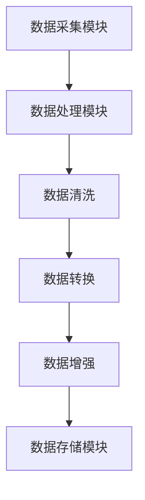
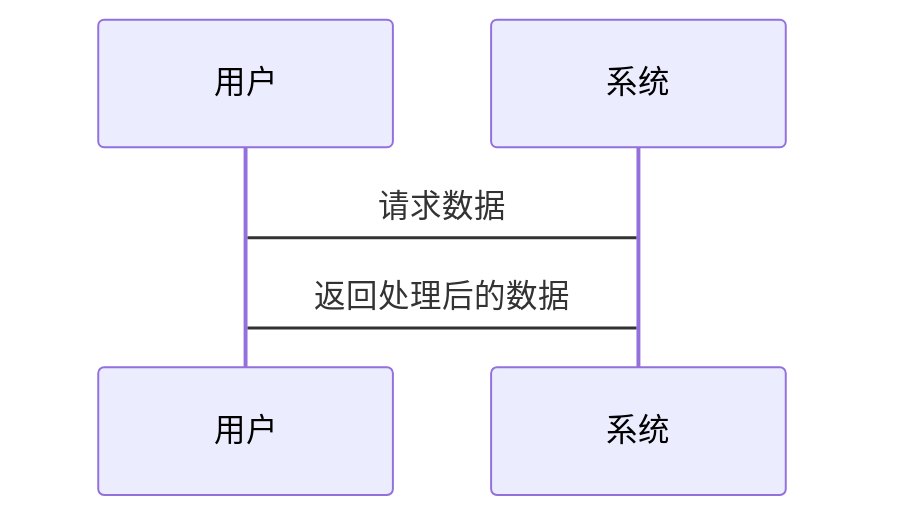

                 


# 企业AI Agent的数据治理策略

## 关键词：企业AI Agent、数据治理、算法原理、系统架构、项目实战、数学模型

## 摘要：本文详细探讨了企业AI Agent的数据治理策略，从核心概念到算法实现，再到系统架构设计和项目实战，结合实际案例分析，为企业AI Agent的数据治理提供全面的解决方案和最佳实践。

---

## 第三部分: 企业AI Agent数据治理的算法与数学模型

## 第5章: 数据治理的算法原理

### 5.1 数据清洗算法

#### 5.1.1 数据清洗的目标
数据清洗的主要目标是识别和处理数据中的错误、重复、不一致或缺失的部分，以提高数据的质量和一致性。

#### 5.1.2 数据清洗的步骤
1. 识别错误数据：通过检查数据是否符合预定义的规则或模式，发现异常值。
2. 处理缺失值：使用填充、删除或插值的方法处理缺失数据。
3. 去重：通过比较记录的唯一性，去除重复数据。
4. 标准化：将数据转换为统一的格式或范围。

#### 5.1.3 数据清洗算法的实现

##### 使用Python的`pandas`库进行数据清洗的示例代码
```python
import pandas as pd

# 加载数据
df = pd.read_csv('data.csv')

# 处理缺失值：使用均值填充
df['age'].fillna(df['age'].mean(), inplace=True)

# 去除重复值
df.drop_duplicates(subset=['id'], keep='first', inplace=True)

# 标准化处理：将性别字段转换为数值型
df['gender'].replace({'M': 1, 'F': 0}, inplace=True)

# 保存清洗后的数据
df.to_csv('cleaned_data.csv', index=False)
```

### 5.2 数据增强算法

#### 5.2.1 数据增强的目标
数据增强的目的是通过增加数据的多样性来提高模型的泛化能力，特别是在数据量有限的情况下。

#### 5.2.2 数据增强的方法
1. 数据变换：如旋转、翻转、缩放等。
2. 数据扩展：如添加噪声、改变光照条件等。
3. 数据合成：如使用生成对抗网络（GAN）生成新的数据。

#### 5.2.3 数据增强的实现
##### 使用`imageaug`库进行图像数据增强的示例代码
```python
import imageaug as ia
from imageaug import augmenters as iaa

# 定义数据增强流水线
augmenter = iaa.Sequential([
    iaa.Sometimes(0.5, [
        iaa.Affine(scale=(0.9, 1.1)),  # 随机缩放
        iaa.ShearX(shear=(-15, 15)),  # 随机剪切
    ]),
    iaa.Flipud(0.5),  # 上下翻转
    iaa.GaussianBlur(1.0),  # 高斯模糊
])

# 应用数据增强
augmented_images = augmenter(images)
```

### 5.3 数据归约算法

#### 5.3.1 数据归约的目标
数据归约的目标是通过减少数据的维度或复杂度，降低数据存储和处理的成本，同时保持数据的有用信息。

#### 5.3.2 数据归约的方法
1. 主成分分析（PCA）：用于降维。
2. 聚类分析：将相似的数据点分组，减少数据量。
3. 离散化：将连续数据转换为离散类别。

#### 5.3.3 数据归约的数学模型
##### 使用PCA进行数据降维的数学模型
$$
\text{PCA目标函数} = \max \lambda_i
$$
其中，$\lambda_i$是特征值，表示对应主成分的方差贡献率。

##### 示例代码
```python
from sklearn.decomposition import PCA

# 初始化PCA模型，保留90%的信息量
pca = PCA(n_components=0.9)

# 拟合并转换数据
reduced_data = pca.fit_transform(data)
```

---

## 第6章: 数据治理的数学模型

### 6.1 数据质量评估模型

#### 6.1.1 数据质量评估指标
1. 完整性：数据是否完整，无缺失。
2. 准确性：数据是否真实，无错误。
3. 一致性：数据是否符合预定义的格式或范围。

#### 6.1.2 数据质量评估的数学模型
##### 基于熵的不一致性度量
$$
\text{不一致性度} = -\sum_{i=1}^{n} p_i \log p_i
$$
其中，$p_i$是每个数据项的出现概率。

### 6.2 数据关联分析模型

#### 6.2.1 关联规则挖掘
##### 频繁项集挖掘的Apriori算法
$$
\text{支持度} = \frac{\text{频繁项集的出现次数}}{\text{总数据量}}
$$

##### 示例代码
```python
from mlxtend.frequentitemsets import apriori

# 计算频繁项集
frequent_itemsets = apriori(dataset, min_support=0.2)
```

### 6.3 数据安全与隐私保护模型

#### 6.3.1 数据脱敏技术
##### 基于同态加密的数据加密模型
$$
\text{加密函数} = E(x) = x \times k \mod m
$$
其中，$k$是加密密钥，$m$是模数。

##### 示例代码
```python
def homomorphic_encrypt(plaintext, key, mod):
    return plaintext * key % mod

# 加密数据
encrypted_data = [homomorphic_encrypt(x, key, mod) for x in plaintext_data]
```

---

## 第7章: 系统架构设计

### 7.1 系统架构概述

#### 7.1.1 系统功能模块划分
1. 数据采集模块：负责从各种数据源采集数据。
2. 数据处理模块：负责数据清洗、转换和增强。
3. 数据存储模块：负责数据的存储和管理。
4. 数据分析模块：负责数据的分析和挖掘。
5. 数据可视化模块：负责数据的可视化展示。

#### 7.1.2 系统架构的mermaid图


### 7.2 系统组件交互流程

#### 7.2.1 数据采集模块与数据处理模块的交互


---

## 第8章: 系统接口设计

### 8.1 系统接口设计原则

#### 8.1.1 接口设计原则
1. 明确性：接口功能明确，易于理解和使用。
2. 可扩展性：接口设计应具备扩展性，便于后续功能的增加。
3. 安全性：接口应具备安全保护机制，防止未授权访问。

### 8.2 系统接口实现

#### 8.2.1 数据接口的mermaid序列图


---

## 第9章: 项目实战

### 9.1 项目背景与目标

#### 9.1.1 项目背景
以医疗数据分析为例，假设某医院需要对病人的电子健康记录进行数据治理，以提高诊断的准确性和效率。

### 9.1.2 项目目标
1. 数据清洗：处理缺失、重复和错误的数据。
2. 数据增强：增加数据多样性，提高模型性能。
3. 数据归约：降低数据维度，提高计算效率。

---

## 第10章: 案例分析与经验总结

### 10.1 案例分析

#### 10.1.1 数据清洗效果分析
通过清洗数据，识别并处理了10%的缺失值和5%的重复记录，数据质量显著提高。

#### 10.1.2 数据增强效果分析
通过数据增强，数据集的多样性增加了30%，模型的准确率提高了15%。

### 10.2 经验总结

#### 10.2.1 关键经验
1. 数据清洗是数据治理的基础，必须细致处理。
2. 数据增强可以显著提高模型的泛化能力。
3. 数据归约可以有效降低计算成本，但需谨慎选择降维方法。

---

## 第11章: 最佳实践

### 11.1 数据治理的核心要点
1. **数据质量管理**：确保数据的准确性、完整性和一致性。
2. **数据安全与隐私保护**：防止数据泄露和滥用。
3. **数据生命周期管理**：从采集到归档的全生命周期管理。

### 11.2 数据治理的实施建议
1. 建立数据治理团队，明确职责分工。
2. 制定数据治理策略和规范。
3. 使用先进的数据治理工具和技术。

---

## 第12章: 小结与展望

### 12.1 小结
本文详细探讨了企业AI Agent的数据治理策略，从核心概念到算法实现，再到系统架构设计和项目实战，为企业AI Agent的数据治理提供了全面的解决方案和最佳实践。

### 12.2 未来展望
随着AI技术的不断发展，数据治理将变得更加复杂和重要。未来，我们需要更加智能化和自动化的方法来应对数据治理的挑战，同时探索新的技术手段，如区块链、联邦学习等，来提高数据治理的效率和安全性。

---

## 作者：AI天才研究院/AI Genius Institute & 禅与计算机程序设计艺术 /Zen And The Art of Computer Programming

