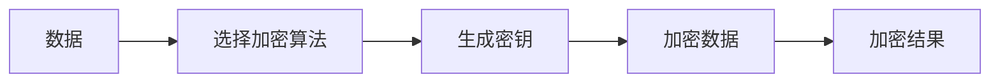
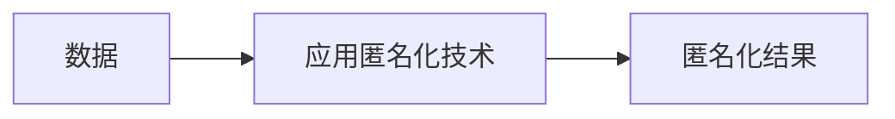
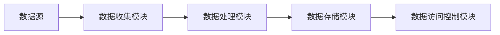

                 


```markdown
# 企业AI Agent的数据隐私保护机制

> 关键词：企业AI Agent，数据隐私保护，数据加密，匿名化，访问控制

> 摘要：随着企业AI Agent的广泛应用，数据隐私保护成为一个重要挑战。本文系统地探讨了企业AI Agent的数据隐私保护机制，从核心概念、算法原理到系统设计和项目实战，全面分析了如何在企业环境中保护AI Agent的数据隐私，确保数据的机密性、完整性和可用性。

---

# 第一部分: 企业AI Agent的背景与核心概念

## 第1章: 企业AI Agent的概述

### 1.1 AI Agent的基本概念
- 1.1.1 AI Agent的定义与特征
  - AI Agent是能够感知环境并自主决策的智能实体。
  - 核心特征包括自主性、反应性、主动性、社会性。
- 1.1.2 企业AI Agent的独特性
  - 在企业环境中，AI Agent通常需要处理敏感数据，如客户信息、业务数据等。
  - 需要满足企业内部的合规性要求，如GDPR、CCPA等。

### 1.2 数据隐私保护的重要性
- 1.2.1 数据隐私保护的基本概念
  - 数据隐私是指个人或企业在数据处理过程中的权利和控制。
  - 数据隐私保护是法律法规的明确要求，如GDPR、CCPA等。
- 1.2.2 企业AI Agent中的数据隐私挑战
  - AI Agent处理的数据可能涉及个人隐私和商业机密。
  - AI Agent的自主性和分布特性增加了数据隐私保护的难度。
- 1.2.3 数据隐私保护的法律与伦理要求
  - GDPR要求数据处理者必须获得数据主体的明确同意。
  - 数据隐私保护不仅是法律要求，也是企业社会责任的体现。

### 1.3 企业AI Agent的应用场景
- 1.3.1 智能客服
  - AI Agent通过处理客户请求，收集和分析客户数据。
- 1.3.2 智能推荐系统
  - 基于用户数据进行个性化推荐，可能涉及用户隐私。
- 1.3.3 智能决策支持
  - AI Agent帮助企业管理层做出决策，涉及敏感数据。

## 第2章: 数据隐私保护机制的核心概念与联系

### 2.1 数据隐私保护的核心技术
- 2.1.1 数据加密技术
  - 对敏感数据进行加密，确保只有授权方能够解密。
- 2.1.2 数据匿名化技术
  - 通过去标识化处理，减少数据关联性。
- 2.1.3 数据访问控制
  - 通过权限管理，限制数据访问范围。

### 2.2 数据隐私保护机制的数学模型
- 2.2.1 数据隐私保护的数学定义
  - 数据隐私保护可以通过概率论和信息论模型来描述。
  - 例如，定义数据隐私保护的概率分布模型。
- 2.2.2 数据隐私保护的度量方法
  - 使用信息熵来度量数据泄露的可能性。
  - 例如，信息熵公式：$$H(X) = -\sum p(x) \log p(x)$$
- 2.2.3 数据隐私保护的约束条件
  - 数据必须满足隐私保护的同时，保持可用性。

### 2.3 数据隐私保护机制的对比分析
- 2.3.1 数据加密与数据匿名化的对比
  - 数据加密适用于保护传输中的数据，匿名化适用于存储数据。
- 2.3.2 数据访问控制与数据加密的对比
  - 数据访问控制侧重于权限管理，数据加密侧重于数据本身的安全性。

### 2.4 数据隐私保护机制的ER实体关系图
```mermaid
er
    entity 数据主体 {
        key 用户ID
        attribute 用户名
        attribute 密码
        attribute 邮箱
    }
    entity 数据控制者 {
        key 数据ID
        attribute 数据类型
        attribute 数据所有者
    }
    entity 数据使用记录 {
        key 记录ID
        attribute 数据使用时间
        attribute 数据使用人
    }
    数据主体 --> 数据控制者: 提供数据
    数据控制者 --> 数据使用记录: 记录数据使用
```

---

# 第三部分: 数据隐私保护机制的算法原理

## 第3章: 数据加密技术的原理与实现

### 3.1 数据加密算法
- 3.1.1 对称加密算法
  - 使用相同的密钥进行加密和解密，如AES。
- 3.1.2 非对称加密算法
  - 使用公钥和私钥，如RSA。
- 3.1.3 同态加密
  - 允许在加密数据上进行计算，保持数据隐私。

### 3.2 数据加密的实现步骤


### 3.3 数据加密的Python实现
```python
import cryptography
from cryptography.fernet import Fernet

# 生成密钥
key = Fernet.generate_key()
cipher_suite = Fernet(key)

# 加密数据
data = "Sensitive information"
encrypted_data = cipher_suite.encrypt(data.encode())
```

## 第4章: 数据匿名化技术的原理与实现

### 4.1 数据匿名化方法
- 4.1.1 去标识化
  - 移除数据中的唯一标识符。
- 4.1.2 混淆技术
  - 添加噪声或随机化数据。
- 4.1.3 数据替换
  - 替换数据中的敏感字段。

### 4.2 数据匿名化的实现步骤


### 4.3 数据匿名化的Python实现
```python
import pandas as pd

# 数据匿名化处理
data = pd.DataFrame({
    '用户ID': [1, 2, 3],
    '用户名': ['user1', 'user2', 'user3'],
    '密码': ['pass1', 'pass2', 'pass3']
})

# 去标识化处理
data_anonymized = data.drop(columns=['密码'])
```

---

# 第四部分: 数据隐私保护机制的系统设计

## 第5章: 系统分析与架构设计

### 5.1 系统功能设计
- 数据收集模块：负责收集和处理数据。
- 数据处理模块：对数据进行加密或匿名化处理。
- 数据存储模块：安全存储处理后的数据。
- 数据访问控制模块：管理数据访问权限。

### 5.2 系统架构设计


---

# 第五部分: 项目实战与总结

## 第6章: 项目实战

### 6.1 环境安装
- 安装必要的库，如cryptography、pandas。

### 6.2 系统核心实现
```python
from cryptography.fernet import Fernet

def generate_key():
    key = Fernet.generate_key()
    return key

def encrypt_data(data, key):
    cipher_suite = Fernet(key)
    encrypted_data = cipher_suite.encrypt(data.encode())
    return encrypted_data

# 示例
data = "用户密码：123456"
key = generate_key()
encrypted_data = encrypt_data(data, key)
print("加密后的数据:", encrypted_data)
```

### 6.3 案例分析
- 实际案例分析：如何保护智能客服中的用户数据。

### 6.4 项目小结
- 项目实现了数据加密和匿名化处理，确保了数据隐私。

## 第7章: 总结与展望

### 7.1 总结
- 本文详细探讨了企业AI Agent的数据隐私保护机制，从理论到实践进行了系统性的分析。

### 7.2 展望
- 未来，数据隐私保护将更加重要，AI Agent需要更智能的隐私保护机制。

---

# 作者：AI天才研究院 & 禅与计算机程序设计艺术
```

