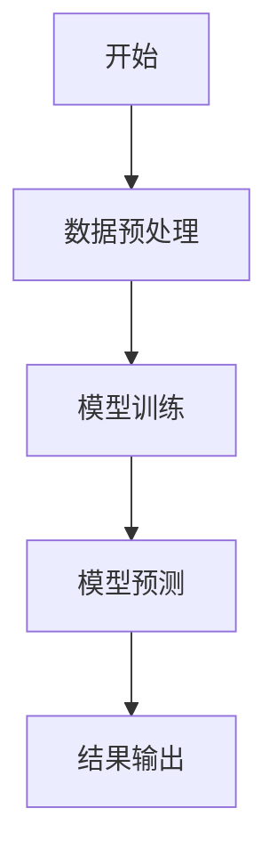

                 


# 企业AI Agent的时序数据库设计与应用

## 关键词：时序数据库、AI Agent、时间序列预测、系统架构、企业应用

## 摘要：  
随着人工智能技术的快速发展，AI Agent在企业中的应用越来越广泛。时序数据库作为处理时间序列数据的核心技术，对于支持AI Agent的高效运行至关重要。本文将详细探讨企业AI Agent与时序数据库的设计与应用，从核心概念、算法原理到系统架构，再到项目实战，全面解析如何通过时序数据库赋能AI Agent，为企业智能化转型提供技术支持。

---

# 第一部分: 企业AI Agent的时序数据库基础

## 第1章: 时序数据库与AI Agent概述

### 1.1 时序数据库的基本概念

#### 1.1.1 时序数据的定义与特点
时序数据是指按时间顺序记录的数据，通常具有以下特点：
- **时间戳**：每条数据都有明确的时间属性。
- **连续性**：数据按时间顺序排列，通常用于记录动态变化。
- **高频率**：时序数据可以是高频数据（如每秒一次）或低频数据（如每天一次）。
- **关联性**：数据之间的关联性较强，适合用于时间序列分析。

#### 1.1.2 时序数据库的核心功能
时序数据库主要用于存储和管理时间序列数据，其核心功能包括：
- **高效存储**：支持大规模时序数据的存储和查询。
- **快速查询**：支持按时间范围、时间戳等条件快速检索数据。
- **数据压缩**：通过压缩技术减少存储空间占用。
- **时间序列分析**：支持多种时间序列分析功能，如预测、异常检测等。

#### 1.1.3 时序数据库与传统数据库的区别
| 属性       | 时序数据库             | 传统数据库             |
|------------|----------------------|----------------------|
| 数据类型   | 时间序列数据         | 结构化或非结构化数据   |
| 查询方式   | 时间范围查询为主     | 条件查询为主           |
| 数据压缩   | 支持高效压缩算法     | 不支持或仅支持基本压缩 |
| 使用场景   | IoT、实时监控、金融等 | 企业事务处理、OLTP等   |

### 1.2 AI Agent的定义与特点

#### 1.2.1 AI Agent的基本概念
AI Agent（人工智能代理）是指能够感知环境、自主决策并执行任务的智能实体。它通常具有以下特点：
- **自主性**：能够自主决策，无需人工干预。
- **反应性**：能够实时感知环境并做出反应。
- **目标导向**：基于目标执行任务。
- **学习能力**：能够通过数据和经验优化自身行为。

#### 1.2.2 AI Agent的核心功能
AI Agent的核心功能包括：
- **感知环境**：通过传感器、API等方式获取环境数据。
- **决策推理**：基于获取的数据进行分析和推理，生成决策方案。
- **执行任务**：根据决策方案执行具体任务。
- **自适应优化**：通过学习和优化算法不断提升性能。

#### 1.2.3 AI Agent与传统软件的区别
| 属性       | AI Agent             | 传统软件             |
|------------|----------------------|----------------------|
| 智能性     | 高度智能，能够自主决策 | 非智能，依赖人工干预 |
| 学习能力   | 具备学习能力         | 无学习能力           |
| 反应性     | 高度反应性           | 低反应性或无反应性   |
| 适应性     | 能够自适应环境变化   | 需人工调整和维护     |

### 1.3 时序数据库在AI Agent中的应用背景

#### 1.3.1 时序数据在AI Agent中的重要性
时序数据是AI Agent感知环境和决策的重要依据。例如：
- 在智能监控系统中，时序数据用于实时监测设备状态。
- 在智能推荐系统中，时序数据用于分析用户行为变化。

#### 1.3.2 AI Agent对时序数据库的需求
AI Agent需要时序数据库支持以下功能：
- **高效存储**：支持大规模时序数据的存储。
- **快速查询**：支持按时间范围快速检索数据。
- **分析功能**：支持时间序列预测、异常检测等分析功能。

#### 1.3.3 企业级应用中时序数据库的挑战
企业在使用时序数据库时面临以下挑战：
- **数据量大**：企业级应用通常需要处理海量时序数据。
- **实时性要求高**：AI Agent需要实时感知环境，对时序数据库的响应速度要求高。
- **复杂性**：企业环境复杂，时序数据来源多样，增加了数据库设计的难度。

### 1.4 本章小结
本章介绍了时序数据库和AI Agent的基本概念，并分析了时序数据库在AI Agent中的重要性。通过对比时序数据库和传统数据库的特点，以及AI Agent与传统软件的差异，明确了时序数据库在企业AI Agent应用中的独特价值和挑战。

---

## 第2章: 时序数据库与AI Agent的核心概念

### 2.1 时序数据库的核心原理

#### 2.1.1 数据存储机制
时序数据库通常采用列式存储，以提高查询效率。数据按时间戳排序，支持高效的范围查询。

#### 2.1.2 时间戳的作用
时间戳是时序数据的核心属性，用于标识数据的时间属性。时序数据库通过时间戳快速定位数据，支持时间范围查询。

#### 2.1.3 数据压缩与存储优化
时序数据库通过数据压缩算法（如Snappy、Gzip）减少存储空间占用，同时保持数据的可读性。

### 2.2 AI Agent的核心算法

#### 2.2.1 时间序列预测算法
时间序列预测是AI Agent的重要功能之一。常用的算法包括：
- **ARIMA模型**：自回归积分滑动模型，适用于线性时间序列预测。
- **LSTM网络**：长短期记忆网络，适用于非线性时间序列预测。

#### 2.2.2 异常检测算法
异常检测用于识别时序数据中的异常值，常用的算法包括：
- **基于统计的方法**：如Z-score、移动平均法。
- **基于机器学习的方法**：如Isolation Forest、One-Class SVM。

#### 2.2.3 关联规则挖掘
关联规则挖掘用于发现时序数据中的关联模式，常用的算法包括：
- **Apriori算法**：用于发现频繁项集。
- **FP-Growth算法**：用于高效挖掘频繁项集。

### 2.3 时序数据库与AI Agent的实体关系图

```mermaid
er
    %% 时序数据库与AI Agent的实体关系图
    entity 时序数据库 {
        id
        时间戳
        数据值
    }
    entity AI Agent {
        id
        类型
        功能
    }
    relationship 关联关系 {
        时序数据库 --> AI Agent : 提供数据支持
        AI Agent --> 时序数据库 : 写入数据
    }
```

### 2.4 本章小结
本章详细介绍了时序数据库和AI Agent的核心原理，并通过实体关系图展示了两者之间的关联关系。通过分析时序数据库的核心功能和AI Agent的核心算法，明确了时序数据库在AI Agent中的关键作用。

---

## 第3章: 时序数据库的算法原理

### 3.1 时间序列预测算法

#### 3.1.1 ARIMA算法原理



##### ARIMA模型公式
ARIMA模型由以下部分组成：
- 自回归部分（AR）：$y_t = \phi_1 y_{t-1} + \phi_2 y_{t-2} + \cdots + \phi_p y_{t-p} + \epsilon_t$
- 积分部分（I）：用于消除数据的平稳性。
- 滑动平均部分（MA）：$e_t = \theta_1 e_{t-1} + \theta_2 e_{t-2} + \cdots + \theta_q e_{t-q}$

##### ARIMA算法实现代码

```python
from statsmodels.tsa.arima_model import ARIMA
import pandas as pd

# 示例数据
data = pd.Series([1, 2, 3, 4, 5], index=pd.date_range('2020-01-01', periods=5))

# 模型训练
model = ARIMA(data, order=(1, 1, 1))
model_fit = model.fit()

# 预测
forecast = model_fit.forecast(steps=5)
print(forecast)
```

---

## 总结

---

**作者：AI天才研究院/AI Genius Institute & 禅与计算机程序设计艺术 /Zen And The Art of Computer Programming**

