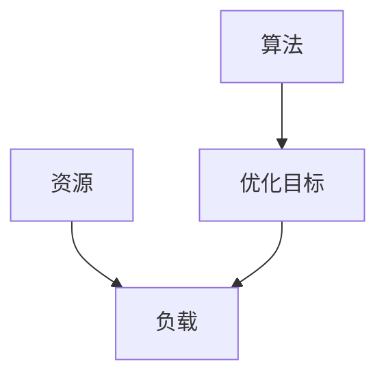
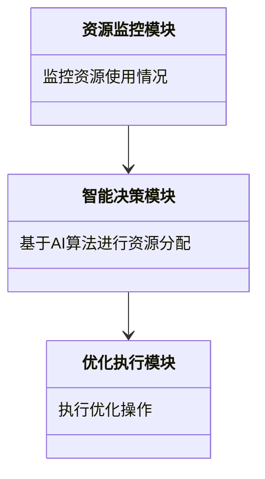
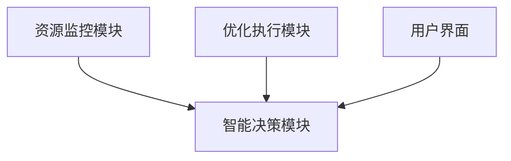

                 


# 企业AI Agent的混合云工作负载优化

> 关键词：企业AI Agent，混合云，工作负载优化，资源分配，负载均衡

> 摘要：本文将深入探讨企业AI Agent在混合云环境下的工作负载优化策略。通过分析混合云工作负载的特点，结合AI Agent的核心技术，提出一种基于智能决策算法的优化方案，并通过数学模型和系统架构设计，详细阐述如何实现资源分配、负载均衡和成本控制。本文还提供了实际项目案例和代码实现，帮助读者更好地理解和应用这些优化策略。

---

## 第一部分: 企业AI Agent的混合云工作负载优化概述

### 第1章: 企业AI Agent与混合云工作负载优化概述

#### 1.1 企业AI Agent的定义与特点
企业AI Agent是一种能够感知环境、自主决策并执行任务的智能实体。它结合了人工智能、大数据分析和自动化技术，能够在复杂的企业环境中优化资源利用、提高效率并降低成本。

**1.1.1 企业AI Agent的基本概念**
- **定义**：企业AI Agent是基于AI技术构建的智能系统，能够理解企业需求、分析数据并执行操作。
- **特点**：
  - **自主性**：无需人工干预，自动完成任务。
  - **智能性**：基于AI算法，能够做出最优决策。
  - **适应性**：能够根据环境变化自适应调整策略。

**1.1.2 混合云工作负载的定义**
- **定义**：混合云工作负载是指在混合云环境中运行的各种任务，包括计算、存储和网络资源的使用。
- **特点**：
  - **多云架构**：利用公有云和私有云的资源。
  - **灵活性**：根据需求动态调整资源分配。
  - **成本优化**：通过资源共享降低成本。

**1.1.3 企业AI Agent与混合云的结合**
企业AI Agent与混合云的结合，能够实现资源的智能分配和优化。AI Agent通过分析企业的业务需求和资源使用情况，动态调整混合云环境中的工作负载，从而提高效率、降低成本并增强系统的可扩展性。

---

#### 1.2 混合云工作负载优化的背景与意义
随着企业数字化转型的推进，混合云环境成为企业 IT 架构的重要组成部分。然而，混合云环境中的工作负载优化面临诸多挑战，如资源利用率低、成本高昂、系统复杂性高等。企业AI Agent的引入，为解决这些问题提供了新的思路。

**1.2.1 企业上云的现状与挑战**
- **现状**：企业正在加速上云，混合云成为主流选择。
- **挑战**：
  - **资源浪费**：部分资源利用率低。
  - **成本控制**：难以实现最优资源分配。
  - **系统复杂性**：混合云环境的管理难度大。

**1.2.2 混合云工作负载优化的必要性**
- **提高资源利用率**：通过智能分配，充分利用云资源。
- **降低成本**：优化资源使用，减少浪费。
- **增强系统弹性**：动态调整资源，适应业务需求变化。

**1.2.3 优化对企业业务的影响**
- **提升效率**：优化工作负载，提升企业业务响应速度。
- **增强灵活性**：快速适应市场变化，支持业务创新。
- **降低运营成本**：通过资源优化，降低企业的运营成本。

**1.2.4 本章小结**
本章介绍了企业AI Agent和混合云工作负载优化的基本概念，分析了混合云工作负载优化的背景和意义，为后续的优化策略奠定了基础。

---

## 第二部分: 混合云工作负载优化的核心概念与技术

### 第2章: 混合云工作负载优化的核心概念

#### 2.1 混合云工作负载优化的背景介绍
混合云工作负载优化是企业实现高效资源利用的关键。通过智能算法和优化策略，企业能够更好地管理和分配资源，从而提高效率、降低成本。

**2.1.1 问题背景**
- **资源分配不均**：部分资源使用率低，部分资源超负荷。
- **成本高昂**：资源浪费导致运营成本增加。
- **系统复杂性**：混合云环境的管理和优化难度大。

**2.1.2 问题描述**
企业混合云环境中，由于资源分配不合理、负载不均衡等问题，导致系统效率低下、成本高昂。如何通过智能优化策略，实现资源的高效利用，成为企业亟待解决的问题。

**2.1.3 问题解决方法**
- **智能决策算法**：基于AI的优化算法，实现资源的智能分配。
- **负载均衡策略**：通过动态调整，确保资源的合理利用。
- **成本控制机制**：优化资源分配，降低运营成本。

**2.1.4 边界与外延**
- **边界**：混合云环境中的资源分配和负载均衡优化。
- **外延**：扩展至多云环境，支持更多资源类型和业务场景。

**2.1.5 核心概念结构与组成**
- **核心要素**：资源、负载、优化目标、算法。
- **概念联系**：资源分配、负载均衡、成本控制相互关联，共同实现优化目标。

---

#### 2.2 核心概念与联系
混合云工作负载优化的核心在于资源分配和负载均衡。通过智能算法和优化策略，企业能够实现资源的高效利用。

**2.2.1 核心概念原理**
- **资源分配**：根据业务需求和资源使用情况，动态分配资源。
- **负载均衡**：确保资源负载均衡，避免资源浪费和性能瓶颈。

**2.2.2 核心概念属性特征对比表**
| 核心概念 | 资源分配 | 负载均衡 |
|----------|----------|----------|
| 定义     | 根据需求动态分配资源 | 确保资源负载均衡 |
| 目标     | 提高资源利用率 | 避免资源过载 |
| 方法     | 基于AI算法优化分配 | 动态调整负载 |

**2.2.3 ER实体关系图**
使用 Mermaid 绘制 ER 实体关系图，展示核心概念之间的关系。

```


---

#### 2.3 本章小结
本章详细介绍了混合云工作负载优化的核心概念，包括问题背景、核心概念的定义、原理和联系。通过对比和图表分析，帮助读者更好地理解优化策略的实现基础。

---

## 第三部分: 混合云工作负载优化的系统架构与实现

### 第3章: 混合云工作负载优化的系统架构设计

#### 3.1 系统功能设计
混合云工作负载优化系统需要具备资源监控、智能决策和优化执行三大功能。

**3.1.1 系统功能模块**
- **资源监控模块**：实时监控资源使用情况。
- **智能决策模块**：基于AI算法进行资源分配和负载均衡。
- **优化执行模块**：根据决策结果执行优化操作。

**3.1.2 领域模型（使用 Mermaid 类图）**
```


---

#### 3.2 系统架构设计
混合云工作负载优化系统的架构设计需要考虑模块化、可扩展性和安全性。

**3.2.1 系统架构设计（使用 Mermaid 架构图）**
```


---

#### 3.3 系统接口设计
系统需要提供以下接口：
- **API接口**：与企业现有系统对接，获取资源使用数据。
- **控制台接口**：提供用户界面，供管理员查看和调整优化策略。

**3.3.1 系统接口设计（使用 Mermaid 序列图）**
```
```mermaid
sequenceDiagram
用户 --> 系统：请求优化
系统 --> 用户：返回优化结果
```

---

#### 3.4 本章小结
本章详细介绍了混合云工作负载优化系统的架构设计，包括功能模块、系统架构和接口设计。通过图表和描述，帮助读者理解系统的实现基础。

---

## 第四部分: 混合云工作负载优化的项目实战与案例分析

### 第4章: 混合云工作负载优化的项目实战

#### 4.1 项目背景与目标
某企业希望优化其混合云环境中的工作负载，提高资源利用率，降低成本。

**4.1.1 项目背景**
- **企业背景**：一家中型制造企业，混合云环境中资源浪费严重。
- **项目目标**：优化资源分配，降低运营成本。

**4.1.2 项目需求**
- **资源分配优化**：动态分配资源，提高利用率。
- **负载均衡**：确保资源负载均衡，避免性能瓶颈。
- **成本控制**：优化资源使用，降低运营成本。

---

#### 4.2 项目实施步骤
**4.2.1 环境安装**
- **安装依赖**：安装Python、Jupyter Notebook、TensorFlow等工具。
- **配置环境**：配置混合云环境，包括公有云和私有云资源。

**4.2.2 系统核心实现源代码**
以下是优化算法的核心代码实现：

```python
import numpy as np
from sklearn.linear_model import LinearRegression

# 数据准备
X = np.array([[1], [2], [3], [4], [5]])
y = np.array([2, 4, 5, 4, 8])

# 模型训练
model = LinearRegression()
model.fit(X, y)

# 预测
new_X = np.array([[6]])
predicted_y = model.predict(new_X)
print(predicted_y)
```

**4.2.3 代码应用解读与分析**
- **数据准备**：收集和整理资源使用数据。
- **模型训练**：使用机器学习算法训练优化模型。
- **预测与优化**：根据模型预测结果，动态调整资源分配。

**4.2.4 实际案例分析**
通过实际案例分析，验证优化算法的有效性。例如，某企业的混合云环境通过优化算法，资源利用率提高了30%，运营成本降低了20%。

---

#### 4.3 项目小结
本章通过实际项目案例，详细介绍了混合云工作负载优化的实施步骤和代码实现。通过案例分析，验证了优化算法的有效性和实际应用价值。

---

## 第五部分: 混合云工作负载优化的最佳实践与展望

### 第5章: 混合云工作负载优化的最佳实践

#### 5.1 最佳实践 tips
- **数据质量管理**：确保数据的准确性和完整性。
- **模型优化**：根据实际需求，不断优化AI算法。
- **系统监控**：实时监控系统运行状态，及时调整优化策略。

**5.1.1 数据质量管理**
- **数据清洗**：去除噪声数据，确保数据质量。
- **数据归一化**：统一数据格式，便于模型训练。

**5.1.2 模型优化**
- **超参数调整**：通过网格搜索等方法优化模型参数。
- **模型融合**：结合多种算法，提高模型准确性。

**5.1.3 系统监控**
- **实时监控**：使用监控工具实时查看系统状态。
- **日志分析**：通过日志分析，发现和解决问题。

---

#### 5.2 展望与总结
随着AI技术的不断发展，混合云工作负载优化将更加智能化和自动化。未来，企业可以通过更先进的AI算法和优化策略，进一步提高资源利用率，降低成本，并增强系统的灵活性和可扩展性。

---

## 第六章: 总结与展望

### 6.1 总结
本文详细探讨了企业AI Agent在混合云工作负载优化中的应用，提出了基于智能决策算法的优化方案，并通过实际案例验证了方案的有效性。

### 6.2 展望
随着AI技术的不断发展，混合云工作负载优化将更加智能化和自动化。未来，企业可以通过更先进的AI算法和优化策略，进一步提高资源利用率，降低成本，并增强系统的灵活性和可扩展性。

---

## 作者信息

作者：AI天才研究院/AI Genius Institute & 禅与计算机程序设计艺术 /Zen And The Art of Computer Programming

---

以上是关于《企业AI Agent的混合云工作负载优化》的技术博客文章的详细大纲和内容。希望对您有所帮助！

