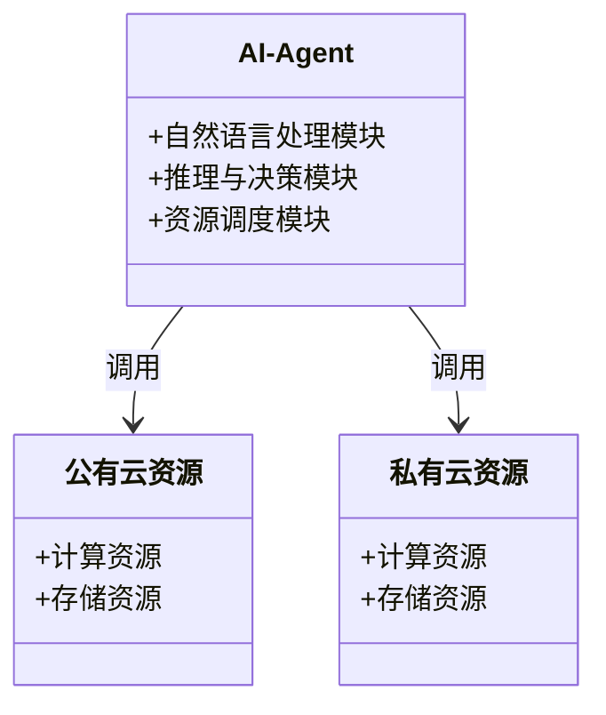

                 


# 企业AI Agent的混合云部署策略

> 关键词：企业AI Agent，混合云，部署策略，架构设计，系统优化，云资源调度

> 摘要：随着人工智能技术的快速发展，企业AI Agent在各个行业的应用越来越广泛。然而，AI Agent的部署环境和资源调度策略直接影响其性能和可用性。本文从混合云部署的背景出发，详细分析了AI Agent的核心算法、混合云架构设计、系统优化策略以及实际应用场景。通过理论分析与实践案例相结合，本文为读者提供了全面的企业AI Agent混合云部署解决方案，帮助企业在复杂的云环境中实现高效、安全的AI Agent部署与管理。

---

# 第一部分: 企业AI Agent的混合云部署背景与概述

# 第1章: 企业AI Agent的混合云部署概述

## 1.1 混合云部署的基本概念

### 1.1.1 混合云的定义与特点

混合云是一种结合公有云和私有云的部署模式，通过将部分资源托管在公有云，另一部分部署在私有云或本地服务器，实现资源的灵活调配和优化利用。其特点包括：

- **灵活性**：可以根据业务需求动态调整资源使用。
- **成本优化**：通过公有云和私有云的结合，降低整体成本。
- **安全性**：私有云可以部署敏感业务，公有云处理非敏感业务，平衡安全与成本。

### 1.1.2 企业AI Agent的定义与核心功能

企业AI Agent是一种能够理解并执行企业级任务的智能代理，其核心功能包括：

- **自然语言处理**：通过NLP技术与用户进行交互。
- **智能决策**：基于上下文信息进行推理和决策。
- **任务执行**：能够调用企业内部系统完成任务。

### 1.1.3 混合云部署的背景与挑战

随着企业数字化转型的深入，AI Agent的需求日益增长。混合云部署为企业提供了更灵活的资源调配方式，但也带来了资源调度、数据一致性、安全性等方面的挑战。

---

## 1.2 混合云部署的核心优势

### 1.2.1 资源弹性扩展的优势

混合云允许企业在业务高峰期弹性扩展资源，避免了单一云环境的资源瓶颈问题。

### 1.2.2 成本优化的策略

通过将非敏感业务部署在公有云，敏感业务部署在私有云，企业可以实现成本的最小化。

### 1.2.3 多云环境下资源利用率的提升

混合云部署能够充分利用不同云提供商的优势，提高资源利用率。

---

## 1.3 企业AI Agent的典型应用场景

### 1.3.1 智能客服与用户交互

AI Agent可以作为智能客服，通过NLP技术与用户进行交互，解决用户问题。

### 1.3.2 自动化运维与监控

AI Agent可以用于自动化运维，实时监控系统状态并进行异常处理。

### 1.3.3 数据分析与决策支持

AI Agent可以通过分析企业数据，提供决策支持。

---

## 1.4 本章小结

本章从混合云部署的基本概念出发，介绍了企业AI Agent的定义与核心功能，并分析了混合云部署的背景与优势。通过典型应用场景的描述，读者可以更好地理解混合云部署的实际需求。

---

# 第2章: 混合云架构与AI Agent的核心技术

## 2.1 混合云架构的核心组件

### 2.1.1 公有云与私有云的协同

混合云架构通过公有云和私有云的协同工作，实现资源的灵活调配。

### 2.1.2 负载均衡与流量分发

混合云架构需要通过负载均衡技术，将流量分发到不同的云资源上。

### 2.1.3 跨云数据同步与一致性

混合云环境中，数据需要在不同云之间同步，并保持一致性。

---

## 2.2 混合云架构的设计原则

### 2.2.1 可扩展性与可伸缩性

混合云架构需要具备良好的可扩展性和可伸缩性，以应对业务波动。

### 2.2.2 安全性与数据隔离

混合云架构需要考虑数据的安全性和隔离性，避免数据泄露。

### 2.2.3 灾备与高可用性

混合云架构需要具备灾备能力，确保系统的高可用性。

---

## 2.3 混合云架构的实现技术

### 2.3.1 虚拟化与容器化技术

虚拟化技术可以实现资源的高效利用，容器化技术则可以提高部署效率。

### 2.3.2 多云管理平台的构建

多云管理平台可以统一管理不同云提供商的资源，简化运维流程。

### 2.3.3 资源调度与编排工具

资源调度与编排工具可以帮助企业实现资源的自动化调度和优化。

---

## 2.4 本章小结

本章详细介绍了混合云架构的核心组件、设计原则和实现技术，为后续的AI Agent部署提供了理论基础。

---

# 第3章: AI Agent的核心算法与实现

## 3.1 自然语言处理（NLP）算法

### 3.1.1 Transformer模型的原理

Transformer模型通过自注意力机制，可以处理长序列数据。

### 3.1.2 注意力机制的实现

注意力机制通过计算输入序列中各个位置的权重，实现对重要信息的聚焦。

### 3.1.3 梯度下降与优化算法

梯度下降是一种常用的优化算法，用于最小化模型的损失函数。

---

## 3.2 AI Agent的推理与决策算法

### 3.2.1 基于规则的推理

基于规则的推理通过预定义的规则，实现简单的逻辑推理。

### 3.2.2 基于概率的推理

基于概率的推理通过计算概率分布，实现不确定性推理。

### 3.2.3 增量学习与在线更新

增量学习可以在新数据到来时，逐步更新模型参数。

---

## 3.3 算法实现的数学模型

### 3.3.1 Transformer模型的数学公式

$$\text{Encoder}(x) = \text{LayerNorm}(x + \text{MultiHead}(x))$$

### 3.3.2 注意力机制的计算公式

$$\text{Attention}(Q, K, V) = \text{softmax}\left(\frac{QK^T}{\sqrt{d_k}}\right)V$$

---

## 3.4 算法实现的Python代码示例

```python
import torch

class TransformerEncoder(torch.nn.Module):
    def __init__(self, d_model, nhead, dim_feedforward=2048, dropout=0.1):
        super(TransformerEncoder, self).__init__()
        self.self_attn = torch.nn.MultiheadAttention(d_model, nhead)
        self.feedforward = torch.nn.Sequential(
            torch.nn.Linear(d_model, dim_feedforward),
            torch.nn.ReLU(),
            torch.nn.Linear(dim_feedforward, d_model)
        )
        self.norm = torch.nn.LayerNorm(d_model)
        
    def forward(self, x, mask=None):
        attn_output, _ = self.self_attn(x, x, x, mask=mask)
        x = attn_output + x
        x = self.norm(x)
        x = self.feedforward(x)
        return x
```

---

## 3.5 本章小结

本章从AI Agent的核心算法出发，详细介绍了自然语言处理和推理算法的实现原理，并通过数学公式和代码示例，帮助读者理解AI Agent的实现过程。

---

# 第4章: 混合云部署中的AI Agent系统优化

## 4.1 混合云环境下的资源调度策略

### 4.1.1 资源负载均衡

通过负载均衡技术，实现资源的动态分配。

### 4.1.2 资源弹性伸缩

根据业务需求，动态调整资源的使用。

### 4.1.3 多云环境下的资源隔离

确保不同业务之间的资源隔离，避免资源冲突。

---

## 4.2 AI Agent的性能优化策略

### 4.2.1 并行计算优化

通过并行计算，提高模型的推理速度。

### 4.2.2 模型轻量化

通过模型压缩和剪枝技术，降低模型的计算开销。

### 4.2.3 数据预处理优化

通过数据预处理，减少模型的训练时间。

---

## 4.3 混合云环境下的数据一致性保障

### 4.3.1 数据同步机制

通过数据同步机制，确保不同云之间的数据一致性。

### 4.3.2 数据分区策略

通过数据分区策略，实现数据的分布式存储和一致性管理。

### 4.3.3 数据冗余与备份

通过数据冗余和备份，确保数据的高可用性。

---

## 4.4 本章小结

本章从混合云环境下的资源调度和性能优化出发，提出了AI Agent的系统优化策略，并详细介绍了数据一致性保障的实现方法。

---

# 第5章: 企业AI Agent的混合云部署实战

## 5.1 项目背景与目标

### 5.1.1 项目背景

某企业希望利用AI Agent实现智能客服系统，提升用户体验。

### 5.1.2 项目目标

实现AI Agent的混合云部署，确保系统的高可用性和安全性。

---

## 5.2 系统功能设计

### 5.2.1 领域模型设计



### 5.2.2 系统架构设计


### 5.2.3 系统接口设计

通过API接口，实现AI Agent与公有云和私有云资源的交互。

---

## 5.3 项目实战

### 5.3.1 环境配置

- 安装公有云和私有云环境。
- 配置负载均衡和多云管理平台。

### 5.3.2 核心代码实现

```python
import boto3

class CloudResourceManager:
    def __init__(self, public_cloud_config, private_cloud_config):
        self.public_cloud = boto3.Session(
            aws_access_key_id=public_cloud_config['access_key'],
            aws_secret_access_key=public_cloud_config['secret_key']
        )
        self.private_cloud = private_cloud_config['resources']
        
    def allocate_resource(self, resource_type):
        # 根据资源类型分配公有云或私有云资源
        pass
```

### 5.3.3 实际案例分析

通过实际案例分析，验证AI Agent的混合云部署方案的有效性。

---

## 5.4 本章小结

本章通过实际项目案例，详细介绍了AI Agent的混合云部署过程，包括系统设计和核心代码实现。

---

# 第6章: 混合云部署中的安全与合规

## 6.1 混合云环境下的数据安全

### 6.1.1 数据加密与解密

通过数据加密技术，确保数据传输和存储的安全性。

### 6.1.2 身份认证与权限管理

通过身份认证和权限管理，确保只有授权用户可以访问敏感资源。

---

## 6.2 混合云环境下的合规要求

### 6.2.1 数据隐私合规

确保数据的收集、存储和使用符合相关法律法规。

### 6.2.2 服务级别协议（SLA）

确保混合云部署符合企业的SLA要求。

### 6.2.3 安全审计与日志管理

通过安全审计和日志管理，确保系统的安全性和合规性。

---

## 6.3 本章小结

本章从安全与合规的角度，详细介绍了混合云环境下的数据安全和合规要求，为企业AI Agent的混合云部署提供了安全保障。

---

# 第7章: 企业AI Agent的混合云部署未来展望

## 7.1 混合云部署的技术趋势

### 7.1.1 多云管理平台的智能化

未来的多云管理平台将更加智能化，能够自动优化资源分配。

### 7.1.2 AI Agent的自适应能力

AI Agent需要具备更强的自适应能力，能够根据环境变化自动调整策略。

### 7.1.3 边缘计算与混合云的结合

边缘计算与混合云的结合将推动AI Agent在边缘场景中的应用。

---

## 7.2 企业AI Agent的未来发展

### 7.2.1 AI Agent的智能化升级

AI Agent需要不断升级，以适应更复杂的业务需求。

### 7.2.2 多模态交互的实现

未来的AI Agent将支持多模态交互，包括视觉、语音等多种交互方式。

### 7.2.3 高可用性与容错能力

未来的AI Agent需要具备更强的高可用性与容错能力，确保系统的稳定运行。

---

## 7.3 本章小结

本章从技术趋势和未来发展两个方面，展望了企业AI Agent的混合云部署的未来发展方向。

---

# 作者

作者：AI天才研究院/AI Genius Institute & 禅与计算机程序设计艺术 /Zen And The Art of Computer Programming

---

**本文由AI天才研究院原创，转载请注明出处。**

