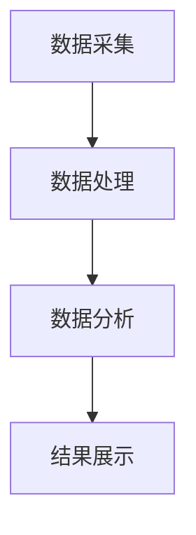
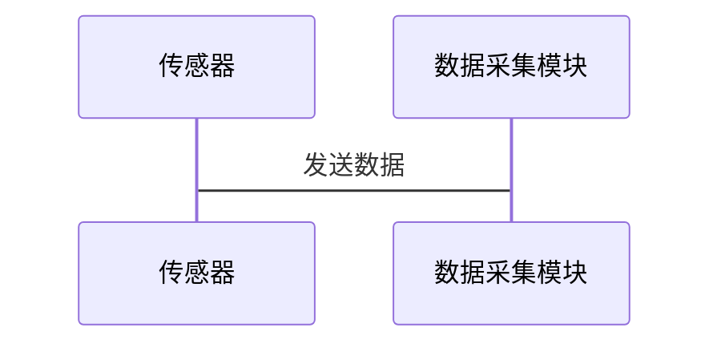
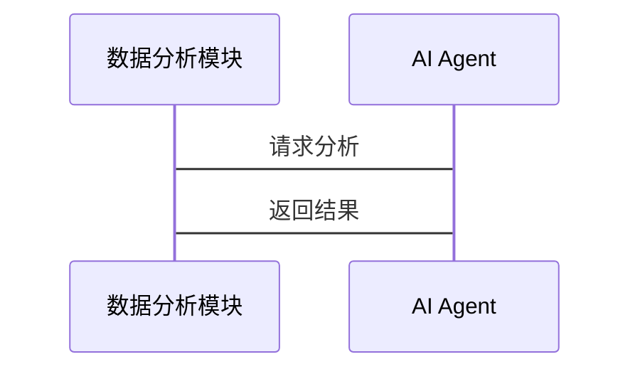

                 


# 企业AI Agent的物联网(IoT)数据分析与应用

> 关键词：AI Agent, 物联网, 数据分析, 数据流, 企业应用, 算法实现

> 摘要：本文深入探讨了企业AI Agent在物联网数据分析中的应用，从基础概念到核心算法，再到系统架构和项目实战，全面解析了如何利用AI Agent提升物联网数据的处理与应用能力。通过详细的技术分析和实际案例，展示了企业AI Agent在物联网环境中的巨大潜力和实际价值。

---

# 第一部分: 企业AI Agent与物联网数据分析基础

## 第1章: 物联网(IoT)与AI Agent概述

### 1.1 物联网(IoT)的基本概念

#### 1.1.1 物联网的定义与特点
物联网（Internet of Things, IoT）是指通过各种信息传感设备，如传感器、射频识别（RFID）技术、全球定位系统（GPS）、红外感应器等，按照约定的协议，把任何物品与互联网连接起来，进行信息交换和通信，以实现智能化识别、定位、跟踪、监控和管理。

**物联网的特点：**
- **万物互联**：设备间的无缝连接与通信。
- **实时性**：数据的实时采集与传输。
- **智能化**：通过数据分析实现智能决策。

#### 1.1.2 物联网的核心技术
- **感知层**：传感器、RFID、摄像头等设备用于数据采集。
- **网络层**：包括Wi-Fi、蓝牙、ZigBee等通信技术，实现数据传输。
- **应用层**：数据分析与应用，如智能监控、智能家居等。

#### 1.1.3 物联网的应用场景
- 智能家居
- 智慧城市
- 工业物联网（IIoT）

### 1.2 AI Agent的定义与特点

#### 1.2.1 AI Agent的基本概念
AI Agent（人工智能代理）是一种能够感知环境并采取行动以实现目标的智能实体。它可以是一个软件程序，也可以是一个硬件设备，具备自主决策和执行的能力。

**AI Agent的特点：**
- **自主性**：能够在没有外部干预的情况下运行。
- **反应性**：能够根据环境变化做出实时反应。
- **目标导向**：所有行为都围绕特定目标展开。

#### 1.2.2 AI Agent的核心功能
- 数据采集与处理
- 信息推理与决策
- 行动执行

#### 1.2.3 AI Agent与传统软件的区别
| 属性       | AI Agent                     | 传统软件                   |
|------------|------------------------------|----------------------------|
| 智能性     | 高                           | 低                         |
| 自主性     | 高                           | 低                         |
| 适应性     | 高                           | 低                         |

### 1.3 企业AI Agent与物联网的结合

#### 1.3.1 企业AI Agent的定义
企业AI Agent是指在企业环境中，通过AI技术实现智能化管理和优化的代理系统。

#### 1.3.2 物联网数据与AI Agent的关系
物联网提供了海量实时数据，AI Agent利用这些数据进行分析和决策，从而提升企业的运营效率。

#### 1.3.3 企业AI Agent在物联网中的应用
- 智能监控与预警
- 资源优化配置
- 智能决策支持

---

## 第2章: 物联网数据流与AI Agent的交互机制

### 2.1 物联网数据流的定义

#### 2.1.1 数据流的方向与类型
物联网数据流可以分为流入和流出两种方向，数据类型包括文本、图像、声音等。

#### 2.1.2 数据流的采集与传输
数据采集是物联网系统的第一步，通常通过传感器完成。数据传输则依赖于通信技术，如Wi-Fi、5G等。

### 2.2 AI Agent的数据处理流程

#### 2.2.1 数据的接收与解析
AI Agent接收数据后，需要进行解析和格式化处理。

#### 2.2.2 数据的存储与管理
数据存储可以采用数据库或分布式存储系统，如Hadoop、MongoDB等。

#### 2.2.3 数据的分析与决策
通过机器学习算法对数据进行分析，生成决策结果。

### 2.3 物联网数据与AI Agent的交互模型

#### 2.3.1 数据流的实时性要求
物联网数据通常需要实时处理，AI Agent需要具备快速响应能力。

#### 2.3.2 数据流的可靠性与安全性
数据传输过程中需要保证数据的完整性和安全性。

#### 2.3.3 数据流的可扩展性
物联网系统通常需要支持大规模数据的扩展。

---

## 第3章: 物联网数据的预处理与特征提取

### 3.1 数据清洗与预处理

#### 3.1.1 数据的去噪与异常处理
通过统计分析和机器学习方法去除噪声数据和异常值。

#### 3.1.2 数据的归一化与标准化
归一化：将数据按比例缩放到0-1范围。
标准化：将数据按均值和标准差标准化。

#### 3.1.3 数据的缺失值处理
插值法、均值法、随机填补法等。

### 3.2 特征提取与选择

#### 3.2.1 特征提取的基本方法
主成分分析（PCA）、线性判别分析（LDA）等。

#### 3.2.2 基于AI的特征提取
使用深度学习模型（如CNN、RNN）提取特征。

#### 3.2.3 特征选择的优化策略
逐步回归、Lasso回归等。

### 3.3 数据特征的可视化分析

#### 3.3.1 数据分布的可视化
使用直方图、箱线图等工具。

#### 3.3.2 数据关联性的可视化
使用散点图、热力图等工具。

#### 3.3.3 数据趋势的可视化
使用折线图、趋势图等工具。

---

## 第4章: 基于AI Agent的物联网数据分析算法

### 4.1 数据分析算法概述

#### 4.1.1 常见的数据分析算法
分类（决策树、随机森林）、回归（线性回归、逻辑回归）、聚类（K-means、层次聚类）。

#### 4.1.2 基于AI的分析算法
深度学习（CNN、RNN）、强化学习（Q-learning、Deep Q-Network）。

#### 4.1.3 算法的选择与优化
根据数据类型和业务需求选择合适的算法，并通过交叉验证进行优化。

### 4.2 基于AI Agent的分类算法

#### 4.2.1 分类算法的基本原理
通过训练数据学习分类模型，对新数据进行分类预测。

#### 4.2.2 基于AI Agent的分类模型
使用随机森林、XGBoost等算法构建分类模型。

#### 4.2.3 分类算法的性能评估
准确率、召回率、F1分数等指标。

### 4.3 基于AI Agent的回归算法

#### 4.3.1 回归算法的基本原理
通过训练数据学习回归模型，对新数据进行数值预测。

#### 4.3.2 基于AI Agent的回归模型
使用线性回归、Lasso回归等算法构建回归模型。

#### 4.3.3 回归算法的优化
调整模型参数、交叉验证等方法。

---

## 第5章: 物联网数据分析系统的架构与实现

### 5.1 系统架构设计

#### 5.1.1 系统功能设计
数据采集模块、数据处理模块、数据分析模块、结果展示模块。

#### 5.1.2 系统架构图


### 5.2 系统接口设计

#### 5.2.1 数据采集接口


#### 5.2.2 数据分析接口


### 5.3 系统实现

#### 5.3.1 数据采集实现
使用Python的paho-mqtt库实现MQTT协议数据接收。

#### 5.3.2 数据分析实现
使用机器学习库scikit-learn进行分类和回归分析。

#### 5.3.3 结果展示实现
使用Flask框架搭建Web界面，展示分析结果。

---

## 第6章: 企业AI Agent的物联网数据分析应用案例

### 6.1 案例背景介绍

#### 6.1.1 项目介绍
智能工厂实时监控案例。

#### 6.1.2 项目目标
通过AI Agent实现设备状态监控和故障预测。

### 6.2 项目实现

#### 6.2.1 环境安装
安装Python、paho-mqtt、scikit-learn、Flask等库。

#### 6.2.2 核心代码实现
```python
import paho.mqtt.client as mqtt
from sklearn.ensemble import RandomForestClassifier
import joblib

# 数据采集
def on_message(client, userdata, message):
    data = message.payload.decode()
    # 数据处理
    processed_data = preprocess(data)
    # 数据分析
    model = joblib.load('model.pkl')
    prediction = model.predict(processed_data)
    # 结果展示
    print(f'预测结果: {prediction}')

client = mqtt.Client()
client.on_message = on_message
client.connect('localhost', 1883)
client.subscribe('设备状态')
client.loop_forever()
```

#### 6.2.3 代码解读
- 数据采集：通过MQTT协议接收设备数据。
- 数据处理：对数据进行清洗和特征提取。
- 数据分析：使用随机森林模型进行分类预测。
- 结果展示：在Web界面展示预测结果。

### 6.3 实际案例分析

#### 6.3.1 分析结果
通过AI Agent实现了设备状态的实时监控和故障预测。

#### 6.3.2 案例总结
AI Agent在物联网数据分析中的应用显著提升了企业的运营效率和决策能力。

---

## 第7章: 企业AI Agent物联网数据分析的最佳实践

### 7.1 最佳实践 Tips

#### 7.1.1 数据安全
确保数据传输和存储的安全性，采用加密技术。

#### 7.1.2 算法选择
根据具体场景选择合适的算法，并进行充分的验证和优化。

#### 7.1.3 系统优化
优化系统架构，提升数据处理和分析的效率。

### 7.2 小结

#### 7.2.1 企业AI Agent的优势
- 提高效率
- 实时决策
- 智能化管理

#### 7.2.2 挑战与解决方案
- 数据量大：采用分布式存储和计算。
- 实时性要求高：优化数据采集和处理流程。
- 数据安全：加强数据加密和访问控制。

### 7.3 拓展阅读

#### 7.3.1 推荐书籍
- 《机器学习实战》
- 《物联网技术与应用》

#### 7.3.2 技术博客
- AI Agent相关技术博客
- 物联网技术博客

---

# 作者

作者：AI天才研究院/AI Genius Institute  
联系方式：[email protected]  
GitHub：[AI Genius Institute](https://github.com/AI-Genius-Institute)

