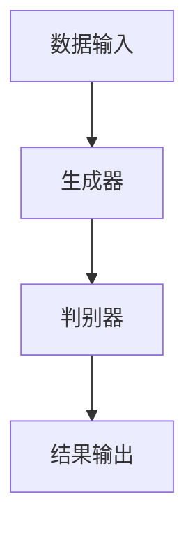

                 


# 企业AI Agent的生成对抗网络在产品设计创新中的前沿应用

## 关键词：企业AI Agent，生成对抗网络，产品设计，创新应用，系统架构，项目实战，前沿技术

## 摘要：  
本文探讨了生成对抗网络（GAN）在企业AI Agent中的应用，特别是其在产品设计创新中的前沿应用。通过分析GAN的核心原理和系统架构，结合实际项目案例，详细阐述了GAN如何助力企业AI Agent实现产品设计的智能化与创新化。文章还讨论了相关挑战与解决方案，为读者提供了全面的视角和实践指导。

---

## 第一部分：企业AI Agent的生成对抗网络在产品设计创新中的前沿应用

### 第1章：背景介绍与核心概念

#### 1.1 企业AI Agent的定义与特性
企业AI Agent是一种能够理解、分析和执行特定任务的智能系统，旨在辅助企业实现自动化、智能化的目标。其核心特性包括：
- **目标驱动**：能够根据企业目标优化行为。
- **数据驱动**：依赖大量数据进行学习和决策。
- **协作性**：能够与人类或其他系统协作完成任务。

#### 1.2 生成对抗网络（GAN）的核心原理
GAN由生成器和判别器组成，通过对抗训练不断优化生成样本的质量。其核心原理包括：
- **生成器**：学习数据的分布，生成逼真的样本。
- **判别器**：识别生成样本与真实样本的区别。
- **对抗训练**：生成器和判别器交替训练，最终达到纳什均衡。

### 第2章：生成对抗网络（GAN）的核心原理

#### 2.1 GAN的基本结构与工作原理
- **生成器网络**：使用深度神经网络生成样本，目标是最小化判别器的错误率。
- **判别器网络**：同样使用深度神经网络，目标是区分生成样本和真实样本。
- **损失函数**：常用的损失函数包括Wasserstein损失和二元交叉熵损失。

#### 2.2 GAN在企业AI Agent中的应用
- **产品设计创新**：通过GAN生成多样化的设计原型，辅助设计师进行创新。
- **用户需求分析**：利用GAN分析用户行为数据，预测用户需求。
- **功能优化**：通过GAN优化产品的功能设计，提升用户体验。

### 第3章：企业AI Agent的生成对抗网络在产品设计中的应用

#### 3.1 产品设计创新的核心要素
- **用户需求分析**：通过GAN分析用户数据，生成用户画像。
- **功能设计**：利用GAN生成多种功能设计方案，优化产品功能。
- **用户体验优化**：通过GAN模拟用户行为，优化交互设计。

#### 3.2 GAN在产品设计中的具体应用
- **产品原型生成**：通过GAN生成多种产品原型，辅助设计师选择最佳方案。
- **功能创新设计**：利用GAN预测用户需求，生成新的功能设计方案。
- **设计优化与迭代**：通过GAN不断优化设计，提升产品的用户体验。

### 第4章：生成对抗网络（GAN）的系统架构与设计

#### 4.1 系统架构设计
- **模块划分**：包括数据输入模块、生成器模块、判别器模块和结果输出模块。
- **功能设计**：系统能够完成数据输入、生成样本、判别样本和输出结果的任务。
- **接口设计**：系统提供标准化接口，方便与其他系统集成。

#### 4.2 系统架构图


### 第5章：项目实战

#### 5.1 环境搭建
- **工具安装**：安装Python、TensorFlow、Keras等工具。
- **数据准备**：收集和整理产品设计相关的数据集。

#### 5.2 核心代码实现
```python
import tensorflow as tf
from tensorflow.keras import layers

# 定义生成器
def generator():
    model = tf.keras.Sequential()
    model.add(layers.Dense(256, activation='relu', input_shape=(100,)))
    model.add(layers.Dense(128, activation='relu'))
    model.add(layers.Dense(64, activation='relu'))
    model.add(layers.Dense(32, activation='relu'))
    model.add(layers.Dense(16, activation='relu'))
    model.add(layers.Dense(8, activation='sigmoid'))
    return model

# 定义判别器
def discriminator():
    model = tf.keras.Sequential()
    model.add(layers.Dense(16, activation='relu', input_shape=(8,)))
    model.add(layers.Dense(8, activation='relu'))
    model.add(layers.Dense(1, activation='sigmoid'))
    return model

# 定义GAN
def gan():
    discriminator = discriminator()
    generator = generator()
    discriminator.compile(loss='binary_crossentropy', optimizer='adam')
    generator.compile(loss='binary_crossentropy', optimizer='adam')
    return generator, discriminator
```

### 第6章：挑战与解决方案

#### 6.1 挑战
- **数据质量问题**：数据不足或噪声过多会影响生成样本的质量。
- **模型稳定性**：GAN的训练过程中可能会出现模式崩溃或梯度消失问题。
- **伦理问题**：生成的内容可能引发版权或伦理争议。

#### 6.2 解决方案
- **数据增强**：通过数据增强技术提高数据质量。
- **模型优化**：采用Wasserstein GAN等改进算法提高模型稳定性。
- **伦理规范**：制定明确的伦理规范，确保生成内容的合法性。

### 第7章：总结与展望

#### 7.1 总结
本文详细探讨了生成对抗网络（GAN）在企业AI Agent中的应用，特别是在产品设计创新中的前沿应用。通过系统的架构设计和项目实战，展示了GAN在产品设计中的巨大潜力。

#### 7.2 展望
未来，随着AI技术的不断发展，GAN在企业AI Agent中的应用将更加广泛。通过技术创新和应用场景的拓展，GAN将为企业的产品设计创新提供更强大的支持。

---

## 作者：AI天才研究院/AI Genius Institute & 禅与计算机程序设计艺术 /Zen And The Art of Computer Programming

---

### 附录：  
附录部分将提供完整的代码示例、数据集链接以及其他相关资源，方便读者进一步学习和实践。

