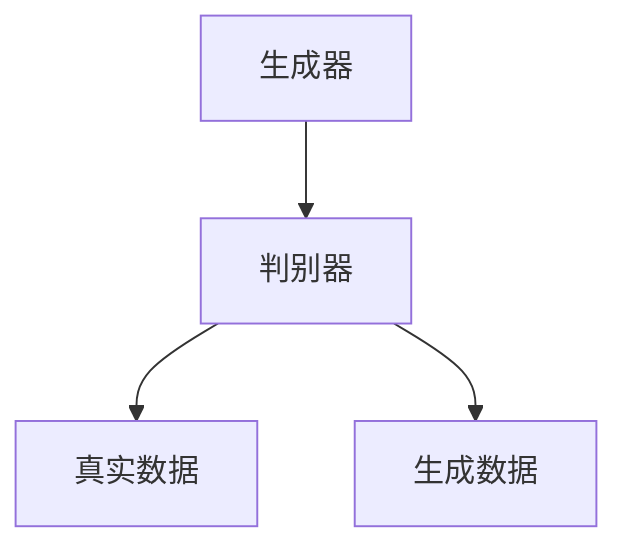
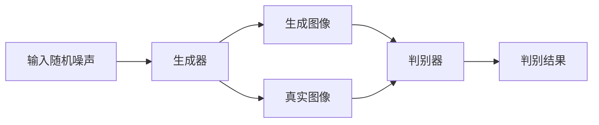
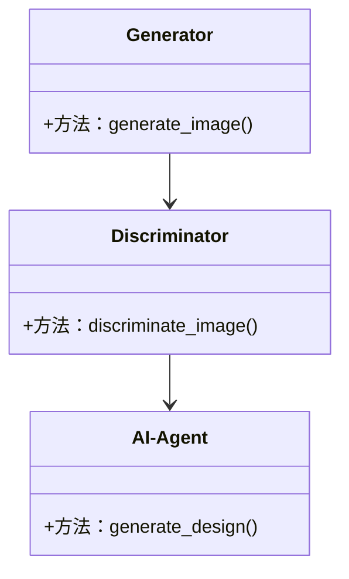
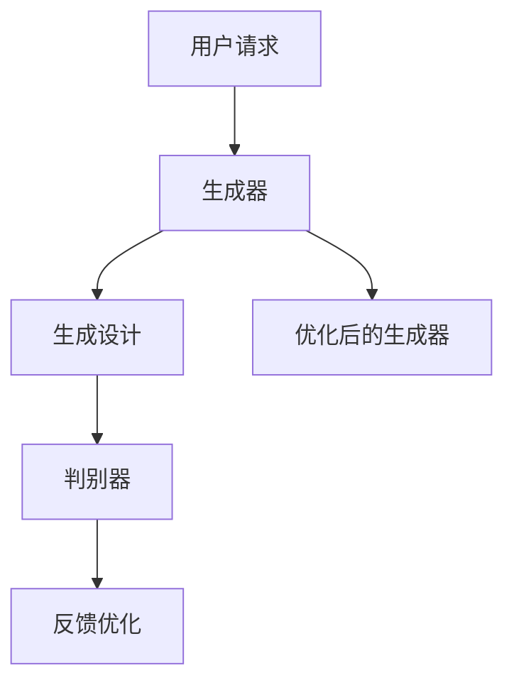
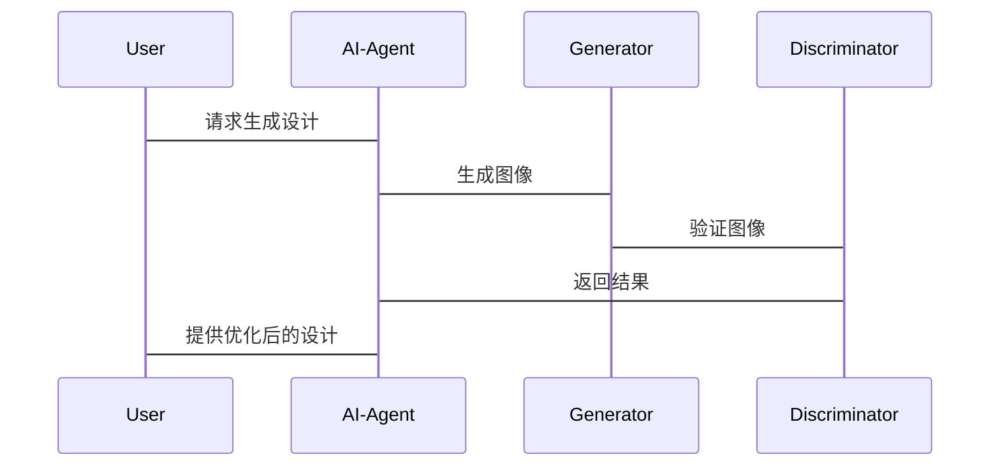

                 


# 企业AI Agent的生成对抗网络在产品设计创新中的应用

> 关键词：生成对抗网络（GANs）、企业AI Agent、产品设计创新、图像生成、风格迁移、深度学习

> 摘要：本文探讨生成对抗网络（GANs）在企业AI Agent中的应用，特别是在产品设计创新方面。通过详细分析GANs的核心原理、算法实现、系统架构以及实际案例，本文展示了GANs如何助力企业实现智能化、创新化的产品设计。文章内容涵盖背景介绍、核心概念、算法原理、系统设计、项目实战等，为读者提供全面的技术解读。

---

## 第1章: 背景介绍

### 1.1 生成对抗网络的基本概念
生成对抗网络（GANs）是一种深度学习模型，由生成器（Generator）和判别器（Discriminator）组成。生成器的目标是生成逼真的数据，而判别器则负责区分真实数据和生成数据。两者的对抗过程使得生成器逐步提升生成能力，最终达到以假乱真的效果。

### 1.2 GANs的发展历程
GANs由Ian Goodfellow等人于2014年提出，随后衍生出多种变体，如DCGAN、WGAN、StyleGAN等。这些变体在生成质量、训练稳定性和生成速度等方面不断优化，推动了GANs在图像生成、风格迁移等领域的应用。

### 1.3 GANs在企业中的应用现状
企业AI Agent通过集成GANs技术，可以实现自动化的产品设计、市场趋势预测和用户体验优化。例如，利用GANs生成产品设计草图或市场推广图像，显著提升了设计效率和创新能力。

### 1.4 GANs在产品设计创新中的潜力
GANs能够生成多样化的设计方案，为产品设计师提供灵感和参考。通过与企业AI Agent结合，GANs能够实时调整设计参数，满足不同客户的需求，推动产品设计的创新。

---

## 第2章: 生成对抗网络的核心概念

### 2.1 生成器与判别器的对抗关系
生成器通过优化损失函数生成高质量数据，判别器则通过分类任务识别数据的真伪。两者相互博弈，最终达到纳什均衡。

### 2.2 GANs的数学模型与公式
生成器的损失函数为：
$$ \mathcal{L}_G = \mathbb{E}_{z \sim p_z}[\log D(G(z))] $$
判别器的损失函数为：
$$ \mathcal{L}_D = \mathbb{E}_{x \sim p_{data}}[\log D(x)] + \mathbb{E}_{z \sim p_z}[\log (1 - D(G(z)))] $$

### 2.3 GANs与其他生成模型的对比
与变分自编码器（VAE）相比，GANs生成的图像质量更高，但训练过程更不稳定。与自动编码器（AE）相比，GANs能够生成多样化的新样本，但对数据分布的覆盖能力有限。

### 2.4 实体关系图


---

## 第3章: 生成对抗网络的算法原理

### 3.1 GANs的训练过程


### 3.2 GANs的数学模型
生成器和判别器通过对抗训练优化目标函数：
$$ \min_G \max_D \mathcal{L}_G + \mathcal{L}_D $$

### 3.3 GANs的实现代码
```python
import tensorflow as tf
from tensorflow.keras import layers

def build_generator():
    model = tf.keras.Sequential([
        layers.Dense(256, activation='relu'),
        layers.Dense(784, activation='sigmoid')
    ])
    return model

def build_discriminator():
    model = tf.keras.Sequential([
        layers.Dense(256, activation='relu'),
        layers.Dense(1, activation='sigmoid')
    ])
    return model

generator = build_generator()
discriminator = build_discriminator()

# 定义损失函数
cross_entropy = tf.keras.losses.BinaryCrossentropy()

# 定义优化器
generator_optimizer = tf.keras.optimizers.Adam(0.0002)
discriminator_optimizer = tf.keras.optimizers.Adam(0.0002)

# 训练过程
def train_step(images):
    noise = tf.random.normal([batch_size, 100])
    generated_images = generator(noise)
    
    real_output = discriminator(images)
    generated_output = discriminator(generated_images)
    
    # 判别器损失
    d_loss = cross_entropy(tf.ones_like(real_output), real_output) + cross_entropy(tf.zeros_like(generated_output), generated_output)
    
    # 生成器损失
    g_loss = cross_entropy(tf.ones_like(generated_output), generated_output)
    
    # 反向传播和优化
    generator.trainable = True
    discriminator.trainable = True
    generator_optimizer.minimize(g_loss, generator.trainable_weights)
    discriminator_optimizer.minimize(d_loss, discriminator.trainable_weights)
```

---

## 第4章: 企业AI Agent的系统设计

### 4.1 系统功能模块


### 4.2 系统架构设计


### 4.3 接口设计与交互


---

## 第5章: 项目实战

### 5.1 环境安装
安装必要的库：
```bash
pip install tensorflow-gpu==2.5.0 keras==2.5.0 numpy==1.21.0
```

### 5.2 核心实现代码
```python
import numpy as np
import tensorflow as tf
from tensorflow.keras import layers

# 定义生成器和判别器
def build_generator():
    model = tf.keras.Sequential([
        layers.Dense(256, activation='relu'),
        layers.Dense(784, activation='sigmoid')
    ])
    return model

def build_discriminator():
    model = tf.keras.Sequential([
        layers.Dense(256, activation='relu'),
        layers.Dense(1, activation='sigmoid')
    ])
    return model

# 初始化模型
generator = build_generator()
discriminator = build_discriminator()

# 定义损失函数和优化器
cross_entropy = tf.keras.losses.BinaryCrossentropy()
generator_optimizer = tf.keras.optimizers.Adam(0.0002)
discriminator_optimizer = tf.keras.optimizers.Adam(0.0002)

# 训练过程
def train_step(images):
    noise = tf.random.normal([batch_size, 100])
    generated_images = generator(noise)
    
    real_output = discriminator(images)
    generated_output = discriminator(generated_images)
    
    d_loss = cross_entropy(tf.ones_like(real_output), real_output) + cross_entropy(tf.zeros_like(generated_output), generated_output)
    g_loss = cross_entropy(tf.ones_like(generated_output), generated_output)
    
    generator.trainable = True
    discriminator.trainable = True
    generator_optimizer.minimize(g_loss, generator.trainable_weights)
    discriminator_optimizer.minimize(d_loss, discriminator.trainable_weights)

# 训练循环
def train():
    for epoch in range(num_epochs):
        for batch in dataset:
            train_step(batch)
```

### 5.3 案例分析
通过训练GANs模型，生成高质量的产品设计图像，并通过判别器优化生成器，最终实现逼真且多样化的设计效果。

### 5.4 总结
本章通过实战项目，展示了GANs在企业AI Agent中的具体应用，验证了其在产品设计创新中的潜力。

---

## 第6章: 最佳实践与注意事项

### 6.1 小结
GANs是一种强大的生成模型，能够显著提升企业AI Agent的产品设计能力。

### 6.2 注意事项
- 训练GANs需要大量计算资源和时间。
- 需要平衡生成器和判别器的训练过程，避免模式坍缩。

### 6.3 拓展阅读
推荐阅读Ian Goodfellow的《GANs tutorial》和相关研究论文，深入了解GANs的最新进展。

---

## 作者：AI天才研究院/AI Genius Institute & 禅与计算机程序设计艺术 /Zen And The Art of Computer Programming

