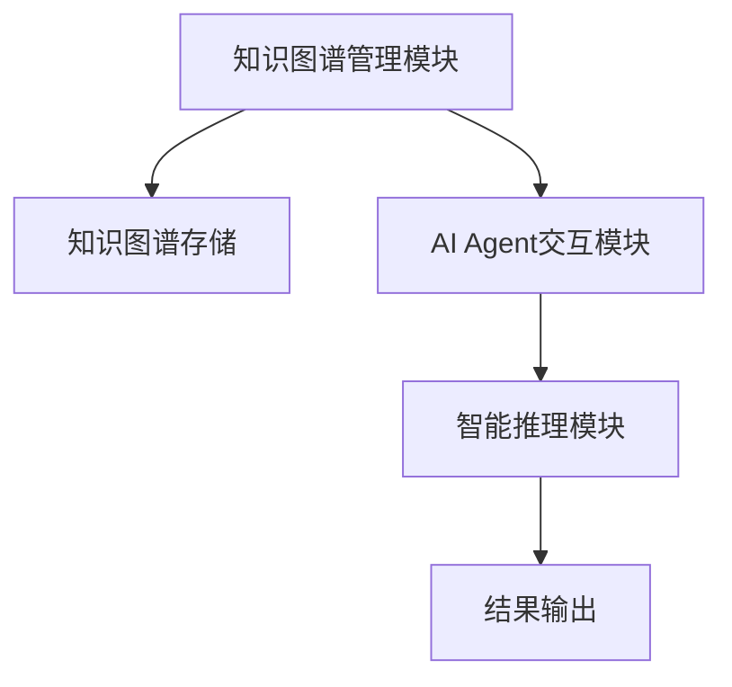
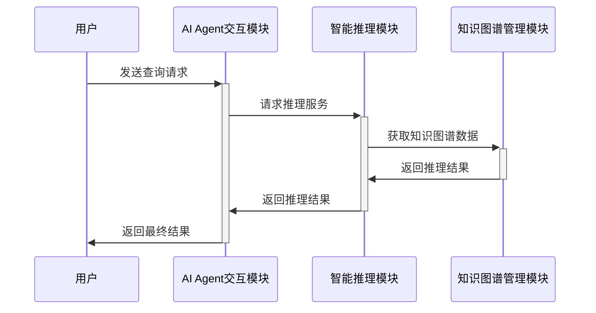

                 


# 《企业AI Agent的知识图谱应用策略》

---

## 关键词：
知识图谱, AI Agent, 企业应用, 系统架构, 实战案例

---

## 摘要：
本文系统地探讨了企业AI Agent在知识图谱中的应用策略，从知识图谱的基本概念到AI Agent的设计实现，再到具体的场景应用和系统架构，最后通过项目实战和最佳实践总结了相关经验。文章结合理论与实践，深入分析了知识图谱如何赋能AI Agent，为企业智能化转型提供可行的解决方案。

---

## 第一部分: 企业AI Agent与知识图谱的背景与核心概念

### 第1章: 知识图谱与AI Agent概述

#### 1.1 知识图谱的基本概念
##### 1.1.1 知识图谱的定义与特点
知识图谱是一种以结构化形式表示知识的网络，由实体和关系构成。它具有以下特点：
- **语义性**：通过关系描述实体之间的联系。
- **层次性**：支持复杂的语义关系。
- **动态性**：能够实时更新和扩展。

##### 1.1.2 知识图谱的构建过程
构建知识图谱的步骤包括：
1. 数据收集：从多种来源（如数据库、网页、文档）获取数据。
2. 数据清洗：去除冗余和不一致的数据。
3. 实体识别：通过NLP技术提取实体。
4. 关系抽取：识别实体之间的关系。
5. 知识融合：整合多源数据。
6. 知识表示：将知识以结构化形式存储。

##### 1.1.3 知识图谱在企业中的应用价值
知识图谱在企业中的应用价值体现在：
- **提升决策效率**：通过知识关联快速获取所需信息。
- **优化业务流程**：通过知识图谱实现智能化流程管理。
- **增强客户体验**：通过个性化推荐提升客户满意度。

#### 1.2 AI Agent的基本概念
##### 1.2.1 AI Agent的定义与分类
AI Agent是一种智能体，能够感知环境并执行任务。分类包括：
- **简单反射式Agent**：基于规则执行任务。
- **基于模型的反射式Agent**：基于内部模型进行推理。
- **实用基于效用的Agent**：通过效用函数优化决策。

##### 1.2.2 AI Agent的核心功能与特点
AI Agent的核心功能包括：
- **感知环境**：通过传感器或API获取信息。
- **推理与学习**：利用知识图谱进行推理和学习。
- **自主决策**：基于推理结果做出决策。
- **与人交互**：通过自然语言处理与用户互动。

##### 1.2.3 AI Agent与传统软件的区别
AI Agent与传统软件的区别在于：
- **自主性**：能够自主决策。
- **适应性**：能够适应环境变化。
- **学习能力**：能够通过学习提升能力。

#### 1.3 知识图谱与AI Agent的结合
##### 1.3.1 知识图谱如何赋能AI Agent
知识图谱为AI Agent提供了丰富的知识库，使其能够理解上下文并进行推理。

##### 1.3.2 AI Agent如何利用知识图谱提升智能
AI Agent通过知识图谱进行实体识别、关系推理和意图理解，从而提升智能水平。

##### 1.3.3 知识图谱与AI Agent的协同工作原理
知识图谱为AI Agent提供知识支持，AI Agent利用知识图谱进行推理和决策，两者协同工作。

#### 1.4 本章小结
本章介绍了知识图谱和AI Agent的基本概念，分析了它们的结合方式和协同工作原理。

---

## 第二部分: 知识图谱的构建与管理

### 第2章: 知识图谱的构建与管理

#### 2.1 知识图谱的构建流程
##### 2.1.1 数据收集与预处理
- 数据来源：数据库、文档、API接口。
- 数据清洗：去除噪声数据，确保数据质量。

##### 2.1.2 实体识别与抽取
- 实体识别：使用NLP技术识别文本中的实体。
- 实体消歧：解决同一实体的不同表示问题。

##### 2.1.3 关系抽取与构建
- 关系抽取：识别实体之间的关系。
- 关系建模：使用关系三元组表示。

##### 2.1.4 知识图谱的存储与管理
- 数据库选择：使用图数据库（如Neo4j）存储知识图谱。
- 数据管理：通过版本控制管理知识图谱的更新。

#### 2.2 知识图谱的表示方法
##### 2.2.1 实体表示方法
- 使用唯一标识符表示实体。
- 通过属性描述实体的特征。

##### 2.2.2 关系表示方法
- 使用关系三元组（头实体、关系、尾实体）表示关系。
- 支持复杂的语义关系，如“属于”、“包含”。

##### 2.2.3 知识图谱的标准化表示
- 使用RDF（资源描述框架）或RDFS（RDF Schema）表示知识图谱。
- 通过OWL（Web Ontology Language）定义本体论。

#### 2.3 知识图谱的可视化
- 使用图数据库工具（如Neo4j的Browser）进行可视化。
- 通过颜色和样式区分不同类型的实体和关系。

---

## 第三部分: AI Agent的设计与实现

### 第3章: AI Agent的设计与实现

#### 3.1 AI Agent的设计要点
##### 3.1.1 设计目标
- 提供智能化服务。
- 支持多种交互方式。
- 具备自适应能力。

##### 3.1.2 设计原则
- 简单性：模块化设计。
- 可扩展性：支持功能扩展。
- 安全性：保护用户隐私。

#### 3.2 AI Agent的实现步骤
##### 3.2.1 系统架构设计
- 分层架构：包括数据层、逻辑层和表示层。
- 使用微服务架构实现模块化。

##### 3.2.2 交互方式设计
- 多轮对话：支持复杂场景的交互。
- 多模态交互：结合文本、语音、图像等多种交互方式。

##### 3.2.3 智能核心实现
- 知识图谱推理：基于知识图谱进行推理。
- 机器学习：使用监督学习训练模型。
- 自然语言处理：支持语义理解和生成。

#### 3.3 知识图谱在AI Agent中的应用
##### 3.3.1 实体识别与链接
- 通过知识图谱进行实体识别和链接。
- 使用实体消歧技术解决同名实体问题。

##### 3.3.2 关系推理与学习
- 基于知识图谱进行关系推理。
- 使用图嵌入技术（如Word2Vec、GloVe）进行关系学习。

##### 3.3.3 智能问答与对话
- 基于知识图谱构建智能问答系统。
- 使用对话管理技术实现多轮对话。

---

## 第四部分: 知识图谱与AI Agent的场景应用

### 第4章: 知识图谱与AI Agent的场景应用

#### 4.1 知识图谱在企业中的应用场景
##### 4.1.1 企业知识管理
- 建立企业知识库，支持知识共享和复用。
- 通过知识图谱实现知识的结构化管理。

##### 4.1.2 企业决策支持
- 基于知识图谱进行数据分析和决策支持。
- 通过知识图谱发现数据之间的关联关系。

##### 4.1.3 企业风险管理
- 使用知识图谱识别潜在风险。
- 通过知识图谱进行风险评估和预警。

#### 4.2 知识图谱在AI Agent中的具体应用
##### 4.2.1 企业内部知识问答
- 建立企业知识图谱，支持员工快速获取内部知识。
- 使用AI Agent提供智能问答服务。

##### 4.2.2 企业供应链管理
- 建立供应链知识图谱，支持供应链优化和风险控制。
- 使用AI Agent进行供应链监控和预测。

##### 4.2.3 企业客户关系管理
- 建立客户知识图谱，支持客户分层和精准营销。
- 使用AI Agent进行客户互动和服务。

---

## 第五部分: 知识图谱与AI Agent的系统架构设计

### 第5章: 系统架构设计

#### 5.1 系统功能设计
##### 5.1.1 知识图谱管理模块
- 数据录入与管理。
- 知识图谱构建与维护。

##### 5.1.2 AI Agent交互模块
- 用户输入处理。
- 多轮对话管理。

##### 5.1.3 智能推理模块
- 知识图谱推理。
- 机器学习推理。

#### 5.2 系统架构设计
##### 5.2.1 系统架构图


##### 5.2.2 系统接口设计
- API接口：提供RESTful API接口。
- 数据接口：支持多种数据格式的导入和导出。

##### 5.2.3 系统交互流程


---

## 第六部分: 知识图谱与AI Agent的项目实战

### 第6章: 项目实战

#### 6.1 环境安装与配置
##### 6.1.1 环境搭建
- 安装Python 3.8+
- 安装必要的库：pandas、numpy、networkx、spacy、flask、neo4j-driver。

##### 6.1.2 知识图谱存储选择
- 使用Neo4j作为图数据库。
- 配置Neo4j的REST API。

#### 6.2 核心代码实现
##### 6.2.1 知识图谱构建
```python
from neo4j import GraphDatabase
from neo4j.exceptions import ServiceUnavailable

class KnowledgeGraph:
    def __init__(self, uri, user, password):
        self.driver = GraphDatabase.driver(uri, auth=(user, password))
    
    def close(self):
        self.driver.close()
    
    def create_entity(self, entity_type, entity_name):
        with self.driver.session() as session:
            session.run("CREATE (n:{entity_type} {{name: '{entity_name}'}}) RETURN n"
                        .format(entity_type=entity_type, entity_name=entity_name))
    
    def create_relation(self, start_entity, relation, end_entity):
        with self.driver.session() as session:
            session.run("MATCH (a), (b) WHERE a.name = '{start_entity}' AND b.name = '{end_entity}' CREATE (a)-[r:{relation}]->(b)"
                        .format(start_entity=start_entity, relation=relation, end_entity=end_entity))
```

##### 6.2.2 AI Agent实现
```python
from flask import Flask, request, jsonify
import spacy

app = Flask(__name__)
nlp = spacy.load("en_core_web_sm")

@app.route('/api/ask', methods=['POST'])
def ask():
    data = request.json
    question = data['question']
    doc = nlp(question)
    # 这里可以实现基于知识图谱的问答逻辑
    return jsonify({'answer': '待实现的问答逻辑'})
```

#### 6.3 案例分析与解读
##### 6.3.1 实战案例
- 案例1：企业内部知识问答系统。
- 案例2：供应链管理优化。

##### 6.3.2 代码实现解读
- 知识图谱构建部分：使用Neo4j存储知识图谱。
- AI Agent实现部分：基于Flask构建RESTful API，使用spaCy进行自然语言处理。

#### 6.4 项目小结
本章通过实际案例展示了知识图谱与AI Agent的应用，详细介绍了环境搭建和代码实现过程。

---

## 第七部分: 知识图谱与AI Agent的最佳实践

### 第7章: 最佳实践

#### 7.1 最佳实践总结
##### 7.1.1 数据质量的重要性
- 确保数据的准确性和完整性。
- 定期更新和维护知识图谱。

##### 7.1.2 模型优化技巧
- 使用迁移学习提升模型性能。
- 定期评估模型效果并进行优化。

##### 7.1.3 安全与隐私保护
- 确保知识图谱和AI Agent的安全性。
- 遵守数据隐私保护法规。

#### 7.2 小结
本章总结了知识图谱与AI Agent应用中的最佳实践，为读者提供了宝贵的参考。

#### 7.3 展望
随着AI技术的不断发展，知识图谱与AI Agent的应用前景广阔，未来将会有更多创新的应用场景。

---

## 作者：AI天才研究院/AI Genius Institute & 禅与计算机程序设计艺术 /Zen And The Art of Computer Programming

---

**本文版权归作者所有，转载请注明出处！**

