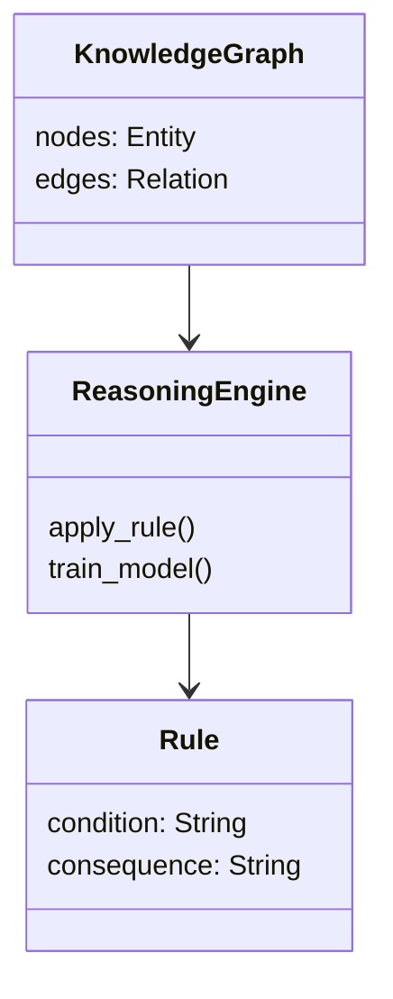

                 


# 企业AI Agent的知识图谱推理引擎

> 关键词：AI Agent, 知识图谱, 推理引擎, 企业应用, 系统架构

> 摘要：企业AI Agent的知识图谱推理引擎是人工智能领域的重要组成部分，它通过构建和利用知识图谱进行推理，为企业决策提供支持。本文将详细介绍知识图谱的构建过程、推理引擎的核心原理、算法实现、系统架构设计以及实际项目中的应用，帮助读者全面理解并掌握这一技术。

---

# 第一部分：企业AI Agent与知识图谱概述

## 第1章：企业AI Agent与知识图谱概述

### 1.1 AI Agent的基本概念
AI Agent（智能体）是指能够感知环境并采取行动以实现目标的实体。它具备自主性、反应性、目标导向和社会能力等特征。

#### 1.1.1 AI Agent的特点
- **自主性**：能够自主决策，无需外部干预。
- **反应性**：能够实时感知环境并做出反应。
- **目标导向**：所有行动都围绕特定目标展开。
- **社会能力**：能够与其他Agent或人类进行交互和协作。

#### 1.1.2 企业AI Agent的应用场景
在企业中，AI Agent可以用于智能客服、供应链管理、风险评估等领域。例如，智能客服Agent能够根据客户问题实时生成回答，提升用户体验。

#### 1.1.3 知识图谱在AI Agent中的作用
知识图谱是一种结构化的数据表示方式，能够帮助AI Agent更好地理解和推理复杂的信息。通过知识图谱，AI Agent可以实现知识的组织、关联和推理。

### 1.2 知识图谱的基本概念
知识图谱是一种以图结构形式表示知识的数据库，节点代表实体，边代表实体之间的关系。

#### 1.2.1 知识图谱的定义
知识图谱通过结构化的形式表示实体及其关系，能够帮助机器理解和推理知识。

#### 1.2.2 知识图谱的构建过程
知识图谱的构建通常包括数据收集、预处理、知识抽取、知识融合和存储等步骤。

#### 1.2.3 知识图谱的表示方法
知识图谱常用的表示方法包括RDF（资源描述框架）和图嵌入（如Word2Vec、GloVe）。

### 1.3 知识图谱推理引擎的核心概念
知识图谱推理引擎是基于知识图谱进行推理的核心工具，能够从知识图谱中推导出新的知识。

#### 1.3.1 推理引擎的定义
推理引擎是一种用于从已有知识中推导出新知识的工具，通常基于逻辑推理或机器学习算法。

#### 1.3.2 知识图谱推理引擎的分类
知识图谱推理引擎主要分为基于规则的推理引擎和基于机器学习的推理引擎。

#### 1.3.3 知识图谱推理引擎的应用价值
知识图谱推理引擎能够帮助企业实现知识的自动化推理，提升决策效率和准确性。

---

## 第2章：知识图谱的构建过程

### 2.1 数据收集与预处理
知识图谱的构建需要从多种数据源收集数据，包括结构化数据、非结构化数据和半结构化数据。

#### 2.1.1 数据来源与多样性
数据来源可以是企业内部数据库、外部公开数据集、文本文件等。

#### 2.1.2 数据清洗与标准化
数据清洗包括去除重复数据、处理缺失值和异常值等。标准化则是将数据转换为统一的格式，便于后续处理。

#### 2.1.3 数据标注与结构化
将非结构化数据（如文本）标注为结构化数据，以便构建知识图谱。

### 2.2 知识抽取与表示
知识抽取是将数据中的实体和关系提取出来，并表示为知识图谱中的节点和边。

#### 2.2.1 实体识别与关系抽取
实体识别是通过自然语言处理技术从文本中提取实体，关系抽取则是识别实体之间的关系。

#### 2.2.2 知识表示的多样性
知识图谱可以通过多种方式表示，如RDF三元组、图嵌入等。

#### 2.2.3 知识图谱的存储技术
知识图谱通常存储在图数据库中，如Neo4j、RDF数据库等。

### 2.3 知识图谱的管理和维护
知识图谱的管理和维护包括版本控制、知识更新和质量评估。

#### 2.3.1 知识图谱的版本控制
通过版本控制工具记录知识图谱的变更历史，方便回溯和管理。

#### 2.3.2 知识图谱的扩展与更新
根据新的数据不断扩展知识图谱，并定期更新已有数据。

#### 2.3.3 知识图谱的质量评估
通过评估知识图谱的完整性、准确性、一致性和可扩展性来衡量其质量。

---

## 第3章：知识图谱推理引擎的核心原理

### 3.1 推理引擎的基本原理
推理引擎通过逻辑推理或机器学习算法，从知识图谱中推导出新的知识。

#### 3.1.1 推理的定义与分类
推理是指从已有的知识中推导出新的知识的过程。推理可以分为逻辑推理和归纳推理。

#### 3.1.2 知识图谱推理的流程
知识图谱推理通常包括知识表示、推理规则定义、推理过程执行和结果验证等步骤。

#### 3.1.3 推理引擎的性能指标
性能指标包括推理速度、准确率、内存占用等。

### 3.2 符号推理与概率推理
符号推理基于逻辑规则进行推理，概率推理则基于概率模型进行推理。

#### 3.2.1 符号推理的基本原理
符号推理通过逻辑规则对知识图谱中的实体和关系进行推理，例如通过RDF规则进行推理。

#### 3.2.2 概率推理的基本原理
概率推理基于概率论，通常使用贝叶斯网络进行推理。

#### 3.2.3 符号推理与概率推理的对比
符号推理适用于确定性推理，概率推理适用于不确定性推理。

### 3.3 知识图谱推理引擎的实现技术
知识图谱推理引擎的实现技术包括基于规则的推理和基于机器学习的推理。

#### 3.3.1 基于规则的推理
基于规则的推理通过预定义的规则对知识图谱进行推理，例如RDF规则。

#### 3.3.2 基于机器学习的推理
基于机器学习的推理通过训练模型对知识图谱进行推理，例如使用图神经网络进行推理。

#### 3.3.3 混合推理方法
混合推理方法结合了符号推理和概率推理的优点，适用于复杂场景。

---

## 第4章：知识图谱推理引擎的算法实现

### 4.1 基于规则的推理算法
基于规则的推理算法通过预定义的规则对知识图谱进行推理。

#### 4.1.1 算法流程
1. 输入知识图谱和推理规则。
2. 根据推理规则对知识图谱进行推理。
3. 输出推理结果。

#### 4.1.2 代码实现
```python
def rule_based_reasoning(knowledge_graph, rules):
    results = []
    for rule in rules:
        if rule_matches(knowledge_graph, rule):
            results.append(rule后果)
    return results
```

### 4.2 基于机器学习的推理算法
基于机器学习的推理算法通过训练模型对知识图谱进行推理。

#### 4.2.1 算法流程
1. 数据预处理：将知识图谱转换为适合机器学习模型的格式。
2. 模型训练：训练图神经网络模型。
3. 推理：使用训练好的模型进行推理。

#### 4.2.2 代码实现
```python
import tensorflow as tf
from tensorflow.keras import layers

def build_model(input_shape):
    model = tf.keras.Sequential()
    model.add(layers.InputLayer(input_shape))
    model.add(layers.Conv2D(32, (3,3), activation='relu'))
    model.add(layers.MaxPooling2D((2,2)))
    model.add(layers.Flatten())
    model.add(layers.Dense(64, activation='relu'))
    model.add(layers.Dense(1, activation='sigmoid'))
    return model
```

### 4.3 数学模型与公式
#### 4.3.1 基于概率的推理公式
$$ P(A|B) = \frac{P(B|A) \cdot P(A)}{P(B)} $$

#### 4.3.2 基于符号的推理规则
如果A → B，且A为真，则B为真。

---

## 第5章：知识图谱推理引擎的系统架构设计

### 5.1 系统功能设计
知识图谱推理引擎的系统功能包括知识图谱存储、推理规则管理、推理过程执行和结果展示。

#### 5.1.1 领域模型设计
使用Mermaid类图描述系统中的各个组件及其关系。



#### 5.1.2 系统架构设计
使用Mermaid架构图描述系统的整体架构。


---

## 第6章：知识图谱推理引擎的项目实战

### 6.1 项目环境搭建
项目实战需要安装必要的依赖库，例如Python的networkx和TensorFlow。

#### 6.1.1 安装依赖
```bash
pip install networkx tensorflow
```

### 6.2 项目核心代码实现
实现一个简单的知识图谱推理引擎，包括知识图谱的构建和推理规则的定义。

#### 6.2.1 知识图谱的构建
```python
import networkx as nx

G = nx.DiGraph()
G.add_edge("A", "B")
G.add_edge("B", "C")
```

#### 6.2.2 推理规则的定义
```python
def apply_rule(G, rule):
    if rule in G.edges:
        return True
    return False
```

### 6.3 实际案例分析
通过一个具体案例分析推理引擎的应用，例如在企业供应链管理中的应用。

#### 6.3.1 案例背景
假设企业需要预测供应链中的潜在风险，可以通过知识图谱推理引擎进行推理。

#### 6.3.2 推理过程
1. 收集供应链中的数据并构建知识图谱。
2. 定义推理规则，例如“如果供应商延迟交货，则影响生产进度”。
3. 执行推理，生成潜在风险报告。

---

## 第7章：总结与展望

### 7.1 总结
本文详细介绍了企业AI Agent的知识图谱推理引擎，包括知识图谱的构建、推理引擎的核心原理、算法实现、系统架构设计以及项目实战等内容。

### 7.2 未来展望
未来，知识图谱推理引擎将在企业智能化转型中发挥更重要的作用，例如动态知识图谱、分布式推理和多模态推理。

---

## 作者：AI天才研究院/AI Genius Institute & 禅与计算机程序设计艺术 /Zen And The Art of Computer Programming

