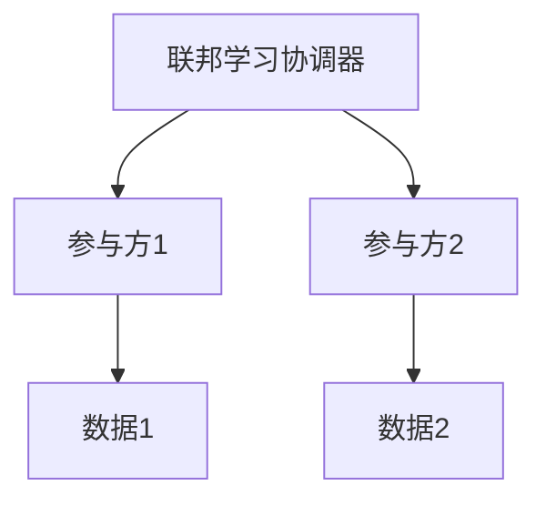

                 


# 企业AI Agent的联邦学习在跨企业数据协作中的安全实践

> 关键词：企业AI Agent，联邦学习，跨企业数据协作，数据隐私，安全性

> 摘要：本文深入探讨了联邦学习在跨企业数据协作中的安全实践，分析了企业AI Agent在联邦学习中的应用，详细介绍了联邦学习的算法原理、系统架构设计、项目实战以及安全机制，为跨企业数据协作的安全性提供了理论支持和实践指导。

---

## 第一章: 企业AI Agent的背景与概述

### 1.1 企业AI Agent的定义与特点

企业AI Agent是一种智能代理系统，用于在企业内部或跨企业环境中执行特定任务。它具备以下特点：
- **自主性**：能够独立决策和行动。
- **反应性**：能够根据环境变化调整行为。
- **社交能力**：能够与其他系统或人类进行交互和协作。

### 1.2 联邦学习的背景与概述

联邦学习（Federated Learning）是一种分布式机器学习技术，允许多个参与方在不共享数据的情况下协作训练模型。其核心特点包括：
- **数据隐私保护**：数据不出域，确保数据安全。
- **模型协作更新**：通过加密通信更新模型参数。

### 1.3 跨企业数据协作的背景与挑战

跨企业数据协作旨在通过共享数据或模型参数提升整体智能水平，但面临以下挑战：
- **数据隐私风险**：数据泄露可能引发法律问题。
- **协作效率低下**：传统方法需要大量数据传输和处理。
- **信任机制缺失**：不同企业之间的信任问题影响协作意愿。

### 1.4 联邦学习在跨企业数据协作中的作用

联邦学习通过加密通信和分布式计算，解决了跨企业协作中的数据隐私问题，同时提升了模型的泛化能力。它为企业的数据共享提供了一种安全、高效的方式。

---

## 第二章: 联邦学习的核心概念与联系

### 2.1 联邦学习的核心概念

- **数据联邦**：通过加密协议在数据源处进行局部模型训练。
- **模型联邦**：参与方共享模型参数，共同优化全局模型。
- **安全机制**：采用加密技术和访问控制确保数据安全。

### 2.2 联邦学习与分布式机器学习的对比

| 对比维度         | 联邦学习                          | 分布式机器学习                  |
|------------------|-----------------------------------|--------------------------------|
| 数据处理方式     | 数据不出域，仅传输模型参数       | 数据集中到中心服务器            |
| 数据隐私性       | 高                                | 中                                |
| 通信开销         | 高                                | 中                                |

### 2.3 联邦学习的数学模型

全局模型更新公式：
$$\theta_{\text{global}}^{(t+1)} = \frac{1}{n}\sum_{i=1}^{n}\theta_{\text{local}}^{(t+1)}$$

其中，$\theta_{\text{global}}$ 表示全局模型参数，$n$ 表示参与方数量。

---

## 第三章: 联邦学习的算法原理

### 3.1 联邦学习的算法概述

联邦学习的流程包括以下步骤：
1. **初始化**：各参与方初始化本地模型参数。
2. **局部训练**：各参与方在本地数据上训练模型。
3. **模型聚合**：将各参与方的模型参数聚合，更新全局模型。
4. **模型分发**：将更新后的全局模型分发给各参与方。

### 3.2 联邦学习的数学模型

假设每个参与方$i$有数据集$D_i$，本地模型参数为$\theta_i$。全局模型参数$\theta$的更新公式为：
$$\theta_{\text{new}} = \sum_{i=1}^{n} \frac{1}{n} \theta_i^{(t+1)}$$

### 3.3 联邦学习的Python实现示例

```python
import numpy as np

# 初始化全局模型参数
theta_global = np.random.randn(2, 1)

# 联邦学习循环
for _ in range(num_epochs):
    # 模型分发
    for i in range(num_parties):
        theta_i = theta_global.copy()
        # 局部训练
        theta_i += 0.1 * np.random.randn(2, 1)
    # 模型聚合
    theta_global = np.mean([theta_i for theta_i in theta_parties], axis=0)
```

---

## 第四章: 联邦学习的数学模型与公式

### 4.1 数据分布的数学表达

假设数据分布为$p(x_i, y_i)$，每个参与方$i$的数据集$D_i$服从$p(x_i, y_i)$。

### 4.2 模型参数更新公式

全局模型参数更新公式：
$$\theta_{\text{global}}^{(t+1)} = \frac{1}{n}\sum_{i=1}^{n}\theta_{\text{local}}^{(t+1)}$$

其中，$\theta_{\text{local}}^{(t+1)}$ 表示参与方$i$在第$t+1$轮的模型参数。

### 4.3 联邦学习的收敛性分析

通过数学推导，可以证明联邦学习在满足一定条件下能够收敛到全局最优模型。

---

## 第五章: 联邦学习的系统架构设计

### 5.1 系统架构设计

使用Mermaid图展示系统架构：



### 5.2 系统功能设计

系统功能包括：
- 数据预处理与建模
- 模型训练与更新
- 模型聚合与分发

---

## 第六章: 联邦学习的项目实战

### 6.1 项目环境搭建

需要安装以下库：
- `numpy`
- `tensorflow`

### 6.2 核心代码实现

```python
import tensorflow as tf
from tensorflow.keras import layers

# 初始化模型
model = tf.keras.Sequential([
    layers.Dense(64, activation='relu'),
    layers.Dense(10, activation='softmax')
])

# 编译模型
model.compile(optimizer='adam', loss='sparse_categorical_crossentropy', metrics=['accuracy'])

# 联邦学习训练
model.fit(x_train, y_train, epochs=10, verbose=1)
```

### 6.3 案例分析

以图像分类任务为例，展示联邦学习在实际中的应用效果。

---

## 第七章: 联邦学习的安全机制与最佳实践

### 7.1 联邦学习的安全机制

- **加密通信**：使用安全通道传输模型参数。
- **访问控制**：限制数据访问权限。
- **隐私保护**：采用差分隐私技术保护数据。

### 7.2 最佳实践

- **数据预处理**：确保数据质量和一致性。
- **模型选择**：根据任务选择合适的模型架构。
- **安全性评估**：定期进行安全审计和漏洞测试。

---

## 总结

联邦学习作为一种新兴的分布式机器学习技术，在跨企业数据协作中展现出巨大的潜力。通过合理的安全机制和系统设计，联邦学习能够有效保护数据隐私，同时提升模型的性能。未来，随着技术的不断发展，联邦学习将在更多领域发挥重要作用。

---

## 作者

作者：AI天才研究院（AI Genius Institute） & 禅与计算机程序设计艺术（Zen And The Art of Computer Programming）

