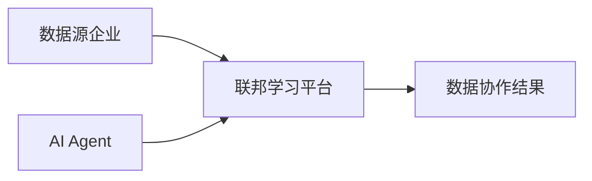
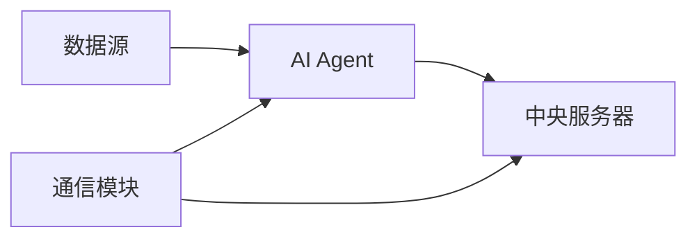

                 


# 企业AI Agent的联邦学习在跨企业数据协作中的实践

> 关键词：联邦学习，AI Agent，跨企业数据协作，数据隐私，分布式计算

> 摘要：本文系统地探讨了联邦学习在企业AI Agent跨企业数据协作中的实践应用，从理论基础到算法实现，再到实际案例分析，全面剖析了联邦学习在保护数据隐私的前提下，如何实现跨企业数据协作的技术细节和应用场景。文章通过详细的数学公式推导、系统架构设计和代码实现，深入解读了联邦学习的核心原理及其在企业级应用中的实践价值。

---

# 第一部分: 背景介绍与核心概念

## 第1章: 联邦学习与AI Agent概述

### 1.1 联邦学习的定义与背景

#### 1.1.1 联邦学习的定义  
联邦学习（Federated Learning，FL）是一种分布式机器学习技术，旨在在不集中收集原始数据的情况下，通过多个参与方协作训练共享的模型。其核心思想是“数据不动，模型动”，即数据保留在本地，仅交换模型参数或中间结果。

#### 1.1.2 联邦学习的背景与意义  
随着数据量的爆炸式增长，企业间数据孤岛问题日益严重。联邦学习通过在数据源端进行分布式模型训练，解决了数据隐私泄露和传输成本高的问题，同时实现了数据价值的共享。

#### 1.1.3 联邦学习的核心特点  
- **数据隐私保护**：数据无需离开本地，隐私泄露风险降低。  
- **分布式计算**：模型参数在分布式环境中同步更新。  
- **多方协作**：多个参与方共同参与模型训练，形成协同效应。  

### 1.2 AI Agent的定义与特点

#### 1.2.1 AI Agent的基本概念  
AI Agent（人工智能代理）是一种能够感知环境、自主决策并执行任务的智能体。它可以在分布式环境中与其他Agent协作，完成复杂的任务。

#### 1.2.2 AI Agent的核心能力  
- **感知能力**：通过传感器或数据接口获取环境信息。  
- **决策能力**：基于获取的信息进行推理和决策。  
- **执行能力**：根据决策执行具体操作。  

#### 1.2.3 AI Agent与传统算法的区别  
AI Agent具有主动性、目标性和社会性，能够自主决策并与其他Agent或系统交互，而传统算法通常是被动执行的静态程序。

### 1.3 跨企业数据协作的挑战与机遇

#### 1.3.1 聯合数据协作的背景  
企业间数据孤岛问题严重，数据无法共享导致资源浪费，联邦学习为跨企业数据协作提供了新的思路。

#### 1.3.2 数据孤岛问题的现状  
- 数据分散在不同企业，难以形成合力。  
- 数据隐私问题限制了数据共享。  
- 数据格式不统一，增加了协作难度。  

#### 1.3.3 联邦学习在跨企业协作中的作用  
联邦学习通过分布式模型训练，实现了跨企业数据协作，同时保护了数据隐私，为企业的数据价值挖掘提供了新途径。

## 第2章: 联邦学习的核心概念与联系

### 2.1 联邦学习的核心原理

#### 2.1.1 联邦学习的基本原理  
联邦学习通过在各个参与方本地进行模型训练，然后将模型参数汇总到中央服务器或协调节点，更新全局模型。整个过程无需交换原始数据，仅交换模型参数。

#### 2.1.2 联邦学习的通信机制  
- **同步联邦学习**：所有参与方同时更新模型，并将参数同步到中央服务器。  
- **异步联邦学习**：参与方按需更新模型，参数更新不同时，适合大规模分布式环境。  

#### 2.1.3 联邦学习的隐私保护机制  
- **差分隐私**：通过添加噪声保护数据隐私。  
- **同态加密**：在加密状态下进行模型训练，确保数据安全。  

### 2.2 AI Agent与联邦学习的关系

#### 2.2.1 AI Agent在联邦学习中的角色  
AI Agent可以作为联邦学习的参与者，负责本地数据的处理和模型训练，同时与其他Agent协作，共同更新全局模型。

#### 2.2.2 联邦学习如何赋能AI Agent  
联邦学习提供了分布式协作机制，使AI Agent能够更高效地进行跨域协作，提升决策能力和任务执行效率。

#### 2.2.3 联邦学习与AI Agent的协同工作模式  
AI Agent通过联邦学习平台进行协作，每个Agent负责本地数据的训练，然后通过通信协议将模型参数更新同步到全局模型中。

### 2.3 联邦学习的实体关系图



---

## 第3章: 联邦学习的算法原理

### 3.1 联邦学习的数学模型

#### 3.1.1 分布式优化问题  
$$ \min_{\theta} \sum_{i=1}^{n} f_i(\theta) $$  

#### 3.1.2 联邦平均算法(FedAvg)  
$$ \theta^{(t+1)} = \theta^{(t)} - \eta \sum_{i=1}^{n} \nabla f_i(\theta^{(t)}) $$  

### 3.2 联邦学习的实现流程

#### 3.2.1 初始化全局模型  
全局模型参数初始化为随机值或预训练模型参数。  

#### 3.2.2 分配数据到各参与方  
每个参与方本地数据被分发，准备进行局部训练。  

#### 3.2.3 局部模型训练  
每个参与方使用本地数据训练模型，更新局部模型参数。  

#### 3.2.4 模型参数汇总  
所有参与方将局部模型参数汇总到中央服务器，更新全局模型。  

#### 3.2.5 模型更新分发  
中央服务器将更新后的全局模型参数分发给所有参与方，进行下一轮训练。  

### 3.3 AI Agent的决策模型

#### 3.3.1 基于联邦学习的多智能体协作  
通过联邦学习平台，多个AI Agent协同训练，共同优化全局模型。  

#### 3.3.2 联邦学习中的参数同步机制  
通过通信协议，确保各个参与方的模型参数同步更新，避免数据不一致问题。  

#### 3.3.3 联邦学习的收敛性分析  
通过数学推导，证明联邦学习算法的收敛性，确保模型训练的有效性。  

---

## 第4章: 联邦学习的系统架构与实现

### 4.1 系统架构设计

#### 4.1.1 系统组成模块  
- **数据源模块**：数据生成和存储。  
- **AI Agent模块**：负责本地模型训练和参数更新。  
- **通信模块**：负责模型参数的传输和同步。  
- **中央服务器模块**：全局模型管理与分发。  

#### 4.1.2 系统架构图  



### 4.2 系统实现细节

#### 4.2.1 环境安装  
- **Python 3.8+**  
- **TensorFlow或PyTorch**  
- **Flask或FastAPI（用于通信模块）**  

#### 4.2.2 核心代码实现  

```python
import numpy as np
from tensorflow.keras import layers, models

# 初始化全局模型
def create_model(input_dim, output_dim):
    model = models.Sequential()
    model.add(layers.Dense(64, activation='relu', input_dim=input_dim))
    model.add(layers.Dense(output_dim, activation='sigmoid'))
    model.compile(optimizer='adam', loss='binary_crossentropy', metrics=['accuracy'])
    return model

# 联邦学习主循环
def federated_learning(agents, epochs):
    global_model = create_model(input_dim, output_dim)
    global_weights = global_model.get_weights()

    for epoch in range(epochs):
        # 分配模型参数到各个代理
        for agent in agents:
            agent.model.set_weights(global_weights)
        
        # 各个代理进行局部训练
        agent_weights = []
        for agent in agents:
            local_weights = agent.model.train()
            agent_weights.append(local_weights)
        
        # 汇总各个代理的权重，计算平均权重
        averaged_weights = average_weights(agent_weights)
        
        # 更新全局模型
        global_model.set_weights(averaged_weights)
        global_weights = global_model.get_weights()
```

---

## 第5章: 跨企业数据协作的实践案例

### 5.1 实际案例分析

#### 5.1.1 案例背景  
某行业内的多家企业希望通过联邦学习技术，共同训练一个客户画像模型，提升市场营销效率。  

#### 5.1.2 数据准备  
各企业分别提供本地客户数据，数据格式统一，但具体内容不共享。  

#### 5.1.3 模型训练  
通过联邦学习平台，各企业本地训练客户画像模型，然后将模型参数汇总，更新全局模型。  

#### 5.1.4 模型评估  
评估全局模型的准确率和性能，确保模型的有效性。  

### 5.2 实践中的挑战与解决方案

#### 5.2.1 数据异构性问题  
不同企业的数据格式可能不同，需要进行数据预处理和标准化。  

#### 5.2.2 模型收敛速度慢  
通过优化通信频率和参数更新策略，提高模型收敛速度。  

#### 5.2.3 安全性问题  
通过差分隐私和同态加密技术，确保模型训练过程中的数据安全。  

---

## 第6章: 总结与展望

### 6.1 核心总结

#### 6.1.1 联邦学习的核心价值  
通过分布式计算，实现跨企业数据协作，保护数据隐私，挖掘数据价值。  

#### 6.1.2 AI Agent在联邦学习中的作用  
AI Agent作为分布式协作的核心单元，推动了联邦学习的落地应用。  

### 6.2 未来展望

#### 6.2.1 联邦学习的技术演进  
未来，联邦学习将更加注重模型的实时性、高效性和安全性。  

#### 6.2.2 AI Agent的智能化升级  
AI Agent将更加智能化，具备自适应学习和自主决策能力。  

#### 6.2.3 跨企业协作的扩展应用  
联邦学习将在更多领域得到应用，如医疗、金融、制造等，推动企业数字化转型。  

---

作者：AI天才研究院/AI Genius Institute & 禅与计算机程序设计艺术 /Zen And The Art of Computer Programming

