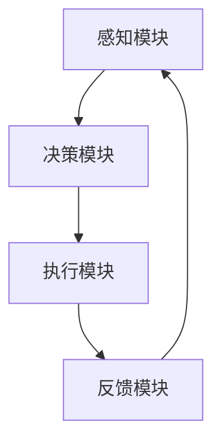

                 


# 企业AI Agent的联邦学习在跨部门数据协作中的实践与挑战

> 关键词：联邦学习、AI Agent、跨部门协作、数据隐私、企业级应用

> 摘要：本文探讨了企业AI Agent在联邦学习框架下的跨部门数据协作应用，分析了其在数据隐私保护、通信效率、模型收敛性等方面的挑战，并提出了相应的解决方案和最佳实践。通过具体案例和系统设计，展示了联邦学习与AI Agent结合的实际应用价值。

---

# 第1章 联邦学习与AI Agent的核心概念

## 1.1 联邦学习的定义与背景

### 1.1.1 数据孤岛问题的现状
在企业环境中，数据往往分散在不同的部门或系统中，形成“数据孤岛”。这种状况限制了数据的共享与利用，影响了企业的决策效率和创新能力。

### 1.1.2 联邦学习的定义与特点
联邦学习是一种分布式机器学习方法，允许多个机构在不共享原始数据的情况下，联合训练模型。其特点包括数据局部性、模型全局性、通信效率和隐私保护。

### 1.1.3 联邦学习与传统数据共享的区别
传统数据共享需要交换原始数据，存在隐私风险；而联邦学习通过加密通信和模型更新，保护数据隐私，同时实现模型协作。

## 1.2 AI Agent的基本概念

### 1.2.1 AI Agent的定义与分类
AI Agent是具有自主决策和执行能力的智能体，可以分为基于规则的、基于模型的和基于Q-learning的类型。

### 1.2.2 AI Agent的核心功能与应用场景
AI Agent通过感知环境、决策、执行和反馈，实现智能推荐、自动化运维、智能客服等应用场景。

### 1.2.3 AI Agent与传统AI的区别
AI Agent强调自主性和实时性，能够动态适应环境变化，而传统AI系统通常是静态的。

## 1.3 联邦学习与AI Agent的结合

### 1.3.1 联邦学习在AI Agent中的作用
联邦学习通过分布式模型训练，提升AI Agent的泛化能力，同时保护数据隐私。

### 1.3.2 AI Agent如何实现跨部门数据协作
AI Agent作为数据协作的接口，协调不同部门的数据共享和模型训练，确保数据安全和协作效率。

### 1.3.3 联邦学习与AI Agent的协同机制
通过通信协议和任务分配机制，AI Agent在各部门之间协调联邦学习过程，实现模型更新和任务执行。

---

# 第2章 联邦学习的数学模型与算法原理

## 2.1 联邦学习的数学模型

### 2.1.1 联邦学习的假设与约束
假设各参与方拥有本地数据集，通信仅限于模型参数更新，数据不可共享。

### 2.1.2 联邦优化的数学表达式
$$ \text{目标函数} = \sum_{i=1}^{n} f_i(w) + \lambda R(w) $$
其中，$f_i(w)$是第i个参与方的损失函数，$R(w)$是正则化项。

### 2.1.3 联邦学习的收敛性分析
通过优化算法，如随机梯度下降，各参与方同步更新模型参数，确保模型收敛。

## 2.2 联邦学习的算法流程

### 2.2.1 数据预处理与特征工程
对各参与方的数据进行清洗、特征提取和标准化处理。

### 2.2.2 联邦训练过程
1. 初始化全局模型参数。
2. 各参与方基于本地数据更新模型。
3. 将更新后的模型参数上传到中心服务器。
4. 服务器汇总参数，更新全局模型。

### 2.2.3 联邦学习的通信机制
采用同步或异步模式，通过加密通道进行模型参数更新。

---

# 第3章 AI Agent的系统架构与设计

## 3.1 AI Agent的系统架构

### 3.1.1 模块划分
AI Agent系统包括感知模块、决策模块、执行模块和反馈模块。

### 3.1.2 模块交互关系
感知模块收集数据，决策模块生成策略，执行模块执行任务，反馈模块提供反馈。

### 3.1.3 系统架构设计图


## 3.2 联邦学习在AI Agent中的实现

### 3.2.1 数据协作的通信协议
采用安全通信协议，如加密传输，确保数据协作的安全性。

### 3.2.2 联邦模型的训练与更新
AI Agent协调各参与方，同步模型更新，确保模型准确性。

### 3.2.3 数据协作的安全性保障
通过数据脱敏和同态加密技术，保护数据隐私。

---

# 第4章 联邦学习与AI Agent的项目实战

## 4.1 项目环境与工具安装

### 4.1.1 开发环境配置
安装Python、TensorFlow、Flask等工具。

### 4.1.2 联邦学习框架安装
安装Federated Learning框架，如FedML。

## 4.2 项目核心代码实现

### 4.2.1 数据预处理代码
```python
import pandas as pd
from sklearn.preprocessing import StandardScaler

data = pd.read_csv('local_data.csv')
scaler = StandardScaler()
data_scaled = scaler.fit_transform(data)
```

### 4.2.2 联邦训练代码
```python
def train_federated():
    model = create_model()
    for epoch in epochs:
        for party in parties:
            model_weights = model.get_weights()
            # 更新模型
            new_weights = party.train(model_weights)
            model.set_weights(new_weights)
    return model
```

## 4.3 案例分析与解读

### 4.3.1 案例背景
某企业希望利用跨部门数据进行客户画像构建，采用联邦学习进行模型训练。

### 4.3.2 数据协作实现
各部门通过AI Agent接口，共享特征工程后的数据，进行模型训练。

### 4.3.3 模型评估
评估模型准确率和鲁棒性，确保数据隐私保护。

---

# 第5章 联邦学习与AI Agent的挑战与解决方案

## 5.1 联邦学习的挑战

### 5.1.1 数据隐私问题
解决方法：采用同态加密和安全多方计算。

### 5.1.2 通信效率问题
优化通信协议，减少数据传输量。

## 5.2 AI Agent的实践挑战

### 5.2.1 跨部门协作复杂性
建立统一的数据协作标准，简化流程。

### 5.2.2 可解释性问题
通过可视化工具，提升模型的可解释性。

## 5.3 解决方案与最佳实践

### 5.3.1 数据隐私保护
使用区块链技术记录数据协作日志，确保透明性。

### 5.3.2 提高通信效率
优化算法，降低通信频率和数据量。

---

# 小结

企业AI Agent的联邦学习在跨部门数据协作中展现出巨大潜力，但也面临数据隐私、通信效率等挑战。通过技术创新和最佳实践，可以有效应对这些挑战，推动AI技术在企业中的广泛应用。

---

# 作者

作者：AI天才研究院（AI Genius Institute） & 禅与计算机程序设计艺术（Zen And The Art of Computer Programming）

