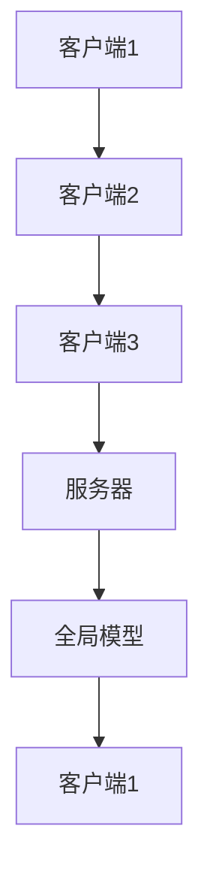

                 

# 《企业AI Agent的联邦学习平台设计》

> 关键词：联邦学习，AI Agent，分布式计算，数据隐私，机器学习

> 摘要：本文将详细探讨企业AI Agent的联邦学习平台设计，涵盖联邦学习的基本概念、算法原理、系统架构、实现方法以及实际应用案例。通过分析联邦学习的核心技术，结合AI Agent的特点，提出一种高效、安全的联邦学习平台设计方案。

---

# 第1章: 联邦学习平台的背景与概念

## 1.1 企业AI Agent的发展背景

### 1.1.1 企业智能化转型的需求

随着企业智能化转型的推进，AI Agent（人工智能代理）逐渐成为企业实现智能化决策和自动化操作的核心技术。AI Agent能够根据企业环境和目标，自主执行任务，优化资源配置，并与人类或其他系统进行交互。然而，AI Agent的高效运行依赖于大规模数据的共享与协同学习，这引出了联邦学习的概念。

### 1.1.2 AI Agent在企业中的角色与价值

AI Agent在企业中的主要角色包括：

1. **智能化决策支持**：通过分析企业内外部数据，提供决策建议。
2. **自动化任务执行**：自动完成重复性或低价值的任务。
3. **多系统协同**：作为桥梁，连接企业中的多个系统和数据源。
4. **实时反馈与优化**：基于实时数据不断优化自身行为。

### 1.1.3 联邦学习的定义与特点

联邦学习（Federated Learning）是一种分布式机器学习技术，允许多个参与方在不共享原始数据的情况下，共同训练一个全局模型。其特点包括：

- **数据隐私保护**：数据不出域，仅交换模型更新。
- **分布式计算**：计算资源分布于多个节点。
- **模型共享**：多个参与方共享模型参数，提升全局模型的性能。

---

## 1.2 联邦学习平台的核心概念

### 1.2.1 联邦学习的基本原理

联邦学习的核心原理是通过多个客户端（参与方）协作训练一个全局模型，同时保护各方的原始数据。训练过程中，客户端仅上传模型更新到服务器，而服务器将所有客户端的更新整合成一个全局模型，再将全局模型下发给客户端。

### 1.2.2 联邦学习与分布式学习的对比

| 对比维度         | 联邦学习                | 分布式学习            |
|------------------|------------------------|----------------------|
| 数据共享方式     | 不共享原始数据，仅共享模型更新 | 可能共享数据或模型    |
| 计算模式         | 分布式计算，模型参数聚合 | 分布式计算，数据并行  |
| 隐私保护         | 强调隐私保护            | 数据共享可能不严格    |

### 1.2.3 联邦学习平台的架构与功能

**联邦学习平台架构图**

联邦学习平台的主要功能包括：

- **数据管理**：管理各个客户端的数据，确保数据隐私。
- **模型训练**：协调客户端进行模型训练，聚合模型更新。
- **通信机制**：定义客户端与服务器之间的通信协议。
- **安全性保障**：防止数据泄露和模型攻击。

---

## 1.3 企业AI Agent与联邦学习的结合

### 1.3.1 AI Agent的定义与功能

AI Agent是一种智能体，能够感知环境、自主决策并执行任务。在企业中，AI Agent可以用于：

- **客户关系管理**：通过分析客户行为提供个性化服务。
- **供应链优化**：协调供应商和物流资源。
- **智能监控**：实时监控企业运行状态，发现异常并报警。

### 1.3.2 联邦学习在AI Agent中的应用

通过联邦学习，企业AI Agent可以在不共享原始数据的情况下，协同多个部门或系统的数据，提升模型的泛化能力和准确性。

### 1.3.3 企业级联邦学习平台的优势

- **数据隐私保护**：企业内部数据不出域，符合数据安全法规。
- **模型性能提升**：通过多个部门的数据协同训练，模型更具鲁棒性。
- **灵活性与扩展性**：支持多种AI Agent应用场景。

---

## 1.4 本章小结

本章从企业AI Agent的发展背景出发，介绍了联邦学习的核心概念和技术特点，分析了联邦学习在企业AI Agent中的应用价值。通过对比联邦学习与传统分布式学习的差异，明确了联邦学习平台在企业中的重要性。

---

接下来是第2章: 联邦学习的核心概念与技术背景

---

**注意：以上为目录大纲的第一章内容，完整文章将按照此大纲展开，涵盖算法原理、系统架构设计、项目实战等内容。**

