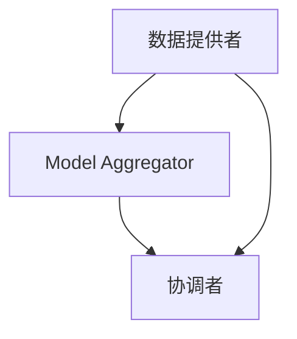

                 


# 企业AI Agent的联邦学习隐私保护机制

> **关键词**：联邦学习、隐私保护、AI Agent、数据安全、企业应用、同态加密、差分隐私  
> **摘要**：本文探讨企业AI Agent在联邦学习中的隐私保护机制，分析核心概念、算法原理、系统架构和实现案例，提供详细的技术解析和实践指导。

---

## 第1章：联邦学习与隐私保护背景

### 1.1 联邦学习的基本概念

联邦学习（Federated Learning）是一种分布式机器学习技术，允许多个参与方在不共享原始数据的情况下，协作训练模型。核心在于数据不出域，仅交换模型参数，保护数据隐私。

### 1.2 隐私保护的重要性

数据隐私是企业的生命线。联邦学习通过局部建模和参数交换，避免数据集中，降低隐私泄露风险。企业AI Agent需平衡模型性能与隐私保护。

### 1.3 企业AI Agent的应用场景

企业AI Agent通过联邦学习，在医疗、金融、推荐系统等领域协同训练模型，同时保护数据隐私。应用场景包括：

- **医疗领域**：患者数据分散在不同机构，AI Agent协作训练疾病预测模型。
- **金融领域**：多个金融机构联合训练反欺诈模型。
- **推荐系统**：跨平台用户行为数据建模，提升推荐精度。

---

## 第2章：联邦学习的核心机制

### 2.1 联邦学习的参与者

- **数据提供者**：拥有数据的参与方，如企业或机构。
- **模型 aggregator**：协调模型训练，聚合参数。
- **协调者**：负责通信、同步，确保流程。

### 2.2 数据安全与隐私保护机制

- **数据加密**：使用同态加密或秘密分享，确保数据可用性。
- **差分隐私**：在数据中加入噪声，保护个体隐私。
- **安全多方计算**：多方协作计算，避免数据泄露。

---

## 第3章：企业AI Agent的联邦学习框架

### 3.1 AI Agent在联邦学习中的角色

AI Agent作为智能代理，负责本地数据建模、参数更新，并与aggregator交互，协调模型训练。

### 3.2 数据协作协议

AI Agent间通过安全通信协议交换模型参数，确保数据隐私。通信方式包括：

- **基于HTTPS的加密通信**：防止数据篡改。
- **区块链技术**：记录交易，确保透明性和不可篡改性。

### 3.3 隐私保护机制

- **同态加密**：支持在密文上执行计算，保护数据隐私。
- **差分隐私**：通过添加噪声，确保模型训练的隐私性。

---

## 第4章：隐私保护技术

### 4.1 同态加密

- **概念**：允许在加密数据上进行计算，结果仍为加密形式。
- **应用**：保护数据隐私，同时支持模型训练。

### 4.2 差分隐私

- **概念**：通过添加噪声，确保数据查询结果无法推断单个样本。
- **应用**：保护个体隐私，适用于数据发布和分析。

### 4.3 安多方计算

- **概念**：多方协作计算，确保数据隐私。
- **应用**：联合建模，保护各方数据安全。

---

## 第5章：算法原理与数学模型

### 5.1 联邦平均算法（FedAvg）

#### 5.1.1 算法流程

1. **初始化**：aggregator初始化全局模型参数。
2. **本地训练**：各数据提供者在本地数据上训练模型，更新参数。
3. **参数上传**：数据提供者将模型参数上传到aggregator。
4. **参数聚合**：aggregator聚合各参数，更新全局模型。
5. **迭代优化**：重复训练和聚合，直到模型收敛。

#### 5.1.2 数学模型

全局模型更新公式：

$$
\theta_{\text{new}} = \sum_{i=1}^{n} w_i \theta_i
$$

其中，$\theta_i$为第i个数据提供者的模型参数，$w_i$为权重。

#### 5.1.3 代码实现示例

```python
def fed_avg(global_model, local_models, weights):
    for param, local_param, weight in zip(global_model.parameters(),
                                        [local.parameters() for local in local_models],
                                        weights):
        param.data = (torch.sum(torch.tensor([local_param[i].data * weight[i] for i in range(len(weight))]), dim=0)).data
```

### 5.2 隐私保护机制的数学模型

#### 5.2.1 同态加密的数学基础

加密函数：

$$
E(x) = x + \text{noise}
$$

解密函数：

$$
D(E(x)) = x
$$

#### 5.2.2 差分隐私的数学公式

差分隐私定义：

$$
\Pr[P(E(D) \in S)] \leq \Pr[P(E(D+\epsilon) \in S)] + \delta
$$

其中，$\epsilon$为隐私预算，$\delta$为隐私泄露概率。

---

## 第6章：系统设计与架构

### 6.1 系统架构设计

- **功能模块**：
  - 数据提供者模块：本地数据建模。
  - Model Aggregator：全局模型聚合。
  - 协调者模块：通信协调。

- **架构图**



### 6.2 通信协议设计

- **协议流程**：
  1. 数据提供者发送模型参数到aggregator。
  2. aggregator聚合参数，返回全局模型。
  3. 协调者监控进度，确保安全。

- **通信安全**：
  - 使用HTTPS加密通信。
  - 应用区块链技术记录交易日志。

---

## 第7章：项目实战与最佳实践

### 7.1 项目实战

#### 7.1.1 环境安装

安装依赖：

```bash
pip install torch numpy matplotlib
```

#### 7.1.2 核心代码实现

```python
import torch
import torch.nn as nn
import torch.optim as optim

class Model(nn.Module):
    def __init__(self):
        super(Model, self).__init__()
        self.fc1 = nn.Linear(10, 5)
        self.fc2 = nn.Linear(5, 1)

    def forward(self, x):
        x = self.fc1(x)
        x = self.fc2(x)
        return x

def train(model, optimizer, data):
    for epoch in range(10):
        optimizer.zero_grad()
        outputs = model(data)
        loss = nn.MSELoss()(outputs, data[:, -1])
        loss.backward()
        optimizer.step()

def fed_train(global_model, local_models, data):
    for param, local_model, data in zip(global_model.parameters(),
                                        local_models,
                                        data):
        train(local_model, optim.SGD(local_model.parameters(), lr=0.1), data)
```

### 7.2 最佳实践与注意事项

- **数据预处理**：确保数据匿名化。
- **模型评估**：定期验证模型性能。
- **通信安全**：加密通信，防止数据篡改。
- **隐私预算**：合理设置$\epsilon$，平衡隐私与性能。

---

## 结语

企业AI Agent的联邦学习隐私保护机制通过联邦学习实现数据协作，保护隐私，提升模型性能。本文详细探讨了核心概念、算法原理、系统设计和项目实战，为企业应用提供了指导。

---

## 作者

**作者：AI天才研究院（AI Genius Institute） & 禅与计算机程序设计艺术（Zen And The Art of Computer Programming）**

