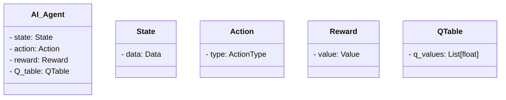
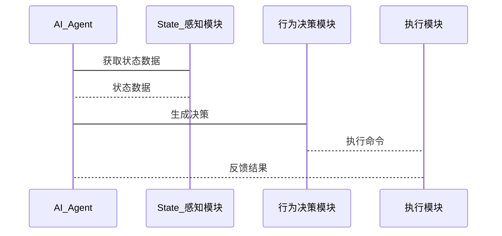

                 


# 企业AI Agent的自动化运维与故障预测

> 关键词：AI Agent，自动化运维，故障预测，强化学习，监督学习，系统架构

> 摘要：本文深入探讨了企业AI Agent在自动化运维与故障预测中的应用。从基本概念到核心原理，从系统架构到项目实战，结合强化学习与监督学习算法，详细讲解了AI Agent在企业运维中的技术实现与应用价值。

---

# 第1章: 企业AI Agent概述

## 1.1 AI Agent的基本概念

### 1.1.1 AI Agent的定义

AI Agent（人工智能代理）是指能够感知环境、自主决策并执行任务的智能实体。在企业运维中，AI Agent通常用于自动化操作、故障预测和问题解决。

### 1.1.2 AI Agent的核心特征

- **自主性**：能够在没有人工干预的情况下执行任务。
- **反应性**：能够实时感知环境变化并做出响应。
- **学习能力**：通过数据和经验不断优化自身的决策能力。
- **协作性**：能够与其他系统或AI Agent协同工作。

### 1.1.3 企业级AI Agent的应用场景

- **自动化运维**：自动执行系统监控、日志分析、故障修复等任务。
- **故障预测**：通过历史数据和实时监控，预测系统可能出现的故障。
- **智能决策支持**：为运维人员提供基于数据的决策支持。

## 1.2 企业AI Agent的背景与问题背景

### 1.2.1 传统企业运维的痛点

- **效率低下**：依赖人工操作，效率低且容易出错。
- **响应延迟**：故障发现和处理时间较长。
- **缺乏智能化**：缺乏对复杂问题的自主分析和决策能力。

### 1.2.2 AI技术在企业运维中的应用价值

- **提高效率**：通过自动化减少人工干预，提高运维效率。
- **实时响应**：快速发现并解决问题，降低响应延迟。
- **智能化决策**：利用AI技术分析复杂问题，提供最优解决方案。

### 1.2.3 AI Agent在企业运维中的定位

AI Agent是企业运维智能化的核心工具，能够实现从被动响应到主动预测的转变。

## 1.3 企业AI Agent的应用价值

### 1.3.1 提高运维效率

通过自动化操作和智能决策，显著减少人工干预，提高运维效率。

### 1.3.2 减少人为错误

AI Agent能够避免人为操作失误，确保运维过程的准确性。

### 1.3.3 实现自动化运维与故障预测

通过AI Agent的实时监控和学习能力，实现系统故障的早期预测和自动修复。

## 1.4 本章小结

本章介绍了AI Agent的基本概念、核心特征及其在企业运维中的应用场景，分析了AI Agent在企业运维中的重要价值。

---

# 第2章: AI Agent的核心概念与原理

## 2.1 AI Agent的核心概念

### 2.1.1 知识表示

知识表示是AI Agent理解问题和环境的基础，通常采用符号逻辑、概率推理或知识图谱等方法。

### 2.1.2 行为决策

行为决策是AI Agent的核心功能，基于当前状态和目标，选择最优行动方案。

### 2.1.3 状态感知

状态感知是AI Agent通过传感器或数据源获取环境信息的能力，是实现自主决策的前提。

## 2.2 AI Agent的工作原理

### 2.2.1 信息感知与数据采集

AI Agent通过传感器、日志文件或其他数据源获取环境信息。

### 2.2.2 知识表示与推理

将感知到的信息转化为知识表示，并通过推理引擎进行逻辑推理。

### 2.2.3 行为决策与执行

基于推理结果，生成行动方案并执行。

## 2.3 AI Agent的核心要素对比

### 2.3.1 核心要素属性对比表

| 核心要素 | 特征 |
|----------|------|
| 知识表示 | 符号化表示、知识图谱 |
| 行为决策 | 基于推理的决策、强化学习 |
| 状态感知 | 实时数据采集、传感器数据 |

### 2.3.2 ER实体关系图

```mermaid
er
actor: AI Agent
mode: 行为决策
event: 状态感知
action: 行为执行
```

---

# 第3章: AI Agent的算法原理

## 3.1 基于强化学习的AI Agent算法

### 3.1.1 强化学习的基本原理

强化学习是一种通过试错机制优化决策策略的方法，AI Agent通过与环境交互获得奖励，逐步优化行动策略。

### 3.1.2 AI Agent的强化学习模型

#### 算法实现步骤

1. 初始化环境和状态。
2. 选择行动并执行。
3. 获取奖励并更新策略。
4. 重复步骤1-3直到目标达成。

### 3.1.3 算法实现代码示例

```python
import numpy as np

class AI_Agent:
    def __init__(self, state_space, action_space):
        self.state_space = state_space
        self.action_space = action_space
        self.Q = np.zeros((state_space, action_space))

    def choose_action(self, state):
        return np.argmax(self.Q[state, :])

    def update_Q(self, state, action, reward):
        self.Q[state, action] += reward

# 示例用法
agent = AI_Agent(5, 3)
agent.choose_action(0)
agent.update_Q(0, 1, 1)
```

### 3.1.4 强化学习的数学模型

$$ Q(s,a) = Q(s,a) + \alpha (r + \gamma Q(s',a') - Q(s,a)) $$

其中：
- \( Q(s,a) \)：状态-行动值函数。
- \( \alpha \)：学习率。
- \( r \)：奖励。
- \( \gamma \)：折扣因子。
- \( s' \)：下一状态。

## 3.2 基于监督学习的AI Agent算法

### 3.2.1 监督学习的基本原理

监督学习是一种基于标注数据进行模式识别和分类的方法，AI Agent可以通过监督学习模型进行状态分类和预测。

### 3.2.2 AI Agent的监督学习模型

#### 算法实现步骤

1. 数据预处理和特征提取。
2. 训练监督学习模型。
3. 使用模型进行预测和分类。

### 3.2.3 算法实现代码示例

```python
from sklearn.tree import DecisionTreeClassifier

# 示例数据
X = [[1, 1], [2, 2], [3, 3], [4, 4]]
y = [0, 1, 2, 3]

# 训练模型
model = DecisionTreeClassifier()
model.fit(X, y)

# 预测
model.predict([[5,5]])
```

---

# 第4章: 系统分析与架构设计

## 4.1 问题场景介绍

### 4.1.1 企业运维中的常见问题

- 系统故障频发。
- 运维效率低下。
- 人工操作失误率高。

### 4.1.2 AI Agent的应用目标

- 实现系统故障的早期预测。
- 提供自动化运维解决方案。
- 降低人工操作失误率。

## 4.2 系统功能设计

### 4.2.1 领域模型设计



## 4.3 系统架构设计

### 4.3.1 系统架构设计


## 4.4 系统接口设计

### 4.4.1 系统接口设计说明

- **输入接口**：接收系统状态数据和用户指令。
- **输出接口**：输出决策结果和执行命令。
- **学习接口**：接收奖励信号并更新模型。

## 4.5 系统交互设计

### 4.5.1 系统交互流程



---

# 第5章: 项目实战

## 5.1 环境安装与配置

### 5.1.1 开发环境搭建

- 操作系统：Linux（推荐Ubuntu）
- 开发工具：Python、Jupyter Notebook、Git
- 依赖库安装：`pip install numpy scikit-learn`

### 5.1.2 依赖库安装

```bash
pip install numpy scikit-learn
```

## 5.2 系统核心实现

### 5.2.1 AI Agent核心代码实现

#### 强化学习代码实现

```python
import numpy as np

class AI_Agent:
    def __init__(self, state_space, action_space):
        self.state_space = state_space
        self.action_space = action_space
        self.Q = np.zeros((state_space, action_space))

    def choose_action(self, state):
        return np.argmax(self.Q[state, :])

    def update_Q(self, state, action, reward):
        self.Q[state, action] += reward

# 示例用法
agent = AI_Agent(5, 3)
agent.choose_action(0)
agent.update_Q(0, 1, 1)
```

---

**作者：AI天才研究院/AI Genius Institute & 禅与计算机程序设计艺术 /Zen And The Art of Computer Programming**

