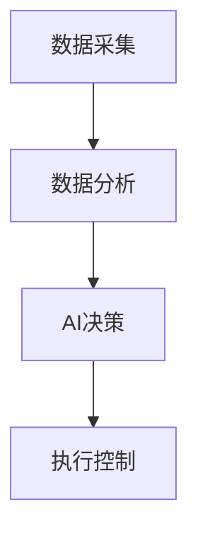
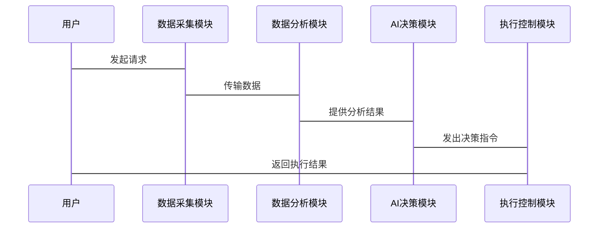

                 


# 企业AI Agent的自动化运维系统

## 关键词：企业AI Agent, 自动化运维, 人工智能, 系统架构, 算法原理, 运维管理

## 摘要：  
随着企业信息化和自动化的深入推进，AI Agent在运维管理中的应用日益广泛。本文系统地介绍了企业AI Agent的背景、核心概念、算法原理、系统架构与设计，以及项目实战案例，详细阐述了AI Agent在企业运维中的价值与实现路径。

---

# 第1章: 企业AI Agent的背景与概念

## 1.1 企业运维的现状与挑战

### 1.1.1 传统企业运维的痛点
- **人工依赖强**：传统运维高度依赖人工操作，效率低且容易出错。
- **响应速度慢**：面对突发事件，人工运维难以快速响应。
- **成本高**：需要大量运维人员，且运维工具碎片化，成本居高不下。

### 1.1.2 运维自动化的需求
- **自动化监控**：实时监控系统状态，自动发现和解决问题。
- **智能决策**：利用AI技术实现自主决策，减少人为干预。
- **快速迭代**：支持快速部署和迭代，适应业务快速变化。

### 1.1.3 AI Agent在运维中的应用价值
- **提升效率**：通过自动化和智能化，大幅提高运维效率。
- **降低风险**：减少人为错误，确保系统稳定运行。
- **降低成本**：优化资源利用，降低运维成本。

## 1.2 AI Agent的核心概念

### 1.2.1 AI Agent的定义
AI Agent是一种能够感知环境、自主决策并执行任务的智能体，具备学习、推理和自适应能力。

### 1.2.2 AI Agent的基本特征
| 特征 | 描述 |
|------|------|
| 感知能力 | 能够感知环境状态，获取相关信息。 |
| 决策能力 | 基于感知信息，做出最优决策。 |
| 执行能力 | 执行决策任务，完成目标。 |
| 自适应能力 | 根据反馈不断优化行为策略。 |

### 1.2.3 企业AI Agent的边界与外延
- **边界**：AI Agent仅处理可编程的任务，不涉及企业的核心业务逻辑。
- **外延**：AI Agent可以与企业其他系统（如CRM、ERP）集成，扩展应用场景。

## 1.3 企业AI Agent与传统运维的对比

### 1.3.1 运维模式的演变
| 模式 | 特点 |
|------|------|
| 手工运维 | 依赖人工操作，效率低。 |
| 工具化运维 | 使用脚本或工具，半自动化。 |
| 智能化运维 | 基于AI的自主决策，高度自动化。 |

### 1.3.2 AI Agent的优势与劣势
- **优势**：
  - 高效性：快速响应，减少人工干预。
  - 准确性：基于数据和模型，决策更精准。
- **劣势**：
  - 黑箱问题：AI决策的可解释性较弱。
  - 依赖数据：需要大量高质量的数据支持。

### 1.3.3 适用场景与限制
- **适用场景**：日志分析、系统监控、故障修复、资源调度。
- **限制**：适用于规则明确、可量化的任务，不适合需要创造性决策的任务。

## 1.4 本章小结
本章介绍了企业AI Agent的背景、核心概念及其与传统运维的对比，为后续章节奠定了基础。

---

# 第2章: AI Agent的核心原理

## 2.1 AI Agent的基本原理

### 2.1.1 感知层原理
- **数据采集**：通过日志、指标等数据源感知系统状态。
- **特征提取**：将原始数据转换为可分析的特征向量。

### 2.1.2 决策层原理
- **策略选择**：基于特征向量，选择最优行动策略。
- **风险评估**：评估不同策略的风险和收益。

### 2.1.3 执行层原理
- **任务执行**：根据决策结果，执行具体任务。
- **反馈收集**：收集执行结果，用于后续优化。

## 2.2 AI Agent的算法原理

### 2.2.1 基于强化学习的AI Agent算法
- **Q-learning算法**：
  - **定义**：通过试错学习，找到最优策略。
  - **公式**：$$ Q(s, a) = r + \gamma \max_{a'} Q(s', a') $$
  - **流程图**：
    ```mermaid
    graph LR
        A[状态s] --> B[动作a]
        B --> C[奖励r]
        C --> D[新状态s']
    ```

### 2.2.2 基于监督学习的AI Agent算法
- **线性回归模型**：
  - **公式**：$$ y = \theta^T x + b $$
  - **应用**：预测系统资源消耗，优化资源配置。

### 2.2.3 基于无监督学习的AI Agent算法
- **聚类算法**：
  - **公式**：$$ distance(x_i, x_j) = \sqrt{(x_i - x_j)^2} $$
  - **应用**：异常检测，识别系统中的异常行为。

## 2.3 AI Agent的数学模型与公式

### 2.3.1 强化学习模型
- **Q-learning**：
  - $$ Q(s, a) = r + \gamma \max_{a'} Q(s', a') $$
  - 其中，$\gamma$ 是折扣因子，$r$ 是奖励值。

### 2.3.2 监督学习模型
- **线性回归**：
  - $$ y = \theta^T x + b $$
  - 其中，$\theta$ 是参数，$x$ 是输入特征，$b$ 是偏置项。

### 2.3.3 无监督学习模型
- **K-means聚类**：
  - $$ distance(x_i, x_j) = \sqrt{(x_i - x_j)^2} $$
  - 计算数据点之间的距离，用于聚类分析。

## 2.4 本章小结
本章详细讲解了AI Agent的核心原理，包括感知层、决策层和执行层的原理，以及三种主要的AI算法及其数学模型。

---

# 第3章: 企业AI Agent的系统架构与设计

## 3.1 系统功能模块设计

### 3.1.1 数据采集模块
- **功能**：采集系统日志、性能指标等数据。
- **工具**：Prometheus、ELK。

### 3.1.2 数据分析模块
- **功能**：对数据进行清洗、分析和建模。
- **工具**：Python（Pandas、Scikit-learn）。

### 3.1.3 AI决策模块
- **功能**：基于分析结果，生成决策。
- **工具**：TensorFlow、PyTorch。

### 3.1.4 执行控制模块
- **功能**：执行决策任务。
- **工具**：Ansible、SaltStack。

## 3.2 系统架构图


## 3.3 系统接口设计

### 3.3.1 数据接口
- **输入**：系统日志、性能指标。
- **输出**：处理后的数据。

### 3.3.2 AI模型接口
- **输入**：特征向量。
- **输出**：决策结果。

### 3.3.3 执行接口
- **输入**：决策指令。
- **输出**：执行结果。

## 3.4 系统交互流程图


## 3.5 本章小结
本章详细设计了企业AI Agent的系统架构，包括功能模块、架构图和接口设计。

---

# 第4章: 项目实战——企业AI Agent的实现

## 4.1 环境安装与配置

### 4.1.1 安装Python
- **命令**：`python --version`
- **依赖**：Pandas、Scikit-learn、TensorFlow。

### 4.1.2 安装监控工具
- **命令**：`pip install prometheus-client`

## 4.2 核心代码实现

### 4.2.1 数据采集模块
```python
import prometheus_client
from prometheus_client import generate_latest

def get_metrics():
    metrics = generate_latest()
    return metrics
```

### 4.2.2 数据分析模块
```python
import pandas as pd
from sklearn.model_selection import train_test_split

data = pd.read_csv('data.csv')
X_train, X_test, y_train, y_test = train_test_split(data.drop('label', axis=1), data['label'])
```

### 4.2.3 AI决策模块
```python
import tensorflow as tf
from tensorflow.keras import layers

model = tf.keras.Sequential([
    layers.Dense(64, activation='relu'),
    layers.Dense(1, activation='sigmoid')
])
model.compile(optimizer='adam', loss='binary_crossentropy')
model.fit(X_train, y_train, epochs=10)
```

### 4.2.4 执行控制模块
```python
import subprocess

def execute_command(command):
    subprocess.run(command, shell=True, check=True)
```

## 4.3 实际案例分析

### 4.3.1 日志分析案例
- **目标**：识别服务器异常。
- **步骤**：
  1. 采集日志数据。
  2. 分析异常模式。
  3. 自动生成修复指令。

### 4.3.2 资源调度案例
- **目标**：优化服务器资源分配。
- **步骤**：
  1. 监控资源使用情况。
  2. 预测资源需求。
  3. 自动调整资源分配。

## 4.4 本章小结
本章通过实际案例，详细讲解了企业AI Agent的实现过程，包括环境配置、代码实现和案例分析。

---

# 第5章: 总结与展望

## 5.1 本章小结
- **总结**：企业AI Agent通过自动化和智能化，显著提升了运维效率和稳定性。
- **展望**：未来，AI Agent将在更多领域发挥重要作用，如边缘计算、智能客服等。

## 5.2 最佳实践Tips
- **数据质量**：确保数据的完整性和准确性。
- **模型优化**：定期更新模型，适应环境变化。
- **可解释性**：提高AI决策的透明度，便于问题排查。

## 5.3 注意事项
- **数据隐私**：确保数据安全，遵守相关法律法规。
- **系统容错**：设计容错机制，避免单点故障。

## 5.4 拓展阅读
- **推荐书籍**：《机器学习实战》、《深度学习》。
- **推荐博客**：AI领域技术博客推荐。

---

# 作者：AI天才研究院 & 禅与计算机程序设计艺术

---

**本文遵循知识共享署名-非商业性使用-相同方式共享 4.0 国际许可协议（[CC BY-NC-SA 4.0](https://creativecommons.org/licenses/by-nc-sa/4.0/)），转载请注明出处。**

