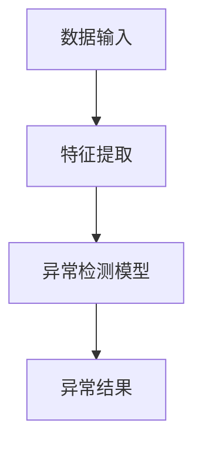
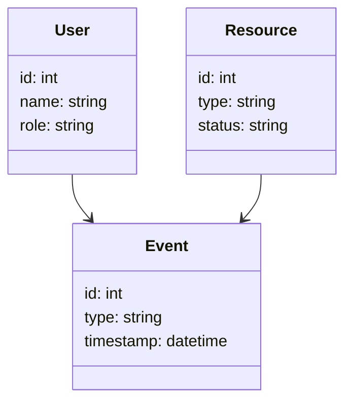
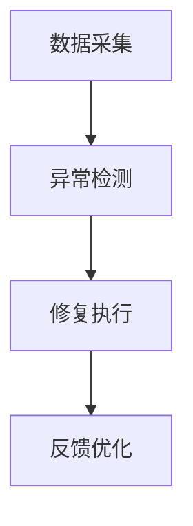
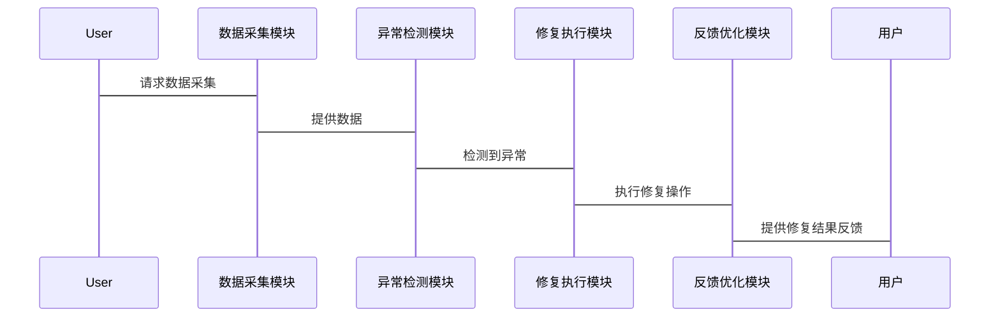

                 


# 企业AI Agent的自我诊断与修复能力

> 关键词：企业AI Agent，自我诊断，修复能力，异常检测，自适应修复，强化学习

> 摘要：本文详细探讨了企业AI Agent的自我诊断与修复能力，从核心概念、算法原理、系统架构到项目实战，全面解析了该能力在企业中的应用与实现。通过理论与实践相结合的方式，本文为读者提供了一套系统化的解决方案，帮助企业在复杂环境中实现智能化运维与问题自愈。

---

# 第一部分: 企业AI Agent的自我诊断与修复能力概述

# 第1章: 企业AI Agent的自我诊断与修复能力概述

## 1.1 什么是企业AI Agent

### 1.1.1 企业AI Agent的定义
企业AI Agent（Artificial Intelligence Agent）是一种能够感知环境、理解任务并采取行动以实现目标的智能实体。它通常以软件或服务的形式存在，具备自主决策、问题解决和持续优化的能力。

**关键特征：**
- **自主性**：无需人工干预，自主完成任务。
- **智能性**：基于数据和模型进行决策。
- **适应性**：能够根据环境变化调整行为。

### 1.1.2 企业AI Agent的核心功能
企业AI Agent的核心功能包括：
1. **数据收集与分析**：实时收集环境数据并进行分析。
2. **任务执行**：根据分析结果采取行动。
3. **自我诊断与修复**：检测自身问题并进行修复。

### 1.1.3 企业AI Agent的分类与特点
企业AI Agent可以根据功能、部署环境和应用领域进行分类：
- **按功能分类**：监控型、决策型、执行型。
- **按部署环境分类**：云端、边缘端、本地端。
- **按应用领域分类**：运维、客服、供应链等。

## 1.2 自我诊断与修复能力的背景与意义

### 1.2.1 企业AI Agent面临的挑战
企业AI Agent在运行过程中可能会面临以下挑战：
1. **环境复杂性**：企业环境复杂多变，可能导致系统故障。
2. **数据噪声**：数据中可能存在大量噪声，影响诊断准确性。
3. **修复不确定性**：修复过程可能涉及多种不确定性因素。

### 1.2.2 自我诊断与修复能力的重要性
自我诊断与修复能力是企业AI Agent的核心能力，能够：
1. **提高系统可靠性**：通过自主检测和修复问题，减少人工干预。
2. **降低运维成本**：自动化处理问题，降低运维人员的工作量。
3. **提升用户体验**：快速解决问题，提升用户满意度。

### 1.2.3 该能力在企业中的应用前景
随着企业数字化转型的加速，AI Agent的自我诊断与修复能力将在以下几个方面发挥重要作用：
1. **智能运维**：自动化监控和修复系统故障。
2. **实时响应**：快速应对环境变化，确保系统稳定运行。
3. **持续优化**：通过自我学习和优化，提升系统性能。

## 1.3 本章小结
本章从企业AI Agent的定义、核心功能和分类入手，详细分析了自我诊断与修复能力的背景和意义，并展望了其在企业中的应用前景。

---

# 第二部分: 企业AI Agent的自我诊断与修复能力的核心概念

# 第2章: 企业AI Agent的自我诊断机制

## 2.1 自我诊断的核心原理

### 2.1.1 异常检测算法
异常检测是自我诊断的核心技术之一。常用的算法包括：
1. **基于统计的方法**：如均值-标准差法、孤立森林。
2. **基于机器学习的方法**：如支持向量机（SVM）、随机森林、神经网络。
3. **基于时间序列分析的方法**：如ARIMA、LSTM。

**异常检测流程图：**


### 2.1.2 状态监控与分析
状态监控是通过实时采集系统状态数据，利用模型分析系统健康状况。常见的状态监控指标包括CPU使用率、内存占用、磁盘I/O等。

### 2.1.3 自我诊断的触发条件
自我诊断的触发条件通常包括：
- **阈值触发**：当某指标超过预设阈值时触发诊断。
- **模式触发**：当检测到特定模式或序列时触发诊断。
- **时间触发**：定期执行诊断任务。

## 2.2 自我诊断与修复能力的实现方式

### 2.2.1 基于规则的诊断
基于规则的诊断是通过预定义的规则集来检测和修复问题。例如，当CPU使用率超过80%，触发资源扩展。

### 2.2.2 基于机器学习的诊断
基于机器学习的诊断通过训练模型来识别异常模式。例如，使用随机森林模型进行故障分类。

### 2.2.3 基于知识图谱的诊断
基于知识图谱的诊断利用知识图谱中的关联关系进行推理。例如，当检测到多个相关异常时，通过知识图谱推理出根本原因。

## 2.3 诊断结果的评估与反馈

### 2.3.1 诊断结果的准确性评估
诊断结果的准确性评估可以通过以下指标进行：
- **精确率（Precision）**：正确诊断的异常数占所有诊断异常数的比例。
- **召回率（Recall）**：正确诊断的异常数占实际存在的异常数的比例。
- **F1分数（F1 Score）**：精确率和召回率的调和平均数。

### 2.3.2 反馈机制的设计
反馈机制的设计包括：
- **日志记录**：记录每次诊断的结果和修复操作。
- **模型优化**：根据反馈结果优化诊断模型。
- **用户通知**：通过邮件或短信通知相关人员。

### 2.3.3 诊断结果的可视化展示
诊断结果可以通过以下方式可视化：
- **仪表盘**：实时显示系统状态和诊断结果。
- **图表**：用折线图、柱状图等展示异常趋势。
- **告警界面**：显示当前告警信息和修复建议。

## 2.4 本章小结
本章详细探讨了企业AI Agent的自我诊断机制，包括异常检测算法、状态监控与分析、诊断触发条件，以及诊断结果的评估与反馈。

---

# 第3章: 自我修复能力的实现原理

## 3.1 自我修复的核心算法

### 3.1.1 自适应修复算法
自适应修复算法是一种动态调整修复策略的算法。例如，当检测到网络延迟增加时，自动调整负载均衡策略。

### 3.1.2 基于强化学习的修复
基于强化学习的修复通过训练强化学习模型来选择最优的修复动作。例如，使用Q-learning算法进行修复决策。

### 3.1.3 基于反馈的修复
基于反馈的修复通过实时反馈修复效果来调整修复策略。例如，根据修复后的系统性能反馈调整修复参数。

## 3.2 自我修复的实现步骤

### 3.2.1 问题识别与定位
问题识别与定位是修复的前提，通常包括：
- **异常检测**：通过异常检测算法发现系统故障。
- **故障定位**：通过日志分析和调用链追踪确定故障位置。

### 3.2.2 修复方案的生成
修复方案的生成可以通过以下方式实现：
- **规则匹配**：根据预定义的规则生成修复方案。
- **模型推理**：通过机器学习模型推理出修复方案。
- **知识图谱推理**：利用知识图谱推理出修复方案。

### 3.2.3 修复方案的执行与验证
修复方案的执行与验证包括：
- **修复执行**：将修复方案转化为具体操作。
- **修复验证**：通过监控系统状态验证修复效果。

## 3.3 自我修复能力的优化策略

### 3.3.1 基于经验的修复优化
基于经验的修复优化是通过积累历史修复经验来优化修复策略。例如，记录每次修复的操作和效果，用于后续的优化。

### 3.3.2 基于数据的修复优化
基于数据的修复优化是通过分析历史数据来优化修复策略。例如，分析故障发生的频率和模式，优化异常检测阈值。

### 3.3.3 基于模型的修复优化
基于模型的修复优化是通过优化诊断模型来提升修复效果。例如，使用深度学习模型优化异常检测的准确性。

## 3.4 本章小结
本章详细探讨了企业AI Agent的自我修复能力，包括核心算法、实现步骤和优化策略。

---

# 第三部分: 企业AI Agent的自我诊断与修复能力的系统架构设计

# 第4章: 企业AI Agent的系统架构设计

## 4.1 系统功能设计

### 4.1.1 领域模型设计
领域模型设计是系统功能设计的基础，通常包括以下实体：
- **用户**：系统用户，具有不同的角色和权限。
- **资源**：系统资源，如服务器、数据库等。
- **事件**：系统中的各种事件，如异常告警、修复操作等。

**领域模型类图：**


### 4.1.2 系统功能模块
系统功能模块包括：
1. **数据采集模块**：负责采集系统数据。
2. **异常检测模块**：负责检测系统异常。
3. **修复执行模块**：负责执行修复操作。
4. **反馈优化模块**：负责优化修复策略。

## 4.2 系统架构设计

### 4.2.1 系统架构图


### 4.2.2 接口设计
系统接口设计包括：
- **数据采集接口**：提供数据采集的API。
- **异常检测接口**：提供异常检测的API。
- **修复执行接口**：提供修复执行的API。
- **反馈优化接口**：提供反馈优化的API。

### 4.2.3 交互流程设计


## 4.3 本章小结
本章详细探讨了企业AI Agent的系统架构设计，包括领域模型设计、系统功能模块和系统架构图。

---

# 第五部分: 企业AI Agent的自我诊断与修复能力的项目实战

# 第5章: 项目实战：企业运维AI Agent

## 5.1 项目介绍
本项目旨在开发一个具备自我诊断与修复能力的企业运维AI Agent，用于实时监控和修复系统故障。

## 5.2 环境安装

### 5.2.1 安装Python
```bash
# 安装Python
sudo apt-get install python3 python3-dev
```

### 5.2.2 安装依赖库
```bash
# 安装依赖库
pip install numpy scikit-learn matplotlib
```

## 5.3 核心代码实现

### 5.3.1 异常检测算法实现
```python
import numpy as np
from sklearn.ensemble import IsolationForest

# 异常检测算法实现
class IsolationForestDetector:
    def __init__(self, n_estimators=100, contamination=0.1):
        self.model = IsolationForest(n_estimators=n_estimators, contamination=contamination)
    
    def fit(self, X):
        self.model.fit(X)
    
    def predict(self, X):
        return self.model.predict(X)
```

### 5.3.2 修复执行模块实现
```python
import subprocess

# 修复执行模块实现
class RepairExecutor:
    def execute(self, repair_script):
        subprocess.run(repair_script, shell=True, check=True)
```

## 5.4 项目小结
本章通过一个具体的项目实战，详细展示了企业AI Agent的自我诊断与修复能力的实现过程。

---

# 第六部分: 总结与展望

# 第6章: 总结与展望

## 6.1 总结
本文详细探讨了企业AI Agent的自我诊断与修复能力，从核心概念、算法原理、系统架构到项目实战，全面解析了该能力在企业中的应用与实现。

## 6.2 未来展望
未来，随着人工智能技术的不断发展，企业AI Agent的自我诊断与修复能力将更加智能化和自动化。可能的发展方向包括：
- **更复杂的异常检测算法**：如基于深度学习的异常检测。
- **更智能的修复策略**：如基于强化学习的修复决策。
- **更高效的反馈优化机制**：如基于自适应模型的优化策略。

## 6.3 最佳实践 Tips
- 在实际应用中，建议结合企业的具体需求和场景选择合适的算法和策略。
- 定期对系统进行监控和优化，确保系统的稳定性和可靠性。
- 加强团队的技术能力和经验积累，提升系统的智能化水平。

## 6.4 本章小结
本章总结了全文的主要内容，并展望了未来的发展方向，同时提供了一些实用的建议。

---

# 作者：AI天才研究院/AI Genius Institute & 禅与计算机程序设计艺术 /Zen And The Art of Computer Programming

