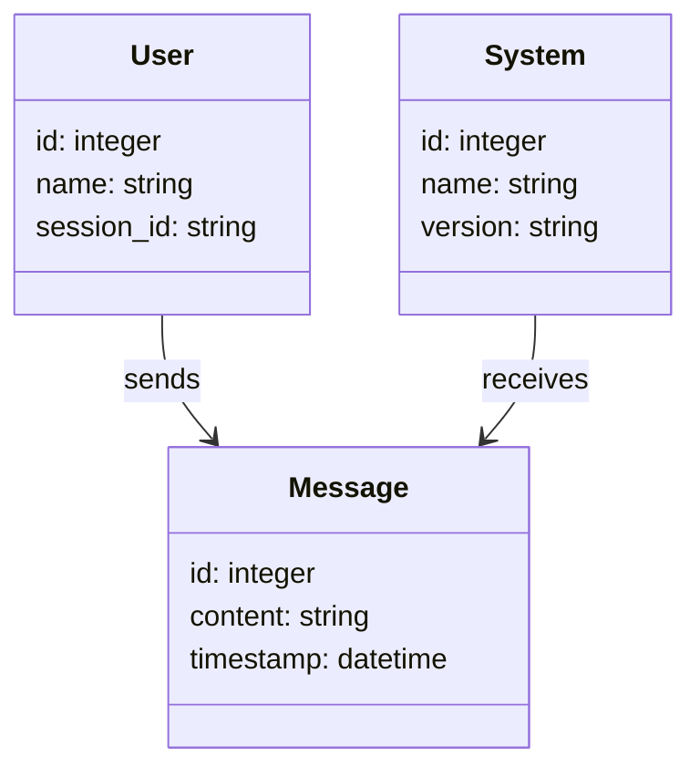

                 

# 企业AI Agent的自然语言接口设计与优化

> 关键词：AI Agent, 自然语言处理, 对话系统, 企业智能化, 系统架构

> 摘要：本文详细探讨了企业AI Agent的自然语言接口设计与优化的关键问题，涵盖从理论到实践的各个方面，包括核心概念、算法原理、系统架构设计、项目实战及优化建议。文章旨在为企业技术人员和AI开发者提供深入的指导，帮助他们构建高效、智能的AI Agent系统。

---

# 第1章: 企业AI Agent与自然语言接口概述

## 1.1 企业AI Agent的背景与概念

### 1.1.1 问题背景：企业智能化转型的需求

随着企业智能化转型的推进，AI技术逐渐成为企业提升效率和竞争力的核心工具。AI Agent（智能代理）作为实现智能化的关键技术，通过自然语言接口（NLI）与用户交互，为企业提供智能化服务。自然语言接口是AI Agent与用户之间的重要桥梁，其设计与优化直接影响用户体验和系统性能。

### 1.1.2 问题描述：自然语言接口的重要性

自然语言接口是用户与AI Agent之间进行交流的媒介。通过NLI，用户可以用自然语言与系统交互，系统则通过解析用户的意图并生成相应的响应。设计一个高效、准确的NLI是实现AI Agent智能化的关键。

### 1.1.3 问题解决：AI Agent的作用与价值

AI Agent通过自然语言接口，能够理解用户需求，提供个性化服务，提升企业的智能化水平。例如，在企业内部，AI Agent可以通过NLI帮助员工快速获取信息、处理任务，从而提高工作效率。

### 1.1.4 边界与外延：自然语言接口的适用范围

自然语言接口主要应用于需要与用户进行对话交互的场景，如客服系统、智能助手、智能推荐等。其适用范围包括信息查询、任务处理、数据检索等。

### 1.1.5 核心要素：AI Agent、自然语言处理、用户交互

AI Agent的核心要素包括自然语言处理（NLP）、对话系统和用户交互设计。自然语言处理是实现NLI的基础，对话系统是NLI的核心，用户交互设计是NLI的保障。

---

## 1.2 自然语言处理与对话系统

### 1.2.1 自然语言处理的基本概念

自然语言处理（NLP）是研究如何让计算机理解和生成人类语言的学科。它包括文本处理、语义分析、情感分析等多个方面。

### 1.2.2 对话系统的分类与特点

对话系统可以分为基于规则的对话系统、基于统计的对话系统和基于深度学习的对话系统。基于规则的系统通过预定义的规则生成响应；基于统计的系统利用数据统计方法生成响应；基于深度学习的系统利用神经网络模型生成响应。

### 1.2.3 AI Agent在企业中的应用场景

AI Agent在企业中的应用场景包括智能客服、智能助手、智能推荐、智能监控等。通过自然语言接口，AI Agent可以帮助企业实现自动化服务，提升用户体验。

### 1.2.4 自然语言接口的核心挑战

自然语言接口的核心挑战包括意图识别、实体识别、对话上下文的理解与管理、多轮对话的连贯性等。

---

## 1.3 本章小结

本章介绍了企业AI Agent的背景与概念，分析了自然语言处理与对话系统的关系，讨论了AI Agent在企业中的应用场景及其核心挑战。通过这些内容，读者可以理解自然语言接口在企业AI Agent中的重要性。

---

# 第2章: 自然语言接口的核心概念与联系

## 2.1 自然语言处理的核心原理

### 2.1.1 语言模型的基本原理

语言模型通过概率分布来描述词与词之间的关系。例如，使用n-gram模型来预测下一个词的概率。

### 2.1.2 分析器与生成器的对比

分析器负责将输入文本转换为结构化表示，生成器负责将结构化表示转换为自然语言文本。

### 2.1.3 自然语言接口的实体关系图（ER图）

以下是自然语言接口的实体关系图：

---

## 2.2 对话系统的算法原理

### 2.2.1 基于规则的对话系统

基于规则的对话系统通过预定义的规则生成响应。例如，当用户输入“你好”，系统回复“你好！有什么可以帮助你的吗？”

### 2.2.2 基于统计的对话系统

基于统计的对话系统利用数据统计方法生成响应。例如，使用马尔可夫链模型来预测下一个词的概率。

### 2.2.3 基于深度学习的对话系统

基于深度学习的对话系统利用神经网络模型生成响应。例如，使用Transformer模型进行自然语言生成。

---

## 2.3 自然语言接口的数学模型

### 2.3.1 语言模型的概率表示

语言模型可以通过概率分布来表示，例如，使用交叉熵损失函数来衡量模型预测与真实值之间的差异。

$$ \text{损失函数} = -\sum_{i=1}^{n} \log P(y_i | y_{i-1}, \ldots, y_1) $$

### 2.3.2 对话系统的评估指标

对话系统的评估指标包括BLEU、ROUGE、METEOR等。

---

## 2.4 本章小结

本章详细讲解了自然语言接口的核心概念与联系，包括语言模型的基本原理、分析器与生成器的对比、对话系统的分类与特点，以及自然语言接口的数学模型。通过这些内容，读者可以理解自然语言接口的设计与优化的关键点。

---

接下来的章节将围绕算法原理、系统架构设计、项目实战等内容展开，具体内容请参考后续章节。

--- 

# 作者

作者：AI天才研究院/AI Genius Institute & 禅与计算机程序设计艺术 /Zen And The Art of Computer Programming

