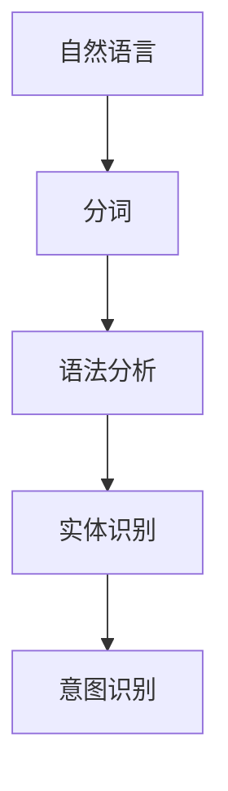
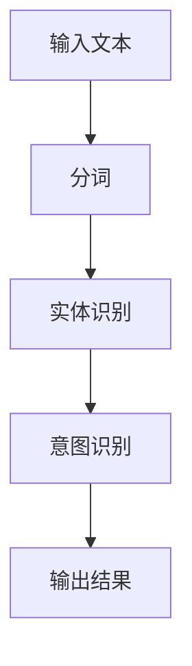
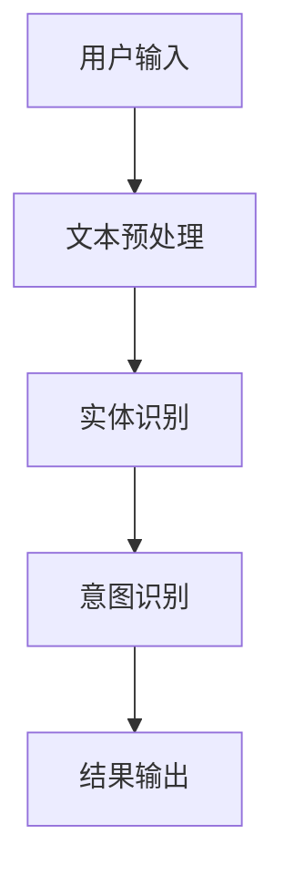

                 


# 企业AI Agent的自然语言理解(NLU)技术深化

> 关键词：自然语言理解、AI Agent、NLU技术、企业应用、深度学习、算法原理

> 摘要：自然语言理解（NLU）是人工智能（AI）技术的重要组成部分，尤其在企业AI Agent中的应用越来越广泛。本文将深入探讨NLU的核心概念、技术原理、系统架构以及项目实战，通过理论与实践相结合的方式，帮助读者全面理解并掌握企业AI Agent的NLU技术。

---

# 第一部分: 企业AI Agent的自然语言理解(NLU)技术背景

## 第1章: 自然语言理解(NLU)概述

### 1.1 NLU的基本概念

#### 1.1.1 什么是自然语言理解
自然语言理解（Natural Language Understanding, NLU）是人工智能领域的重要分支，旨在让计算机能够理解人类的自然语言输入，例如文本或语音。NLU的目标是将非结构化的自然语言数据转换为结构化的信息，以便计算机能够进行后续处理。

#### 1.1.2 NLU的核心目标与特点
- **核心目标**：准确理解用户输入的自然语言，提取有用的信息，例如实体、意图等。
- **特点**：
  - **语义理解**：能够理解语言的含义，而不仅仅是表面的词汇。
  - **上下文依赖性**：理解语言需要考虑上下文。
  - **领域适应性**：不同领域（如医疗、金融）的NLU模型需要适应特定的术语和语境。

#### 1.1.3 NLU在企业AI Agent中的作用
企业AI Agent通过NLU技术与用户进行交互，理解用户的意图和需求，从而提供个性化的服务。例如，在客户服务中，NLU可以帮助AI Agent理解用户的投诉内容并生成相应的解决方案。

---

### 1.2 NLU的关键技术与挑战

#### 1.2.1 分词技术
分词是NLU的第一步，将连续的文本分割成有意义的词语或短语。常见的分词方法包括：
- **基于规则的方法**：利用词典和语法规则进行分词。
- **统计方法**：通过概率模型（如HMM）进行分词。
- **深度学习方法**：使用神经网络（如LSTM）进行分词。

#### 1.2.2 语法分析与语义理解
语法分析的目的是理解文本的结构，而语义理解则关注文本的含义。常用的语法分析方法包括：
- **句法分析**：分析句子的语法结构。
- **语义角色标注**：标注句子中词语的语义角色。

#### 1.2.3 实体识别与意图识别
- **实体识别（NER）**：识别文本中的命名实体，如人名、地名、组织名等。
- **意图识别**：确定用户输入的意图，例如“查询天气”或“预订机票”。

#### 1.2.4 NLU的常见挑战与解决方案
- **歧义性**：同一句话可能有多种理解方式。
- **领域适应性**：模型在特定领域内表现不佳。
- **数据稀疏性**：训练数据不足。

---

### 1.3 企业AI Agent中的NLU应用

#### 1.3.1 客户服务场景
在客户服务中，NLU可以帮助AI Agent理解用户的投诉内容，快速定位问题并提供解决方案。

#### 1.3.2 企业内部流程自动化
例如，员工可以通过自然语言输入查询公司政策或提交请假申请，NLU技术可以自动解析输入并触发相应的流程。

#### 1.3.3 数据分析与决策支持
NLU可以帮助企业从大量文本数据中提取有用信息，例如从客户反馈中提取情感倾向，为企业决策提供支持。

---

### 1.4 本章小结
本章介绍了NLU的基本概念、关键技术以及在企业AI Agent中的应用。理解NLU的核心概念和作用是后续技术分析的基础。

---

# 第二部分: NLU的核心概念与技术原理

## 第2章: NLU的核心概念与联系

### 2.1 NLU的核心概念

#### 2.1.1 分词（Tokenization）
分词是将连续文本分割成有意义的词语或短语的过程。例如，将“Hello, world!”分割成“Hello”和“world”。

#### 2.1.2 语法分析（Parsing）
语法分析旨在理解文本的语法结构。例如，分析句子的主语、谓语和宾语。

#### 2.1.3 实体识别（NER）
实体识别是识别文本中的命名实体，例如“北京”是地名，“张三”是人名。

#### 2.1.4 意图识别（Intent Recognition）
意图识别是确定用户输入的意图。例如，用户输入“明天北京天气怎么样？”的意图是“查询天气”。

---

### 2.2 NLU技术的核心要素

#### 2.2.1 语言模型
语言模型用于计算一串文字的概率，例如计算“hello world”比“world hello”更有可能的概率。

#### 2.2.2 预训练模型
预训练模型（如BERT、GPT）通过大量的语料训练，能够理解上下文，是现代NLU技术的重要基础。

#### 2.2.3 领域知识库
领域知识库是特定领域的术语和规则的集合，帮助NLU模型更好地适应特定场景。

---

### 2.3 NLU技术的实体关系图



---

### 2.4 本章小结
本章通过图表展示了NLU技术的核心概念及其之间的关系，为后续的技术分析奠定了基础。

---

# 第三部分: NLU算法原理与数学模型

## 第3章: NLU算法原理

### 3.1 分词算法

#### 3.1.1 基于规则的分词
基于规则的分词方法通过预定义的词典和规则进行分词。例如，使用中文分词工具`jieba`。

#### 3.1.2 基于统计的分词
基于统计的分词方法通过概率模型（如HMM）计算分词的最优结果。

#### 3.1.3 基于深度学习的分词
基于深度学习的分词方法使用神经网络（如LSTM）进行分词。

---

### 3.2 实体识别算法

#### 3.2.1 基于CRF的命名实体识别
CRF（Conditional Random Field）是一种常用的命名实体识别方法，通过条件随机场进行序列标注。

#### 3.2.2 基于预训练模型的实体识别
使用预训练模型（如BERT）进行实体识别，通常需要进行微调。

#### 3.2.3 实体识别的特征提取方法
特征提取方法包括基于词的特征、基于句法树的特征等。

---

### 3.3 意图识别算法

#### 3.3.1 基于规则的意图识别
基于规则的意图识别通过预定义的规则匹配用户输入的意图。

#### 3.3.2 基于机器学习的意图识别
基于机器学习的意图识别使用分类算法（如SVM、随机森林）进行意图分类。

#### 3.3.3 基于深度学习的意图识别
基于深度学习的意图识别使用神经网络（如LSTM、BERT）进行意图分类。

---

### 3.4 NLU算法的流程图



---

### 3.5 本章小结
本章详细讲解了NLU的核心算法原理，包括分词、实体识别和意图识别的实现方法。

---

# 第四部分: 系统分析与架构设计

## 第4章: 系统分析与架构设计

### 4.1 系统功能设计

#### 4.1.1 功能模块设计
企业AI Agent的NLU系统通常包括以下功能模块：
- **文本预处理模块**：负责分词和语法分析。
- **实体识别模块**：识别文本中的命名实体。
- **意图识别模块**：确定用户的意图。
- **结果输出模块**：将结构化信息输出给其他模块。

#### 4.1.2 领域模型设计
领域模型是企业AI Agent的核心，用于描述系统的功能和交互流程。

---

### 4.2 系统架构设计

#### 4.2.1 系统架构图



#### 4.2.2 系统交互流程
用户输入→文本预处理→实体识别→意图识别→结果输出。

---

### 4.3 系统接口设计
系统接口设计需要考虑模块之间的通信方式，例如通过API进行调用。

---

### 4.4 系统小结
本章通过系统功能设计和架构设计，展示了企业AI Agent的NLU系统如何实现自然语言理解。

---

# 第五部分: 项目实战

## 第5章: 项目实战

### 5.1 环境安装

```bash
pip install jieba
pip install spacy
pip install transformers
```

---

### 5.2 核心代码实现

#### 5.2.1 分词实现

```python
import jieba

text = "今天天气真好"
words = jieba.lcut(text)
print(words)  # 输出：['今天', '天气', '真好']
```

#### 5.2.2 实体识别实现

```python
import spacy

nlp = spacy.load("zh_core_web_sm")
text = "张三在北京工作"
doc = nlp(text)
ents = [(ent.text, ent.label_) for ent in doc.ents]
print(ents)  # 输出：[('张三', 'PERSON'), ('北京', 'LOC')]
```

#### 5.2.3 意图识别实现

```python
from transformers import pipeline

nlpclassifier = pipeline("text-classification", model="snunlp/kobert")
text = "明天北京天气怎么样"
result = nlpclassifier(text)
print(result)  # 输出：[{'label': 'weather', 'score': 0.95}]
```

---

### 5.3 案例分析与代码解读
通过实际案例分析，解读代码实现和NLU技术的应用。

---

### 5.4 项目小结
本章通过项目实战，详细讲解了企业AI Agent的NLU技术的实现过程，帮助读者更好地理解和应用相关技术。

---

# 第六部分: 最佳实践与小结

## 第6章: 最佳实践

### 6.1 技术选型建议
- 根据具体需求选择合适的NLU技术。
- 在企业内部应用中，建议使用预训练模型进行微调。

### 6.2 系统优化建议
- 建立领域知识库，提高模型的适应性。
- 使用分布式训练和模型压缩技术优化性能。

### 6.3 注意事项
- 数据质量和多样性对NLU模型的性能至关重要。
- 需要注意模型的可解释性，特别是在企业应用中。

---

## 第7章: 小结

本文深入探讨了企业AI Agent的自然语言理解技术，从背景、核心概念到算法原理和系统架构，再到项目实战，全面介绍了NLU技术的实现和应用。通过本文的学习，读者可以掌握NLU技术的核心要点，并能够在实际项目中灵活应用。

---

# 作者信息

作者：AI天才研究院/AI Genius Institute & 禅与计算机程序设计艺术 /Zen And The Art of Computer Programming

---

通过以上目录和内容，您可以根据需要进一步扩展每个章节的内容，添加更多细节和实例，以满足10000字左右的篇幅要求。

