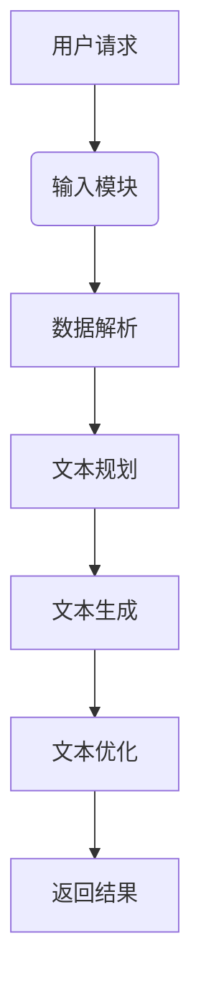
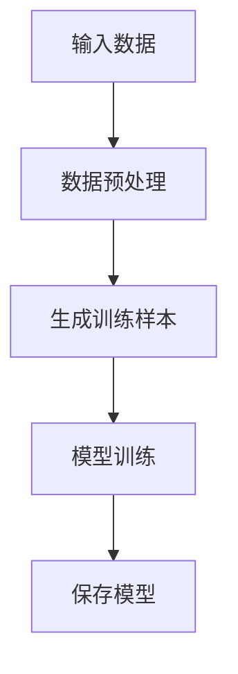
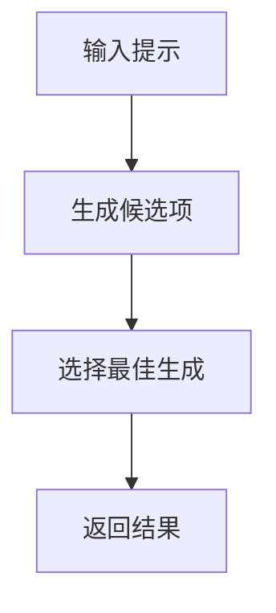
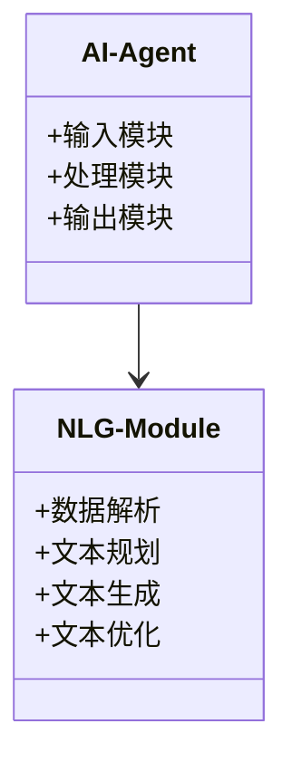

                 


# 企业AI Agent的自然语言生成(NLG)报告系统

> 关键词：企业AI Agent，自然语言生成(NLG)，大语言模型，报告生成，系统设计

> 摘要：本文详细探讨了企业AI Agent中自然语言生成（NLG）报告系统的构建与实现。首先，介绍了企业AI Agent和自然语言生成的基本概念及其在企业中的应用价值。然后，深入分析了自然语言生成的核心原理，包括生成模型的分类与应用、生成质量的评估方法。接着，详细讲解了企业AI Agent中的自然语言生成系统设计，包括系统架构、模块设计和关键问题。随后，重点阐述了基于大语言模型的自然语言生成系统实现，包括系统实现的总体框架、算法原理与实现、系统架构设计与优化。最后，通过项目实战展示了系统的实现过程，并总结了最佳实践与注意事项。

---

# 第1章: 企业AI Agent与自然语言生成(NLG)概述

## 1.1 企业AI Agent的定义与特点

企业AI Agent是一种能够感知环境、理解需求并执行任务的智能系统。它通过与用户的交互，能够自动化处理企业中的各种任务，如数据分析、报告生成、客户沟通等。

### 1.1.1 AI Agent的基本概念
AI Agent（智能代理）是一种能够感知环境并采取行动以实现目标的智能系统。它可以分为简单反射型、基于模型的反应型、基于目标的和基于效用的四种类型。

### 1.1.2 企业AI Agent的核心特点
- **自主性**：能够自主决策和行动。
- **反应性**：能够实时感知环境变化并做出响应。
- **目标导向**：通过目标驱动来执行任务。
- **可扩展性**：能够适应企业规模和复杂度的变化。

### 1.1.3 企业AI Agent的应用场景
- **客户支持**：通过自然语言处理与客户进行交互，提供解决方案。
- **数据分析**：自动分析企业数据，生成洞察报告。
- **流程自动化**：自动化处理企业中的各种流程，提高效率。

## 1.2 自然语言生成(NLG)的基本概念

自然语言生成（Natural Language Generation，NLG）是将结构化数据转化为自然语言文本的过程。它是实现AI Agent与人类交互的关键技术之一。

### 1.2.1 自然语言生成的定义
自然语言生成是指通过计算机程序生成符合人类语言习惯的文本内容。NLG系统通常包括文本规划、文本生成和文本优化三个阶段。

### 1.2.2 NLG的核心技术与方法
- **基于规则的方法**：通过预定义的语法规则生成文本。
- **统计方法**：基于语料库中的数据，通过概率模型生成文本。
- **深度学习方法**：利用神经网络模型（如Transformer）生成自然语言文本。

### 1.2.3 NLG在企业中的应用价值
- **自动化报告生成**：将结构化数据转化为易于理解的报告。
- **客户沟通**：通过NLG生成个性化的沟通内容。
- **实时信息处理**：快速生成实时信息的文本描述。

## 1.3 企业AI Agent与NLG的结合

企业AI Agent通过整合自然语言生成技术，能够更高效地与用户交互并生成报告。

### 1.3.1 AI Agent中的自然语言生成需求
- **多语言支持**：支持多种语言的生成。
- **上下文理解**：根据上下文生成合适的文本内容。
- **个性化生成**：根据用户需求生成个性化文本。

### 1.3.2 企业报告生成的痛点与解决方案
- **痛点**：传统报告生成过程耗时长、效率低、内容重复。
- **解决方案**：通过AI Agent和NLG技术实现自动化、智能化的报告生成。

### 1.3.3 本章小结
本章介绍了企业AI Agent和自然语言生成的基本概念，并探讨了两者的结合在企业报告生成中的应用价值。

---

# 第2章: 自然语言生成(NLG)的核心原理

## 2.1 自然语言生成的基本原理

自然语言生成的核心是将结构化数据转化为自然语言文本，这一过程涉及到文本规划、生成和优化。

### 2.1.1 生成模型的分类
- **基于规则的生成模型**：通过预定义的语法规则生成文本。
- **统计生成模型**：基于语料库中的数据，通过概率模型生成文本。
- **深度学习生成模型**：利用神经网络模型（如Transformer）生成自然语言文本。

### 2.1.2 基于规则的生成方法
基于规则的生成方法通过预定义的语法规则生成文本，适用于特定领域的文本生成。

### 2.1.3 基于统计的生成方法
统计生成方法通过分析语料库中的数据，计算每个词语出现的概率，从而生成符合语言习惯的文本。

### 2.1.4 基于深度学习的生成方法
深度学习生成方法利用神经网络模型（如Transformer）生成自然语言文本。这种方法能够捕捉到语言的上下文关系，生成更自然的文本。

## 2.2 大语言模型在NLG中的应用

大语言模型（如GPT、BERT）在自然语言生成中表现出色，能够生成高质量的文本内容。

### 2.2.1 GPT系列模型在NLG中的应用
GPT模型通过自监督学习，能够生成连贯的自然语言文本，适用于多种生成任务。

### 2.2.2 BERT及其变体在NLG中的应用
BERT模型主要用于理解上下文关系，通过微调可以用于生成任务，如对话生成和文本摘要。

### 2.2.3 其他大语言模型在NLG中的应用
除了GPT和BERT，还有其他大语言模型（如PaLM、T5）在NLG中也有广泛应用。

## 2.3 NLG生成的质量评估

评估NLG生成的质量是衡量生成系统性能的重要环节。

### 2.3.1 基于人类评估的质量指标
- **内容准确性**：生成内容是否准确反映了输入数据。
- **语义连贯性**：生成文本是否连贯，逻辑是否清晰。
- **语言自然性**：生成文本是否符合自然语言的表达习惯。

### 2.3.2 基于自动评估的质量指标
- **BLEU**：基于编辑距离的评估指标。
- **ROUGE**：基于召回率的评估指标。
- **METEOR**：基于元语言评估的指标。

### 2.3.3 综合评估方法
结合自动评估和人工评估，可以更全面地评估生成系统的性能。

---

# 第3章: 企业AI Agent中的自然语言生成系统设计

## 3.1 企业AI Agent的系统架构

企业AI Agent的系统架构需要考虑模块化设计、高可用性和可扩展性。

### 3.1.1 系统功能模块划分
- **输入模块**：接收用户的输入请求。
- **处理模块**：解析输入请求并生成相应的文本内容。
- **输出模块**：将生成的文本内容返回给用户。

### 3.1.2 系统输入输出设计
- **输入设计**：定义输入数据的格式和类型。
- **输出设计**：定义输出文本的格式和内容。

### 3.1.3 系统交互流程设计
- **用户输入**：用户向AI Agent发送请求。
- **系统处理**：AI Agent解析请求并生成相应的文本内容。
- **结果返回**：AI Agent将生成的文本内容返回给用户。

## 3.2 自然语言生成模块的设计

自然语言生成模块是企业AI Agent的核心部分，负责将结构化数据转化为自然语言文本。

### 3.2.1 模块输入数据格式
- **结构化数据**：如JSON格式的数据。
- **元数据**：如生成文本的风格和语气。

### 3.2.2 模块内部处理流程
- **数据解析**：解析输入数据，提取生成文本所需的信息。
- **文本规划**：根据提取的信息生成文本内容。
- **文本优化**：对生成的文本进行润色和优化，提升语言表达的自然性。

### 3.2.3 模块输出格式与质量控制
- **输出格式**：生成文本的格式，如TXT、PDF等。
- **质量控制**：通过预设的规则和模型，确保生成文本的质量。

## 3.3 系统设计中的关键问题

在设计企业AI Agent的自然语言生成系统时，需要考虑以下关键问题。

### 3.3.1 数据隐私与安全问题
- **数据加密**：对敏感数据进行加密处理。
- **访问控制**：限制未经授权的访问。

### 3.3.2 多语言支持与文化适应性
- **多语言生成**：支持多种语言的文本生成。
- **文化适应性**：生成符合目标文化背景的文本内容。

### 3.3.3 系统可扩展性与维护性
- **模块化设计**：便于模块的扩展和维护。
- **可配置性**：通过配置参数灵活调整系统行为。

---

# 第4章: 基于大语言模型的企业AI Agent NLG系统实现

## 4.1 系统实现的总体框架

基于大语言模型的企业AI Agent NLG系统实现需要考虑模型的训练、部署和应用。

### 4.1.1 系统功能模块划分
- **训练模块**：对大语言模型进行训练和微调。
- **部署模块**：将模型部署到生产环境。
- **应用模块**：通过API接口提供生成服务。

### 4.1.2 系统接口设计
- **输入接口**：接收用户的生成请求。
- **输出接口**：返回生成的文本内容。

### 4.1.3 系统流程图设计



## 4.2 算法原理与实现

基于大语言模型的自然语言生成算法通常包括训练和推理两个阶段。

### 4.2.1 大语言模型的训练过程



### 4.2.2 模型推理过程



### 4.2.3 解码策略

解码策略是模型生成文本的重要组成部分，常用的解码策略包括贪心解码和随机采样。

### 4.2.4 生成模型的数学公式

自然语言生成模型的输出概率可以表示为：

$$ P(y|x) = \frac{P(y|x)}{P(x|y)} $$

其中，$x$ 是输入，$y$ 是输出。

## 4.3 系统架构设计与优化

### 4.3.1 系统架构设计



### 4.3.2 系统优化

系统优化包括模型压缩、推理加速和资源优化。

---

# 第5章: 项目实战

## 5.1 环境安装与配置

### 5.1.1 安装Python
```bash
python --version
pip install --upgrade pip
```

### 5.1.2 安装依赖库
```bash
pip install torch transformers
```

## 5.2 系统核心代码实现

### 5.2.1 数据预处理
```python
import torch
from transformers import GPT2LMHeadModel, GPT2Tokenizer

tokenizer = GPT2Tokenizer.from_pretrained('gpt2')
model = GPT2LMHeadModel.from_pretrained('gpt2')
```

### 5.2.2 模型训练
```python
optimizer = torch.optim.Adam(model.parameters(), lr=1e-5)
criterion = torch.nn.CrossEntropyLoss()
```

### 5.2.3 模型推理
```python
input_text = "根据以下数据生成报告："
inputs = tokenizer(input_text, return_tensors="pt")
outputs = model.generate(**inputs, max_length=500)
generated_text = tokenizer.decode(outputs[0])
print(generated_text)
```

## 5.3 案例分析与实现解读

### 5.3.1 案例分析
假设我们需要生成一份销售报告，输入数据包括销售额、增长率等信息。

### 5.3.2 代码实现解读
通过预处理输入数据，调用大语言模型生成报告内容，并输出生成的文本。

## 5.4 项目总结与经验分享

### 5.4.1 项目成果
成功实现了一个基于大语言模型的企业AI Agent NLG系统。

### 5.4.2 经验分享
- **模型选择**：选择适合任务的大语言模型。
- **数据质量**：高质量的训练数据能够提升生成效果。
- **系统优化**：通过模型压缩和推理优化提升系统性能。

---

# 第6章: 最佳实践与总结

## 6.1 最佳实践

### 6.1.1 小结
通过本文的介绍，我们了解了企业AI Agent中的自然语言生成系统的构建与实现。

### 6.1.2 注意事项
- **数据隐私**：确保数据的安全性和隐私性。
- **模型选择**：根据具体任务选择合适的模型。
- **系统优化**：通过优化提升系统的性能和用户体验。

### 6.1.3 拓展阅读
建议进一步阅读大语言模型的论文和相关技术文档，深入理解模型的原理和应用。

## 6.2 作者总结

企业AI Agent的自然语言生成系统是人工智能技术的重要应用之一。通过本文的介绍，希望能够为读者提供一个系统化的构建与实现的思路，帮助他们在实际应用中更好地利用这些技术。

---

# 作者：AI天才研究院/AI Genius Institute & 禅与计算机程序设计艺术 /Zen And The Art of Computer Programming

