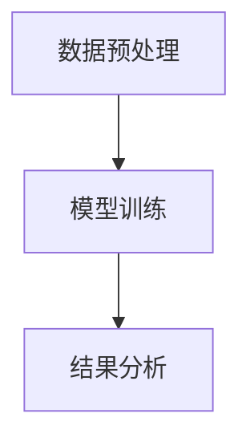

                 


# 企业AI Agent的自监督学习在非标准数据利用中的创新实践

## 关键词：自监督学习、AI Agent、非标准数据、企业应用、创新实践

## 摘要：本文探讨了自监督学习在企业AI Agent中的应用，特别是如何利用非标准数据进行创新实践。通过背景介绍、核心概念分析、算法原理、系统设计和项目实战，详细阐述了自监督学习的优势及其在企业中的实际应用，为企业AI Agent的开发和优化提供了理论和实践指导。

---

## 第一部分：背景介绍

### 第1章：自监督学习与AI Agent概述

#### 1.1 自监督学习的定义与特点
- **自监督学习**：通过未标记数据中的内在结构进行学习，无需外部标注。其特点是数据利用率高、学习能力强，适用于数据充足但标注成本高的场景。
- **特点**：
  1. 自监督学习依赖数据内在关系，无需外部标签。
  2. 具备强大的数据处理能力，能够挖掘数据潜在价值。
  3. 在非标准数据处理中表现优异，适用于企业复杂场景。

#### 1.2 AI Agent的基本概念
- **AI Agent**：智能体，能够感知环境并采取行动以实现目标。企业AI Agent通常用于自动化决策、数据分析和问题解决。
- **核心功能**：
  1. 数据感知与处理
  2. 自主决策与行动
  3. 学习与优化能力

#### 1.3 问题背景与目标
- **背景**：企业环境中数据复杂多样，非结构化数据占比高，传统监督学习依赖标注，成本高昂。
- **目标**：利用自监督学习处理非标准数据，提升AI Agent的自主学习能力，降低依赖标注数据的成本。

---

## 第二部分：核心概念与联系

### 第2章：自监督学习与AI Agent的核心原理

#### 2.1 自监督学习的原理
- **对比学习**：通过对比不同数据增强版本，学习数据的不变性特征。
- **生成式模型**：利用生成对抗网络（GAN）生成多样数据，提升模型泛化能力。
- **数学模型**：
  - 对比学习目标函数：$$ L = \log\left(\frac{p(x,y)}{p(x)p(y)}\right) $$
  - 变分自编码器（VAE）：$$ \mathcal{L} = -\mathbb{E}_{x}[ \log p(x|z)] + \text{KL}(q(z|x)||p(z)) $$

#### 2.2 AI Agent的自监督学习机制
- **数据表示**：将非标准数据映射到低维特征空间，便于处理。
- **任务建模**：构建任务目标函数，驱动AI Agent学习。

#### 2.3 核心概念对比表
| 概念 | 自监督学习 | AI Agent |
|------|------------|----------|
| 数据需求 | 无标签数据 | 结构化或非结构化数据 |
| 学习目标 | 数据特征学习 | 任务目标驱动 |

#### 2.4 实体关系图
```mermaid
er
  entity(自监督学习) {
    id
    特征
    损失函数
  }
  entity(AI Agent) {
    id
    功能
    交互
  }
  relationship(自监督学习驱动AI Agent学习) {
    自监督学习 -> AI Agent
  }
```

---

## 第三部分：算法原理讲解

### 第3章：自监督学习算法原理

#### 3.1 对比学习算法
- **流程**：
  1. 数据增强生成正样本对。
  2. 对比网络学习样本对之间的相似性。
  3. 优化目标函数，更新模型参数。

#### 3.2 生成式模型算法
- **变分自编码器（VAE）**：
  - 通过编码器将数据压缩为隐变量，解码器还原数据。
  - 示例代码：
    ```python
    import keras
    encoder = keras.Sequential([...])
    decoder = keras.Sequential([...])
    class VAE(keras.Model):
        def call(self, x):
            z = encoder(x)
            return decoder(z)
    ```

---

## 第四部分：系统分析与架构设计

### 第4章：系统架构设计

#### 4.1 项目背景与目标
- 项目背景：企业数据复杂，非标准数据占比高。
- 目标：构建自监督学习驱动的AI Agent，提升数据处理能力。

#### 4.2 系统功能设计
- **数据预处理模块**：清洗和增强数据。
- **模型训练模块**：训练对比学习模型。
- **结果分析模块**：评估模型性能。

#### 4.3 系统架构图


---

## 第五部分：项目实战

### 第5章：项目实战与实现

#### 5.1 环境安装与配置
- 安装Python、TensorFlow、Keras等依赖库。

#### 5.2 核心代码实现
- **数据预处理**：对图像数据进行旋转、缩放等增强处理。
- **模型训练**：使用对比学习框架SimCLR训练模型。

#### 5.3 代码解读与优化
- 优化学习率和网络结构，提升模型性能。

#### 5.4 实际案例分析
- 通过具体案例展示自监督学习在企业数据处理中的优势。

---

## 总结

通过本文的详细讲解，读者可以全面理解自监督学习在企业AI Agent中的应用。从理论到实践，本文提供了丰富的指导，帮助企业高效利用非标准数据，推动AI技术的发展。

---

## 作者：AI天才研究院/Zen And The Art of Computer Programming

