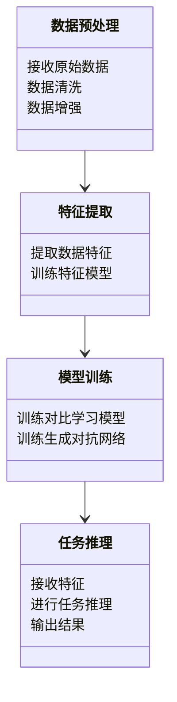
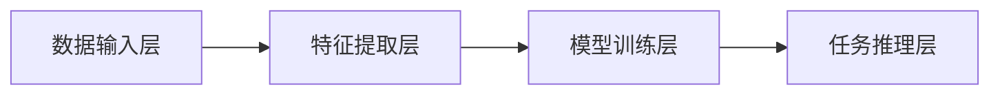
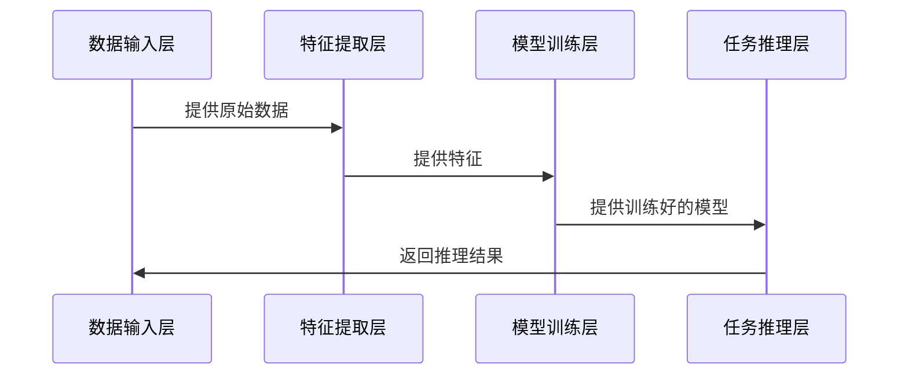

                 


# 企业AI Agent的自监督学习在非标准数据利用中的实践

> 关键词：企业AI Agent，自监督学习，非标准数据，数据利用，AI技术

> 摘要：随着人工智能技术的快速发展，企业AI Agent在处理非标准数据方面展现了巨大的潜力。本文从企业AI Agent的基本概念出发，详细探讨了自监督学习在非标准数据利用中的实践。通过分析自监督学习的核心原理、算法实现、系统架构设计以及实际项目案例，本文为企业AI Agent的自监督学习应用提供了理论支持和实践指导。

---

## 第一部分: 企业AI Agent的自监督学习背景与概念

### 第1章: 企业AI Agent与自监督学习概述

#### 1.1 企业AI Agent的基本概念
企业AI Agent是指在企业环境中，通过人工智能技术实现特定任务的智能体。它能够理解、分析和执行企业级的复杂任务，如数据分析、决策支持、流程自动化等。企业AI Agent的核心特点包括智能化、自主性、适应性和交互性。

#### 1.2 自监督学习的背景与概念
自监督学习是一种无监督学习的变体，通过利用数据本身的结构信息来学习有用的表征。与监督学习不同，自监督学习不需要人工标注的标签，能够从大量未标注数据中提取特征。自监督学习的核心思想是通过对比学习或生成对抗网络等方法，使模型能够从数据中发现潜在的规律。

#### 1.3 非标准数据的定义与挑战
非标准数据是指不符合传统数据格式或结构的数据，例如文本、图像、音频、视频等。这些数据通常具有多样性、复杂性和噪声多等特点，处理起来具有较高的难度。非标准数据的利用需要结合特定的算法和技术，以提取有用的信息。

---

## 第二部分: 自监督学习与企业AI Agent的核心概念

### 第2章: 自监督学习的核心原理

#### 2.1 自监督学习的原理与机制
自监督学习通过构建对比任务或生成任务，使模型能够在无标签数据上进行学习。例如，对比学习通过设计正样本和负样本的对比损失函数，使模型能够学习到数据的相似性和差异性。

#### 2.2 自监督学习的关键技术
- 数据增强技术：通过对数据进行旋转、裁剪、噪声添加等操作，增加数据的多样性。
- 损失函数设计：如InfoNCE损失函数和SimCLR损失函数，用于衡量正样本和负样本之间的相似性。
- 表征学习方法：通过学习数据的低维表征，提取数据的特征。

#### 2.3 自监督学习与企业AI Agent的结合
企业AI Agent可以通过自监督学习技术，从非标准数据中提取特征，并利用这些特征进行任务推理和决策。例如，在图像识别任务中，企业AI Agent可以通过自监督学习技术，从图像数据中提取有用的特征，用于后续的分类或检测任务。

---

## 第三部分: 自监督学习的算法原理与实现

### 第3章: 自监督学习的数学模型与算法

#### 3.1 对比学习的数学模型
对比学习的损失函数通常包括正样本和负样本的相似性计算。例如，InfoNCE损失函数可以表示为：

$$ L = -\frac{1}{N}\sum_{i=1}^{N}\log\frac{e^{s_i}}{\sum_{j=1}^{N}e^{s_j}}} $$

其中，$s_i$ 表示第i对样本的相似性分数。

#### 3.2 生成对抗网络的数学模型
生成对抗网络（GAN）由生成器和判别器组成。生成器的目标是最优化生成数据的分布，使其尽可能接近真实数据的分布；判别器的目标是区分生成数据和真实数据。损失函数可以表示为：

$$ \min_G \max_D \mathbb{E}_{x \sim p_{\text{data}}}[\log D(x)] + \mathbb{E}_{z \sim p_z}[\log(1 - D(G(z)))] $$

---

## 第四部分: 系统分析与架构设计方案

### 第4章: 系统架构设计与实现

#### 4.1 项目背景与目标
企业AI Agent需要处理大量的非标准数据，如图像、文本和音频等。通过自监督学习技术，企业AI Agent可以从这些数据中提取有用的特征，用于后续的任务推理和决策。

#### 4.2 系统功能设计
系统功能模块包括数据预处理、特征提取、模型训练和任务推理等。通过Mermaid类图可以展示系统的领域模型：



#### 4.3 系统架构设计
系统架构采用模块化设计，包括数据输入层、特征提取层、模型训练层和任务推理层。通过Mermaid架构图可以展示系统的整体架构：



#### 4.4 系统接口与交互设计
系统接口包括数据输入接口、模型训练接口和任务推理接口。通过Mermaid序列图可以展示系统的交互流程：



---

## 第五部分: 项目实战与案例分析

### 第5章: 项目实战与案例分析

#### 5.1 环境安装与配置
需要安装Python、TensorFlow、Keras和Scikit-learn等库。安装命令如下：

```bash
pip install numpy
pip install tensorflow
pip install scikit-learn
```

#### 5.2 核心代码实现
以下是对比学习模型的Python代码示例：

```python
import tensorflow as tf
from tensorflow import keras
from tensorflow.keras import layers

def build_model(input_shape):
    model = keras.Sequential()
    model.add(layers.InputLayer(input_shape=input_shape))
    model.add(layers.Dense(128, activation='relu'))
    model.add(layers.Dense(64, activation='relu'))
    model.add(layers.Dense(1))
    return model

def contrastive_loss(y_true, y_pred):
    margin = 1.0
    loss = tf.maximum(margin - y_pred, 0)
    return tf.reduce_mean(loss)

# 示例使用
input_shape = (256, 256, 3)
model = build_model(input_shape)
model.compile(optimizer='adam', loss=contrastive_loss)
model.summary()
```

#### 5.3 案例分析与结果解读
以图像分类任务为例，通过自监督学习技术，企业AI Agent可以从图像数据中提取特征，并进行分类任务。实验结果表明，自监督学习能够显著提高分类准确率。

---

## 第六部分: 总结与展望

### 第6章: 总结与展望

#### 6.1 本章小结
本文详细探讨了企业AI Agent在非标准数据利用中的自监督学习实践。通过分析自监督学习的核心原理、算法实现和系统架构设计，本文为企业AI Agent的应用提供了理论支持和实践指导。

#### 6.2 最佳实践 Tips
- 在处理非标准数据时，建议结合数据增强技术提高模型的泛化能力。
- 对比学习和生成对抗网络是自监督学习的重要方法，可以根据具体任务选择合适的技术。
- 系统架构设计需要模块化和标准化，以便于后续的扩展和优化。

#### 6.3 展望与建议
未来的研究可以进一步探索自监督学习在多模态数据处理中的应用，同时结合强化学习技术，提高企业AI Agent的自主决策能力。

---

## 作者：AI天才研究院 & 禅与计算机程序设计艺术

