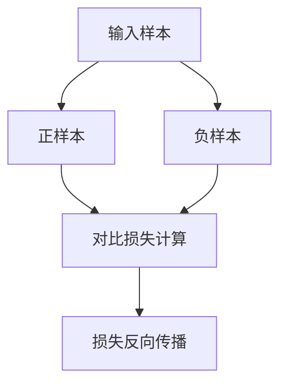
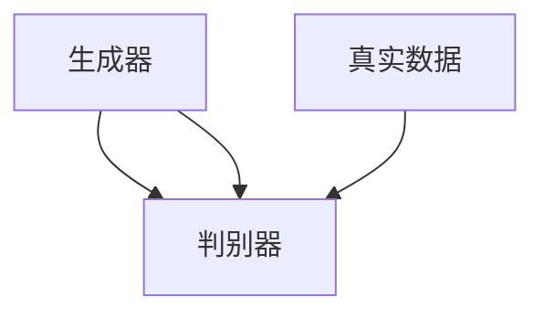
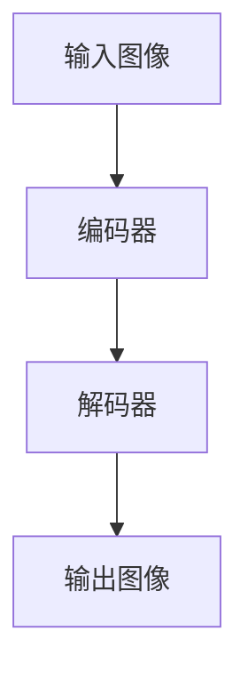
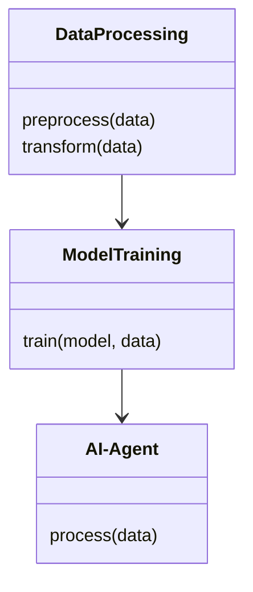
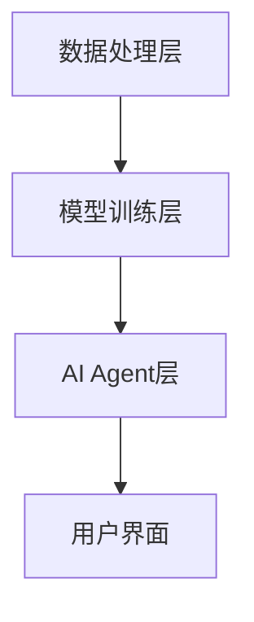

                 


# 企业AI Agent的自监督学习在非标准数据利用中的突破性实践

> 关键词：企业AI Agent，自监督学习，非标准数据，对比学习，生成对抗网络，图像重建，数据增强

> 摘要：本文探讨了在企业环境中，利用自监督学习方法处理非标准数据，以实现AI Agent的突破性应用。通过详细分析自监督学习的核心原理，结合实际项目案例，展示了如何在企业中有效利用非标准数据，提升企业的智能化水平。

---

## 第1章：企业AI Agent的背景与概念

### 1.1 AI Agent的基本概念

AI Agent（人工智能代理）是指能够感知环境、自主决策并执行任务的智能实体。它具备以下特点：

- **自主性**：无需外部干预，自主完成任务。
- **反应性**：能够实时感知环境并做出反应。
- **目标导向**：根据预设目标采取行动。

#### AI Agent与其他智能体的对比

| 特性                | AI Agent          | 其他智能体（如人类、动物） |
|---------------------|-------------------|---------------------------|
| 自主性              | 高                | 较低或无                   |
| 反应性              | 强                | 较弱或无                   |
| 学习能力            | 强                | 有限                       |

### 1.2 自监督学习的定义与特点

自监督学习是一种无需依赖大量标注数据的机器学习方法。其特点包括：

- **无监督学习**：利用未标注数据进行学习。
- **对比学习**：通过对比正样本和负样本，提升模型的区分能力。
- **生成对抗**：通过生成器和判别器的对抗，生成高质量的数据。

---

## 第2章：非标准数据的挑战与利用

### 2.1 非标准数据的定义与分类

非标准数据指的是结构不规则、难以直接用于机器学习模型的数据，常见类型包括：

- **文本数据**：如企业文档、客户评论。
- **图像数据**：如产品图片、监控视频。
- **音频数据**：如客服通话录音。

#### 非标准数据的特点

| 类型    | 特点                   |
|---------|------------------------|
| 文本     | 高维、稀疏             |
| 图像     | 高维、连续             |
| 音频     | 时间序列、连续性       |

### 2.2 非标准数据在企业中的应用场景

- **文本数据**：用于情感分析、关键词提取。
- **图像数据**：用于目标检测、图像分类。
- **音频数据**：用于语音识别、声纹识别。

#### 应用场景对比

| 场景          | 数据类型 | 处理方法         |
|---------------|----------|-----------------|
| 客服对话分析  | 文本      | 情感分析         |
| 产品推荐       | 图像      | 图像分类         |
| 声纹识别       | 音频      | 语音识别         |

### 2.3 企业AI Agent在非标准数据利用中的价值

- **提高数据利用率**：通过自监督学习，充分利用未标注数据。
- **降低数据处理成本**：减少对标注数据的依赖，降低成本。
- **提升企业智能化水平**：通过高效的数据处理，提升决策能力。

---

## 第3章：自监督学习的核心原理

### 3.1 对比学习

对比学习是一种通过对比正样本和负样本来学习数据表示的方法。其流程如下：



#### 对比损失函数

$$ L = \frac{1}{|B|} \sum_{i=1}^{n} \sum_{j=1}^{n} (1 - y_{i,j}) \log \frac{p(x_i, x_j)}{p(x_i)p(x_j)} + y_{i,j} \log \frac{p(x_j, x_i)}{p(x_j)p(x_i)} $$

### 3.2 生成对抗网络

生成对抗网络（GAN）由生成器和判别器组成，通过对抗训练生成高质量数据。

#### GAN结构图



### 3.3 图像重建与预训练

图像重建通过自动编码器（Autoencoder）将图像压缩并重建，提升模型的表示能力。

#### 自动编码器结构



---

## 第4章：自监督学习的算法实现

### 4.1 对比学习算法实现

```python
import tensorflow as tf

def contrastive_loss(y_true, y_pred):
    loss = tf.keras.losses.contrastive_loss(y_true, y_pred)
    return loss

model = tf.keras.Sequential()
model.add(tf.keras.layers.Dense(128, activation='relu'))
model.add(tf.keras.layers.Dense(128, activation='sigmoid'))
model.compile(optimizer='adam', loss=contrastive_loss)
```

### 4.2 生成对抗网络的实现

```python
import tensorflow as tf

def generator():
    model = tf.keras.Sequential()
    model.add(tf.keras.layers.Dense(256, activation='relu'))
    model.add(tf.keras.layers.Dense(128, activation='sigmoid'))
    return model

def discriminator():
    model = tf.keras.Sequential()
    model.add(tf.keras.layers.Dense(128, activation='relu'))
    model.add(tf.keras.layers.Dense(1, activation='sigmoid'))
    return model

generator = generator()
discriminator = discriminator()
```

### 4.3 图像重建算法的实现

```python
import tensorflow as tf

def autoencoder():
    encoder = tf.keras.Sequential()
    encoder.add(tf.keras.layers.Conv2D(64, (3,3), activation='relu'))
    encoder.add(tf.keras.layers.MaxPooling2D((2,2)))

    decoder = tf.keras.Sequential()
    decoder.add(tf.keras.layers.Conv2DTranspose(64, (3,3), activation='relu'))
    decoder.add(tf.keras.layers.UpSampling2D((2,2)))

    return encoder, decoder
```

---

## 第5章：系统分析与架构设计方案

### 5.1 项目背景介绍

项目目标是通过自监督学习处理企业中的非标准数据，提升AI Agent的智能化水平。

### 5.2 系统功能设计

#### 领域模型类图



### 5.3 系统架构设计

#### 系统架构图



---

## 第6章：项目实战

### 6.1 环境安装

安装必要的库：

```bash
pip install tensorflow==2.5.0
pip install numpy==1.21.0
pip install matplotlib==3.5.0
```

### 6.2 核心代码实现

实现对比学习模型：

```python
import tensorflow as tf

def contrastive_loss(y_true, y_pred):
    margin = 1.0
    loss = tf.maximum(margin - y_pred, 0.0)
    return tf.reduce_mean(loss)

model = tf.keras.Sequential()
model.add(tf.keras.layers.Dense(128, activation='relu'))
model.add(tf.keras.layers.Dense(128, activation='sigmoid'))
model.compile(optimizer='adam', loss=contrastive_loss)
```

### 6.3 实际案例分析

以客服对话分析为例，展示如何利用对比学习处理文本数据。

---

## 第7章：最佳实践与小结

### 7.1 最佳实践

- 数据预处理：使用数据增强技术提升模型鲁棒性。
- 模型优化：通过超参数调整和模型调优提升性能。
- 持续学习：定期更新模型以适应数据变化。

### 7.2 项目小结

通过自监督学习，企业可以有效利用非标准数据，提升AI Agent的智能化水平。对比学习、生成对抗网络等方法在实际应用中展现了巨大潜力。

### 7.3 注意事项

- 数据隐私：确保数据处理符合相关法律法规。
- 模型泛化：避免过拟合，确保模型在不同场景下的表现。

### 7.4 拓展阅读

- 《Deep Learning》——Ian Goodfellow
- 《Generative Adversarial Nets》——Goodfellow et al.

---

作者：AI天才研究院/AI Genius Institute & 禅与计算机程序设计艺术 /Zen And The Art of Computer Programming

