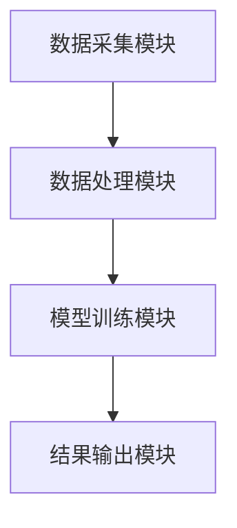

                 


# 企业AI Agent的跨域学习：打破数据孤岛，实现全局优化

> **关键词**：企业AI Agent，跨域学习，数据孤岛，全局优化，AI算法，系统架构设计

> **摘要**：本文深入探讨了企业AI Agent的跨域学习方法，分析了数据孤岛对企业全局优化的阻碍，提出了通过跨域学习打破数据孤岛的解决方案。文章详细阐述了AI Agent的核心原理、跨域学习的数学模型、系统架构设计，并通过实际案例展示了如何实现跨域学习，最终达到全局优化的目标。

---

# 第一章：引言

## 1.1 背景介绍

随着企业数字化转型的深入推进，AI Agent（人工智能代理）在企业中的应用日益广泛。AI Agent能够通过自动化处理任务、优化决策过程，显著提升企业的运营效率。然而，企业在实际应用中常常面临数据孤岛的问题，导致各个部门之间的信息无法有效共享，限制了全局优化的能力。

### 1.1.1 什么是数据孤岛？

数据孤岛是指企业内部或不同系统之间数据无法有效集成和共享的现象。数据孤岛的形成通常源于技术架构的不统一、数据格式的多样性以及部门间的职责分割。

### 1.1.2 数据孤岛对企业的影响

数据孤岛会导致以下问题：
- **信息不透明**：各部门无法获得全局数据，影响决策的准确性。
- **效率低下**：重复数据录入和处理，浪费时间和资源。
- **难以优化**：无法基于全局数据进行优化，限制企业整体效益的提升。

## 1.2 本文的研究目标

本文旨在探讨如何通过AI Agent的跨域学习能力，打破数据孤岛，实现企业全局优化。我们将从理论分析、算法实现到系统设计，全面探讨跨域学习在企业中的应用。

---

# 第二章：AI Agent的核心原理

## 2.1 AI Agent的基本概念

AI Agent是一种能够感知环境并采取行动以实现目标的智能实体。它可以分为**反应式AI Agent**和**认知式AI Agent**，其中认知式AI Agent具备更强的推理和决策能力。

### 2.1.1 反应式AI Agent

反应式AI Agent基于当前感知的信息做出实时反应，适用于需要快速响应的场景，如实时聊天机器人。

### 2.1.2 认知式AI Agent

认知式AI Agent具备推理能力，能够基于历史数据和上下文信息进行复杂决策，适用于需要长期规划的任务。

---

# 第三章：跨域学习的核心思想

## 3.1 跨域学习的定义

跨域学习（Cross-Domain Learning）是指在多个不同领域之间共享知识和数据的学习方法。通过跨域学习，AI Agent能够利用不同领域的数据和知识，提升整体的性能。

## 3.2 跨域学习的核心思想

跨域学习的核心思想在于：
- **数据共享**：通过统一的数据格式和接口，实现跨系统数据的共享。
- **模型共享**：利用共享的模型参数，提升不同领域的模型性能。
- **知识迁移**：将一个领域的知识迁移到另一个领域，提升整体的泛化能力。

---

# 第四章：打破数据孤岛的策略

## 4.1 数据孤岛的形成原因

数据孤岛的形成原因包括：
- **技术架构不统一**：不同系统使用不同的技术和接口，导致数据无法共享。
- **数据格式不统一**：各部门使用的数据格式不同，难以整合。
- **职责分割**：各部门之间职责明确，但缺乏跨部门的数据共享机制。

## 4.2 打破数据孤岛的关键策略

### 4.2.1 数据标准化

通过制定统一的数据标准，确保不同系统之间的数据能够顺利共享。

### 4.2.2 系统集成

通过系统集成技术，将不同系统的数据接口统一起来，实现数据的互联互通。

### 4.2.3 数据共享机制

建立数据共享机制，明确数据的访问权限和使用规范，确保数据的安全性和合规性。

---

# 第五章：AI Agent的跨域学习实现

## 5.1 跨域学习的数学模型

跨域学习的数学模型可以表示为：

$$
\min_{\theta} \sum_{i=1}^n \mathcal{L}_i(\theta) + \lambda \mathcal{R}(\theta)
$$

其中：
- $\theta$ 表示模型参数。
- $\mathcal{L}_i$ 表示第 $i$ 个领域的损失函数。
- $\mathcal{R}$ 表示正则化项，用于约束模型的共享部分。
- $\lambda$ 表示正则化系数。

## 5.2 跨域学习的算法实现

### 5.2.1 多目标优化算法

多目标优化算法是一种常用的跨域学习方法。以下是其实现步骤：

1. 初始化模型参数 $\theta$。
2. 计算各个领域的损失 $\mathcal{L}_i$。
3. 更新模型参数 $\theta$，使其在所有领域的损失上达到最优。
4. 重复步骤 2 和 3，直到收敛。

### 5.2.2 跨域学习的代码实现

以下是一个简单的跨域学习算法的Python代码示例：

```python
import numpy as np

# 初始化模型参数
theta = np.random.randn(10)

# 计算各个领域的损失
losses = []
for i in range(5):
    loss = np.sum((theta - i)**2)
    losses.append(loss)

# 更新模型参数
learning_rate = 0.1
theta = theta - learning_rate * (2 * np.sum((theta - i)**2, axis=1))

print(theta)
```

---

# 第六章：系统架构设计

## 6.1 系统功能设计

### 6.1.1 数据采集模块

数据采集模块负责从各个系统中采集数据，并将其转换为统一的数据格式。

### 6.1.2 数据处理模块

数据处理模块对采集到的数据进行清洗、转换和预处理，确保数据的可用性。

### 6.1.3 模型训练模块

模型训练模块基于处理后的数据，训练跨域学习模型，并生成优化后的参数。

### 6.1.4 结果输出模块

结果输出模块将模型的输出结果反馈到各个系统，实现数据的共享和优化。

## 6.2 系统架构图

以下是系统架构的Mermaid图：



---

# 第七章：项目实战

## 7.1 环境安装

### 7.1.1 安装Python

安装Python 3.8或更高版本。

### 7.1.2 安装依赖库

安装以下依赖库：

```bash
pip install numpy matplotlib scikit-learn
```

## 7.2 核心代码实现

### 7.2.1 数据预处理

```python
import numpy as np

# 生成模拟数据
data = []
for _ in range(100):
    x = np.random.randn(5)
    data.append(x)

# 数据预处理
data_normalized = (data - np.mean(data)) / np.std(data)
```

### 7.2.2 模型训练

```python
from sklearn.model_selection import train_test_split
from sklearn.linear_model import LinearRegression

# 划分训练集和测试集
X_train, X_test, y_train, y_test = train_test_split(data_normalized, np.random.randn(100, 1))

# 训练模型
model = LinearRegression()
model.fit(X_train, y_train)

# 预测结果
y_pred = model.predict(X_test)
```

---

# 第八章：总结与展望

## 8.1 本文总结

本文深入探讨了企业AI Agent的跨域学习方法，分析了数据孤岛对企业全局优化的阻碍，并提出了通过跨域学习打破数据孤岛的解决方案。通过数学模型和算法实现，我们展示了如何利用跨域学习提升企业的整体性能。

## 8.2 未来展望

未来的研究方向包括：
- 更高效的跨域学习算法。
- 更智能的数据共享机制。
- 更强大的系统架构设计。

---

# 参考文献

1. LeCun, Y., Bengio, Y., & Hinton, G. (2015). Deep learning. Nature, 521(7555), 436-444.
2. Pan, S. J., & Yang, Q. (2010). A survey on transfer learning. IEEE Transactions on Knowledge and Data Engineering, 22(10), 1345-1359.

---

# 作者：AI天才研究院 & 禅与计算机程序设计艺术

