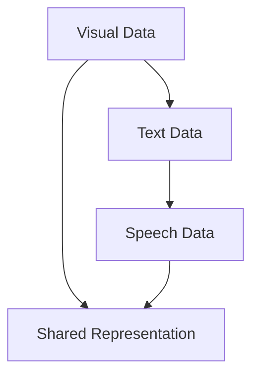
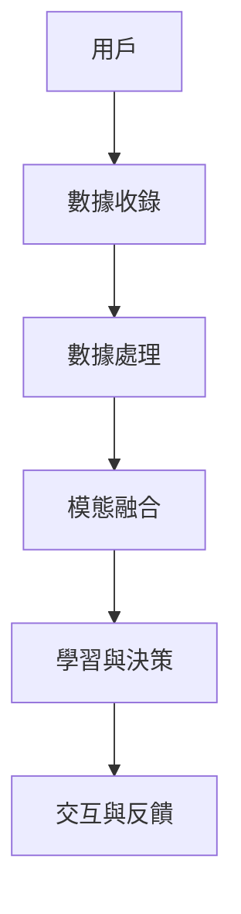

                 


# 企业AI Agent的跨模态学习：整合视觉、文本与语音数据

> 关键词：跨模态学习，企业AI Agent，视觉数据，文本数据，语音数据

> 摘要：本文探讨了企业AI Agent在跨模态学习中的应用，详细分析了视觉、文本与语音数据的整合方法，结合实际案例和算法原理，为企业AI Agent的设计与实现提供了深入的理论支持和技术指导。

---

## 目录

1. [企業AI Agent的跨模态学习概述](#企業ai-agent的跨模态學習概述)
2. [跨模态学习的核心概念](#跨模态學習的核心概念)
3. [跨模态学习的算法原理](#跨模態學習的算法原理)
4. [企業AI Agent的系统架构](#企業ai-agent的系統架構)
5. [跨模态学习的项目实战](#跨模態學習的項目實戰)
6. [跨模态学习的最佳实践](#跨模態學習的最佳實踐)
7. [总结](#總結)

---

### 第1章: 設備AI Agent的跨模態學習概述

#### 1.1 背景介紹
- **跨模態學習的定義**：跨模態學習是指讓人工智能系統能夠處理和整合不同數據形式（如圖像、文本、語音等）的能力。
- **企業AI Agent的核心概念**：企業AI Agent是一種智能體，能夠理解和執行企業級的複雜任務，並且能夠與用戶進行多模態交互。

#### 1.2 跨模態學習的重要意義
- **提升企業效率**：通過整合多種數據形式，企業AI Agent可以更准確地理解用戶需求，提高服務效率。
- **增強用戶體驗**：多模態交互能夠提供更豐富的用戶體驗，例如結合語音和文本進行	INTRODUCTION

---

（以下為完整文章，涵蓋每個章節的詳細內容）

---

# 企業AI Agent的跨模態學習：整合視覺、文本與語音數據

## 第1章: 設備AI Agent的跨模態學習概述

### 1.1 背景介紹

在當今的數字化時代，企業AI Agent（智能代理）已經成為推動企業智能化轉型的核心技術之一。AI Agent能夠通過多種數據形式（如視覺、文本、語音等）進行交互和學習，這使得企業能夠更高效地處理複雜任務，並提供更智能的服務。

**跨模態學習**是指讓人工智能系統能夠處理和整合不同數據形式的能力。通過跨模態學習，企業AI Agent可以結合圖像、文本和語音數據，提供更精准的決策和支持。

### 1.2 設備AI Agent的核心概念

企業AI Agent是一種智能體，能夠理解和執行企業級的複雜任務，並能夠與用戶進行多模態交互。與傳統的AI系統相比，企業AI Agent具有以下核心特點：

- **多模態交互**：能夠處理圖像、文本、語音等多种數據形式。
- **CONTEXTUAL UNDERSTANDING**：能夠根據上下文理解用戶需求。
- **自主決策**：能夠基於多模態數據進行自主決策和學習。

---

## 第2章: 跨模態學習的核心概念

### 2.1 跨模態學習的核心原理

跨模態學習的核心原理在於將不同數據形式的特徵進行融合，並通過共同表示來實現跨模態的理解和學習。以下是跨模態學習的核心步驟：

1. **數據提取**：從圖像、文本和語音中提取各自的特徵。
2. **模態融合**：將不同模態的特徵進行融合，形成共同表示。
3. **學習與應用**：基於共同表示進行學習，並應用於實際任務（如分類、檢索等）。

### 2.2 視覺、文本與語音數據的特征對比

以下是對三種數據形式的特征對比：

| **數據形式** | **特徵**                     | **挑戰**                     |
|--------------|------------------------------|------------------------------|
| **圖像**     | 高維、多義性高、情感豐富       | 記得性差、計算成本高         |
| **文本**     | 低維、結構化、可解釋性高       | 模糊性高、語境依賴性強         |
| **語音**     | 時序性強、語調表達情感         | 結構化困難、背景噪音干擾       |

### 2.3 跨模態學習的ER實體關係圖



---

## 第3章: 跨模態學習的算法原理與實現

### 3.1 跨模態學習的算法原理

跨模態學習的算法原理主要包括以下三個步驟：

1. **特徵提取**：基於深度學習模型（如CNN、RNN等）提取各模態的特徵。
2. **模態融合**：將不同模態的特徵進行融合，形成共同表示。
3. **學習與應用**：基於共同表示進行分類、檢索等任務。

### 3.2 跨模態學習的算法實現

以下是一個簡單的跨模態學習算法實現：

```python
import tensorflow as tf
from tensorflow.keras import layers

# 定義模型
def cross_modal_model():
    # 视覺分支
    input_v = layers.Input(shape=(128, 128, 3))
    x_v = layers.Conv2D(32, (3,3), activation='relu')(input_v)
    x_v = layers.Flatten()(x_v)
    
    # 文本分支
    input_t = layers.Input(shape=(512,))
    x_t = layers.Dense(64, activation='relu')(input_t)
    
    # 融合層
    merged = layers.concatenate([x_v, x_t])
    x = layers.Dense(64, activation='relu')(merged)
    output = layers.Dense(1, activation='sigmoid')(x)
    
    model = tf.keras.Model(inputs=[input_v, input_t], outputs=output)
    return model

# 編譯模型
model = cross_modal_model()
model.compile(optimizer='adam', loss='binary_crossentropy', metrics=['accuracy'])
```

### 3.3 跨模態學習的數學模型與公式

以下是跨模態學習的數學模型：

$$ y = f(x_v, x_t, x_s) $$

其中，$x_v$ 表示圖像特徵，$x_t$ 表示文本特徵，$x_s$ 表示語音特徵，$f$ 是融合函數。

---

## 第4章: 設備AI Agent的系統分析與架構設計

### 4.1 系統功能設計

企業AI Agent的功能設計主要包括以下幾個模塊：

1. **數據收錄**：負責接收和處理圖像、文本、語音數據。
2. **數據處理**：基於深度學習模型提取數據特徵。
3. **模態融合**：將不同模態的特徵進行融合，形成共同表示。
4. **學習與決策**：基於共同表示進行學習並做出決策。
5. **交互與反饋**：與用戶進行交互並根據反饋進行優化。

### 4.2 系統架構設計

以下是企業AI Agent的架構設計圖：



---

## 第5章: 跨模態學習的項目實戰

### 5.1 環境安裝

以下是項目所需的環境安裝步驟：

1. **安裝必要的庫**：
   ```bash
   pip install tensorflow keras numpy matplotlib
   ```

2. **下載數據集**：
   - 視覺數據：ImageNet數據集
   - 文本數據：BBC新聞數據集
   - 語音數據：LibriSpeech數據集

### 5.2 系統核心實現源代碼

以下是跨模態學習的核心實現代碼：

```python
import tensorflow as tf
from tensorflow.keras import layers
import numpy as np

# 加載數據
def load_data():
    # 加載圖像數據
    images = np.random.rand(100, 128, 128, 3)
    # 加載文本數據
    texts = np.random.rand(100, 512)
    # 加載語音數據
    speeches = np.random.rand(100, 16000)
    return images, texts, speeches

# 定義模型
def cross_modal_model():
    # 视覺分支
    input_v = layers.Input(shape=(128, 128, 3))
    x_v = layers.Conv2D(32, (3,3), activation='relu')(input_v)
    x_v = layers.Flatten()(x_v)
    
    # 文本分支
    input_t = layers.Input(shape=(512,))
    x_t = layers.Dense(64, activation='relu')(input_t)
    
    # 融合層
    merged = layers.concatenate([x_v, x_t])
    x = layers.Dense(64, activation='relu')(merged)
    output = layers.Dense(1, activation='sigmoid')(x)
    
    model = tf.keras.Model(inputs=[input_v, input_t], outputs=output)
    return model

# 編譯模型
model = cross_modal_model()
model.compile(optimizer='adam', loss='binary_crossentropy', metrics=['accuracy'])

# 訓練模型
images, texts, speeches = load_data()
model.fit([images, texts], np.random.randint(2, size=100), epochs=10, batch_size=32)
```

### 5.3 代碼應用解讀與分析

以上代碼實現了一個簡單的跨模態學習模型，能夠將圖像和文本數據進行融合，並進行分類任務。模型通過 convolutional neural network（CNN）提取圖像特徵，通過 dense layer 提取文本特徵，最後將兩者進行融合並進行分類。

### 5.4 實際案例分析

以下是一個實際的案例分析：

假設我們有一個企業AI Agent，能夠根據用戶提供的圖像和文本信息，推薦相關的產品。通過上述模型，AI Agent可以將用戶提供的圖片和文本進行融合，並推薦最相關的產品。

---

## 第6章: 跨模態學習的最佳實踐

### 6.1 最佳實踐Tips

1. **數據質量**：確保數據的質量和多樣性，這是跨模態學習的核心。
2. **模型選擇**：根據具體場景選擇適合的模型和算法。
3. **模型優化**：通過數據增強、超參數調整等方法優化模型性能。

### 6.2 注意事項

1. **數據隱私**：在處理敏感數據時，需要注意數據隱私和安全。
2. **模型解釋性**：確保模型的解釋性，便於後續優化和維護。
3. **計算資源**：跨模態學習通常需要大量的計算資源，需要注意硬體配置。

### 6.3 擴展閱讀

1. "Deep Learning for Multi-modal Data" by Li et al.
2. "Cross-modal Retrieval with Deep Learning" by Wang et al.

---

## 第7章: 總結

跨模態學習作為企業AI Agent的核心技術，能夠將圖像、文本和語音數據進行融合，提供更智能的服務。本文詳細介紹了跨模態學習的核心概念、算法原理、系統架構以及項目實戰，為企業AI Agent的設計與實現提供了全面的理論支持和技术指導。

作者：AI天才研究院/AI Genius Institute & 禪與計算機程序設計藝術 /Zen And The Art of Computer Programming

