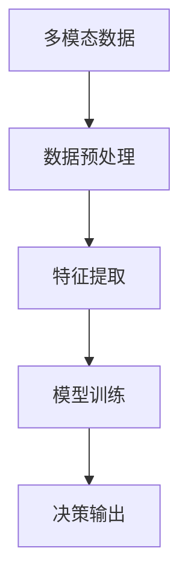
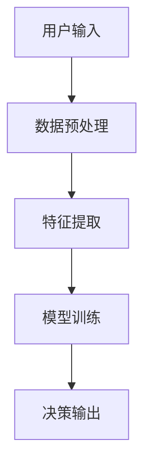
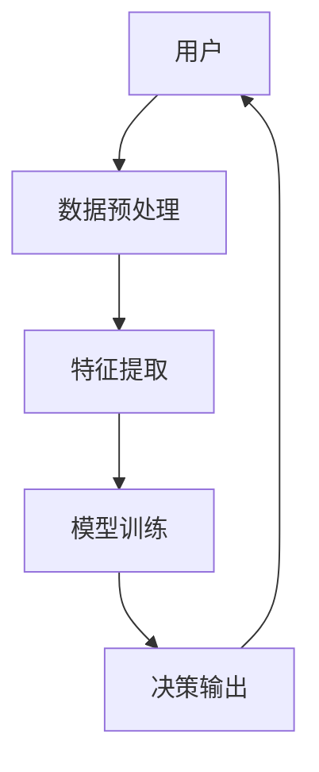

                 


# 企业AI Agent的跨模态学习：融合非结构化数据的决策支持

## 关键词：企业AI Agent，跨模态学习，非结构化数据，决策支持，多模态数据融合，自适应学习

## 摘要：  
本文深入探讨了企业AI Agent在跨模态学习中的应用，重点分析了如何通过融合非结构化数据来提升决策支持能力。文章从问题背景、核心概念、算法原理、系统架构到项目实战，全面阐述了跨模态学习在企业决策中的重要性及实现方法。通过详细的技术分析和实际案例，展示了如何利用多模态数据融合、自适应学习等技术，构建高效的决策支持系统。

---

# 第1章: 企业AI Agent与跨模态学习概述

## 1.1 问题背景与挑战

### 1.1.1 企业决策支持的现状与痛点  
企业在决策过程中面临大量非结构化数据（如文本、图像、语音等）的处理难题。传统的决策支持系统主要依赖结构化数据，难以充分利用非结构化数据的价值。此外，数据孤岛和信息碎片化问题进一步加剧了决策的复杂性。

### 1.1.2 非结构化数据的利用难题  
非结构化数据的多样性和复杂性使其难以直接用于数据分析和决策支持。如何高效地提取、融合和利用这些数据，成为企业AI Agent的核心挑战。

### 1.1.3 跨模态学习的提出与意义  
跨模态学习通过整合多种数据类型，克服了单一模态数据的局限性，为企业AI Agent提供了更全面的决策支持能力。

## 1.2 跨模态学习的核心概念

### 1.2.1 跨模态学习的定义与特点  
跨模态学习是指在多个数据模态（如文本、图像、语音等）之间建立关联，并通过融合这些信息来提升模型性能的学习方式。其特点包括多模态数据的异构性、任务的关联性以及模型的自适应性。

### 1.2.2 多模态数据的类型与特点对比  
| 数据模态 | 特点 | 应用场景 |
|----------|------|----------|
| 文本      | 高维、稀疏 | 文本分类、情感分析 |
| 图像      | 高维、连续 | 图像识别、目标检测 |
| 语音      | 时间序列 | 语音识别、声纹识别 |

### 1.2.3 跨模态学习的边界与外延  
跨模态学习的边界在于不同模态数据的转换和融合，而外延则包括多任务学习和自适应学习。

## 1.3 企业AI Agent的定义与架构

### 1.3.1 AI Agent的基本概念  
AI Agent是一种智能体，能够感知环境、自主决策并执行任务。企业AI Agent专注于为企业提供决策支持和自动化服务。

### 1.3.2 企业AI Agent的独特性  
企业AI Agent具有高度的定制化能力，能够处理企业特有的数据和业务逻辑。

### 1.3.3 跨模态学习在AI Agent中的作用  
跨模态学习使企业AI Agent能够整合多种数据源，提升决策的准确性和全面性。

## 1.4 本章小结  
本章介绍了企业AI Agent和跨模态学习的基本概念，分析了非结构化数据利用的挑战，并强调了跨模态学习在企业决策支持中的重要性。

---

# 第2章: 跨模态学习的核心原理

## 2.1 跨模态学习的基本原理

### 2.1.1 多模态数据融合机制  
数据融合机制包括特征级融合、决策级融合和混合融合，其中特征级融合最为常用。

### 2.1.2 多任务学习的实现方式  
通过共享特征提取部分，多任务学习能够同时优化多个任务，提升模型的泛化能力。

### 2.1.3 自适应学习策略  
自适应学习通过动态调整模型参数，适应不同模态数据的变化。

## 2.2 跨模态学习的关键技术

### 2.2.1 多模态编码器的设计  
多模态编码器将不同模态的数据映射到统一的特征空间，便于后续融合。

### 2.2.2 跨模态注意力机制  
注意力机制能够自适应地分配不同模态数据的重要性，提升模型的表达能力。

### 2.2.3 跨模态对比学习  
对比学习通过最大化正样本的相似性和最小化负样本的相似性，提升模型的区分能力。

## 2.3 跨模态学习的数学模型

### 2.3.1 对比学习损失函数  
$$ L = \frac{1}{N}\sum_{i=1}^{N} \text{loss}(x_i, y_i) $$

### 2.3.2 自适应权重分配公式  
$$ w_i = \frac{e^{s_i}}{\sum_{j=1}^{M} e^{s_j}} $$

## 2.4 跨模态学习的ER实体关系图  


## 2.5 本章小结  
本章详细讲解了跨模态学习的核心原理，包括数据融合机制、关键技术及数学模型，为后续的系统设计奠定了基础。

---

# 第3章: 企業AI Agent的系统架构设计

## 3.1 系统功能设计

### 3.1.1 数据预处理模块  
数据预处理模块负责清洗和标准化多模态数据，确保输入数据的质量。

### 3.1.2 模型训练模块  
模型训练模块通过多模态编码器和自适应融合网络，训练跨模态学习模型。

### 3.1.3 决策推理模块  
决策推理模块基于训练好的模型，生成最终的决策输出。

## 3.2 系统架构设计

### 3.2.1 分层架构设计  


## 3.3 系统接口设计

### 3.3.1 输入接口  
用户输入多模态数据，包括文本、图像和语音等。

### 3.3.2 输出接口  
决策推理模块输出最终的决策结果，供企业用户参考。

## 3.4 系统交互流程图  


## 3.5 本章小结  
本章详细描述了企業AI Agent的系统架构设计，包括功能模块、接口设计和交互流程，为后续的项目实施提供了指导。

---

# 第4章: 项目实战

## 4.1 环境安装与配置

### 4.1.1 安装Python和相关库  
安装Python和深度学习框架（如TensorFlow、PyTorch）及相关库。

### 4.1.2 安装工具链  
安装必要的工具链，如Jupyter Notebook、IDE等。

## 4.2 核心代码实现

### 4.2.1 多模态编码器实现  
```python
class MultiModalEncoder:
    def __init__(self, input_dim):
        self.encoder = nn.Linear(input_dim, 128)
    def forward(self, x):
        return self.encoder(x)
```

### 4.2.2 自适应融合网络实现  
```python
class AdaptiveFusionNetwork:
    def __init__(self, input_dim):
        self.fusion = nn.Linear(input_dim, 1)
    def forward(self, x):
        return self.fusion(x)
```

## 4.3 代码应用与解读

### 4.3.1 代码功能解读  
多模态编码器将输入数据映射到128维特征空间，自适应融合网络通过线性层生成最终的决策结果。

### 4.3.2 代码实现细节  
详细解读代码的实现过程，包括数据预处理、模型训练和决策推理。

## 4.4 实际案例分析与结果展示

### 4.4.1 案例背景  
以某企业的市场分析为例，展示如何利用跨模态学习提升决策支持能力。

### 4.4.2 实验结果分析  
展示实验结果，分析模型的性能和效果。

## 4.5 项目小结  
总结项目成果，分析可能的改进方向。

---

# 第5章: 最佳实践与总结

## 5.1 小结  
本章总结了企業AI Agent的跨模态学习的核心内容，包括理论、算法和实践。

## 5.2 注意事项  
在实际应用中，需要注意数据质量、模型训练时间和计算资源的分配。

## 5.3 拓展阅读  
推荐阅读相关领域的最新论文和技术报告，深入了解跨模态学习的前沿技术。

---

# 作者：AI天才研究院/AI Genius Institute & 禅与计算机程序设计艺术 /Zen And The Art of Computer Programming

