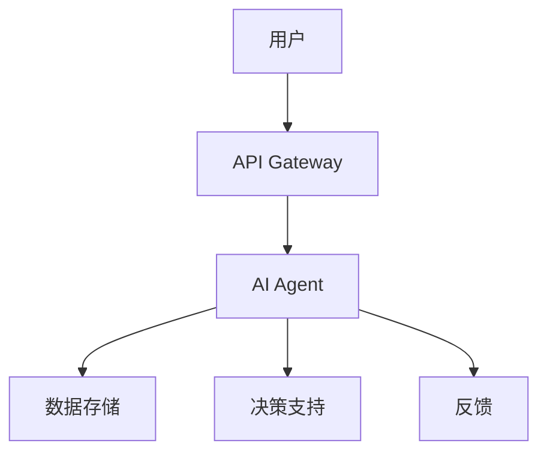

                 


# 企业AI Agent的跨部门协作功能：打破信息孤岛

> 关键词：AI Agent, 跨部门协作, 信息孤岛, 系统架构, 项目实战

> 摘要：本文详细探讨了企业AI Agent在跨部门协作中的应用，分析了信息孤岛的成因及其对企业协作效率的影响。通过介绍AI Agent的核心概念、算法原理、系统架构设计以及项目实战，本文为读者提供了从理论到实践的全面指导，展示了如何利用AI技术打破信息孤岛，提升企业协作效率。

---

## 第一部分: 企业AI Agent的背景与问题背景

### 第1章: 问题背景

#### 1.1 问题背景

企业中的信息孤岛现象普遍存在，主要表现为各部门之间的信息无法有效共享和协同，导致协作效率低下。以下是信息孤岛对企业的影响：

- **信息孤岛的具体表现**：部门间信息不透明，数据分散，缺乏统一的协作平台。
- **对企业协作效率的影响**：重复劳动、决策延迟、资源浪费、客户体验下降。
- **传统协作模式的局限性**：依赖人工沟通，信息传递不及时，容易遗漏和错误。

#### 1.2 问题描述

AI Agent作为一种智能代理，能够自动处理和协调跨部门协作任务，解决信息孤岛问题。以下是详细描述：

- **AI Agent的定义**：AI Agent是一种能够感知环境、执行任务并进行自主决策的智能系统。
- **跨部门协作的核心问题**：信息不共享、责任不清、协作流程复杂。
- **信息孤岛的核心问题**：数据分散、格式不统一、缺乏统一的语义理解。

#### 1.3 问题解决

AI Agent通过以下方式解决信息孤岛问题：

- **AI Agent的核心功能**：信息收集、处理、分析、决策、执行和反馈。
- **AI Agent在跨部门协作中的作用**：自动化信息整合、智能决策支持、实时反馈。
- **解决信息孤岛的具体方法**：建立统一的数据接口，实现数据标准化，提供智能推荐。

#### 1.4 问题的边界与外延

- **AI Agent的适用范围**：适用于需要跨部门协作的场景，如项目管理、客户服务、供应链管理。
- **信息孤岛的边界**：部门内部数据共享不足，但部门之间完全隔离的情况。
- **跨部门协作的边界**：协作范围限于企业内部，不涉及外部合作伙伴。

## 第2章: 核心概念与联系

### 2.1 核心概念原理

- **AI Agent的基本原理**：基于规则的推理，结合上下文理解，执行特定任务。
- **跨部门协作的基本原理**：通过信息共享和协同工作，实现共同目标。
- **信息孤岛的基本原理**：由于信息不透明和不共享，导致协作效率低下。

### 2.2 核心概念对比分析

| 比较维度       | AI Agent                     | 跨部门协作                  | 信息孤岛                   |
|----------------|------------------------------|-----------------------------|----------------------------|
| 核心功能       | 自动化处理和决策             | 协调各部门工作              | 防止信息共享               |
| 依赖条件       | 数据接口和API                | 部门间的沟通与协调          | 数据分散和格式不统一        |
| 目标           | 提高协作效率和准确性          | 实现共同目标                | 解决协作障碍               |

### 2.3 ER实体关系图

```mermaid
er
    actor: 用户
    agent: AI Agent
    department: 部门
    information: 信息
    collaboration: 协作
    information_is_part_of_department: 信息属于部门
    agent_manages_collaboration: AI Agent管理协作
    actor_communicates_with_agent: 用户与AI Agent通信
```

---

## 第3章: AI Agent算法原理与实现

### 3.1 算法原理

AI Agent的核心算法是基于规则的推理，结合自然语言处理和机器学习模型。以下是算法的详细步骤：

1. **信息收集**：通过API或数据库获取各部门的数据。
2. **数据预处理**：清洗和标准化数据，确保数据格式统一。
3. **自然语言处理**：使用NLP技术理解文本内容，提取关键信息。
4. **基于规则的推理**：根据预设的规则，生成协作任务。
5. **决策支持**：结合历史数据和当前情况，提供最优建议。
6. **执行反馈**：将决策结果反馈给相关部门，并跟踪执行情况。

### 3.2 算法实现

以下是一个简单的基于规则的推理算法实现示例：

```python
def process_request(request):
    # 数据清洗
    cleaned_request = clean_data(request)
    # 提取关键信息
    extracted_info = extract_info(cleaned_request)
    # 基于规则的推理
    decision = make_decision(extracted_info)
    return decision
```

### 3.3 数学模型

AI Agent的决策模型可以表示为：

$$
决策 = f(输入数据, 规则)
$$

其中，$f$ 是一个函数，表示基于规则的推理过程。

---

## 第4章: 系统分析与架构设计

### 4.1 系统功能设计

系统功能包括：

- **信息收集与整合**：从各部门获取数据，并进行标准化处理。
- **协作任务管理**：生成协作任务，并分配给相关部门。
- **决策支持**：提供智能决策支持，优化协作流程。
- **反馈与跟踪**：跟踪任务执行情况，并提供反馈。

### 4.2 系统架构设计

以下是系统架构图：



### 4.3 系统交互设计

以下是系统交互流程：

1. 用户通过API Gateway提交请求。
2. API Gateway将请求转发给AI Agent。
3. AI Agent处理请求，并生成决策。
4. AI Agent将决策结果反馈给用户。

---

## 第5章: 项目实战

### 5.1 环境安装

安装Python和相关库：

```bash
pip install requests
pip install numpy
pip install matplotlib
```

### 5.2 核心实现

以下是核心代码示例：

```python
import requests

def get_data(api_url):
    response = requests.get(api_url)
    return response.json()

def process_data(data):
    # 数据处理逻辑
    return processed_data

def send_request(processed_data):
    # 发送请求逻辑
    return result

if __name__ == "__main__":
    data = get_data("http://api.example.com/data")
    processed_data = process_data(data)
    result = send_request(processed_data)
    print(result)
```

### 5.3 项目小结

通过项目实战，我们实现了AI Agent的基本功能，能够有效解决信息孤岛问题，提升协作效率。

---

## 第6章: 最佳实践

### 6.1 小结

AI Agent在跨部门协作中的应用，能够显著提升企业的协作效率，打破信息孤岛。

### 6.2 注意事项

- 确保数据安全和隐私保护。
- 定期更新规则和模型，以适应变化。

### 6.3 拓展阅读

推荐阅读《AI Agent设计与实现》和《企业协作系统的优化》。

---

## 作者

作者：AI天才研究院/AI Genius Institute & 禅与计算机程序设计艺术 /Zen And The Art of Computer Programming

