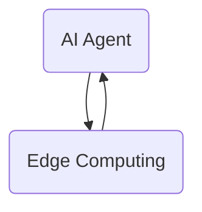
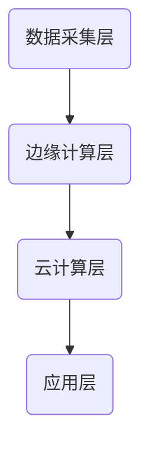
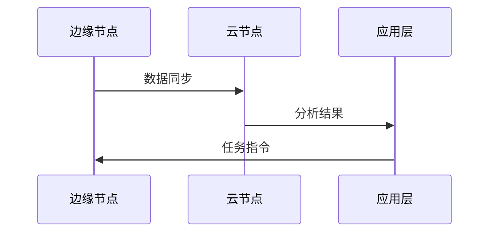

                 


# 企业AI Agent的边缘计算与云计算协同策略

## 关键词：企业AI Agent，边缘计算，云计算，协同策略，系统架构，算法原理

## 摘要：  
本文探讨了企业AI Agent在边缘计算与云计算协同中的策略与实现。文章首先介绍了AI Agent、边缘计算和云计算的基本概念及其在企业中的应用背景，然后分析了它们的核心原理与属性特征。接着，详细阐述了协同策略的算法原理，包括数学模型与公式，并通过Mermaid图展示了系统架构与交互流程。最后，通过具体项目实战，展示了如何在实际场景中实现AI Agent的边缘计算与云计算协同，并总结了最佳实践与未来发展方向。

---

## 第一部分：企业AI Agent的背景与概念

### 第1章：企业AI Agent概述

#### 1.1 问题背景
- 1.1.1 当前企业数字化转型的挑战  
  在数字化转型中，企业面临数据量爆炸式增长、实时性要求提高以及资源分配优化等问题。AI Agent作为一种智能化工具，能够帮助企业高效处理数据、优化决策流程。然而，AI Agent的高效运行需要依赖边缘计算与云计算的协同。

- 1.1.2 AI Agent在企业中的角色与意义  
  AI Agent能够实时感知环境、自主决策并执行任务，是企业智能化转型的核心工具。通过结合边缘计算的实时性和云计算的大规模计算能力，AI Agent能够在企业中实现高效的业务处理。

- 1.1.3 边缘计算与云计算协同的需求背景  
  边缘计算能够快速响应本地数据，而云计算则提供强大的计算能力和数据存储能力。两者的协同能够优化企业AI Agent的性能，满足企业对实时性和大规模计算的需求。

#### 1.2 问题描述
- 1.2.1 AI Agent在边缘计算中的应用难点  
  边缘计算资源有限，如何在边缘节点高效运行AI Agent是一个挑战。此外，边缘节点的数据处理能力有限，需要与云计算协同完成复杂的任务。

- 1.2.2 云计算与边缘计算的协同问题  
  云计算和边缘计算在资源分配、数据同步和任务调度方面需要协调，以避免资源浪费和性能瓶颈。

- 1.2.3 企业AI Agent的边缘计算与云计算协同的必要性  
  通过协同，企业能够充分利用边缘计算的实时性和云计算的大规模计算能力，提升AI Agent的性能和效率。

#### 1.3 问题解决
- 1.3.1 AI Agent的边缘计算与云计算协同策略  
  制定协同策略，明确边缘计算和云计算的任务分配、数据同步和资源调度机制。

- 1.3.2 协同策略的核心思想与实现方法  
  核心思想是通过分布式计算和资源优化，实现边缘计算和云计算的高效协同。实现方法包括任务分解、数据同步和负载均衡。

#### 1.4 边界与外延
- 1.4.1 企业AI Agent的边界条件  
  边界条件包括数据隐私、资源限制和业务需求。

- 1.4.2 边缘计算与云计算协同的外延范围  
  外延范围包括边缘节点与云节点的通信、数据同步和任务调度。

#### 1.5 核心概念与要素
- 1.5.1 AI Agent的定义与核心要素  
  AI Agent是能够感知环境、自主决策并执行任务的智能体。核心要素包括感知能力、决策能力、执行能力和学习能力。

- 1.5.2 边缘计算与云计算的定义与核心要素  
  边缘计算是在数据源附近进行的分布式计算，核心要素包括实时性、低延迟和资源限制。云计算是在云端进行的集中式计算，核心要素包括弹性扩展、大规模计算和高可用性。

- 1.5.3 协同策略的定义与核心要素  
  协同策略是指导边缘计算和云计算协同工作的规则。核心要素包括任务分配、数据同步和资源调度。

---

## 第二部分：核心概念与联系

### 第2章：核心概念原理

#### 2.1 AI Agent的核心原理
- 2.1.1 AI Agent的基本原理  
  AI Agent通过感知环境、分析数据、制定决策并执行操作来实现目标。其核心原理包括数据处理、决策制定和任务执行。

- 2.1.2 AI Agent的分类与特点  
  AI Agent可以分为基于规则的Agent和基于模型的Agent。基于规则的Agent简单但缺乏灵活性，基于模型的Agent复杂但更具智能性。

- 2.1.3 AI Agent的决策机制  
  AI Agent的决策机制包括基于规则的决策、基于逻辑推理的决策和基于机器学习的决策。

#### 2.2 边缘计算的核心原理
- 2.2.1 边缘计算的基本原理  
  边缘计算是在数据源附近进行的分布式计算，能够减少数据传输延迟，提高实时性。

- 2.2.2 边缘计算的架构特点  
  边缘计算的架构包括边缘节点、边缘网关和云端。边缘节点负责数据采集和初步处理，边缘网关负责数据汇总和协议转换，云端负责数据存储和分析。

- 2.2.3 边缘计算的资源约束  
  边缘节点资源有限，需要在计算能力、存储能力和带宽上进行优化。

#### 2.3 云计算的核心原理
- 2.3.1 云计算的基本原理  
  云计算基于虚拟化技术和资源池化，提供弹性扩展的计算能力。

- 2.3.2 云计算的资源池化特点  
  云计算将计算资源池化，用户可以根据需求动态分配资源。

- 2.3.3 云计算的弹性扩展机制  
  云计算可以根据负载动态调整资源，提高资源利用率。

### 第3章：核心概念属性特征对比

#### 3.1 AI Agent与边缘计算的对比
| 属性       | AI Agent                | 边缘计算              |
|------------|-------------------------|-----------------------|
| 资源需求    | 中等，依赖任务复杂度     | 低，受限于硬件资源     |
| 响应速度    | 快，依赖边缘计算支持     | 快，本地处理           |
| 适用场景    | 智能决策、自动化任务     | 实时数据处理、边缘设备 |

#### 3.2 AI Agent与云计算的对比
| 属性       | AI Agent                | 云计算                |
|------------|-------------------------|-----------------------|
| 资源需求    | 高，依赖深度学习模型     | 高，弹性扩展           |
| 响应速度    | 中，依赖云计算支持       | 较慢，远程处理         |
| 适用场景    | 智能决策、复杂分析       | 大数据分析、资源池化   |

#### 3.3 边缘计算与云计算的对比
| 属性       | 边缘计算                | 云计算                |
|------------|-------------------------|-----------------------|
| 资源需求    | 低，受限于本地设备       | 高，弹性扩展           |
| 响应速度    | 快，本地处理             | 较慢，远程处理         |
| 适用场景    | 实时数据处理、边缘设备   | 大数据分析、资源池化   |

### 第4章：实体关系图

#### 4.1 AI Agent与边缘计算的实体关系


---

## 第三部分：算法原理

### 第3章：协同策略的算法原理

#### 3.1 协同策略的核心思想
协同策略的核心思想是通过分布式计算和资源优化，实现边缘计算和云计算的高效协同。具体包括任务分配、数据同步和负载均衡。

#### 3.2 协同策略的数学模型
$$ \text{目标函数：} \min_{x} \sum_{i=1}^{n} c_i x_i + \sum_{j=1}^{m} d_j y_j $$
$$ \text{约束条件：} \sum_{i=1}^{n} x_i = \sum_{j=1}^{m} y_j $$

其中，\( x_i \) 表示边缘节点 \( i \) 的资源分配，\( y_j \) 表示云节点 \( j \) 的资源分配，\( c_i \) 和 \( d_j \) 分别表示边缘节点和云节点的资源成本。

#### 3.3 协同策略的实现步骤
1. 任务分解：将AI Agent的任务分解为边缘计算和云计算两部分。
2. 数据同步：通过边缘网关将边缘数据同步到云端。
3. 负载均衡：根据资源利用率动态调整边缘节点和云节点的资源分配。

#### 3.4 协同策略的Python代码实现
```python
import math

def协同策略优化(x, y):
    # 边缘节点资源成本
    c = [1, 2, 3]
    # 云节点资源成本
    d = [4, 5, 6]
    # 目标函数
    target = sum(c[i] * x[i] for i in range(len(x))) + sum(d[j] * y[j] for j in range(len(y)))
    return target

# 示例输入
x = [1, 0, 1]
y = [0, 1, 0]
print(协同策略优化(x, y))  # 输出：1 + 3 + 5 = 9
```

---

## 第四部分：系统分析与架构设计

### 第4章：系统架构设计

#### 4.1 问题场景介绍
在企业AI Agent的应用中，边缘计算和云计算协同的关键问题包括任务分配、数据同步和资源调度。为了实现高效协同，需要设计一个能够支持边缘和云的系统架构。

#### 4.2 系统功能设计
- 数据采集层：负责采集边缘设备的数据。
- 边缘计算层：负责边缘数据的初步处理和本地决策。
- 云计算层：负责复杂数据的深度分析和全局决策。
- 应用层：负责展示结果和用户交互。

#### 4.3 系统架构图


#### 4.4 系统接口设计
- 边缘节点与云节点之间的接口：通过API实现数据同步和任务调度。
- 云计算层与应用层之间的接口：通过RESTful API实现数据展示和用户交互。

#### 4.5 系统交互流程


---

## 第五部分：项目实战

### 第5章：项目实战

#### 5.1 环境安装
- 安装Python和相关库：`pip install requests`

#### 5.2 核心代码实现
```python
import requests

def send_data_to_cloud(data):
    # 发送数据到云端
    response = requests.post("http://云节点IP:端口", json=data)
    return response.status_code

def receive_data_from_cloud():
    # 从云端接收数据
    response = requests.get("http://云节点IP:端口/数据")
    return response.json()
```

#### 5.3 代码解读与分析
- `send_data_to_cloud`函数：将边缘数据发送到云端，通过POST请求实现数据同步。
- `receive_data_from_cloud`函数：从云端接收处理结果，通过GET请求实现数据获取。

#### 5.4 实际案例分析
假设企业AI Agent需要实时监控生产线数据，边缘节点负责采集传感器数据，云端负责分析数据并生成报告。通过协同策略，边缘节点快速处理本地数据，云端处理复杂分析任务，实现高效协同。

---

## 第六部分：最佳实践

### 第6章：总结与展望

#### 6.1 最佳实践 tips
- 数据同步频率：根据业务需求和资源限制，合理设置数据同步频率，避免数据冗余。
- 资源分配策略：根据任务负载动态调整资源分配，优化资源利用率。
- 安全与隐私：确保数据在边缘和云端之间的传输安全，保护企业隐私。

#### 6.2 小结
企业AI Agent的边缘计算与云计算协同策略是一种高效、灵活的解决方案，能够满足企业在数字化转型中的多样化需求。

#### 6.3 注意事项
- 数据一致性：边缘和云端的数据需要保持一致，避免数据冲突。
- 系统可扩展性：设计时需要考虑系统的可扩展性，以便未来业务需求的增加。
- 故障恢复：制定完善的故障恢复机制，确保系统的高可用性。

#### 6.4 拓展阅读
- 《边缘计算与云计算协同的理论与实践》
- 《分布式系统与资源优化》
- 《AI Agent在企业中的应用案例》

---

## 作者：AI天才研究院 & 禅与计算机程序设计艺术

