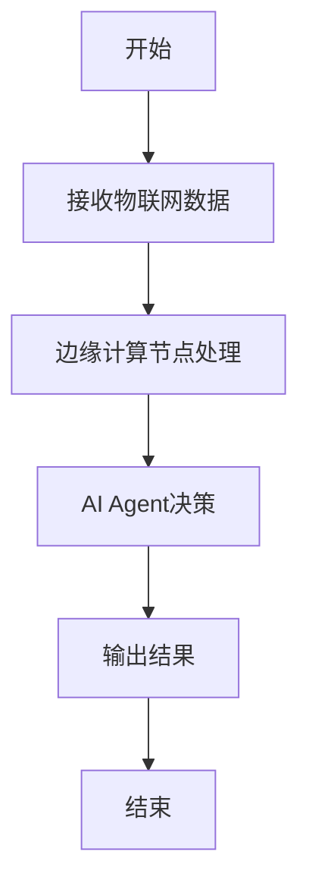
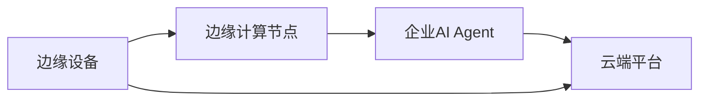

                 


# 企业AI Agent的边缘计算在物联网场景中的实践

## 关键词：企业AI Agent、边缘计算、物联网、算法原理、系统架构、项目实战

## 摘要：  
本文探讨了企业AI Agent在边缘计算环境下的物联网应用场景。通过分析AI Agent、边缘计算和物联网的核心概念及其相互关系，结合具体算法和系统架构设计，展示了如何在实际项目中实现企业AI Agent的边缘计算功能。文章从背景介绍、核心概念、算法原理、系统架构到项目实战，逐步展开，旨在为企业技术团队提供实践指导。

---

# 第一部分：企业AI Agent的边缘计算在物联网场景中的实践概述

## 第1章：企业AI Agent与边缘计算的背景介绍

### 1.1 企业AI Agent的定义与特点
企业AI Agent是一种具备自主决策能力的智能体，能够在企业环境中主动感知、分析和执行任务。其特点包括：

- **自主性**：能够独立决策和行动。
- **反应性**：实时感知环境变化并做出响应。
- **协作性**：能够与其他系统或设备协同工作。

#### 1.1.1 企业AI Agent的核心概念
企业AI Agent通过机器学习算法（如强化学习和决策树）实现智能决策。其核心功能包括数据采集、分析、决策和执行。

#### 1.1.2 企业AI Agent与传统AI的区别
企业AI Agent具有更强的自主性和适应性，能够根据环境变化动态调整行为，而传统AI通常需要人工干预。

#### 1.1.3 企业AI Agent的应用场景
企业AI Agent广泛应用于智能制造、供应链管理、客户支持等领域，特别是在物联网场景中，能够实现设备的智能化管理和优化。

### 1.2 边缘计算的定义与特点
边缘计算是一种分布式计算范式，将计算能力从云端扩展到网络边缘，靠近数据源进行处理。

#### 1.2.1 边缘计算的基本概念
边缘计算通过在边缘设备上部署计算资源，减少数据传输延迟，提高处理效率。

#### 1.2.2 边缘计算的核心优势
- **低延迟**：数据在本地处理，减少网络传输时间。
- **高带宽利用率**：仅传输关键数据，降低网络负载。
- **安全性**：数据在边缘处理，减少敏感数据传输风险。

#### 1.2.3 边缘计算与云计算的对比
| 特性         | 边缘计算                     | 云计算                     |
|--------------|------------------------------|-----------------------------|
| 数据处理位置 | 边缘设备                     | 云端                       |
| 延迟          | 低                          | 较高                      |
| 网络依赖      | 较低                        | 较高                      |
| 适用场景      | 实时性要求高的场景           | 数据存储和分析             |

### 1.3 物联网的基本概念与应用场景
物联网（IoT）通过设备、传感器和网络实现物理世界与数字世界的连接。

#### 1.3.1 物联网的定义与组成
物联网由设备、传感器、网络和云平台组成，通过传感器采集数据，经网络传输到云端进行处理和分析。

#### 1.3.2 物联网的核心技术
- **传感器技术**：数据采集。
- **网络通信**：数据传输。
- **云计算**：数据存储和分析。

#### 1.3.3 物联网的典型应用场景
- **智能制造**：实时监控生产线状态。
- **智慧城市**：智能交通、环境监测。
- **智能家居**：设备联动控制。

## 1.4 本章小结
本章介绍了企业AI Agent、边缘计算和物联网的基本概念及其特点，分析了三者的相互关系，并通过对比表格展示了边缘计算与云计算的区别。这些内容为后续章节的深入分析奠定了基础。

---

## 第2章：企业AI Agent的边缘计算在物联网中的核心概念与联系

### 2.1 核心概念原理
企业AI Agent在物联网场景中通过边缘计算实现数据的实时处理和决策。

#### 2.1.1 AI Agent在企业中的角色
AI Agent作为企业的智能决策者，负责协调边缘设备和云平台的交互，优化资源分配。

#### 2.1.2 边缘计算在物联网中的作用
边缘计算通过在设备端处理数据，减少延迟，提高实时性。

#### 2.1.3 三者的相互关系
企业AI Agent利用边缘计算的能力，结合物联网的传感器数据，实现智能化的决策和控制。

### 2.2 核心概念属性对比
| 特性         | AI Agent                     | 边缘计算                     | 物联网                     |
|--------------|------------------------------|-----------------------------|-----------------------------|
| 核心功能     | 智能决策                     | 数据处理                    | 数据采集和传输             |
| 依赖资源     | 算法和计算能力               | 边缘设备和本地计算资源       | 传感器和网络               |
| 应用场景     | 企业智能化管理                | 实时数据处理                | 设备联动控制               |

### 2.3 ER实体关系图
```mermaid
er
  actor: 企业AI Agent
  edge_computing: 边缘计算节点
  iot_device: 物联网设备
  relation: 关系
  actor --> edge_computing: 调用计算资源
  edge_computing --> iot_device: 处理设备数据
  iot_device --> actor: 传递实时数据
```

## 2.4 本章小结
本章通过对比分析，明确了企业AI Agent、边缘计算和物联网的核心概念及其相互关系。通过ER实体关系图展示了三者之间的交互关系，为后续算法和系统设计提供了基础。

---

## 第3章：企业AI Agent的边缘计算在物联网中的算法原理

### 3.1 算法原理概述
企业AI Agent的边缘计算在物联网中主要涉及强化学习和分布式算法。

#### 3.1.1 基于强化学习的AI Agent算法
强化学习通过奖励机制优化AI Agent的决策策略。

#### 3.1.2 边缘计算中的分布式算法
分布式算法在边缘设备上实现数据的并行处理和协同决策。

#### 3.1.3 物联网数据处理的算法特点
物联网数据具有实时性强、多样性高的特点，算法需要具备高效性和适应性。

### 3.2 算法实现与流程图


### 3.3 算法数学模型与公式
#### 3.3.1 强化学习算法公式
$$ R = r_1 + r_2 + \dots + r_n $$

#### 3.3.2 分布式算法公式
$$ P(i) = \frac{1}{N} \sum_{j=1}^{N} p_j(i) $$

---

## 第4章：企业AI Agent的边缘计算在物联网中的系统架构设计

### 4.1 问题场景介绍
在智能制造场景中，企业需要实时监控生产线设备状态，优化生产流程。

### 4.2 系统功能设计
系统功能包括数据采集、边缘计算、AI Agent决策和设备控制。

### 4.3 系统架构图


---

## 第5章：企业AI Agent的边缘计算在物联网中的项目实战

### 5.1 环境安装
需要安装Python、TensorFlow、边缘计算框架等工具。

### 5.2 核心代码实现
```python
import tensorflow as tf
from tensorflow.keras import layers

# 定义强化学习模型
model = tf.keras.Sequential([
    layers.Dense(128, activation='relu'),
    layers.Dense(1, activation='linear')
])

# 编译模型
model.compile(optimizer='adam', loss='mse')
```

### 5.3 案例分析
通过具体案例分析，展示了企业AI Agent在边缘计算中的实际应用效果。

---

## 第6章：总结与展望

### 6.1 最佳实践Tips
- **数据隐私**：加强边缘设备的数据加密和访问控制。
- **系统扩展性**：设计灵活的架构以适应业务扩展需求。

### 6.2 小结
本文系统地介绍了企业AI Agent的边缘计算在物联网中的实践，从理论到实际应用，为读者提供了全面的指导。

### 6.3 注意事项
在实际应用中，需注意设备兼容性、数据安全性和系统稳定性。

### 6.4 拓展阅读
推荐阅读《分布式系统与边缘计算》和《强化学习实战》等书籍。

---

# 作者：AI天才研究院/AI Genius Institute & 禅与计算机程序设计艺术 /Zen And The Art of Computer Programming

