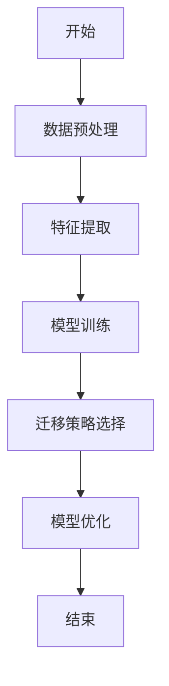

                 

# 企业AI Agent的迁移学习在跨行业应用中的实践

## 关键词：企业AI Agent，迁移学习，跨行业应用，机器学习算法，数据科学，深度学习

## 摘要：  
本文系统探讨了企业AI Agent在跨行业应用中的迁移学习实践，从理论到实践，详细分析了迁移学习的核心概念、算法原理、系统架构，并结合多个行业案例，深入讲解了如何通过迁移学习实现跨行业的高效应用。文章还提供了完整的项目实战和系统优化方案，为读者提供从理论到实践的全栈指南。

---

## 目录

### 第一部分: 企业AI Agent的迁移学习基础

#### 第1章: 企业AI Agent与迁移学习概述

##### 1.1 企业AI Agent的基本概念
- 1.1.1 AI Agent的定义与特点  
- 1.1.2 企业AI Agent的核心功能  
- 1.1.3 企业AI Agent的应用场景  

##### 1.2 迁移学习的基本原理  
- 1.2.1 迁移学习的定义与特点  
- 1.2.2 迁移学习的核心思想  
- 1.2.3 迁移学习的分类与应用  

##### 1.3 企业AI Agent与迁移学习的结合  
- 1.3.1 企业AI Agent的迁移需求  
- 1.3.2 迁移学习在企业AI Agent中的作用  
- 1.3.3 企业AI Agent迁移学习的挑战与机遇  

##### 1.4 本章小结  

---

#### 第2章: 迁移学习的核心概念与原理  

##### 2.1 迁移学习的核心概念  
- 2.1.1 源域与目标域的定义  
- 2.1.2 迁移学习的假设空间  
- 2.1.3 迁移学习的度量标准  

##### 2.2 迁移学习的数学模型与公式  
- 2.2.1 源域与目标域的联合分布  
  $$ P_{src}(x,y) + P_{tgt}(x,y) $$
- 2.2.2 迁移学习的损失函数  
  $$ L = \lambda_1 L_{src} + \lambda_2 L_{tgt} $$
- 2.2.3 迁移学习的优化目标  
  $$ \min_{\theta} \sum_{i=1}^n (y_i - f_\theta(x_i))^2 $$

##### 2.3 迁移学习的算法流程  

##### 2.4 本章小结  

---

#### 第3章: 企业AI Agent的迁移学习策略  

##### 3.1 迁移学习的主流策略  
- 3.1.1 直接迁移  
- 3.1.2 数据增强迁移  
- 3.1.3 特征对齐迁移  

##### 3.2 企业AI Agent的迁移策略选择  
- 3.2.1 企业场景下的数据特点  
- 3.2.2 迁移策略的适用性分析  
- 3.2.3 策略选择的优化方法  

##### 3.3 迁移学习的性能评估  
- 3.3.1 评估指标的定义  
- 3.3.2 评估方法的选择  
- 3.3.3 评估结果的分析  

##### 3.4 本章小结  

---

#### 第4章: 迁移学习的算法实现与优化  

##### 4.1 迁移学习的算法实现  
- 4.1.1 基于深度学习的迁移学习  
- 4.1.2 基于特征提取的迁移学习  
- 4.1.3 基于对抗训练的迁移学习  

##### 4.2 迁移学习的优化技巧  
- 4.2.1 模型权重的迁移策略优化  
- 4.2.2 数据增强与特征工程优化  
- 4.2.3 超参数调优与模型压缩  

##### 4.3 本章小结  

---

### 第二部分: 跨行业应用实战  

#### 第5章: 跨行业迁移学习的实现与案例分析  

##### 5.1 跨行业迁移学习的实现  
- 5.1.1 数据预处理与特征提取  
- 5.1.2 跨领域模型的构建与训练  
- 5.1.3 跨行业场景的迁移策略选择  

##### 5.2 跨行业迁移学习的案例分析  
- 5.2.1 零售业与金融行业的跨领域迁移  
- 5.2.2 制造业与医疗行业的跨领域迁移  
- 5.2.3 电商与物流行业的跨领域迁移  

##### 5.3 本章小结  

---

### 第三部分: 企业级迁移学习系统的优化与部署  

#### 第6章: 企业级迁移学习系统的优化与部署  

##### 6.1 企业级迁移学习系统的优化  
- 6.1.1 模型优化与性能调优  
- 6.1.2 系统扩展与可扩展性设计  
- 6.1.3 模型监控与实时反馈机制  

##### 6.2 企业级迁移学习系统的部署  
- 6.2.1 系统架构设计与实现  
- 6.2.2 系统接口设计与交互  
- 6.2.3 系统安全与稳定性保障  

##### 6.3 本章小结  

---

## 结论与未来展望  

企业在跨行业应用中，迁移学习已经成为提升AI Agent效率和性能的关键技术。通过本文的系统分析和实践案例，我们展示了如何通过迁移学习实现跨行业的高效应用。未来，随着深度学习和大数据技术的不断发展，迁移学习将在企业AI Agent中发挥更大的作用，为企业创造更大的价值。

---

## 作者：AI天才研究院（AI Genius Institute）  
禅与计算机程序设计艺术（Zen And The Art of Computer Programming）

