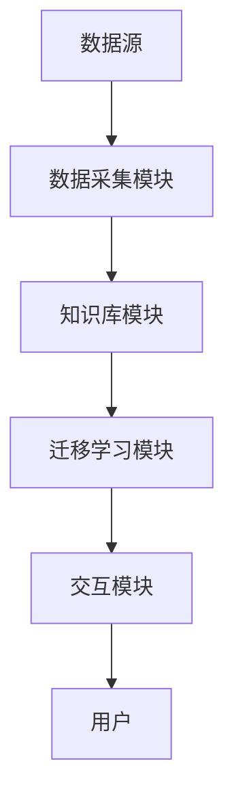

                 


# 《企业AI Agent的迁移学习在跨行业知识迁移中的实践》

## 关键词：迁移学习，AI Agent，跨行业知识迁移，企业智能化，机器学习

## 摘要

本文探讨了企业AI Agent在跨行业知识迁移中的应用，重点分析了迁移学习技术如何帮助企业AI Agent实现跨行业知识的有效迁移。通过详细阐述迁移学习的核心原理、算法实现、系统架构设计以及实际项目案例，本文为读者提供了从理论到实践的全面指南。我们还将讨论如何通过迁移学习优化企业AI Agent的性能，并展望未来的发展方向。

---

## 第1章：迁移学习概述

### 1.1 迁移学习的基本概念

#### 1.1.1 迁移学习的定义

迁移学习是一种机器学习技术，旨在将从一个领域或任务中学到的知识迁移到另一个领域或任务中。与传统机器学习不同，迁移学习的核心在于利用已有的知识来提高新任务的性能。

#### 1.1.2 迁移学习的核心原理

迁移学习的核心原理在于数据之间的相似性。通过分析源领域和目标领域之间的共同特征，迁移学习算法能够将源领域的知识迁移到目标领域。

#### 1.1.3 迁移学习与传统机器学习的区别

| 属性 | 传统机器学习 | 迁移学习 |
|------|--------------|----------|
| 数据需求 | 需要大量目标领域数据 | 利用少量源领域数据 |
| 稀疏性 | 高 | 低 |
| 适用场景 | 数据充分的目标领域 | 数据不足的目标领域 |

### 1.2 企业AI Agent的定义与特点

#### 1.2.1 AI Agent的基本概念

AI Agent是一种智能代理，能够感知环境、自主决策并执行任务。在企业场景中，AI Agent通常用于自动化操作、数据分析和决策支持。

#### 1.2.2 企业AI Agent的独特属性

| 属性 | 描述 |
|------|------|
| 智能性 | 能够自主决策和优化 |
| 适应性 | 能够适应不同业务场景 |
| 可扩展性 | 能够处理多种任务 |

### 1.3 迁移学习在企业AI Agent中的作用

#### 1.3.1 迁移学习如何提升AI Agent的泛化能力

通过迁移学习，AI Agent可以从一个行业任务快速迁移到另一个行业任务，提升其在不同场景中的适用性。

#### 1.3.2 迁移学习在跨行业应用中的优势

- 减少数据依赖：通过迁移学习，AI Agent可以在数据不足的行业利用其他行业的数据进行训练。
- 提高效率：迁移学习能够快速适应新行业，减少从头训练的时间和成本。

#### 1.3.3 迁移学习对企业AI Agent的优化作用

- 提高模型的泛化能力
- 降低模型的过拟合风险
- 提升模型的训练效率

---

## 第2章：迁移学习的核心原理

### 2.1 迁移学习的核心概念

#### 2.1.1 域适应（Domain Adaptation）

域适应的目标是将源领域（Source Domain）的知识迁移到目标领域（Target Domain），以提高目标领域的模型性能。

#### 2.1.2 域泛化（Domain Generalization）

域泛化是指模型在多个领域上具有良好的表现，而不仅仅是针对单个领域。

#### 2.1.3 迁移任务的分类

| 类型 | 描述 |
|------|------|
| 跨领域任务 | 源任务和目标任务属于不同领域 |
| 跨领域数据 | 源数据和目标数据来自不同领域 |

### 2.2 迁移学习的数学模型

#### 2.2.1 域适应的数学表达式

源领域和目标领域的联合分布可以表示为：

$$P_{\text{source}}(x, y) \rightarrow P_{\text{target}}(x, y)$$

其中，\(x\) 是输入数据，\(y\) 是标签。

#### 2.2.2 域泛化的数学表达式

域泛化的目标是找到一个函数 \(f_{\theta}(x)\)，使得在多个领域上具有良好的表现。

$$f_{\theta}(x) = \arg\min_{\theta} \sum_{i=1}^{N} \mathbb{E}_{x \sim P_i} \mathcal{L}(f_{\theta}(x), y_i)$$

其中，\(N\) 是领域的数量，\(\mathcal{L}\) 是损失函数。

#### 2.2.3 迁移学习的算法流程

1. 数据预处理：对源数据和目标数据进行清洗和特征提取。
2. 特征提取：使用特征提取器将数据映射到共享特征空间。
3. 模型训练：在共享特征空间上训练模型，并优化目标领域的性能。

---

## 第3章：跨行业知识迁移的挑战与解决方案

### 3.1 跨行业知识迁移的背景

#### 3.1.1 不同行业数据的差异性

不同行业的数据分布、特征和标签可能存在显著差异，导致模型在跨行业应用中表现不佳。

#### 3.1.2 跨行业迁移的必要性

企业通常需要在多个行业之间共享知识和资源，而迁移学习能够有效支持这种需求。

### 3.2 跨行业知识迁移的核心问题

#### 3.2.1 数据分布的差异

源领域和目标领域的数据分布差异可能导致模型性能下降。

#### 3.2.2 模型的适应性问题

模型在源领域表现良好，但在目标领域可能无法有效适应。

### 3.3 解决方案与技术路线

#### 3.3.1 使用预训练模型进行迁移

- 使用预训练的深度学习模型（如BERT、ResNet等）作为特征提取器。
- 在目标领域上进行微调。

#### 3.3.2 域适应技术的应用

- 使用域适应算法（如最大均值差异、对抗训练）来减少源领域和目标领域的数据分布差异。

#### 3.3.3 跨行业数据的联合训练

- 将多个行业的数据联合训练，提高模型的泛化能力。

---

## 第4章：企业AI Agent的系统架构设计

### 4.1 系统功能模块划分

#### 4.1.1 数据采集模块

负责从各个行业收集和整理数据。

#### 4.1.2 知识库模块

存储和管理各个行业的知识和数据。

#### 4.1.3 迁移学习模块

实现跨行业知识迁移的核心算法。

#### 4.1.4 交互模块

与用户进行交互，提供决策支持和自动化服务。

### 4.2 系统架构图



### 4.3 系统接口设计

- 数据接口：提供API用于数据的输入和输出。
- 知识库接口：提供对知识库的查询和更新功能。
- 交互接口：提供与用户的交互功能。

---

## 第5章：项目实战与实现

### 5.1 环境安装

- 安装Python和必要的机器学习库（如TensorFlow、PyTorch）。
- 安装迁移学习相关的库（如transformers）。

### 5.2 核心代码实现

```python
import torch
from torch import nn
from torch.utils.data import DataLoader
import numpy as np

class FeatureExtractor(nn.Module):
    def __init__(self, input_dim, hidden_dim):
        super(FeatureExtractor, self).__init__()
        self.fc = nn.Linear(input_dim, hidden_dim)
    
    def forward(self, x):
        return self.fc(x)

# 初始化特征提取器
feature_extractor = FeatureExtractor(input_dim=100, hidden_dim=50)

# 定义域适应损失函数
class DomainAdaptor(nn.Module):
    def __init__(self):
        super(DomainAdaptor, self).__init__()
        self.domain_classifier = nn.Linear(50, 1)
    
    def forward(self, features):
        domain_output = self.domain_classifier(features)
        return domain_output

# 初始化域适配器
domain_adaptor = DomainAdaptor()

# 定义损失函数
criterion = nn.BCEWithLogitsLoss()
optimizer = torch.optim.Adam([feature_extractor.parameters(), domain_adaptor.parameters()], lr=0.001)

# 训练过程
for epoch in range(100):
    for batch_x, batch_y in dataloader:
        features = feature_extractor(batch_x)
        domain_output = domain_adaptor(features)
        loss = criterion(domain_output, batch_y)
        optimizer.zero_grad()
        loss.backward()
        optimizer.step()
```

### 5.3 代码应用解读与分析

- 特征提取器用于将输入数据映射到共享特征空间。
- 域适配器通过对抗训练的方式，减少源领域和目标领域的数据分布差异。
- 损失函数用于优化特征提取器和域适配器的参数。

### 5.4 实际案例分析

以电商和金融行业的跨行业知识迁移为例，通过迁移学习，电商行业的用户行为分析模型可以迁移到金融行业的风险评估任务中。

---

## 第6章：总结与展望

### 6.1 最佳实践 tips

- 在实际应用中，建议先进行小规模的迁移学习实验，验证模型的可行性。
- 注意保护数据隐私，避免数据泄露。

### 6.2 小结

本文系统地介绍了迁移学习在企业AI Agent中的应用，从理论到实践，详细讲解了迁移学习的核心原理、系统架构设计和实际项目实现。

### 6.3 注意事项

- 数据预处理是迁移学习成功的关键，需要仔细处理。
- 模型的泛化能力需要通过多次实验验证。

### 6.4 拓展阅读

- 建议读者进一步阅读迁移学习的经典论文，如《A Survey on Deep Learning for Domain Adaptation》。

---

## 作者：AI天才研究院/AI Genius Institute & 禅与计算机程序设计艺术 /Zen And The Art of Computer Programming

---

以上就是《企业AI Agent的迁移学习在跨行业知识迁移中的实践》的完整内容。

