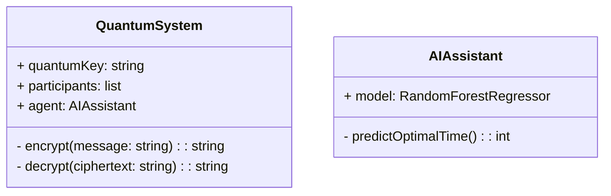

                 


# 企业AI Agent的量子加密通信策略

---

## 关键词：量子加密通信，AI Agent，企业安全，量子密钥分发，自适应加密

---

## 摘要

本文探讨了企业AI Agent在量子加密通信中的应用策略。随着量子计算的快速发展，传统加密技术面临巨大挑战。AI Agent通过自适应学习和优化，为量子加密通信提供了新的解决方案。本文从量子加密通信的基本原理、AI Agent的核心概念，到算法实现、系统架构设计，再到项目实战，全面解析了企业AI Agent在量子加密通信中的应用，最后总结了最佳实践和未来研究方向。

---

## 第1章：量子加密通信与AI Agent概述

### 1.1 量子加密通信的基本概念

量子加密通信是一种利用量子力学原理实现的安全通信技术。其核心是量子密钥分发（QKD），通过量子态的不可克隆性和不可干扰性，确保密钥的安全传输。与传统加密不同，量子加密通信具有无条件安全性，即使面对强大的量子计算机攻击，也能保持通信的安全性。

### 1.2 AI Agent的核心概念

AI Agent（人工智能代理）是一种能够感知环境、自主决策并执行任务的智能实体。在企业环境中，AI Agent通常用于自动化任务处理、数据优化和决策支持。AI Agent的核心能力包括自适应学习、问题解决和自主决策，使其能够高效应对复杂环境中的挑战。

### 1.3 企业AI Agent与量子加密通信的结合背景

随着企业对数据安全需求的增加，传统的加密技术逐渐暴露出安全性不足的问题。量子加密通信以其无条件安全性成为下一代通信技术的首选，但其实现复杂且对环境要求高。AI Agent通过智能化的密钥管理、通信优化和异常检测，解决了量子加密通信中的诸多挑战，为企业提供了高效且安全的通信解决方案。

---

## 第2章：核心概念与联系

### 2.1 量子加密通信的原理

量子密钥分发（QKD）是量子加密通信的核心技术，其基本流程包括密钥生成、分发和通信。通过量子态的不可复制性，确保密钥的安全传输。数学模型如下：

$$ QKD = \{ \text{Alice} \rightarrow \text{Bob} \} $$

### 2.2 AI Agent在量子加密中的作用

AI Agent通过实时学习和优化，帮助量子加密系统实现自适应加密和异常检测。AI Agent能够根据网络环境动态调整加密参数，提升通信效率和安全性。

### 2.3 核心概念对比与ER实体关系图

#### 对比表

| 概念 | 传统加密 | 量子加密 | AI Agent辅助加密 |
|------|----------|----------|------------------|
| 安全性 | 易被破解 | 高安全性 | 自适应增强安全 |
| 密钥管理 | 中心化 | 分布式 | 智能化管理 |

#### ER实体关系图

```mermaid
erd
  entity 量子加密系统 {
    key: QuantumKey
    participant: Alice
    participant: Bob
    agent: AIAgent
  }
  relation 加密通信 {
    from: Alice
    to: Bob
    via: QuantumKey
    managed_by: AIAgent
  }
```

---

## 第3章：算法原理讲解

### 3.1 量子密钥分发（QKD）算法

QKD的基本流程包括：

1. **密钥生成**：Alice生成随机量子态。
2. **量子传输**：通过量子信道传输给Bob。
3. **基底比较**：Alice和Bob分别选择测量基底，只有基底一致时，测量结果有效。
4. **密钥提取**：将一致的测量结果作为密钥。

数学模型如下：

$$ QKD = \{ q_1, q_2, \ldots, q_n \} $$

### 3.2 AI Agent辅助的量子加密算法

AI Agent通过机器学习算法优化密钥生成和传输过程。例如，使用随机森林算法预测最优传输时间。

示例代码：

```python
import numpy as np
from sklearn.ensemble import RandomForestRegressor

# 生成随机量子态
quantum_states = np.random.rand(100)
# 使用随机森林预测最优时间
model = RandomForestRegressor()
model.fit(quantum_states.reshape(-1, 1), np.arange(100))
predicted_time = model.predict(quantum_states.reshape(-1, 1))
```

---

## 第4章：系统分析与架构设计

### 4.1 问题场景介绍

企业需要在动态网络环境中实现安全通信，传统加密技术已无法满足需求。量子加密通信提供了无条件安全性，但其实现复杂且对环境要求高。AI Agent通过智能化管理，简化了量子加密通信的实现过程。

### 4.2 系统功能设计

系统功能包括：

1. **密钥生成与分发**
2. **通信优化**
3. **异常检测**

领域模型类图：



---

## 第5章：项目实战

### 5.1 环境安装

安装Python和必要的库：

```bash
pip install numpy scikit-learn
```

### 5.2 核心实现代码

量子密钥分发实现代码：

```python
import random

def generate_quantum_key(length):
    key = []
    for _ in range(length):
        # 生成随机量子态
        q_state = random.choice(['|0>', '|1>'])
        key.append(q_state)
    return ''.join(key)

# 生成密钥
quantum_key = generate_quantum_key(16)
print(quantum_key)
```

### 5.3 案例分析

假设企业需要在内部通信中应用量子加密技术，AI Agent通过预测网络负载，优化量子密钥分发的效率。具体步骤包括：

1. **环境监控**：实时监控网络状态。
2. **密钥生成**：根据网络状态生成量子密钥。
3. **通信优化**：动态调整通信参数，确保高效安全。

---

## 第6章：最佳实践与小结

### 6.1 小结

企业AI Agent与量子加密通信的结合，不仅提升了通信安全性，还优化了通信效率。AI Agent通过智能化管理，解决了量子加密通信中的诸多挑战。

### 6.2 注意事项

- 量子加密通信对环境要求较高，需确保实验环境的稳定性。
- AI Agent的模型需要定期更新，以应对环境变化。

### 6.3 扩展阅读

建议深入研究量子计算和AI代理的前沿技术，探索更多应用场景。

---

## 作者：AI天才研究院 & 禅与计算机程序设计艺术

本文由AI天才研究院与禅与计算机程序设计艺术团队合作完成，致力于推动人工智能与量子计算的融合研究。

